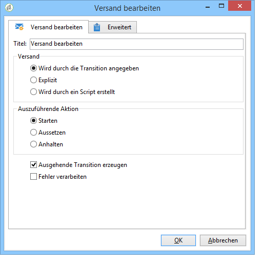

# Versand bearbeiten{#delivery-control}

Die Aktivität **Versand bearbeiten** ermöglicht es, einen Versand zu starten, auszusetzen oder anzuhalten.

Hierbei kann es sich um einen durch die eingehende Transition bezeichneten, einen explizit angegebenen oder einen durch ein Script berechneten Versand handeln. Weitere Informationen hierzu finden Sie im Abschnitt [Versand](../../workflow/using/delivery.md).

Wenn Sie **[!UICONTROL Start]** auswählen, führt die Aktivität alle zum Starten des Versands erforderlichen Schritte aus (Zielgruppenberechnung, Inhaltsvorbereitung, Versand). Wenn einige dieser Schritte bereits von einer vorherigen Workflow-Aktivität ausgeführt wurden, werden sie nicht erneut ausgeführt. Wenn zum Beispiel die Zielgruppenschätzung bereits von einer Aktivität vom Typ **[!UICONTROL Versand]** durchgeführt wurde (siehe [Versand](../../workflow/using/delivery.md)), startet die Aktivität **[!UICONTROL Mit Versand arbeiten]** die verbleibenden Schritte (Inhaltsvorbereitung und Versand).

Folgende Optionen stehen zur Verfügung:

* **[!UICONTROL Ausgehende Transition erzeugen]**

   Erzeugt eine ausgehende Transition im Anschluss an die Aktivität. Sie haben die Wahl, die Zielgruppe der Versandaktion in der Transition zu übermitteln, oder nicht.

* **[!UICONTROL Fehler verarbeiten]**

   Siehe [Fehler verarbeiten](../../workflow/using/monitoring-workflow-execution.md#processing-errors).

## Eingabeparameter {#input-parameters}

* deliveryId

Kennung des Versands, wenn die Option **[!UICONTROL Wird durch die Transition angegeben]** ausgewählt wurde.
