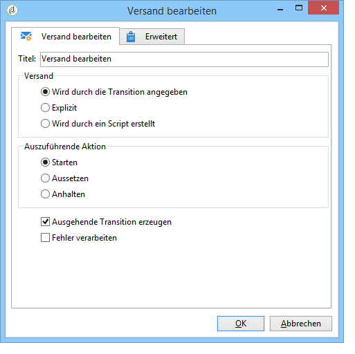

# Versand bearbeiten{#delivery-control}

Die Aktivität **Versand bearbeiten** ermöglicht es, einen Versand zu starten, zu stoppen oder anzuhalten.

Hierbei kann es sich um einen durch die eingehende Transition bezeichneten, einen explizit angegebenen oder einen durch ein Script berechneten Versand handeln. Weitere Informationen hierzu finden Sie im Abschnitt [Versand](delivery.md).

Bei Auswahl von **[!UICONTROL Starten]** führt die Aktivität alle für den Start des Versands erforderlichen Schritte aus (Zielgruppenberechnung, Inhaltsvorbereitung, Versand). Wenn einige dieser Schritte bereits von einer vorherigen Workflow-Aktivität ausgeführt wurden, werden sie nicht erneut ausgeführt. Wenn zum Beispiel die Zielgruppenschätzung bereits von einer Aktivität vom Typ **[!UICONTROL Versand]** durchgeführt wurde (siehe [Versand](delivery.md)), startet die Aktivität **[!UICONTROL Mit Versand arbeiten]** die verbleibenden Schritte (Inhaltsvorbereitung und Versand).

Folgende Optionen stehen zur Verfügung:

* **[!UICONTROL Ausgehende Transition erzeugen]**

  Erstellt eine ausgehende Transition, die am Ende der Ausführung aktiviert wird. Sie können auswählen, ob die Zielgruppe des ausgehenden Versands abgerufen werden soll oder nicht.

* **[!UICONTROL Fehler verarbeiten]**

  Siehe [Fehler verarbeiten](monitoring-workflow-execution.md#processing-errors).

## Eingabeparameter {#input-parameters}

* deliveryId

Kennung des Versands, wenn die Option **[!UICONTROL Wird durch die Transition angegeben]** ausgewählt wurde.
