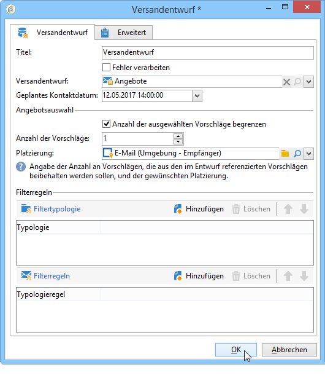

# Versandentwurf{#delivery-outline}

The **delivery outline** lets you use an outline in a campaign workflow. The outline must have been created in the campaign beforehand.

Weiterführende Informationen zu Versandentwürfen finden Sie in diesem [Abschnitt](../../campaign/using/marketing-campaign-deliveries.md#associating-and-structuring-resources-linked-via-a-delivery-outline).

Wählen Sie zur Konfiguration der Aktivität den gewünschten Versandentwurf aus und geben Sie das geplante Kontaktdatum an. Es besteht die Möglichkeit, Filterregeln zu definieren, indem Sie Typologien und Typologieregeln hinzufügen.

## Anwendungsbeispiel: Einfügung eines Angebots mithilfe eines Versandentwurfs {#example--inserting-an-offer-via-a-delivery-outline}

The **delivery outline** activity, available in the campaign workflows, lets you present offers that are referenced in a delivery outline from the current campaign in progress.

>[!NOTE]
>
>Für das vorliegende Anwendungsbeispiel benötigen Sie das **Interaction**-Package.

1. Platzieren Sie hierfür im Workflow die Versandentwurfsaktivität vor einer Versandaktivität.
1. Geben Sie in der Versandentwurfsaktivität den gewünschten Entwurf an.

   Nähere Informationen zu Versandentwürfen erhalten Sie in [diesem Abschnitt](../../campaign/using/marketing-campaign-deliveries.md#associating-and-structuring-resources-linked-via-a-delivery-outline).

1. Füllen Sie die verfügbaren Felder Ihrem Versand entsprechend aus.
1. Sie haben zwei Möglichkeiten:

   * Versand mit Abfrage an das Angebotsmodul: Kreuzen Sie in diesem Fall die Option **[!UICONTROL Anzahl der ausgewählten Vorschläge begrenzen]** an. Konfigurieren Sie die Platzierung und die Anzahl an zu unterbreitenden Angeboten.

      Gewichtung und Eignungsregeln der Angebote werden vom Angebotsmodul berücksichtigt.

   * Versand ohne Abfrage an das Angebotsmodul: Alle im Versandentwurf enthaltenen Angebote werden unterbreitet.

   Die Vorschau berücksichtigt die im Versand konfigurierte Anzahl an Angeboten. Bei Ausführung des Workflows hingegen wird die im Versandentwurf konfigurierte Anzahl verwendet.

   

