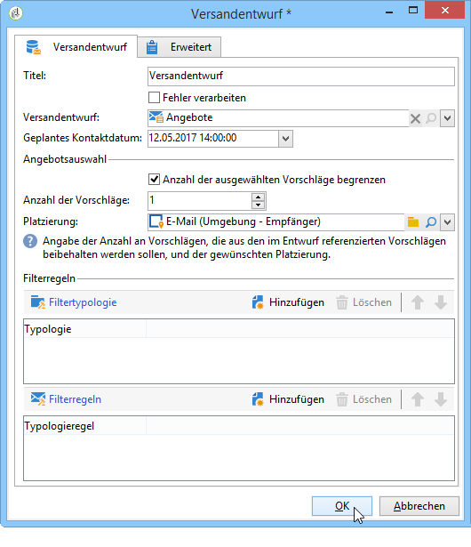

# Versandentwurf{#delivery-outline}

Der **Versandentwurf** ermöglicht Ihnen die Verwendung eines Entwurfs im Kampagnen-Workflow. Der Entwurf muss zuvor in der Kampagne erstellt worden sein.

Weiterführende Informationen zu Versandentwürfen finden Sie in diesem [Abschnitt](../../campaign/using/marketing-campaign-deliveries.md#associating-and-structuring-resources-linked-via-a-delivery-outline).

Zum Konfigurieren der Aktivität müssen Sie einfach den gewünschten Entwurf sowie das geplante Kontaktdatum auswählen.Sie können Filterregeln hinzufügen, indem Sie Typologien oder Typologieregeln hinzufügen.

## Anwendungsbeispiel: Einfügung eines Angebots mithilfe eines Versandentwurfs {#example--inserting-an-offer-via-a-delivery-outline}

Die in Kampagnen-Workflows zur Verfügung stehende Aktivität **Versandentwurf** erlaubt es, Angebote zu unterbreiten, die in einem Versandentwurf der aktuellen Kampagne referenziert wurden.

>[!NOTE]
>
>Für das vorliegende Anwendungsbeispiel benötigen Sie das **Interaction**-Package.

1. Platzieren Sie hierfür im Workflow die Versandentwurfsaktivität vor einer Versandaktivität.
1. Geben Sie in der Versandentwurfsaktivität den gewünschten Entwurf an.

   Nähere Informationen zu Versandentwürfen erhalten Sie in [diesem Abschnitt](../../campaign/using/marketing-campaign-deliveries.md#associating-and-structuring-resources-linked-via-a-delivery-outline).

1. Füllen Sie die verfügbaren Felder Ihrem Versand entsprechend aus.
1. Sie haben zwei Möglichkeiten:

   * Wenn Sie eine Abfrage des Angebotsmoduls durchführen möchten, aktivieren Sie das Feld **[!UICONTROL Anzahl der ausgewählten Vorschläge begrenzen]**.Geben Sie die Platzierung und die Anzahl der Vorschläge an, die im Versand unterbreitet werden sollen.

     Gewichtung und Eignungsregeln der Angebote werden vom Angebotsmodul berücksichtigt.

   * Versand ohne Abfrage an das Angebotsmodul: Alle im Versandentwurf enthaltenen Angebote werden unterbreitet.

   Die Vorschau berücksichtigt die im Versand angegebene Anzahl an Angeboten. Bei Ausführung eines Workflows wird die im Versandentwurf angegebene Anzahl berücksichtigt. 

   
