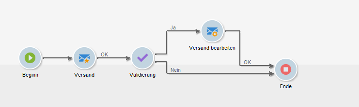

# Versand{#delivery}

Die Aktivität **Versand** wird je nach Kontext zur Konfiguration oder zum Start eines Versands verwendet. Dabei können Elemente aus eingehenden Transitionen verwendet werden.

Öffnen Sie die Aktivität und wählen Sie in den verschiedenen Bereichen die gewünschten Optionen aus.


1. **Versand**

   Sie haben folgende Möglichkeiten:

   * Handelt bei der im eingehenden Übergang angegebenen Bereitstellung. Wählen Sie dazu die erste Option im **[!UICONTROL Delivery]** Abschnitt des Fensters aus.

      Diese Option kann verwendet werden, wenn eine vorangehende Workflow-Aktivität bereits den Versand erstellt oder bezeichnet. Dies kann wie in unten stehendem Beispiel durch eine Aktivität des gleichen Typs erfolgen, die eine ausgehende Transition erzeugt.

      Im Beispiel wird zunächst der Versand erstellt. Dann werden die Zielgruppe und der Inhalt definiert. Schließlich werden die drei Elemente über die eingehende Transition einer zweiten Versandaktivität übermittelt und der Versand gestartet.

      

   * Wählen Sie die betreffende Lieferung direkt aus. Wählen Sie dazu die **[!UICONTROL Explicit]** Option aus und wählen Sie die Bereitstellung aus der Dropdownliste des **[!UICONTROL Delivery]** Felds aus.

      Die Liste zeigt standardmäßig nicht fertige Auslieferungen im Ordner &quot; **Auslieferungen** &quot;an. Um auf andere Kampagnen zuzugreifen, klicken Sie auf das **[!UICONTROL Select link]** Symbol.

      

      Select the campaign from the drop-down list of the **[!UICONTROL Folder]** field, or click **[!UICONTROL Display sub-levels]** to display all of the deliveries contained in sub-folders:

      

      After selecting the delivery action, you can display the content by clicking the **[!UICONTROL Edit link]** icon.

   * Erstellen Sie ein Skript zur Berechnung der Auslieferung. Wählen Sie dazu die **[!UICONTROL Calculated by a script]** Option aus und geben Sie das Skript ein. Sie können ein Eingabefenster öffnen, indem Sie auf die **[!UICONTROL Edit...]** Option klicken. Im folgenden Beispiel wird die ID der Bereitstellung wiederhergestellt:

      

   * Erstellen Sie eine neue Bereitstellung. Wählen Sie dazu die **[!UICONTROL New, created from a template]** Option aus und wählen Sie die Bereitstellungsvorlage, auf der die Bereitstellung basieren soll.

      

      Click the **[!UICONTROL Select link]** icon to browse the folders, and click the **[!UICONTROL Edit link]** icon if you wish to view the content of the selected template.

1. **Bereich Empfänger**

   Die Versandempfänger können durch eingehende Ereignisse angegeben werden, beispielsweise Dateiimport, oder Versand. Sie können außerdem aus einer oder mehreren Dateien stammen.

   

1. **Content**

   Der Versandinhalt kann entweder direkt im Versand oder über das eingehende Ereignis definiert werden.

   

1. **Auszuführende Aktion**

   Der Versand kann gespeichert, vorbereitet oder gestartet werden. Weitere Optionen sind die Schätzung der Zielgruppe und das Auslösen eines Testversands.

   

   Kreuzen Sie eine der möglichen Optionen an:

   * **[!UICONTROL Save]**: Mit dieser Option können Sie die Bereitstellung erstellen und speichern. Es wird nicht analysiert oder bereitgestellt.
   * **[!UICONTROL Estimate the target]**: Mit dieser Option können Sie das Lieferziel berechnen, um sein Potenzial zu bewerten (erste Analysephase). Diese Aktion entspricht der Auswahl der **[!UICONTROL Estimate the population to be targeted]** Option und dem Klicken auf **[!UICONTROL Analyze]** , wenn eine Lieferung per **Auslieferung** an das Hauptziel gesendet wird.
   * **[!UICONTROL Prepare]**: Mit dieser Option können Sie den gesamten Analyseprozess (Zielberechnung und Inhaltsvorbereitung) ausführen. Die Lieferung wird nicht gesendet. Diese Aktion entspricht der Auswahl der **[!UICONTROL Deliver as soon as possible]** Option und dem Klicken auf **[!UICONTROL Analyze]** , wenn eine Lieferung mit **Auslieferung** an das Hauptziel gesendet wird.
   * **[!UICONTROL Send a proof]**: Mit dieser Option können Sie einen Liefernachweis senden. Diese Aktion entspricht dem Klicken auf die **[!UICONTROL Send a proof]** Schaltfläche in der Symbolleiste einer Bereitstellung mit **Auslieferung**
   * **[!UICONTROL Prepare and start]**: Diese Option startet den vollständigen Analysevorgang (Zielberechnung und Inhaltsvorbereitung) und sendet die Bereitstellung. Diese Aktion entspricht dem Klick **[!UICONTROL Deliver as soon as possible]**, **[!UICONTROL Analyze]** und der **[!UICONTROL Confirm delivery]** Option, wenn eine Lieferung mit **Auslieferung** an das Hauptziel gesendet wird.
   Mit der **[!UICONTROL Act on a delivery]** Aktivität, die im Workflow weiter verwendet wird, können Sie alle verbleibenden Schritte starten, die zum Starten der Bereitstellung erforderlich sind (Zielberechnung, Inhaltsvorbereitung, Bereitstellung). For more on this, refer to [Delivery control](../../workflow/using/delivery-control.md).

   Darüber hinaus stehen folgende Optionen für die Aktivität zur Verfügung:

   * **[!UICONTROL Generate an outbound transition]**

      Erzeugt eine ausgehende Transition im Anschluss an die Aktivität. Sie haben die Wahl, die Zielgruppe der Versandaktion in der Transition zu übermitteln, oder nicht.

   * **[!UICONTROL Do not recover target]**

      Die Zielgruppe wird nicht mit der ausgehenden Transition übermittelt.

   * **[!UICONTROL Processing errors]**

      Siehe [Liefersteuerung](../../workflow/using/delivery-control.md).
   Im Tab **Script** können die Versandparameter angepasst werden.

   

## Beispiel: Versand-Workflow {#example--delivery-workflow}

Erstellen Sie einen neuen Workflow und fügen Sie Aktivitäten aus der unten dargestellten Grafik hinzu:



Öffnen Sie die **Versand**-Aktivität und definieren Sie die Eigenschaften folgendermaßen:

* Wählen Sie im **[!UICONTROL Delivery]** Abschnitt eine Bereitstellungsvorlage aus **[!UICONTROL New, created from a template]** und wählen Sie sie aus.
* Wählen Sie im **[!UICONTROL Recipients]** Abschnitt **[!UICONTROL Specified in the delivery]**.
* Behalten Sie im **[!UICONTROL Action to execute]** Abschnitt die **[!UICONTROL Prepare]** Option bei.


Klicken Sie auf **[!UICONTROL OK]** , um das Eigenschaftenfenster zu schließen. Sie haben gerade eine Aktivität konfiguriert, die darin besteht, eine neue Bereitstellung auf der Grundlage einer Bereitstellungsvorlage zu erstellen und vorzubereiten, deren Ziel darin angegeben wird.

Öffnen Sie die Aktivität **Validierung** und definieren Sie folgende Eigenschaften:

1. Wählen Sie im **[!UICONTROL Assignment type]** Feld eine Gruppe aus, in der Sie registriert sind. Wenn Sie über das Admin-Konto eine Verbindung hergestellt haben, wählen Sie die Administratorgruppe aus.
1. Vergeben Sie einen Titel und geben Sie folgenden Text in den Nachrichten-Textkörper ein:

   ```
   Do you wish to approve delivery (<%= vars.recCount %> recipient(s))?
   ```

   Diese Meldung enthält einen in JavaScript geschriebenen Ausdruck: **[!UICONTROL vars.recCount]** stellt die Anzahl der Empfänger dar, auf die sich die Bereitstellung der vorherigen Aufgabe bezieht. Weitere Informationen zu JavaScript-Ausdrücken finden Sie unter [JavaScript-Skripten und -Vorlagen](../../workflow/using/javascript-scripts-and-templates.md).

   

   The Approval task is detailed in [Approval](../../workflow/using/approval.md).

## Eingabeparameter {#input-parameters}

Lieferkennung, wenn die **[!UICONTROL Specified in the transition]** Option im **[!UICONTROL Delivery]** Abschnitt ausgewählt ist.

* deliveryId
* tableName
* schema

Jedes eingehende Ereignis muss eine durch diese Parameter definierte Zielgruppe angeben.

>[!NOTE]
>
>Dieser Parameter wird nur angezeigt, wenn die **[!UICONTROL Specified by inbound event(s)]** Option im **[!UICONTROL Recipients]** Abschnitt ausgewählt ist.

* filename

   Vollständiger Name der erstellten Datei, wenn die **[!UICONTROL File(s) specified by inbound event(s)]** Option im **[!UICONTROL Recipients]** Abschnitt ausgewählt ist.

* contentId

   Content Identifier, wenn die **[!UICONTROL Specified by inbound events]** Option im **[!UICONTROL Content]** Abschnitt ausgewählt ist.

## Ausgabeparameter {#output-parameters}

* tableName
* schema
* recCount

Dieser Satz von drei Werten identifiziert das Ziel, das sich aus der Bereitstellung ergibt. **[!UICONTROL tableName]** ist der Name der Tabelle, die die Bezeichner des Ziels speichert, **[!UICONTROL schema]** das Schema der Population (normalerweise nms:empfänger) und die Anzahl der Elemente in der Tabelle **[!UICONTROL recCount]** ist.

Die Transition des Komplements weist die gleichen Parameter auf.

>[!NOTE]
>
>Es gibt keine Ausgabeparameter, wenn die **[!UICONTROL Do not recover target]** Option ausgewählt ist.

