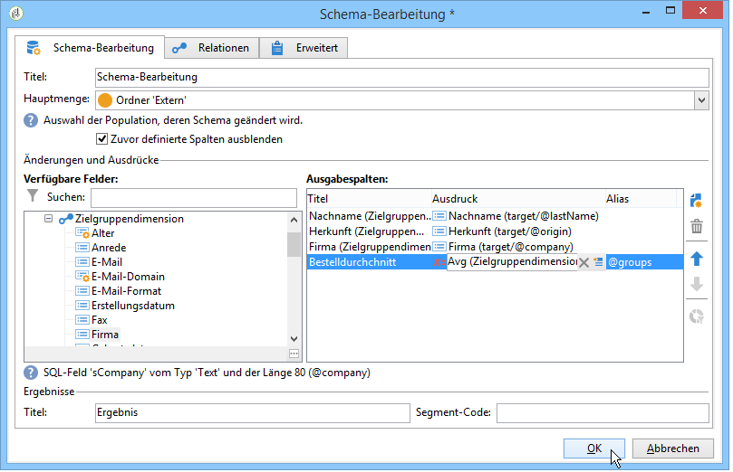
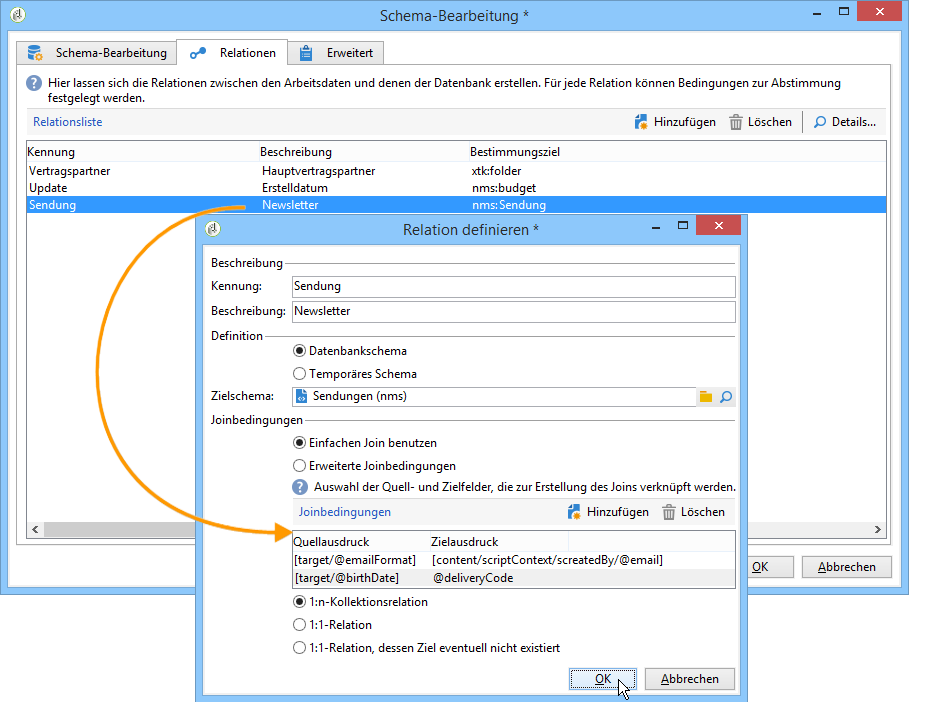

# Schema-Bearbeitung{#edit-schema}

Daten können im Workflow mithilfe der Aktivität „Schema bearbeiten **[!UICONTROL transformiert, normalisiert und bei Bedarf]** werden. Sie wird im Allgemeinen zur Normalisierung der Datenstruktur verwendet: Sie können die Ausgabespalten umbenennen oder ihren Inhalt ändern, indem Sie z. B. die Durchschnittswerte eines Felds oder Aggregats berechnen.

Diese Aktivität verändert nicht die Daten der Arbeitstabelle, sondern nur ihr Schema, d. h. die logische Darstellung der Daten.

Im Tab **[!UICONTROL Relationen]** können Sie Beziehungen zu anderen Arbeitstabellen herstellen.

Im unteren Bereich werden die Joinbedingungen definiert, d. h. die Kriterien festgelegt, die die Abstimmung zwischen den Tabellendaten ermöglichen.
