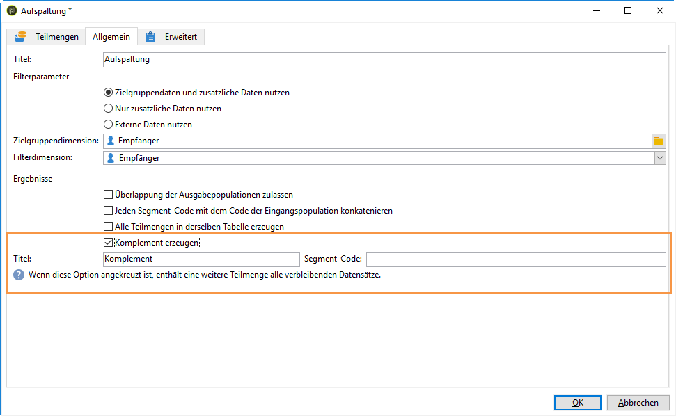
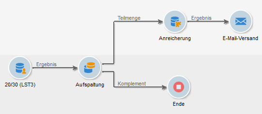
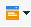

# E-Mail-Anreicherung mit benutzerdefinierten Datumsfeldern{#email-enrichment-with-custom-date-fields}

In diesem Beispiel möchten wir Empfängern, die im aktuellen Monat Geburtstag feiern, eine E-Mail mit benutzerdefinierten Datumsfeldern senden. Die E-Mail soll einen Gutschein enthalten, der bis zu einer Woche vor und nach ihrem Geburtstag gültig ist.

Wir müssen Empfänger aus einer Liste auswählen, die diesen Monat ihre Geburtstage mit einer **[!UICONTROL Split]** Aktivität feiern. Anschließend wird das Feld für die benutzerdefinierten Daten mithilfe der **[!UICONTROL Enrichment]** Aktivität als Gültigkeitsdatum in der E-Mail für das Sonderangebot des Kunden verwendet.


Gehen Sie wie folgt vor:

1. In the **[!UICONTROL Targeting and workflows]** tab of your campaign, drag and drop a **[!UICONTROL Read list]** activity to target your list of recipients.
1. Die zu verarbeitende Liste kann explizit angegeben, von einem Script berechnet oder dynamisch abgerufen werden. Dies hängt von den hier aktivierten Optionen oder angegebenen Parametern ab.

   

1. Add a **[!UICONTROL Split]** activity to differentiate recipients who will celebrate their birthdays this month from other recipients.
1. Um die Liste zu teilen, wählen Sie in der **[!UICONTROL Filtering of selected records]** Kategorie die Option **[!UICONTROL Add a filtering condition on the inbound population]**. Klicken Sie dann auf **[!UICONTROL Edit]**.

   

1. Select **[!UICONTROL Filtering conditions]** then click the **[!UICONTROL Edit expression]** button to filter the month of the recipient&#39;s birthday.

   

1. Klicken Sie **[!UICONTROL Advanced Selection]** dann **[!UICONTROL Edit the formula using an expression]** und fügen Sie den folgenden Ausdruck hinzu: Monat(@Geburtsdatum).
1. Wählen Sie in der **[!UICONTROL Operator]** Spalte die **[!UICONTROL equal to]**.
1. Further filter your condition, by adding the **[!UICONTROL Value]** month of the current date: Month(GetDate()).

   Dadurch werden Empfänger abgerufen, deren Geburtsmonat mit dem aktuellen Monat übereinstimmt.

   

1. Klicks **[!UICONTROL Finish]**. Klicken Sie dann auf der **[!UICONTROL General]** Registerkarte Ihrer **[!UICONTROL Split]** Aktivität auf die **[!UICONTROL Generate complement]** Kategorie **[!UICONTROL Results]** .

   Mit dem **[!UICONTROL Complement]** Ergebnis können Sie eine Bereitstellungsaktivität hinzufügen oder eine Liste aktualisieren. Hier haben wir gerade eine **[!UICONTROL End]** Aktivität hinzugefügt.

   

You now need to configure your **[!UICONTROL Enrichment]** activity:

1. Add an **[!UICONTROL Enrichment]** activity after your subset to add your custom date fields.

   

1. Öffnen Sie Ihre **[!UICONTROL Enrichment]** Aktivität. Klicken Sie in der **[!UICONTROL Complementary information]** Kategorie auf **[!UICONTROL Add data]**.

   

1. Wählen Sie **[!UICONTROL Data linked to the filtering dimension]** dann **[!UICONTROL Data of the filtering dimension]**.
1. Click the **[!UICONTROL Add]** button.

   

1. Add a **[!UICONTROL Label]**. Klicken Sie dann in der **[!UICONTROL Expression]** Spalte auf **[!UICONTROL Edit expression]**.

   

1. First, we need to target the week before the birthdate as the **Validity start date** with the following **[!UICONTROL Expression]**: `SubDays([target/@birthDate], 7)`.

   

1. Then, to create the custom date field **Validity end date** which will target the week after the birthdate, you need to add the **[!UICONTROL Expression]**: `AddDays([target/@birthDate], 7)`.

   Sie können Ihren Ausdruck mit einem Titel kennzeichnen.

   

1. Wählen Sie **[!UICONTROL Ok]** aus. Ihre Anreicherung ist nun fertig.

Nach der **[!UICONTROL Enrichment]** Aktivität können Sie eine Bereitstellung hinzufügen. In diesem Fall haben wir eine E-Mail-Zustellung hinzugefügt, um Empfängern ein Sonderangebot mit Gültigkeitsdaten zu senden, an Kunden, die diesen Monat ihre Geburtstage feiern.

1. Ziehen Sie eine **[!UICONTROL Email delivery]** Aktivität nach Ihrer **[!UICONTROL Enrichment]** Aktivität per Drag &amp; Drop.

   

1. Double-click your **[!UICONTROL Email delivery]** activity to start personalizing your delivery.
1. Add a **[!UICONTROL Label]** to your delivery and click **[!UICONTROL Continue]**.
1. Click **[!UICONTROL Save]** to create your email delivery.
1. Überprüfen Sie die **[!UICONTROL Approval]** Registerkarte der E-Mail-Zustellung, **[!UICONTROL Properties]** die aktiviert **[!UICONTROL Confirm delivery before sending option]** ist.

   Starten Sie dann den Workflow, um Ihre ausgehende Transition mit den ausgewählten Daten anzureichern.

   

You can now start designing your email delivery with the custom date fields created in the **[!UICONTROL Enrichment]** activity.

1. Doppelklicken Sie auf Ihre **[!UICONTROL Email delivery]** Aktivität.
1. Fügen Sie Ihre Zielgruppenerweiterungen zu Ihrer E-Mail hinzu. Diese sollte sich innerhalb des folgendes Ausdrucks befinden, damit Sie das Format der Gültigkeitsdaten konfigurieren können.

   ```
   <%=
           formatDate(targetData.alias of your expression,"%2D.%2M")  %>
   ```

1. Klicks  . Select **[!UICONTROL Target extension]** then the previously created custom validity dates with the **[!UICONTROL Enrichment]** activity to add your extension to the formatDate expression.

   

1. Konfigurieren Sie Ihren E-Mail-Inhalt nach Bedarf.

   

1. Sehen Sie sich Ihre E-Mail in der Vorschau an, um zu überprüfen, ob die benutzerdefinierten Datumsfelder korrekt konfiguriert wurden.

   

Ihre E-Mail ist jetzt bereit. Sie können damit beginnen, Ihre Proofs zu senden und Ihre Lieferung zu bestätigen, um Ihre Geburtstagsemail zu versenden.
