# Anreichern von Daten{#enriching-data}

## Über die Anreicherung von Daten {#about-enriching-data}

In diesem Anwendungsbeispiel werden mögliche Verwendungen der Aktivität **[!UICONTROL Anreicherung]** in einem Zielgruppen-Workflow beschrieben. Weitere Informationen zur Verwendung der Aktivität **[!UICONTROL Anreicherung]** finden Sie unter [Anreicherung](enrichment.md).

In [diesem Abschnitt](email-enrichment-with-custom-date-fields.md) finden Sie außerdem ein Anwendungsbeispiel zur Anreicherung eines E-Mail-Versands mit benutzerdefinierten Datumsangaben.

Den in der Marketing-Datenbank enthaltenen Kontakten soll über eine Webapp ein Preisausschreiben angeboten werden. Die Ergebnisse des Wettbewerbs werden in der Tabelle **[!UICONTROL Wettbewerbsergebnisse]** gespeichert. Diese Tabelle steht in Relation mit der Tabelle der Kontakte (**[!UICONTROL Empfänger]**). Die Tabelle **[!UICONTROL Wettbewerbsergebnisse]** enthält folgende Spalten:

* Wettbewerbsname (@game),
* Versuchnummer (@trial),
* Score (@score).

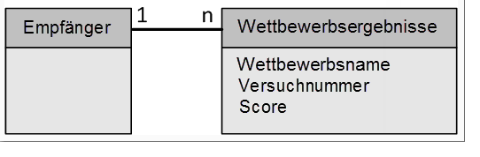

Ein Kontakt in der Tabelle **[!UICONTROL Empfänger]** kann mit mehreren Zeilen in der Tabelle **[!UICONTROL Wettbewerbsergebnisse]** verknüpft werden. Die Beziehung zwischen diesen beiden Tabellen ist vom Typ 1-n. Im Folgenden finden Sie ein Beispiel für die Ergebnisprotokolle für einen Empfänger:

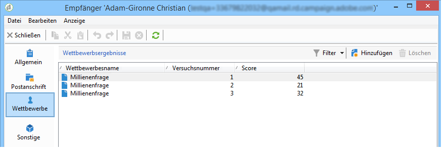

In diesem Anwendungsbeispiel wird das Versenden personalisierter Sendungen an Personen bezweckt, die am letzten Wettbewerb teilgenommen haben, abhängig von den erzielten Punkten. Der Empfänger mit der höchsten Punktzahl erhält den ersten Preis, der Empfänger mit der zweithöchsten Punktzahl einen Trostpreis und alle anderen erhalten eine Nachricht, die ihnen beim nächsten Mal mehr Glück wünschen.

Der Workflow für dieses Anwendungsbeispiel stellt sich wie folgt dar:

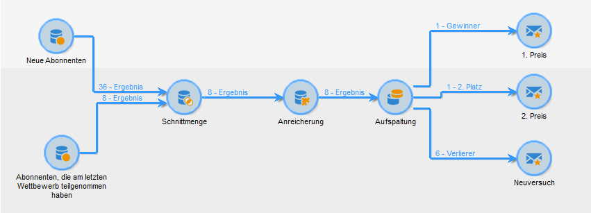

Die Workflow-Erstellung gliedert sich in folgende Schritte:

1. Platzierung von zwei **[!UICONTROL Abfragen]** und einer **[!UICONTROL Schnittmenge]** zum Abruf aller neuen Abonnenten, die am letzten Wettbewerb teilgenommen haben.
1. Im Anschluss daran folgt eine **[!UICONTROL Anreicherung]**, die es ermöglicht, die Daten aus der Tabelle **[!UICONTROL Wettbewerbsergebnisse]** zu verwenden. Das für die Personalisierung benötigte Feld **[!UICONTROL Score]** wird daher zur Workflow-Arbeitstabelle hinzugefügt.
1. Mithilfe der **[!UICONTROL Aufspaltung]** werden nun je nach erreichtem Score Teilmengen erstellt.
1. An jede Teilmenge wird ein **[!UICONTROL Versand]** angeschlossen.

## &#x200B;1. Schritt: Zielgruppenbestimmung {#step-1--targeting}

In der ersten Abfrage werden die Kontakte abgerufen, die innerhalb der letzten sechs Monate in die Datenbank aufgenommen wurden.

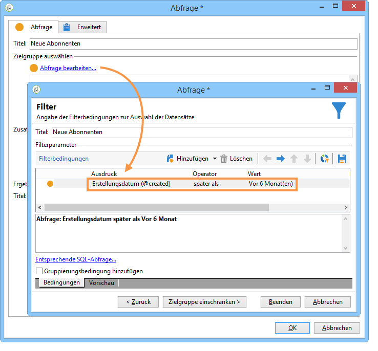

In der zweiten Abfrage werden die Kontakte abgerufen, die am letzten Wettbewerb teilgenommen haben.

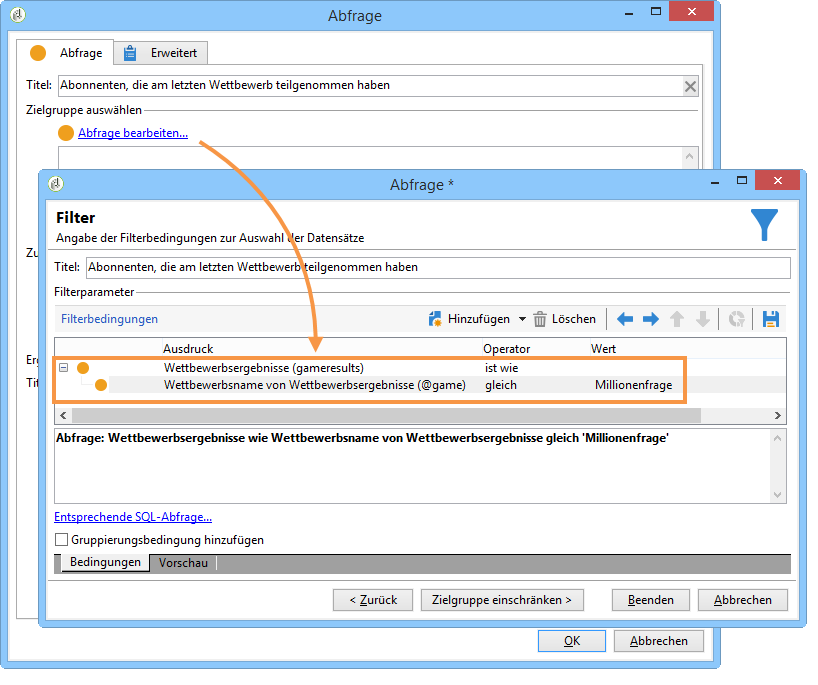

Die **[!UICONTROL Schnittmenge]** ermittelt dann die Population, die beiden Bedingungen entspricht.

## &#x200B;2. Schritt: Anreicherung {#step-2--enrichment}

In diesem Beispiel möchten wir die Sendungen entsprechend dem Feld **[!UICONTROL Score]** in der Tabelle **[!UICONTROL Wettbewerbsergebnisse]** personalisieren. Diese Tabelle weist eine 1:n-Beziehung mit der Empfängertabelle auf. Die **[!UICONTROL Anreicherungsaktivität]** ermöglicht es, Daten aus einer mit der Filterdimension in Relation stehenden Tabelle zur Arbeitstabelle des Workflows hinzuzufügen.

1. Klicken Sie auf den Link **[!UICONTROL Daten hinzufügen...]** im Bearbeitungsbildschirm der Anreicherung und aktivieren Sie die Option **[!UICONTROL Daten in Relation mit der Filterdimension]**. Klicken Sie dann auf **[!UICONTROL Weiter]**.

   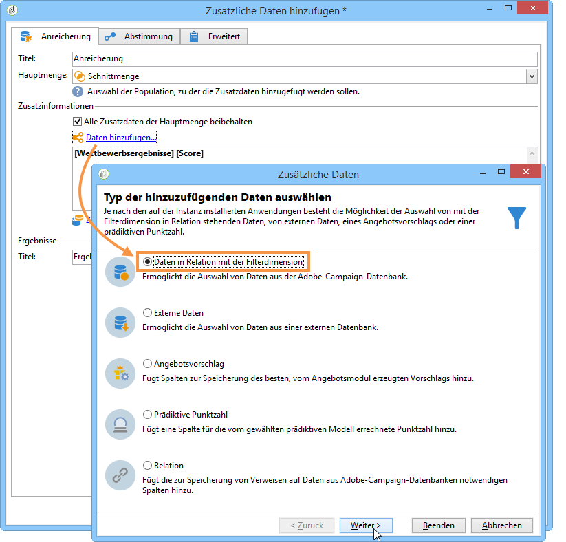

1. Aktivieren Sie im nächsten Bildschirm wiederum die Option **[!UICONTROL Daten in Relation mit der Filterdimension]**, markieren Sie die Tabelle **[!UICONTROL Wettbewerbsergebnisse]** und klicken Sie auf **[!UICONTROL Weiter]**.

   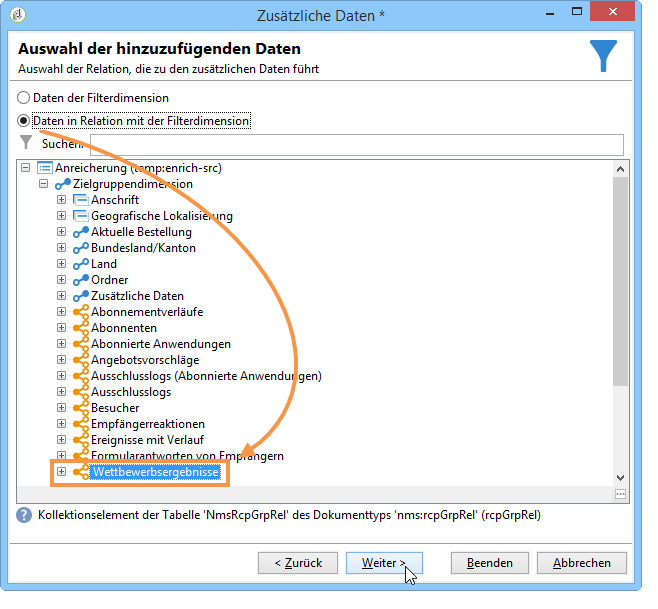

1. Geben Sie eine Kennung und einen Titel an und wählen Sie im Feld **[!UICONTROL Abgerufene Daten]** die Option **[!UICONTROL Zeilenanzahl begrenzen]** aus. Geben Sie dann im Feld **[!UICONTROL Abzurufende Zeilen]** den Wert &#39;1&#39; an. Für jeden Empfänger fügt die Anreicherungsaktivität somit genau eine Zeile aus der Tabelle **[!UICONTROL Wettbewerbsergebnisse]** in die Workflow-Arbeitstabelle ein. Klicken Sie auf **[!UICONTROL Weiter]**.

   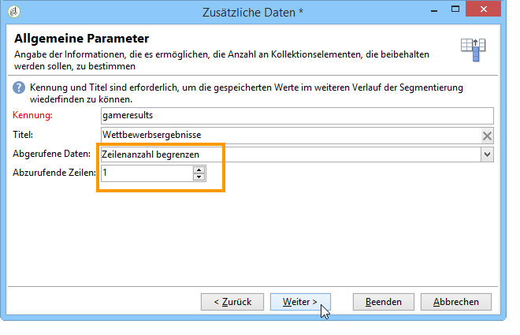

1. Im vorliegenden Beispiel soll das beste Ergebnis der Empfänger aus dem letzten Wettbewerb abgerufen werden. Filtern Sie hierzu die Tabelle nach dem Feld **[!UICONTROL Wettbewerb]** und rufen Sie nur die Datensätze ab, die dem letzten Wettbewerb entsprechen. Klicken Sie auf **[!UICONTROL Weiter]**.

   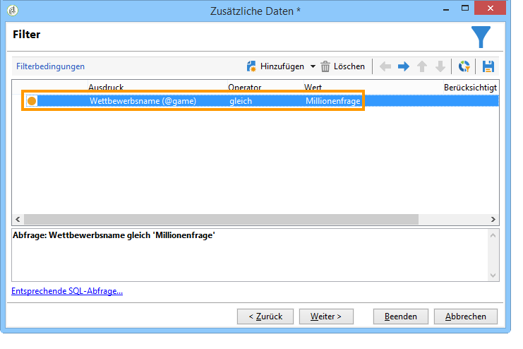

1. Gehen Sie zum Bildschirm **[!UICONTROL Sortieren]** und klicken Sie auf die Schaltfläche **[!UICONTROL Hinzufügen]**, wählen Sie das Feld **[!UICONTROL Score]** aus und aktivieren Sie das Kontrollkästchen in der Spalte **[!UICONTROL Absteigend]**, um Elemente der Felder **[!UICONTROL Score]** in absteigender Reihenfolge zu sortieren. Bei jeder Empfängerin bzw. jedem Empfänger wird durch die Aktivität Anreicherung eine Zeile hinzugefügt, die der höchsten Punktzahl für das letzte Spiel entspricht. Klicken Sie auf **[!UICONTROL Weiter]**.

   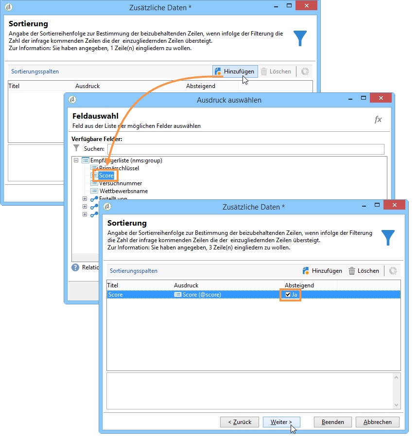

1. Doppelklicken Sie im Bildschirm **[!UICONTROL Hinzuzufügende Daten]** auf das Feld **[!UICONTROL Score]**. Auf diese Weise fügt die Anreicherungsaktivität nur das Feld **[!UICONTROL Score]** hinzu. Klicken Sie auf **[!UICONTROL Beenden]**.

   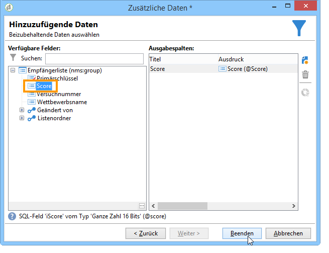

Klicken Sie mit der rechten Maustaste auf die eingehende Transition der Anreicherungsaktivität und wählen Sie **[!UICONTROL Zielgruppe anzeigen]**. Die Arbeitstabelle enthält die folgenden Daten:

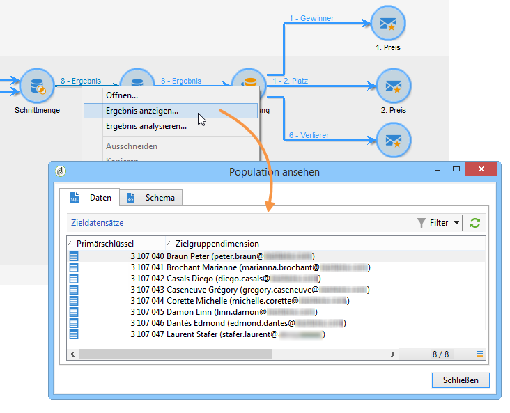

Das Schema der Arbeitstabelle stellt sich wie folgt dar:

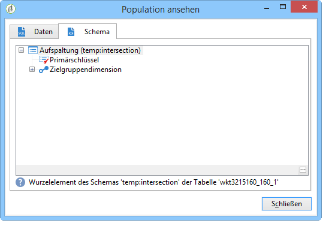

Erneuern Sie diesen Vorgang für die ausgehende Transition der Anreicherungsaktivität. Wir können sehen, dass die mit den Empfängerbewertungen verknüpften Daten hinzugefügt wurden. Die höchste Punktzahl jedes Empfängers wurde wiederhergestellt.

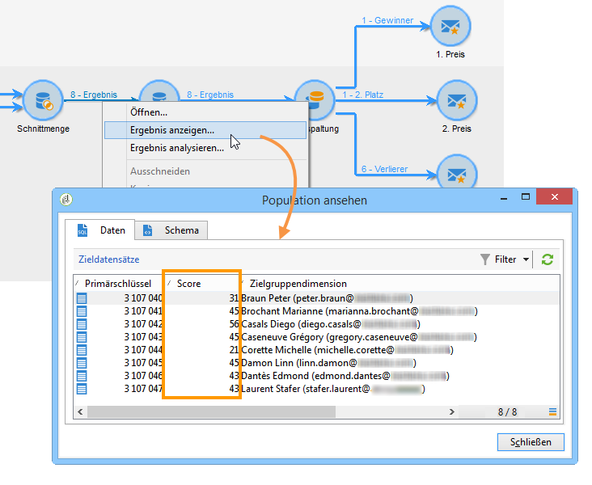

Auch das Schema wurde entsprechend angereichert.

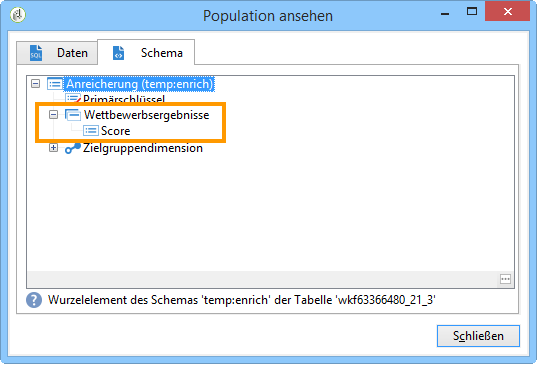

## &#x200B;3. Schritt: Aufspaltung und Versand {#step-3--split-and-delivery}

Im Anschluss an die Anreicherung sorgt die **[!UICONTROL Aufspaltung]** für die Verteilung der Empfänger nach den erreichten Scores.

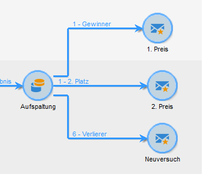

1. Eine erste Teilmenge (**Gewinner**) wurde definiert, um den Empfänger mit der höchsten Punktzahl einzuschließen. Definieren Sie dazu eine Begrenzung der Anzahl der Datensätze, wenden Sie eine absteigende Sortierung auf die Punktzahl an und begrenzen Sie die Anzahl der Datensätze auf 1.

   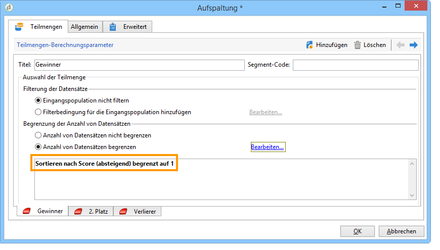

1. Die zweite Teilmenge **Zweite**) enthält den Empfänger mit der zweithöchsten Punktzahl. Die Konfiguration entspricht der für die erste Teilmenge.

   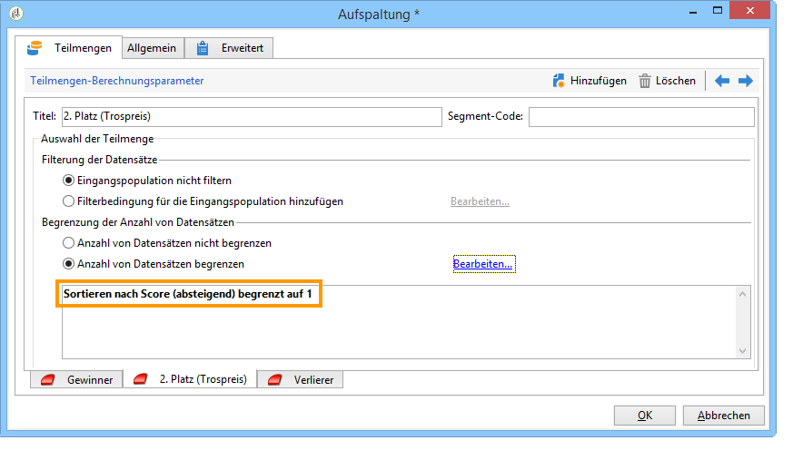

1. Die dritte Teilmenge (**Verlierer**) enthält die verbleibenden Empfänger. Kreuzen Sie im **[!UICONTROL Allgemein]**-Tab die Option **[!UICONTROL Komplement erzeugen]** an, um alle die Empfänger abzurufen, die weder den höchsten noch den zweithöchsten Score erzielt haben.

   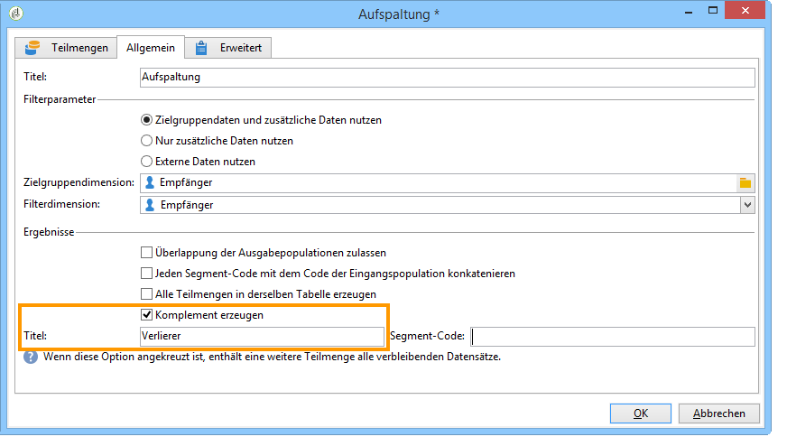

1. Schließen Sie an jede Teilmenge einen **[!UICONTROL Versand]** an. Verwenden Sie für jeden Versand eine andere Versandvorlage.

   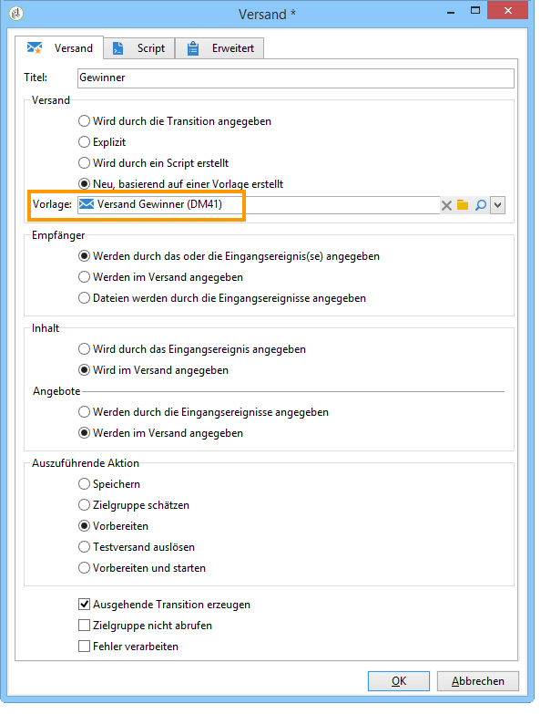
