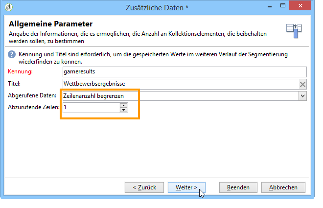

# Daten anreichern{#enriching-data}

## Über die Anreicherung von Daten {#about-enriching-data}

In diesem Verwendungsfall werden die möglichen Verwendungen der **[!UICONTROL Enrichment]** Aktivität in einem Targeting-Arbeitsablauf erläutert. Weitere Informationen zur Verwendung der **[!UICONTROL Enrichment]** Aktivität finden Sie unter: [Anreicherung](../../workflow/using/enrichment.md).

Die Kontakte in der Marketing-Datenbank erhalten eine Einladung zur Teilnahme an einem Wettbewerb über eine Webanwendung. Die Ergebnisse des Wettbewerbs werden in der **[!UICONTROL Competition results]** Tabelle wiedergegeben. Diese Tabelle ist mit der Kontakttabelle verknüpft (**[!UICONTROL Recipients]**). Die **[!UICONTROL Competition results]** Tabelle enthält die folgenden Felder:

* Wettbewerbsname (@game),
* Versuchnummer (@trial),
* Score (@score).

Ein in der **[!UICONTROL Recipients]** Tabelle gefundener Kontakt kann mit mehreren Zeilen in der **[!UICONTROL Competition results]** Tabelle verknüpft werden. Die Beziehung zwischen diesen beiden Tabellen ist vom Typ 1-n. Hier ein Beispiel der Ergebnisprotokolle für einen Empfänger:

Ziel des vorliegenden Beispiels ist es, den Teilnehmern des letzten Wettbewerbs eine je nach erreichtem Score personalisierte Mitteilung zukommen zu lassen. Der Teilnehmer mit dem höchsten Score erhält den ersten Preis, der Teilnehmer mit dem zweithöchsten Score einen Trostpreis und alle anderen Teilnehmer werden aufgefordert, ihr Glück beim nächsten Wettbewerb erneut zu versuchen.

Der Workflow für dieses Anwendungsbeispiel stellt sich wie folgt dar:

Die Workflow-Erstellung gliedert sich in folgende Schritte:

1. Two **[!UICONTROL Query]** activities and one **[!UICONTROL Intersection]** activity are added to target new subscribers who entered last the competition.
1. Die **[!UICONTROL Enrichment]** Aktivität ermöglicht es uns, in der Tabelle gespeicherte Daten hinzuzufügen **[!UICONTROL Competition results]** . Das **[!UICONTROL Score]** Feld, auf dem unsere Personalisierung der Auslieferung stattfinden wird, wird dem Arbeitstisch des Workflows hinzugefügt.
1. The **[!UICONTROL Split]** type activity enables us to create recipient subsets based on scores.
1. For each subset, a **[!UICONTROL Delivery]** type activity is added.

## 1. Schritt: Zielgruppenbestimmung {#step-1--targeting}

In der ersten Abfrage werden die Kontakte abgerufen, die innerhalb der letzten sechs Monate in die Datenbank aufgenommen wurden.

In der zweiten Abfrage werden die Kontakte abgerufen, die am letzten Wettbewerb teilgenommen haben.

An **[!UICONTROL Intersection]** type activity is then added to target the recipients added to the database within the last six months and who entered the last competition.

## 2. Schritt: Anreicherung {#step-2--enrichment}

In diesem Beispiel möchten wir die Auslieferungen entsprechend dem **[!UICONTROL Score]** in der **[!UICONTROL Competition results]** Tabelle gespeicherten Feld personalisieren. Diese Tabelle weist eine 1-n-Typbeziehung mit der Empfängertabelle auf. Die **[!UICONTROL Enrichment]** Aktivität ermöglicht es uns, Daten aus einer Tabelle, die mit der Filterdimension verknüpft ist, zur Arbeitstabelle des Workflows hinzuzufügen.

1. Wählen Sie im Bearbeitungsbildschirm der Anreicherungsaktivität **[!UICONTROL Add data]** und klicken **[!UICONTROL Data linked to the filtering dimension]** Sie auf **[!UICONTROL Next]**.

   

1. Wählen Sie dann die **[!UICONTROL Data linked to the filtering dimension]** Option aus, wählen Sie die **[!UICONTROL Competition results]** Tabelle aus und klicken Sie auf **[!UICONTROL Next]**.

   

1. Geben Sie eine ID und eine Beschriftung ein und wählen Sie die **[!UICONTROL Limit the line count]** Option im **[!UICONTROL Data collected]** Feld. Wählen Sie im **[!UICONTROL Lines to retrieve]** Feld &quot;1&quot;als Wert aus. Für jeden Empfänger wird der Arbeitstabelle des Workflows eine Zeile aus der **[!UICONTROL Competition results]** Tabelle hinzugefügt. Klicks **[!UICONTROL Next]**.

   

1. In diesem Beispiel möchten wir die höchste Punktzahl des Empfängers wiedererlangen, jedoch nur für den letzten Wettbewerb. Fügen Sie dazu einen Filter zum **[!UICONTROL Competition name]** Feld hinzu, um alle Zeilen auszuschließen, die mit vorherigen Wettbewerben in Zusammenhang stehen. Klicks **[!UICONTROL Next]**.

   

1. Gehen Sie zum **[!UICONTROL Sort]** Bildschirm und klicken Sie auf die **[!UICONTROL Add]** Schaltfläche, wählen Sie das **[!UICONTROL Score]** Feld aus und markieren Sie das Kontrollkästchen in der **[!UICONTROL descending]** Spalte, um die Elemente der **[!UICONTROL Score]** Felder in absteigender Reihenfolge zu sortieren. Die Anreicherungsaktivität fügt jedem Empfänger eine Zeile hinzu, die dem höchsten Wert des letzten Spiels entspricht. Klicks **[!UICONTROL Next]**.

   

1. Doppelklicken Sie im **[!UICONTROL Data to add]** Fenster auf das **[!UICONTROL Score]** Feld. Für jeden Empfänger wird durch die Anreicherungsaktivität nur das **[!UICONTROL Score]** Feld hinzugefügt. Klicks **[!UICONTROL Finish]**.

   

Right-click the inbound transition of the enrichment activity and select **[!UICONTROL Display the target]**. The work table contains the following data:

Das Schema der Arbeitstabelle stellt sich wie folgt dar:

Wiederholen Sie den Vorgang für die ausgehende Transition der Anreicherungsaktivität. Sie können sehen, dass die Score-Daten der Empfänger hinzugefügt wurden. Für jeden Empfänger wurde der höchste Score abgerufen.

Auch das Schema wurde entsprechend angereichert.

## 3. Schritt: Aufspaltung und Versand {#step-3--split-and-delivery}

To sort the recipients based on their scores, a **[!UICONTROL Split]** activity is added after the enrichment.

1. Die erste Teilmenge (**Gewinner**) enthält den Empfänger mit dem höchsten Score. Definieren Sie hierzu eine Begrenzung der Datensatzanzahl, sortieren Sie die Scores in absteigender Reihenfolge und begrenzen Sie die Datensatzanzahl auf 1.

   

1. Die zweite Teilmenge (**Trostpreis**) enthält den Empfänger mit dem zweithöchsten Score. Konfigurieren Sie die zweite Teilmenge analog zur ersten.

   

1. Die dritte Untergruppe (**Verlierer**) enthält alle anderen Empfänger. Gehen Sie zur **[!UICONTROL General]** Registerkarte und markieren Sie das **[!UICONTROL Generate complement]** Kästchen, um alle Empfänger als Ziel festzulegen, die die beiden höchsten Werte nicht erreicht haben.

   

1. Add a **[!UICONTROL Delivery]** type activity for each subset, using a different delivery template for each.

   

