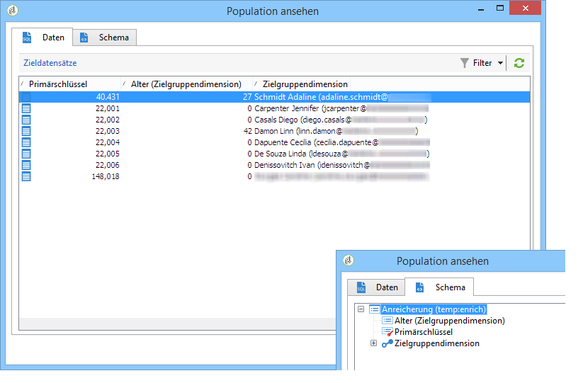
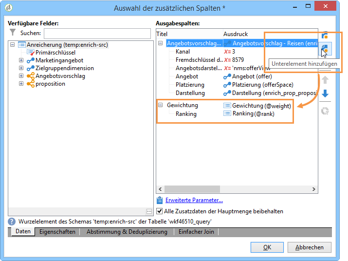

# Anreicherung{#enrichment}

Mit der **[!UICONTROL Enrichment]** Aktivität können Sie Informationen zu einer Profilliste und Links zu einer vorhandenen Tabelle hinzufügen (erstellen Sie eine neue Verbindung). Es können auch Abgleichungskriterien mit Profilen in der Datenbank definiert werden.


## Definitionen {#definitions}

Die Anreicherungsaktivität bietet verschiedene Optionen zur Hinzufügung von Daten:


Mit der **[!UICONTROL Data linked to the filtering dimension]** Option haben Sie Zugriff auf:

* Daten der Filterdimension: entspricht den Daten der Arbeitstabelle;
* Daten in Relation mit der Filterdimension: entspricht den Daten in Relation mit der Arbeitstabelle.


The **[!UICONTROL A link]** option lets you create a join on any table of the database.


Vier Relationstypen stehen zur Auswahl:

* **[!UICONTROL Define a collection]**: können Sie einen Link mit einer 1-N Kardinalität zwischen den Tabellen definieren.
* **[!UICONTROL Define a link whose target is still available]**: können Sie einen Link mit einer Kardinalität von 1 bis 1 zwischen Tabellen definieren. Die Verbindungsbedingungen müssen durch einen einzelnen Datensatz in der Zieltabelle definiert werden.
* **[!UICONTROL Define a link whose target does not necessarily exist in the base]**: können Sie einen Link mit einer Kardinalität von 0 bis 1 zwischen Tabellen definieren. Die Verbindungsbedingung muss durch 0 oder 1 (max.) definiert werden. in der Zieltabelle.

   Diese Option wird auf der **[!UICONTROL Simple Join]** Registerkarte konfiguriert, auf die über den **[!UICONTROL Edit additional data]** Link der **[!UICONTROL Enrichment]** Aktivität zugegriffen werden kann.

* **[!UICONTROL Define a link by searching for a reference among several options]**: dieser Linktyp definiert eine Absöhnung zu einem eindeutigen Datensatz. Adobe Campaign erstellt einen Link zu einer Zieltabelle, indem der Zieltabelle ein Fremdschlüssel hinzugefügt wird, um einen Verweis auf den eindeutigen Datensatz zu speichern.

   Diese Option wird auf der **[!UICONTROL Reconciliation and deduplication]** Registerkarte konfiguriert, auf die über den **[!UICONTROL Edit additional data]** Link der **[!UICONTROL Enrichment]** Aktivität zugegriffen werden kann.

Die Anwendungsfälle zum [Anreichern von Daten](../../workflow/using/enriching-data.md) und [Erstellen einer Zusammenfassungsliste](../../workflow/using/creating-a-summary-list.md) beschreiben die Funktionsweise der Anreicherungsaktivitäten in ihrem Kontext.

## Informationen hinzufügen {#adding-information}

Use the **[!UICONTROL Enrichment]** activity to add columns to a work table: this activity can be used as a complement to a query activity.

The configuration of additional columns is detailed in [Adding data](../../workflow/using/query.md#adding-data).

The **[!UICONTROL Primary set]** field lets you select the inbound transition: the data of this activity&#39;s worktable will be enriched.

Klicken Sie auf den **[!UICONTROL Add data]** Link und wählen Sie den hinzuzufügenden Datentyp aus. Die Liste der angebotenen Datentypen hängt von den auf Ihrer Plattform installierten Modulen und Optionen ab. In einer Minimalkonfiguration können Sie immer Daten hinzufügen, die mit der Filterdimension und einem Link verknüpft sind.


Im folgenden Beispiel wird die Arbeitstabelle mit Informationen zum Alter der Zielpopulation angereichert.


Klicken Sie mit der rechten Maustaste auf die eingehende Transition der Anreicherungsaktivität, um die Daten vor der Anreicherung anzusehen.


Die Arbeitstabelle enthält das zugeordnete Schema und folgende Daten:


Sehen Sie sich nun die Daten nach der Anreicherung an, indem Sie mit der rechten Maustaste auf die ausgehende Transition klicken.


Sie stellen fest, dass das Alter hinzugefügt wurde:


Auch das Schema wurde entsprechend angereichert.

## Umgang mit Zusatzdaten {#managing-additional-data}

Deaktivieren Sie die **[!UICONTROL Keep all additional data from the main set]** Option, wenn Sie die zuvor definierten zusätzlichen Daten nicht beibehalten möchten. In diesem Fall werden nur die zusätzlichen Spalten, die in der Anreicherungsaktivität ausgewählt wurden, der Arbeitstabelle hinzugefügt. Die zusätzlichen Informationen, die den Aktivitäten im Upstream hinzugefügt werden, werden nicht gespeichert.


Die Daten und das Schema der ausgehenden Arbeitstabelle nach Durchführung der Anreicherung stellen sich dann wie folgt dar:



## Relation erzeugen {#creating-a-link}

Es besteht die Möglichkeit, mithilfe der Anreicherungsaktivität eine Relation zwischen den Daten der Arbeitstabelle und denen der Datenbank herzustellen. Es handelt sich in diesem Fall um eine auf den Workflow begrenzte Relation zwischen den eingehenden Daten.

Wenn Sie beispielsweise Daten aus einer Datei laden, die die Kundennummer, das Land und die E-Mail-Adresse der Empfänger enthält, ist die Erzeugung einer Relation zur Ländertabelle erforderlich, um die entsprechende Information im Empfängerprofil zu aktualisieren.

Gehen Sie hierzu wie folgt vor:

1. Laden Sie eine dem folgenden Muster entsprechende Datei:

   ```
   Account number;Country;Email
   18D65;FRANCE;agnes@gmail.com
   243PP;RUSSIA;paul@gmail.com
   55H87;CROATIA;dave@gmail.com
   56U81;USA;susan@gmail.com
   853PI;ITALY;anna@gmail.com
   890LP;FRANCE;robert@gmail.com
   83TY2;SWITZERLAND;mike@gmail.com
   ```

1. Öffnen Sie die Anreicherungsaktivität und klicken Sie auf den Link **Daten hinzufügen...**, um eine Relation zur Ländertabelle herzustellen.

   

1. Wählen Sie die **[!UICONTROL Link definition]** Option aus und klicken Sie auf die **[!UICONTROL Next]** Schaltfläche. Geben Sie den Typ des zu erstellenden Links an. In diesem Beispiel möchten wir das Land des Dateiempfängers mit einem Land in der Liste der verfügbaren Länder in der dedizierten Tabelle der Datenbank in Einklang bringen. Wählen Sie die **[!UICONTROL Define a link by searching for a reference among several options]** Option. Wählen Sie die Tabelle &quot;Land&quot;im **[!UICONTROL Target schema]** Feld aus.

   

1. Definieren Sie schließlich das oder die Felder, die die Zuordnung der Werte der Quelldatei zu denen der Datenbank ermöglichen.

   

Nach Ausführung der Anreicherungsaktivität enthält das temporäre Schema wie zuvor konfiguriert die Relation zur Ländertabelle:


## Datenabstimmung {#data-reconciliation}

Die Anreicherungsaktivität kann zum Konfigurieren der Datenabstimmung verwendet werden, auch nachdem Daten in die Datenbank geladen wurden. In diesem Fall können Sie auf der **[!UICONTROL Reconciliation]** Registerkarte die Verknüpfung zwischen den Daten in der Adobe Campaign-Datenbank und den Daten in der Arbeitstabelle definieren.

Wählen Sie die **[!UICONTROL Identify the targeting document based on work data]** Option aus, geben Sie das Schema an, zu dem Sie einen Link erstellen möchten, und definieren Sie die Verbindungsbedingungen: Wählen Sie dazu die Felder aus, die in den Arbeitsdaten (**[!UICONTROL Source expression]**) und in der Targeting-Dimension (**[!UICONTROL Destination expression]**) abgeglichen werden sollen.

Es können mehrere Abstimmkriterien definiert werden.


Bei mehreren Abstimmkriterien müssen ALLE erfüllt sein, damit die Relation hergestellt werden kann.

## Hinzufügung von Angebotsvorschlägen {#inserting-an-offer-proposition}

Die Anreicherungsaktivität ermöglicht das Hinzufügen von Angeboten oder von Relationen zu Angeboten für Versandempfänger.

Nähere Informationen zur Anreicherungsaktivität erhalten Sie in [diesem Abschnitt](../../workflow/using/enrichment.md).

Sie können beispielsweise aus einer Abfrage stammende Empfängerdaten vor Durchführung eines Versands anreichern.


Erstellen Sie zunächst Ihre Zielbestimmungsabfrage (siehe diesen [Abschnitt](../../workflow/using/query.md)). Gehen Sie dann wie folgt vor:

1. Platzieren Sie im Anschluss an die Abfrage eine Anreicherungsaktivität und öffnen Sie sie zur weiteren Bearbeitung.
1. Wählen Sie auf der **[!UICONTROL Enrichment]** Registerkarte **[!UICONTROL Add data]**.
1. Wählen Sie **[!UICONTROL An offer proposition]** in den hinzuzufügenden Datentypen aus.

   

1. Geben Sie eine Kennung und einen Titel für den hinzuzufügenden Vorschlag an.
1. Konfigurieren Sie die Angebotsauswahl. Zwei Optionen stehen zur Auswahl:

   * **[!UICONTROL Search for the best offer in a category]**: Aktivieren Sie diese Option und geben Sie die Parameter für den Aufruf der Angebotsmaschine an (Angebotsumfang, Kategorie oder Thema(e), Kontaktdatum, Anzahl der zu pflegenden Angebote). Die Engine berechnet automatisch das Angebot/die Angebote, die entsprechend diesen Parametern hinzugefügt werden sollen. Es wird empfohlen, das Feld **[!UICONTROL Category]** oder das **[!UICONTROL Theme]** Feld gleichzeitig auszufüllen.

      

   * **[!UICONTROL A predefined offer]**: Aktivieren Sie diese Option und geben Sie einen Angebotsbereich, ein bestimmtes Angebot und ein Kontaktzeitpunkt an, um das Angebot, das Sie hinzufügen möchten, direkt zu konfigurieren, ohne die Angebotsengine aufzurufen.

      

1. Konfigurieren Sie dann eine Auslieferungsaktivität, die Ihrem ausgewählten Kanal entspricht. Siehe [Kanalübergreifende Auslieferungen](../../workflow/using/cross-channel-deliveries.md).

   Die Anzahl an für die Vorschau verfügbaren Vorschlägen hängt von der Konfiguration der Anreicherung und nicht von im Versand konfigurierten Parametern ab.

Um Angebotsvorschläge anzugeben, können Sie auch auf einen Link zu einem Angebot verweisen. Weitere Informationen hierzu finden Sie im folgenden Abschnitt [Verweisen auf einen Link zu einem Angebot](#referencing-a-link-to-an-offer).

## Relation zu einem Angebot referenzieren {#referencing-a-link-to-an-offer}

In einer Anreicherungsaktivität besteht darüber hinaus die Möglichkeit, eine Relation zu einem Angebot zu referenzieren.

Gehen Sie dazu wie folgt vor:

1. Wählen Sie **[!UICONTROL Add data]** auf der **[!UICONTROL Enrichment]** Registerkarte der Aktivität aus.
1. In the window where you choose the type of data to add, select **[!UICONTROL A link]**.
1. Definieren Sie nun den Relationstyp und das Ziel der Relation. Im vorliegenden Beispiel handelt es sich beim Ziel um das Angebotsschema.

   

1. Definieren Sie die Art der Relation zwischen den Daten der Eingangstabelle der Anreicherungsaktivität (hier die Empfängertabelle) und der Angebotstabelle. Sie können beispielsweise einem Empfänger einen Angebotscode zuordnen.

   

1. Konfigurieren Sie dann eine Auslieferungsaktivität, die Ihrem ausgewählten Kanal entspricht. Siehe [Kanalübergreifende Auslieferungen](../../workflow/using/cross-channel-deliveries.md).

   >[!NOTE]
   >
   >Die Anzahl an für die Vorschau verfügbaren Vorschlägen hängt von den im Versand konfigurierten Parametern ab.

## Rang und Gewichtung von Angeboten speichern {#storing-offer-rankings-and-weights}

Standardmäßig werden Rang und Gewichtung bei Verwendung der Aktivität **Anreicherung** nicht in der Vorschlagstabelle gespeichert.

The **[!UICONTROL Offer engine]** activity does store this information by default.

Gehen Sie wie folgt vor, wenn Sie diese Informationen dennoch speichern möchten:

1. Erstellen Sie einen Workflow mit einer Abfrage und schließen Sie eine Anreicherung mit einer Angebotsmodul-Abfrage (siehe diesen [Abschnitt](../../interaction/using/integrating-an-offer-via-a-workflow.md#specifying-an-offer-or-a-call-to-the-offer-engine)) sowie eine Versandaktivität an.
1. Wählen Sie im Hauptfenster der Aktivität die Option **[!UICONTROL Edit additional data...]**.

   

1. Add the **[!UICONTROL @rank]** columns for the ranking and **[!UICONTROL @weight]** for the offer weight.

   

1. Bestätigen Sie Ihre Wahl und speichern Sie den Workflow.

Die Lieferung speichert automatisch das Ranking und Gewicht der Angebote. Diese Informationen werden auf der **[!UICONTROL Offers]** Registerkarte &quot;Bereitstellung&quot;angezeigt.
