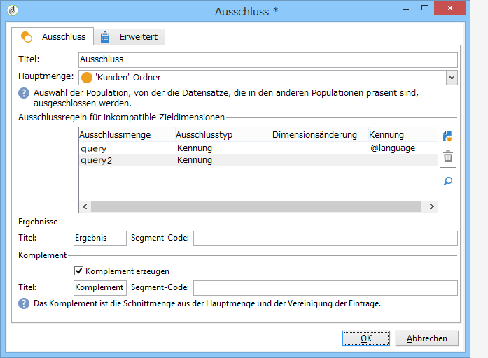
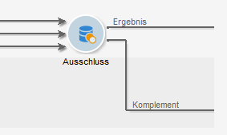
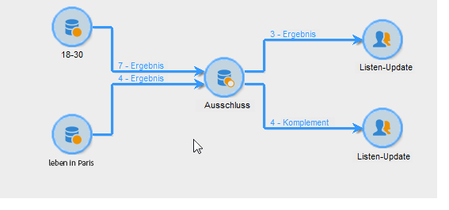

# Ausschluss{#exclusion}

Über eine Aktivität vom Typ **Ausschluss** lassen sich Populationen aus der Hauptzielgruppe extrahieren.

Konfigurieren Sie die Aktivität, indem Sie sie benennen und eine Hauptmenge auswählen. Die Population der Hauptmenge bildet die Grundlage zur Ergebnisfindung. Ausgeschlossen werden die Profile, die sowohl in der Hauptmenge als auch in mindestens einer der eingehenden Aktivitäten enthalten sind.

>[!NOTE]
>
>Weitere Informationen zum Konfigurieren und Verwenden der Ausschlussaktivität finden Sie unter Ausschließen einer Population [(Ausschluss)](../../workflow/using/targeting-data.md#excluding-a-population--exclusion-).

Aktivieren Sie die **[!UICONTROL Generate complement]** Option, wenn Sie die verbleibende Population ausnutzen möchten. Die Ergänzung umfasst die wichtigsten eingehenden Bevölkerungsgruppen abzüglich der ausreisenden Bevölkerung. Daraufhin wird der Aktivität ein zusätzlicher Ausgabeübergang hinzugefügt:

## Anwendungsbeispiele {#exclusion-examples}

Gesucht werden Empfänger zwischen 18 und 30 Jahre, die nicht in Berlin leben. Gehen Sie wie folgt vor:

1. Fügen Sie nach zwei Abfragen eine **[!UICONTROL Exclusion]** -type-Aktivität ein und öffnen Sie sie. Die erste Abfrage richtet sich an Empfänger, die in Paris leben. Die zweite Abfrage wendet sich an Personen zwischen 18 und 30 Jahren.
1. Geben Sie die Hauptmenge an, in diesem Fall die Abfrage **18-30 Jahre**. Alle Empfänger, die in der Ergebnismenge der zweiten Abfrage enthalten sind, werden auf diese Weise vom Endergebnis ausgeschlossen.
1. Markieren Sie die **[!UICONTROL Generate complement]** Option, wenn Sie die nach dem Ausschluss verbleibenden Daten ausnutzen möchten. In diesem Fall besteht die Ergänzung aus Empfängern im Alter von 18 bis 30 Jahren, die in Paris leben.
1. Bestätigen Sie die Konfiguration der Ausschlussaktivität und fügen Sie ein Listen-Update an. Schließen Sie, wenn Sie das Komplement verwenden, auch hier ein Listen-Update an.
1. Starten Sie den Workflow. Im vorliegenden Beispiel enthält die Ergebnisliste alle Empfänger im Alter von 18 bis 30 Jahre, außer denen, die in Berlin leben. Diese werden in der Komplementliste gespeichert.

   

The blacklist importation example uses an **Exclusion**-type activity which can be found in [Read list](../../workflow/using/read-list.md).

## Eingabeparameter {#input-parameters}

* tableName
* schema

Jedes eingehende Ereignis muss eine durch diese Parameter definierte Zielgruppe angeben.

## Ausgabeparameter {#output-parameters}

* tableName
* schema
* recCount

Dieser Satz von drei Werten identifiziert das Ziel, das sich aus dem Ausschluss ergibt. **[!UICONTROL tableName]** ist der Name der Tabelle, in der die Zielkennungen aufgezeichnet werden, das Schema der Population (normalerweise nms:empfänger) und die Anzahl der Elemente in der Tabelle **[!UICONTROL schema]** ist **[!UICONTROL recCount]** dies.

Die Transition des Komplements weist die gleichen Parameter auf.
