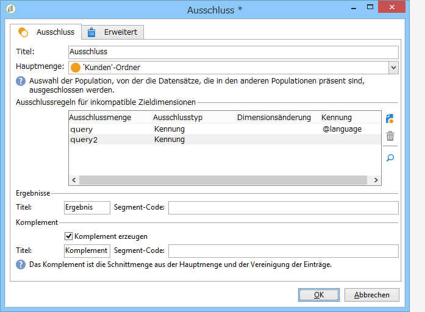
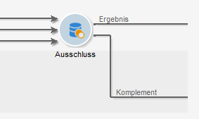
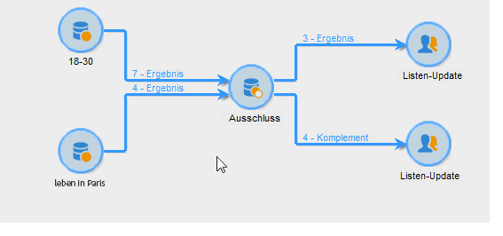

# Ausschluss{#exclusion}

Über eine Aktivität vom Typ **Ausschluss** lassen sich Populationen aus der Hauptzielgruppe extrahieren.

Geben Sie zum Konfigurieren dieser Aktivität den Titel ein und wählen Sie die Hauptmenge für den Empfang aus. Die Population der Hauptmenge bildet die Grundlage für das Ergebnis. Profile, die sowohl der Hauptmenge als auch mindestens einer Eintrittsaktivität zugeordnet sind, werden ausgeschlossen.

>[!NOTE]
>
>Weitere Informationen zum Konfigurieren und Verwenden der Ausschlussaktivität finden Sie unter [Populationen ausschließen (Ausschluss)](targeting-data.md#excluding-a-population--exclusion-).

Aktivieren Sie die Option **[!UICONTROL Komplement erzeugen]**, wenn Sie auch die Restpopulation verwenden möchten. Das Komplement besteht aus der eingehenden Hauptpopulation abzüglich der ausgehenden Population. Dann wird der Aktivität eine zusätzliche ausgehende Transition hinzugefügt, und zwar wie folgt:

## Anwendungsbeispiele für Ausschlüsse {#exclusion-examples}

Gesucht werden Empfänger zwischen 18 und 30 Jahre, die nicht in Berlin leben. Gehen Sie wie folgt vor:

1. Fügen Sie eine Aktivität vom Typ **[!UICONTROL Ausschluss]** nach zwei Abfragen ein und öffnen Sie sie. Die erste Abfrage richtet sich an Empfängerinnen und Empfänger, die in Paris leben. Die zweite Abfrage richtet sich an Personen im Alter von 18 bis 30 Jahren.
1. Geben Sie die Hauptmenge ein. Hier ist die Hauptmenge die Abfrage **18-30 Jahre**. Alle Empfangenden, die in der Ergebnismenge der zweiten Abfrage enthalten sind, werden auf diese Weise vom Endergebnis ausgeschlossen.
1. Aktivieren Sie die Option **[!UICONTROL Komplement erzeugen]**, wenn Sie die nach dem Ausschluss verbleibenden Daten verwenden möchten. In diesem Fall besteht das Komplement aus Empfängerinnen und Empfängern im Alter von 18 bis 30 Jahren, die in Paris leben.
1. Bestätigen Sie die Ausschlusskonfiguration und fügen Sie dem Ergebnis dann eine Aktivität des Typs „Liste aktualisieren“ hinzu. Bei Bedarf können Sie außerdem eine zusätzliche Listenaktualisierung im Komplement einfügen.
1. Führen Sie den Workflow aus. In diesem Beispiel besteht das Ergebnis aus Empfängerinnen und Empfängern im Alter von 18 bis 30 Jahren, allerdings werden die in Paris lebenden ausgeschlossen und an das Komplement gesendet. 

   

## Eingabeparameter {#input-parameters}

* tableName
* schema

Jedes eingehende Ereignis muss eine durch diese Parameter definierte Zielgruppe angeben.

## Ausgabeparameter {#output-parameters}

* tableName
* schema
* recCount

Anhand der drei Werte lässt sich die durch den Ausschluss ermittelte Zielgruppe identifizieren. **[!UICONTROL tableName]** ist der Name der Tabelle, die die Zielgruppen-IDs enthält, **[!UICONTROL schema]** ist das Schema der Population, (i. d. R. nms:recipient) und **[!UICONTROL recCount]** ist die Anzahl der Elemente in der Tabelle.

Die Transition des Komplements weist die gleichen Parameter auf.
