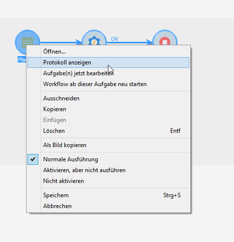
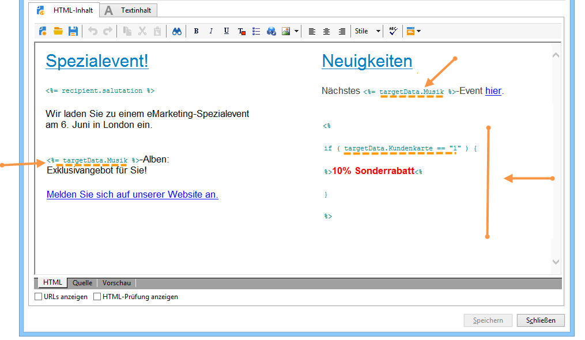
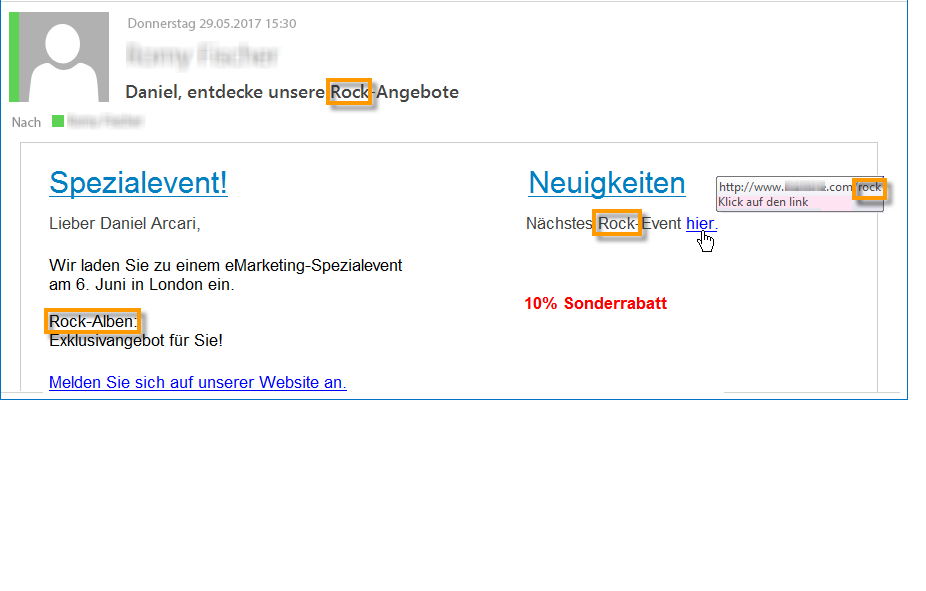

# Workflow ausführen{#executing-a-workflow}

Anleitungen zur Fehlerbehebung bei der Ausführung von Workflows finden Sie in [diesem Abschnitt](../../production/using/workflow-execution.md).

## Workflow starten {#starting-a-workflow}

Workflows werden grundsätzlich manuell gestartet, Nach dem Starten können sie jedoch inaktiv bleiben, je nachdem, welche Informationen über eine Planung (siehe [Planung](../../workflow/using/scheduler.md)) oder Aktivitätsplanung angegeben wurden.

Die mit der Workflow-Ausführung in Zusammenhang stehenden Prozesse (starten, anhalten, aussetzen etc.) laufen **asynchron** ab, d. h. der jeweilige Befehl wird gespeichert und erst dann ausgeführt, wenn ein Server verfügbar ist.

Anhand der Schaltflächen der Symbolleiste kann die Ausführung des Workflows gesteuert und überwacht werden.

Die im Menü **[!UICONTROL Aktionen]** und im Kontextmenü verfügbaren Befehle werden nachstehend erläutert.

### Aktionen-Symbolleiste {#actions-toolbar}

Die Symbolleiste wird in diesem [Abschnitt](../../campaign/using/marketing-campaign-deliveries.md#building-the-main-target-in-a-workflow) beschrieben. Die Schaltfläche **[!UICONTROL Aktionen]** bietet weiterführende Optionen, um auf die Ausführung eines oder mehrerer Workflows Einfluss zu nehmen. Auf die Aktionen können Sie außerdem über das Menü **[!UICONTROL Datei > Aktionen]** oder durch Rechtsklick und Auswahl der Option **[!UICONTROL Aktionen]** im Kontextmenü zugreifen.


* **[!UICONTROL Starten]**

   Dieser Befehl startet die Ausführung eines Workflows. Sein Status wechselt von **In Bearbeitung**, **Ausgesetzt** oder **Abgeschlossen** in **Gestartet**. Die Workflow-Engine übernimmt die Ausführung des Workflows. Bei zuvor ausgesetzten Workflows wird die Ausführung an der Stelle wieder aufgenommen, wo sie ausgesetzt wurde. In den anderen Fällen starten die Workflows jeweils mit der ersten Aktivität.

   Der Start eines Workflows ist ein asynchroner Prozess, d. h. der jeweilige Befehl wird gespeichert und erst dann ausgeführt, wenn ein Server verfügbar ist.

* **[!UICONTROL Aussetzen]**

   Dieser Befehl überführt den Workflow in den Status **Ausgesetzt**. Bis zur Wiederaufnahme werden keine weiteren Aktivitäten gestartet, laufende Vorgänge werden jedoch nicht unterbrochen.

* **[!UICONTROL Anhalten]**

   Dieser Befehl hält die Ausführung eines laufenden Workflows an. Der Status der Workflow-Instanz wechselt zu **Abgeschlossen**. Laufende Vorgänge werden nach Möglichkeit unterbrochen. Gestartete Importe oder SQL-Abfragen werden sofort abgebrochen.

   Das Anhalten eines Workflows ist ein asynchroner Prozess, d. h. der jeweilige Befehl wird gespeichert und der oder die Server brechen die laufenden Vorgänge ab. Das Anhalten einer Workflow-Instanz kann daher eine geraume Zeit dauern, insbesondere wenn der Workflow über verschiedene Server verteilt ist. In diesem Fall muss jeder Server den Prozess übernehmen und die laufenden Aufgaben abbrechen.

* **[!UICONTROL Neu starten]**

   Dieser Befehl hält einen Workflow zunächst an und startet ihn dann erneut.In den meisten Fällen ermöglicht diese Vorgehensweise einen schnelleren Neustart als die separate Verwendung der Anhalten- und Starten-Schaltflächen. Dies ist insbesondere dann nützlich, wenn das Anhalten eines Workflows geraume Zeit in Anspruch nimmt, da der Befehl &quot;Starten&quot; erst wieder verfügbar ist, wenn der Workflow tatsächlich angehalten wurde.

   Die Befehle **[!UICONTROL Starten/Aussetzen/Anhalten/Neu starten]** sind auch über die entsprechenden Schaltflächen der Symbolleiste verfügbar. Weiterführende Informationen finden Sie in diesem [Abschnitt](../../campaign/using/marketing-campaign-deliveries.md#creating-a-targeting-workflow).

* **[!UICONTROL Verlaufsbereinigung]**

   Mit dieser Aktion können Sie den Workflow-Verlauf bereinigen. Weitere Informationen finden Sie unter [Verläufe bereinigen](../../workflow/using/monitoring-workflow-execution.md#purging-the-logs).

* **[!UICONTROL Im Simulationsmodus starten]**

   Mithilfe dieses Befehls wird der Workflow im Simulationsmodus gestartet. In diesem Modus werden nur die Aktivitäten ausgeführt, die keine Auswirkungen auf die Datenbank oder das Dateisystem haben. Dies können Aktivitäten vom Typ **[!UICONTROL Abfrage]**, **[!UICONTROL Vereinigung]**, **[!UICONTROL Schnittmenge]** usw. sein. Aktivitäten mit Auswirkungen (beispielsweise **[!UICONTROL Export]**, **[!UICONTROL Import]** usw.) sowie die darauf folgenden Aktivitäten im selben Zweig werden nicht ausgeführt.

* **[!UICONTROL Vorgezogene Ausführung der ausstehenden Aufgaben]**

   Dieser Befehl bietet die Möglichkeit, so schnell wie möglich alle ausstehenden Aufgaben zu starten. Wenn Sie eine bestimmte Aufgabe starten möchten, klicken Sie auf die entsprechende Aktivität und wählen Sie **[!UICONTROL Aufgabe(n) jetzt bearbeiten]**.

* **[!UICONTROL Unbedingter Stopp]**

   Bei Auswahl dieses Befehls wechselt der Workflow-Status zu **[!UICONTROL Abgeschlossen]**. Dieser Befehl darf nur als letztes Mittel eingesetzt werden, wenn das normale Anhalten auch nach mehreren Minuten keine Wirkung zeigt. Verwenden Sie den unbedingten Stopp nur, wenn Sie sicher sind, dass der Workflow keine reellen laufenden Prozesse aufweist.

   >[!CAUTION]
   >
   >Die Verwendung dieses Befehls sollte erfahrenen Benutzern vorbehalten bleiben.

* **[!UICONTROL Als Vorlage speichern]**

   Dieser Befehl erstellt eine neue, auf dem markierten Workflow basierende Workflow-Vorlage. Geben Sie im Feld **[!UICONTROL Ordner]** den gewünschten Speicherordner an.

   Die Optionen **[!UICONTROL Ausgewählte Zeilen gebündelt aktualisieren...]** und **[!UICONTROL Ausgewählte Zeilen fusionieren...]** sind allgemeine Optionen der Plattform, die in allen **[!UICONTROL Aktionen]**-Menüs zur Verfügung stehen. Lesen Sie diesbezüglich diesen [Abschnitt](../../platform/using/updating-data.md).

### Kontextmenü {#right-click-menu}

Durch Markierung und Rechtsklick auf eine oder mehrere Aktivitäten eines Workflows können Sie speziell auf diese einwirken.



Im Kontextmenü stehen folgende Optionen zur Verfügung:

**[!UICONTROL Öffnen...]** - ermöglicht den Zugriff auf die Eigenschaften der Aktivität.

**[!UICONTROL Protokoll anzeigen]** - zeigt das Ausführungsprotokoll der Aufgaben der ausgewählten Aktivität an. Weitere Informationen finden Sie unter [Protokoll anzeigen](../../workflow/using/monitoring-workflow-execution.md#displaying-logs).

**[!UICONTROL Aufgabe(n) jetzt bearbeiten]** - startet so schnell wie möglich alle ausstehenden Aufgaben der Aktivität.

**[!UICONTROL Workflow ab dieser Aufgabe neu starten]** - startet den Workflow ab der ausgewählten Aufgabe neu und verwendet dabei die durch die vorangehende Ausführung in der Aktivität gespeicherten Ergebnisse.

**[!UICONTROL Ausschneiden/Kopieren/Einfügen/Löschen]** - ermöglicht das Ausschneiden, Kopieren, Einfügen oder Löschen der ausgewählten Aktivität(en).

**[!UICONTROL Als Bild kopieren]** - erstellt einen Screenshot sämtlicher Aktivitäten des Workflows.

**[!UICONTROL Normale Ausführung/Aktivieren, aber nicht ausführen/Nicht aktivieren]** - sind auch im Tab **[!UICONTROL Erweitert]** der Aktivitätseigenschaften verfügbar. Sie werden unter [Ausführung](../../workflow/using/advanced-parameters.md#execution) ausführlich beschrieben.

**[!UICONTROL Speichern/Abbrechen]** - speichert oder verwirft die im Workflow vorgenommenen Änderungen.

>[!NOTE]
>
>Es ist möglich, mehrere Aktivitäten zu markieren, um einen der genannten Befehle auf sie anzuwenden.

Das Kontextmenü wird in diesem [Abschnitt](../../campaign/using/marketing-campaign-deliveries.md#executing-a-workflow) näher erläutert.

## Lebenszyklus eines Workflows {#workflow-life-cycle}

Der Lebenszyklus eines Workflows gestaltet sich in drei Hauptetappen:

* **In Bearbeitung**

   Hierbei handelt es sich um die Phase der Erstellung. Ein neu erstellter Workflow weist den Bearbeitungsstatus auf. Ein derartiger Workflow wurde noch nicht vom Server übernommen und kann daher problemlos geändert werden.

* **Gestartet**

   Nach Abschluss der Konzeptionsphase kann der Workflow gestartet werden. Jetzt wird die Instanz vom Server übernommen und die elementaren Aufgaben werden ausgeführt. Der Workflow kann unter Beachtung gewisser Vorsichtsmaßnahmen trotzdem noch geändert werden.

* **Abgeschlossen**

   Ein Workflow ist abgeschlossen, wenn keine Aufgaben mehr zur Verarbeitung anstehen, oder wenn ein Benutzer die Workflow-Instanz ausdrücklich angehalten hat.

Beispielsweise sind im unten stehenden Workflow die Aktivitäten **Beginn** und **Versand** umrandet und die Aktivität **Validierung** blinkt.


Dies bedeutet, dass die ersten beiden Aktivitäten erfolgreich ausgeführt wurden und dass die Validierungsaktivität in Gang ist, d. h. sie wurde erstellt, ist aber noch nicht abgeschlossen.

Oberhalb der Transition des **Versands** wird **574 - OK** angezeigt. Daran ist erkennbar, dass bei der Versandvorbereitung 574 Empfänger ausgewählt wurden und dass der Vorgang korrekt abgelaufen ist. Diese Art an Informationen wird von Aktivitäten berechnet, die Daten manipulieren, und im Verlauf der Workflow-Ausführung auf den Transitionen angezeigt.

Der Workflow wartet also auf die Entscheidung eines Benutzers, der der Gruppe angehört, welche in der **Validierung**-Aktivität ausgewählt wurde. Gruppenmitglieder, deren E-Mail-Adresse oder Mobiltelefonnummer in ihrem Profil gespeichert sind, werden über die entsprechenden Kanäle benachrichtigt.

Die Benutzerverwaltung wird in diesem [Abschnitt](../../platform/using/access-management.md) beschrieben.

Weitere Informationen zur Überwachung Ihrer Workflows finden Sie in [diesem Abschnitt](../../workflow/using/monitoring-workflow-execution.md).

## Lebenszyklus der Arbeitsdaten {#data-life-cycle}

### Arbeitstabellen {#work-table}

In einem Workflow werden die von einer Aktivität zur anderen übertragenen Daten in temporären Arbeitstabellen gespeichert.

Die Daten können durch Rechtsklick auf die entsprechende Transition angezeigt und analysiert werden.


Wählen Sie im Kontextmenü die entsprechende Option aus:

* Ergebnis anzeigen...

   Diese Option ermöglicht die Anzeige der Zielgruppendaten und der Struktur der Arbeitstabelle (Tab **[!UICONTROL Schema]**).

   

   Weitere Informationen finden Sie unter [Arbeitstabellen und Workflow-Schemata](../../workflow/using/monitoring-workflow-execution.md#worktables-and-workflow-schema).

* Ergebnis analysieren...

   Diese Option bietet Zugriff auf den Assistenten zur beschreibenden Analyse, welcher die Erstellung von Statistiken und Berichten über die in der Transition übermittelten Daten ermöglicht.

   Weiterführende Informationen hierzu finden Sie in diesem [Abschnitt](../../reporting/using/using-the-descriptive-analysis-wizard.md).

Die Zielgruppendaten werden im Verlauf der Workflow-Ausführung nach und nach bereinigt. Nur die letzte Arbeitstabelle bleibt zugänglich. Sie haben die Möglichkeit, den Workflow dahingehend zu konfigurieren, dass alle Arbeitstabellen beibehalten werden. Kreuzen Sie hierzu in den Workflow-Eigenschaften die Option **[!UICONTROL Zwischen zwei Ausführungen die ermittelte Population festhalten]** an.

Bei großen Datenmengen sollte diese Option jedoch nicht aktiviert werden.


### Zielgruppendaten {#target-data}

Die in den Arbeitstabellen gespeicherten Daten können insbesondere in Personalisierungsfeldern verwendet werden.

Auf diese Weise können Sie in einem Versand mithilfe einer Liste gesammelte oder aus Umfrageantworten stammende Informationen verwenden. Dies geschieht über folgende Syntax:

```
%= targetData.FIELD %
```

Personalisierungsinformationen vom Typ **[!UICONTROL Erweiterung des Zieldatensatzes]** (targetData) stehen nur in Zielgruppen-Workflows zur Verfügung. Dies bedeutet, dass die Versandzielgruppe im Workflow zu bestimmen und in der in den Versand eingehenden Transition zu übermitteln ist.

Wenn Sie Testsendungen durchführen möchten, muss die Testversand-Zielgruppe daher im Modus **[!UICONTROL Adressersetzung]** konzipiert werden, damit die Personalisierungsdaten ausgefüllt werden können. Weiterführende Informationen hierzu finden Sie in diesem [Abschnitt](../../delivery/using/steps-defining-the-target-population.md#using-address-substitution-in-proof).

Im folgenden Anwendungsbeispiel sollen Kundeninformationen in einer Liste gesammelt und dann in einer personalisierten E-mail verwendet werden.

Gehen Sie wie folgt vor:

1. Erstellen Sie einen Workflow, um die Informationen zu sammeln, sie mit der Datenbank abzustimmen und den Versand zu starten.

   

   Im vorliegenden Beispiel enthält die Datei folgende Informationen:

   ```
   Music,First name,Last name,Account,CD/DVD,Card
   Pop,David,BLAIR,4323,CD,0
   Rock,Daniel,ARCARI,3222,DVD,1
   Disco,Uma,ALTON,0488,DVD,0
   Jazz,Paul,BOLES,6475,CD,1
   Jazz,David,BOUKHARI,0841,DVD,1
   [...]
   ```

   Die Aktivität zum Laden der Datei wird folgendermaßen konfiguriert:

   

1. Konfigurieren Sie nun die Aktivität vom Typ **[!UICONTROL Anreicherung]**, um die geladenen Daten mit denen der Datenbank abzustimmen.

   Hier dient die Kundennummer als Abstimmschlüssel:

   

1. Konfigurieren Sie dann die **[!UICONTROL Versandaktivität]**. Sie wird basierend auf einer Vorlage erstellt und die Empfänger werden durch die eingehende Transition bestimmt.

   

   >[!CAUTION]
   >
   >Nur die von der Transition übermittelten Daten können für die Versandpersonalisierung verwendet werden. Personalisierungsfelder vom Typ **targetData** stehen nur für die in die **[!UICONTROL Versandaktivität]** eingehende Population zur Verfügung.

1. Verwenden Sie in der Versandvorlage die im Workflow gesammelten Daten.

   Fügen Sie hierfür Personalisierungsfelder vom Typ **[!UICONTROL Erweiterung des Zieldatensatzes]** ein.

   

   Im vorliegenden Beispiel wird der bevorzugte Musikstil des Kunden und der bevorzugte Datenträger (CD oder DVD) - gemäß den Informationen der geladenen Datei - eingefügt.

   Des Weiteren enthält der Versand ein Angebot für Kunden mit Kundenkarte, d. h. für Kunden, bei denen der Wert &#39;Kundenkarte&#39; gleich 1 ist.

   

   Daten vom Typ **[!UICONTROL Erweiterung des Zieldatensatzes]** (targetData) werden wie andere Personalisierungsfelder auch in Sendungen eingefügt. D. h. sie können u. a. in Nachrichtenbetreffs, Linktiteln oder Links selbst verwendet werden.

   Die in der ersten Aktivität des Workflows erhobenen Empfänger erhalten somit die folgende Nachricht:

   

## Validierungen definieren {#defining-approvals}

Validierungen bieten Benutzern die Gelegenheit, an bestimmten Etappen des Workflows Entscheidungen zu treffen oder einen Vorgang zur Ausführung freizugeben.

Bei Verwendung von Validierungen erhält eine Gruppe von verantwortlichen Benutzern eine Benachrichtigung und die Ausführung der an die Validierung anschließenden Aktivität wird bis zum Erhalt der Antwort ausgesetzt. Der Workflow ist jedoch nicht blockiert und kann in der Zwischenzeit andere, nicht von der Validierung abhängige Vorgänge ausführen. So ist es beispielsweise möglich, dass parallel verschiedene Validierungen ausstehen.

Eine Validierung kann vom Benutzer die Auswahl einer Option aus mehreren Vorschlägen verlangen. Es ist ebenfalls möglich, dem Benutzer nur eine Möglichkeit anzubieten, um ihm z. B. eine Aufgabe zuzuweisen (Zielgruppenbestimmung, Inhaltserstellung etc.). In diesem Fall antwortet der Benutzer nach Erledigung der Aufgabe und der Workflow fährt mit der Ausführung der anschließenden Aktivitäten fort. Die folgende Abbildung verdeutlicht die beiden Validierungstypen:


In Kampagnen ist der Validierungsablauf für alle Aktivitäten identisch.


In diesem [Abschnitt](../../campaign/using/marketing-campaign-approval.md#checking-and-approving-deliveries) finden Sie weitere Beispiele zu Validierungen.

Zur Validierung können Benutzer entweder den Webzugriff mithilfe des in der Benachrichtigung enthaltenen Links nutzen oder aber die Clientkonsole.

>[!NOTE]
>
>Nach Speicherung der Antwort kann diese nicht mehr geändert werden.

### Benachrichtigungsversand {#sending-emails}

Benutzer werden durch den Versand einer E-Mail-Benachrichtigung zur Validierung der ihnen zugewiesenen Vorgänge aufgefordert. Die E-Mail enthält einen Link, der den Webzugriff auf die Plattform ermöglicht. Die E-Mail-Adresse des Benutzers muss in seinem Profil gespeichert werden. Bei fehlender Adresse hat der Benutzer trotz allem die Möglichkeit, direkt über die Clientkonsole zu antworten.

Die Benutzerverwaltung wird in diesem [Abschnitt](../../platform/using/access-management.md) beschrieben.

E-Mail-Benachrichtigen werden über eine fortlaufende Versandaktion gesteuert. Die Standardvorlage heißt **[!UICONTROL notifyAssignee]** und ist im Knoten **[!UICONTROL Administration > Kampagnenverwaltung > Vorlagen technischer Sendungen]** zugänglich. Es wird empfohlen, die Vorlage nicht zu ändern, sondern sie zu duplizieren und für jede Aktivität eine gesonderte Benachrichtigungsvorlage zu erstellen.

Auf der genannten Vorlage basierende Sendungen werden im Knoten **[!UICONTROL Administration > Betreibung > Automatisch erstellte Objekte > Technische Sendungen > Workflow-Benachrichtigungen]** gespeichert.

### Validierung in der Clientkonsole {#approval-via-the-console}

In Kampagnen sind die ausstehenden Validierungen im Dashboard ersichtlich.

Bei technischen Workflows können Benutzer auf zu validierenden Aufgaben im Knoten **[!UICONTROL Administration > Betreibung > Automatisch erstellte Objekte > Ausstehende Validierungen]** zugreifen.


### Gruppen {#groups}

Validierungen können einem einzelnen Benutzer, einer Benutzergruppe oder verschiedenen, durch eine Filterbedingung ermittelten Benutzern zugewiesen werden.

1. Bei einfachen Validierungen wird die Aufgabe als abgeschlossen angesehen, sobald ein Benutzer geantwortet hat. Sollte ein weiterer Benutzer antworten wollen, erhält er eine Benachrichtigung, dass die Aufgabe bereits abgeschlossen ist.
1. Für mehrfache Validierungen siehe Abschnitt [Mehrfach-Validierungen](#multiple-approval).

Validierungsverantwortliche Benutzergruppen sollten wie Rollen oder Funktionen konzipiert werden und nicht aus mit Namen bezeichneten Personen bestehen. So ist beispielsweise eine Gruppe &quot;Verantwortliche für Kampagnen-Budgets&quot; weitaus pertinenter als &quot;Team Hans Meyer&quot;. Des Weiteren wird empfohlen, dass eine Gruppe jeweils mindestens zwei Personen enthält, um im Falle einer Abwesenheit nicht den ganzen Ablauf zu blockieren.

### Ablauffristen {#expirations}

Ablauffristen sind besondere, vor allem bei Validierungsaktivitäten auftretende Transitionen. Eine Ablauf-Transition bietet die Möglichkeit, eine Dauer festzulegen, nach deren Verstreichen ein Workflow auch dann weiter ausgeführt wird, wenn niemand auf die Validierungszuweisung geantwortet hat. Die Validierung kann dann z. B. in der nächsten Aktivität einer anderen Gruppe zugewiesen werden.

Ablauffristen werden im zweiten Tab der Eigenschaften von Validierungsaktivitäten definiert. Es können verschiedene Ablauffristen konfiguriert werden.


Klicken Sie auf die Schaltfläche **[!UICONTROL Hinzufügen]**, um eine neue Ablauffrist zu konfigurieren. Für jede Frist wird eine Transition erstellt. Sie haben die Möglichkeit:

* die vorgeschlagenen Parameter direkt in der Liste zu ändern, indem Sie in die entsprechende Zelle klicken,
* oder das Ablauffenster zu öffnen, indem Sie auf die Schaltfläche **[!UICONTROL Detail...]** klicken.

>[!NOTE]
>
>Es ist nicht notwendig, die Ablauffristen zu ordnen, sie werden automatisch in chronologischer Reihenfolge verarbeitet.

Wenn die Option **[!UICONTROL Aufgabe nicht beenden]** angekreuzt wird, bleibt die Validierung auch nach Ablauf der Frist aktiv. Dies erlaubt beispielsweise den Versand von Erinnerungen mit der Möglichkeit, dass die Benutzer auch mit Verspätung antworten können. Standardmäßig ist diese Option nicht aktiviert, d. h. nach Ablauf der Frist wechselt die Aufgabe in den Status &quot;Abgeschlossen&quot; und die Benutzer können nicht mehr antworten.

Vier verschiedene Arten der Berechnung der Ablauffrist stehen zur Auswahl:

* **Nach Beginn der Aufgabe** - die Ablauffrist wird ausgehend vom Aktivierungsdatum der Validierung unter Hinzufügung der angegebenen Dauer berechnet;
* **Nach einem bestimmten Datum** - die Ablauffrist wird ausgehend vom angegebenen Datum unter Hinzufügung der angegebenen Dauer berechnet;
* **Vor einem bestimmten Datum** - die Ablauffrist wird ausgehend vom angegebenen Datum unter Abzug der angegebenen Dauer berechnet;
* **Durch ein Script berechnet** - die Ablauffrist wird mithilfe eines JavaScripts berechnet.

   Das folgende Script berechnet eine Ablauffrist von 24 Stunden vor Start eines Versands (identifiziert durch **vars.deliveryId**):

   ```
   var delivery = nms.delivery.get(vars.deliveryId)
   var expiration = delivery.scheduling.contactDate
   var oneDay = 1000*60*60*24
   expiration.setTime(expiration.getTime() - oneDay)
   return expiration
   ```

### Mehrfach-Validierungen {#multiple-approval}

Bei einer mehrfachen Validierung können alle validierungsverantwortlichen Benutzer antworten. Für jede Antwort wird eine separate Transition aktiviert.

Die Mehrfach-Validierung ist insbesondere für Abstimmungen oder Umfragen geeignet. Es besteht die Möglichkeit, die Antworten zu zählen und nach der definierten Ablauffrist das Ergebnis weiterzuverwenden.

### Erforderliche Rechte {#required-rights}

Um auf eine Validierungsanfrage antworten zu können, müssen Benutzer mindestens über die folgenden Berechtigungen verfügen:

* Lesen von Workflows,
* Lesen und Schreiben im Ordner der zu validierenden Aufgaben.

Die Benutzergruppe &#39;Workflow-Ausführung&#39; verfügt über diese Berechtigungen. Damit ein Benutzer Validierungen vornehmen kann, reicht es somit aus, ihn zu dieser Gruppe hinzuzufügen.

## Architektur {#architecture}

Workflows werden über eine dedizierte Engine verarbeitet. Diese kann zur besseren Lastverteilung simultan auf mehreren Servern gestartet werden.


* Der Prozess &#39;Workflow Instance Runner&#39; (runwf) führt alle Aufgaben einer spezifischen Workflow-Instanz aus. Sobald keine Aufgaben mehr zur unmittelbaren Verarbeitung anstehen, wird der Prozess passiviert, d. h. er speichert seinen derzeitigen Status in der Datenbank und hält an.
* Das Modul &#39;Workflow Server&#39; (wfserver) überwacht die laufenden Workflow-Instanzen. Wenn Aufgaben zur Ausführung anstehen, erstellt das Modul einen Prozess, um die entsprechende Instanz zu aktivieren oder zu reaktivieren.

Von Benutzern angeforderte Aktionen (Workflow starten, anhalten, aussetzen usw.) werden nicht sofort vom &#39;nlserver&#39;-Modul ausgeführt, sondern in eine Warteschlange eingereiht, um von einem Workflow-Modul verarbeitet zu werden.
