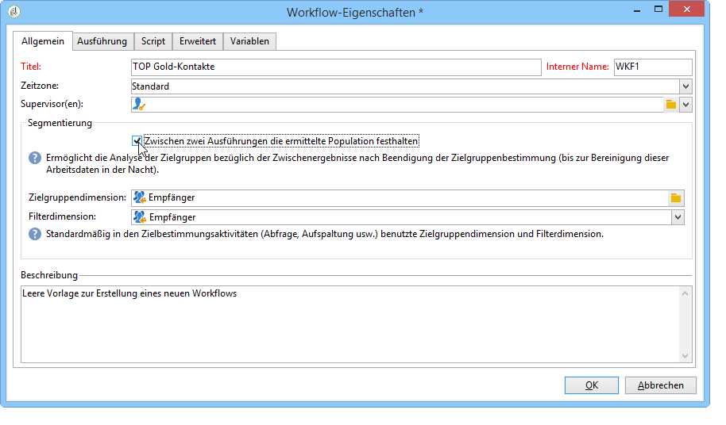
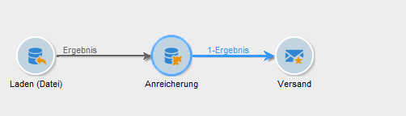
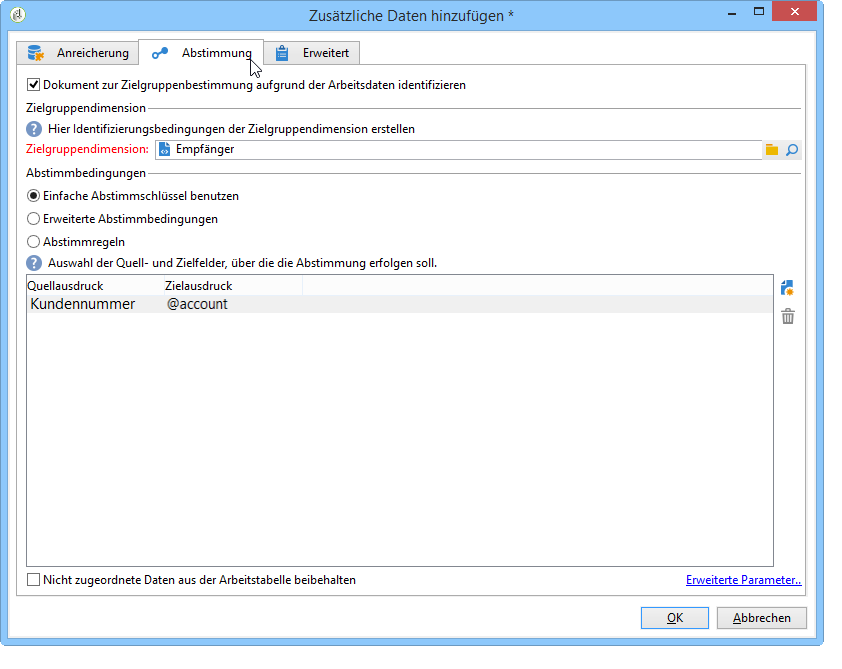
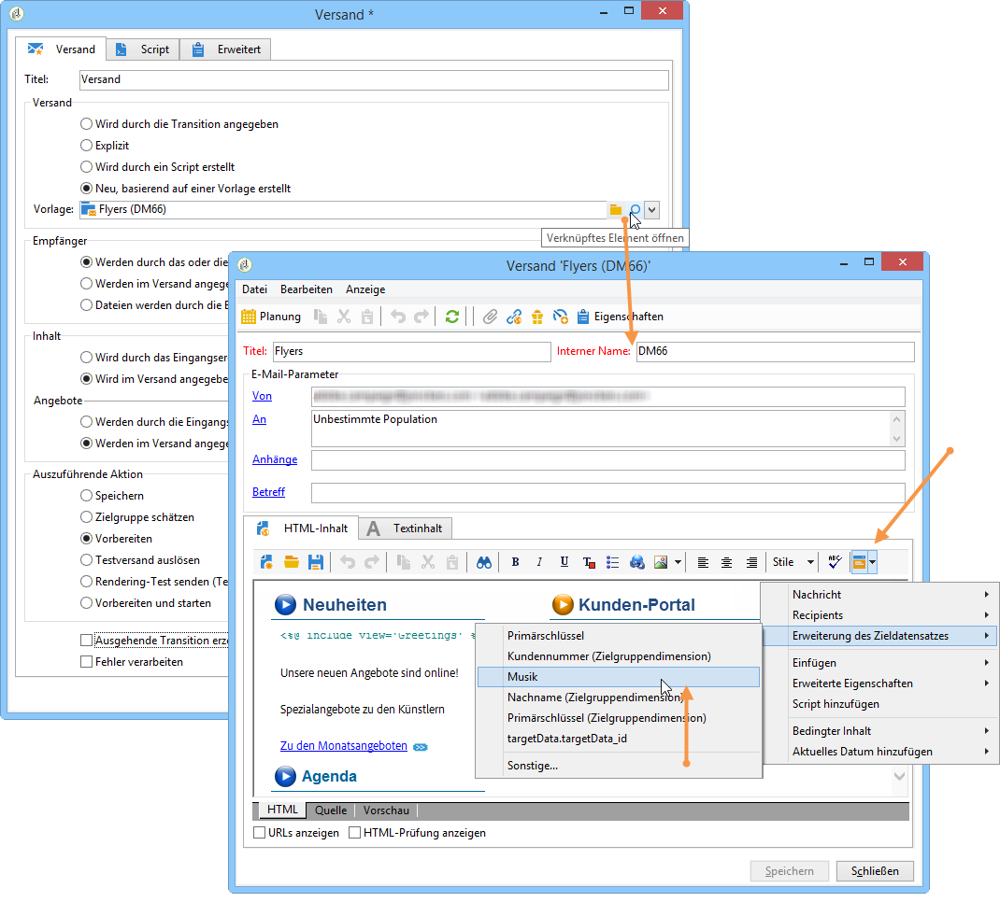
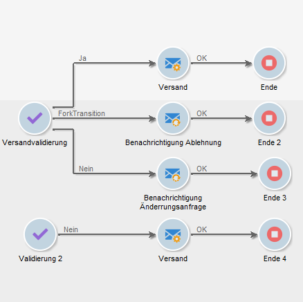
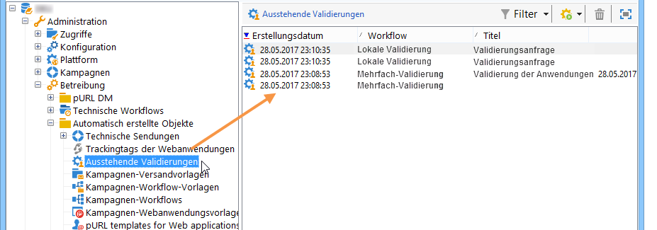
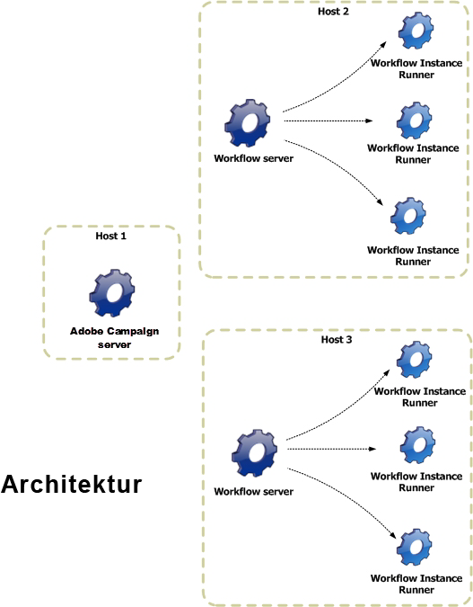

# Workflow ausführen{#executing-a-workflow}

Richtlinien zur Fehlerbehebung in Bezug auf die Ausführung von Workflows finden Sie in [diesem Abschnitt](../../production/using/workflow-execution.md).

## Workflow starten {#starting-a-workflow}

Workflows werden grundsätzlich manuell gestartet, Beim Starten kann es jedoch inaktiv bleiben, je nachdem, welche Informationen über einen Planer (siehe [Planer](../../workflow/using/scheduler.md)) oder die Aktivitätsplanung angegeben wurden.

Die mit der Workflow-Ausführung in Zusammenhang stehenden Prozesse (starten, anhalten, aussetzen etc.) laufen **asynchron** ab, d. h. der jeweilige Befehl wird gespeichert und erst dann ausgeführt, wenn ein Server verfügbar ist.

Anhand der Schaltflächen der Symbolleiste kann die Ausführung des Workflows gesteuert und überwacht werden.

The list of options available in the **[!UICONTROL Actions]** menu and the right-click menu are detailed below.

### Aktionen-Symbolleiste {#actions-toolbar}

Die Symbolleistenschaltflächen sind in diesem [Abschnitt](../../campaign/using/marketing-campaign-deliveries.md#building-the-main-target-in-a-workflow)beschrieben. Über die **[!UICONTROL Actions]** Schaltfläche haben Sie Zugriff auf zusätzliche Ausführungsoptionen, um auf ausgewählte Workflows zu reagieren. Sie können auch das **[!UICONTROL File > Actions]** Menü verwenden oder mit der rechten Maustaste auf einen Workflow klicken und die Option auswählen **[!UICONTROL Actions]**.


* **[!UICONTROL Start]**

   Dieser Befehl startet die Ausführung eines Workflows. Sein Status wechselt von **In Bearbeitung**, **Ausgesetzt** oder **Abgeschlossen** in **Gestartet**. Die Workflow-Engine übernimmt die Ausführung des Workflows. Bei zuvor ausgesetzten Workflows wird die Ausführung an der Stelle wieder aufgenommen, wo sie ausgesetzt wurde. In den anderen Fällen starten die Workflows jeweils mit der ersten Aktivität.

   Der Start eines Workflows ist ein asynchroner Prozess, d. h. der jeweilige Befehl wird gespeichert und erst dann ausgeführt, wenn ein Server verfügbar ist.

* **[!UICONTROL Pause]**

   Dieser Befehl überführt den Workflow in den Status **Ausgesetzt**. Bis zur Wiederaufnahme werden keine weiteren Aktivitäten gestartet, laufende Vorgänge werden jedoch nicht unterbrochen.

* **[!UICONTROL Stop]**

   Dieser Befehl hält die Ausführung eines laufenden Workflows an. Der Status der Workflow-Instanz wechselt zu **Abgeschlossen**. Laufende Vorgänge werden nach Möglichkeit unterbrochen. Gestartete Importe oder SQL-Abfragen werden sofort abgebrochen.

   Das Anhalten eines Workflows ist ein asynchroner Prozess, d. h. der jeweilige Befehl wird gespeichert und der oder die Server brechen die laufenden Vorgänge ab. Das Anhalten einer Workflow-Instanz kann daher eine geraume Zeit dauern, insbesondere wenn der Workflow über verschiedene Server verteilt ist. In diesem Fall muss jeder Server den Prozess übernehmen und die laufenden Aufgaben abbrechen.

* **[!UICONTROL Restart]**

   Dieser Befehl hält einen Workflow zunächst an und startet ihn dann erneut.In den meisten Fällen ermöglicht diese Vorgehensweise einen schnelleren Neustart als die separate Verwendung der Anhalten- und Starten-Schaltflächen. Dies ist insbesondere dann nützlich, wenn das Anhalten eines Workflows geraume Zeit in Anspruch nimmt, da der Befehl &quot;Starten&quot; erst wieder verfügbar ist, wenn der Workflow tatsächlich angehalten wurde.

   Die **[!UICONTROL Start / Pause / Stop / Restart]** Aktionen sind auch über die Ausführungssymbole in der Symbolleiste verfügbar. Weiterführende Informationen hierzu finden Sie in diesem [Abschnitt](../../campaign/using/marketing-campaign-deliveries.md#creating-a-targeting-workflow).

* **[!UICONTROL Purge history]**

   Mit dieser Aktion können Sie den Workflow-Verlauf bereinigen. Weitere Informationen finden Sie unter [Bereinigen der Protokolle](../../workflow/using/monitoring-workflow-execution.md#purging-the-logs).

* **[!UICONTROL Start in simulation mode]**

   Mit dieser Option können Sie den Workflow im Simulationsmodus anstatt im echten Modus starten. Das bedeutet, dass bei Aktivierung dieses Modus nur Aktivitäten ausgeführt werden, die sich nicht auf die Datenbank oder das Dateisystem auswirken (z. **[!UICONTROL Query]**, **[!UICONTROL Union]**, **[!UICONTROL Intersection]** usw.). Aktivitäten, die eine Wirkung haben (z. **[!UICONTROL Export]**, **[!UICONTROL Import]** usw.) sowie die darauf folgenden (in derselben Zweigstelle) nicht ausgeführt werden.

* **[!UICONTROL Execute pending tasks now]**

   This action lets you start all pending tasks as soon as possible. To start a specific task, right-click its activity and select **[!UICONTROL Execute pending task(s) now]**.

* **[!UICONTROL Unconditional stop]**

   Diese Option ändert den Workflow-Status in **[!UICONTROL Finished]**. Diese Aktion sollte nur als letztes Mittel verwendet werden, wenn der normale Stopp-Prozess nach einigen Minuten fehlschlägt. Verwenden Sie den bedingungslosen Stopp nur, wenn Sie sicher sind, dass keine aktiven Workflow-Aufträge ausgeführt werden.

   >[!CAUTION]
   >
   >Die Verwendung dieses Befehls sollte erfahrenen Benutzern vorbehalten bleiben.

* **[!UICONTROL Save as template]**

   Diese Aktion erstellt eine neue Workflow-Vorlage basierend auf dem ausgewählten Workflow. Sie müssen den Ordner angeben, in dem er gespeichert wird (im **[!UICONTROL Folder]** Feld).

   Die **[!UICONTROL Mass update of selected lines]** und **[!UICONTROL Merge selected lines]** Optionen sind allgemeine Plattformoptionen, die in allen **[!UICONTROL Actions]** Menüs verfügbar sind. Weiterführende Informationen hierzu finden Sie in diesem [Abschnitt](../../platform/using/updating-data.md).

### Kontextmenü {#right-click-menu}

Durch Markierung und Rechtsklick auf eine oder mehrere Aktivitäten eines Workflows können Sie speziell auf diese einwirken.


Im Kontextmenü stehen folgende Optionen zur Verfügung:

**[!UICONTROL Open]**: Mit dieser Option können Sie auf die Aktivitätseigenschaften zugreifen.

**[!UICONTROL Display logs:]** Mit dieser Option können Sie das Aufgabenausführungsprotokoll für die ausgewählte Aktivität anzeigen. Weitere Informationen finden Sie unter Protokolle [anzeigen](../../workflow/using/monitoring-workflow-execution.md#displaying-logs).

**[!UICONTROL Execute pending task(s) now:]** Mit dieser Aktion können Sie ausstehende Aufgaben so schnell wie möglich starten.

**[!UICONTROL Workflow restart from a task:]** Mit dieser Option können Sie den Workflow mit den zuvor für diese Aktivität gespeicherten Ergebnissen neu starten.

**[!UICONTROL Cut/Copy/Paste/Delete:]** Mit diesen Optionen können Sie Aktivitäten ausschneiden, kopieren, einfügen und löschen.

**[!UICONTROL Copy as bitmap:]** Mit dieser Option können Sie einen Screenshot aller Aktivitäten erstellen.

**[!UICONTROL Normal execution / Enable but do not execute / Do not enable:]** Diese Optionen stehen auch auf der **[!UICONTROL Advanced]** Registerkarte der Aktivitätseigenschaften zur Verfügung. Sie werden unter [Ausführung](../../workflow/using/advanced-parameters.md#execution)ausführlich beschrieben.

**[!UICONTROL Save / Cancel:]** können Sie die an einem Workflow vorgenommenen Änderungen speichern oder abbrechen.

>[!NOTE]
>
>Es ist möglich, mehrere Aktivitäten zu markieren, um einen der genannten Befehle auf sie anzuwenden.

Das Kontextmenü wird in diesem [Abschnitt](../../campaign/using/marketing-campaign-deliveries.md#executing-a-workflow) näher erläutert.

## Lebenszyklus eines Workflows {#workflow-life-cycle}

Der Lebenszyklus eines Workflows gestaltet sich in drei Hauptetappen:

* **In Bearbeitung**

   Hierbei handelt es sich um die Phase der Erstellung. Ein neu erstellter Workflow weist den Bearbeitungsstatus auf. Ein derartiger Workflow wurde noch nicht vom Server übernommen und kann daher problemlos geändert werden.

* **Gestartet**

   Nach Abschluss der Konzeptionsphase kann der Workflow gestartet werden. Jetzt wird die Instanz vom Server übernommen und die elementaren Aufgaben werden ausgeführt. Der Workflow kann unter Beachtung gewisser Vorsichtsmaßnahmen trotzdem noch geändert werden.

* **Abgeschlossen**

   Ein Workflow ist abgeschlossen, wenn keine Aufgaben mehr zur Verarbeitung anstehen, oder wenn ein Benutzer die Workflow-Instanz ausdrücklich angehalten hat.

Beispielsweise sind im unten stehenden Workflow die Aktivitäten **Beginn** und **Versand** umrandet und die Aktivität **Validierung** blinkt.


Dies bedeutet, dass die ersten beiden Aktivitäten erfolgreich ausgeführt wurden und dass die Validierungsaktivität in Gang ist, d. h. sie wurde erstellt, ist aber noch nicht abgeschlossen.

Oberhalb der Transition des **Versands** wird **574 - OK** angezeigt. Daran ist erkennbar, dass bei der Versandvorbereitung 574 Empfänger ausgewählt wurden und dass der Vorgang korrekt abgelaufen ist. Diese Art an Informationen wird von Aktivitäten berechnet, die Daten manipulieren, und im Verlauf der Workflow-Ausführung auf den Transitionen angezeigt.

Der Workflow wartet also auf die Entscheidung eines Benutzers, der der Gruppe angehört, welche in der **Validierung**-Aktivität ausgewählt wurde. Gruppenmitglieder, deren E-Mail-Adresse oder Mobiltelefonnummer in ihrem Profil gespeichert sind, werden über die entsprechenden Kanäle benachrichtigt.

Die Benutzerverwaltung wird in diesem [Abschnitt](../../platform/using/access-management.md) beschrieben.

Weitere Informationen zur Überwachung der Workflows finden Sie in [diesem Abschnitt](../../workflow/using/monitoring-workflow-execution.md).

## Lebenszyklus der Arbeitsdaten {#data-life-cycle}

### Arbeitstabellen {#work-table}

In einem Workflow werden die von einer Aktivität zur anderen übertragenen Daten in temporären Arbeitstabellen gespeichert.

Die Daten können durch Rechtsklick auf die entsprechende Transition angezeigt und analysiert werden.


Wählen Sie im Kontextmenü die entsprechende Option aus:

* Ergebnis anzeigen...

   Diese Option ermöglicht die Anzeige der Zielgruppendaten und der Struktur der Arbeitstabelle (Tab **[!UICONTROL Schema]**).

   

   Weitere Informationen finden Sie unter [Tabellen und Workflow-Schema](../../workflow/using/monitoring-workflow-execution.md#worktables-and-workflow-schema).

* Ergebnis analysieren...

   Diese Option bietet Zugriff auf den Assistenten zur beschreibenden Analyse, welcher die Erstellung von Statistiken und Berichten über die in der Transition übermittelten Daten ermöglicht.

   Weiterführende Informationen hierzu finden Sie in diesem [Abschnitt](../../reporting/using/using-the-descriptive-analysis-wizard.md).

Die Zieldaten werden bei Ausführung des Workflows bereinigt. Nur der letzte Arbeitstisch ist verfügbar. Sie können den Workflow so konfigurieren, dass alle Arbeitstabellen weiterhin verfügbar sind: aktivieren Sie die **[!UICONTROL Keep the result of interim populations between two executions]** Option in den Workflow-Eigenschaften.

Bei großen Datenmengen sollte diese Option jedoch nicht aktiviert werden.



### Zielgruppendaten {#target-data}

Die in den Arbeitstabellen gespeicherten Daten können insbesondere in Personalisierungsfeldern verwendet werden.

Auf diese Weise können Sie in einem Versand mithilfe einer Liste gesammelte oder aus Umfrageantworten stammende Informationen verwenden. Dies geschieht über folgende Syntax:

```
%= targetData.FIELD %
```

**[!UICONTROL Target extension]** (targetData) Personalisierungselemente vom Typ sind für Targeting-Arbeitsabläufe nicht verfügbar. Das Bereitstellungsziel muss im Workflow integriert und im eingehenden Übergang der Bereitstellung angegeben werden.

Wenn Sie Auslieferungsnachweise erstellen möchten, muss das Proof-Ziel basierend auf dem **[!UICONTROL Address substitution]** Modus erstellt werden, damit die Personalisierungsdaten eingegeben werden können. Weiterführende Informationen hierzu finden Sie in diesem [Abschnitt](../../delivery/using/steps-defining-the-target-population.md#using-address-substitution-in-proof).

Im folgenden Anwendungsbeispiel sollen Kundeninformationen in einer Liste gesammelt und dann in einer personalisierten E-mail verwendet werden.

Gehen Sie wie folgt vor:

1. Erstellen Sie einen Workflow, um die Informationen zu sammeln, sie mit der Datenbank abzustimmen und den Versand zu starten.

   

   Im vorliegenden Beispiel enthält die Datei folgende Informationen:

   ```
   Music,First name,Last name,Account,CD/DVD,Card
   Pop,David,BLAIR,4323,CD,0
   Rock,Daniel,ARCARI,3222,DVD,1
   Disco,Uma,ALTON,0488,DVD,0
   Jazz,Paul,BOLES,6475,CD,1
   Jazz,David,BOUKHARI,0841,DVD,1
   [...]
   ```

   Die Aktivität zum Laden der Datei wird folgendermaßen konfiguriert:

   

1. Configure the **[!UICONTROL Enrichment]** type activity to reconcile the collected data with that already in the Adobe Campaign database.

   Hier dient die Kundennummer als Abstimmschlüssel:

   

1. Then configure the **[!UICONTROL Delivery]**: it is created based on a template, and the recipients are specified by the inbound transition.

   

   >[!CAUTION]
   >
   >Nur die im Übergang enthaltenen Daten können zur Personalisierung der Bereitstellung verwendet werden. **Personalisierungsfelder für targetData** -Typen stehen nur für die eingehende Bevölkerung der Aktivität zur Verfügung **[!UICONTROL Delivery]** .

1. Verwenden Sie in der Versandvorlage die im Workflow gesammelten Daten.

   To do this, insert **[!UICONTROL Target extension]** type personalization fields.

   

   Im vorliegenden Beispiel wird der bevorzugte Musikstil des Kunden und der bevorzugte Datenträger (CD oder DVD) - gemäß den Informationen der geladenen Datei - eingefügt.

   Des Weiteren enthält der Versand ein Angebot für Kunden mit Kundenkarte, d. h. für Kunden, bei denen der Wert &#39;Kundenkarte&#39; gleich 1 ist.

   

   **[!UICONTROL Target extension]** (targetData)-Typdaten werden unter Verwendung der gleichen Eigenschaften wie alle Personalisierungsfelder in Auslieferungen eingefügt. Sie können auch im Betreff, in den Linkbeschriftungen oder in den Links selbst verwendet werden.

   Die in der ersten Aktivität des Workflows erhobenen Empfänger erhalten somit die folgende Nachricht:

   

## Validierungen definieren {#defining-approvals}

Validierungen bieten Benutzern die Gelegenheit, an bestimmten Etappen des Workflows Entscheidungen zu treffen oder einen Vorgang zur Ausführung freizugeben.

Bei Verwendung von Validierungen erhält eine Gruppe von verantwortlichen Benutzern eine Benachrichtigung und die Ausführung der an die Validierung anschließenden Aktivität wird bis zum Erhalt der Antwort ausgesetzt. Der Workflow ist jedoch nicht blockiert und kann in der Zwischenzeit andere, nicht von der Validierung abhängige Vorgänge ausführen. So ist es beispielsweise möglich, dass parallel verschiedene Validierungen ausstehen.

Eine Validierung kann vom Benutzer die Auswahl einer Option aus mehreren Vorschlägen verlangen. Es ist ebenfalls möglich, dem Benutzer nur eine Möglichkeit anzubieten, um ihm z. B. eine Aufgabe zuzuweisen (Zielgruppenbestimmung, Inhaltserstellung etc.). In diesem Fall antwortet der Benutzer nach Erledigung der Aufgabe und der Workflow fährt mit der Ausführung der anschließenden Aktivitäten fort. Die folgende Abbildung verdeutlicht die beiden Validierungstypen:



In Kampagnen ist der Validierungsablauf für alle Aktivitäten identisch.


In diesem [Abschnitt](../../campaign/using/marketing-campaign-approval.md#checking-and-approving-deliveries) finden Sie weitere Beispiele zu Validierungen.

Zur Validierung können Benutzer entweder den Webzugriff mithilfe des in der Benachrichtigung enthaltenen Links nutzen oder aber die Clientkonsole.

>[!NOTE]
>
>Nach Speicherung der Antwort kann diese nicht mehr geändert werden.

### Benachrichtigungsversand {#sending-emails}

Benutzer werden durch den Versand einer E-Mail-Benachrichtigung zur Validierung der ihnen zugewiesenen Vorgänge aufgefordert. Die E-Mail enthält einen Link, der den Webzugriff auf die Plattform ermöglicht. Die E-Mail-Adresse des Benutzers muss in seinem Profil gespeichert werden. Bei fehlender Adresse hat der Benutzer trotz allem die Möglichkeit, direkt über die Clientkonsole zu antworten.

Die Benutzerverwaltung wird in diesem [Abschnitt](../../platform/using/access-management.md) beschrieben.

Genehmigungs-E-Mails werden kontinuierlich gesendet. Die standardmäßige Bereitstellungsvorlage lautet **[!UICONTROL notifyAssignee]**: Er wird im **[!UICONTROL Administration > Campaign management > Technical delivery templates]** Ordner gespeichert. Dieses Szenario kann angepasst werden. Es wird außerdem empfohlen, eine Kopie zu erstellen und Vorlagen für jede Aktivität zu ändern.

Über diese Vorlage erstellte Lieferungen werden im **[!UICONTROL Administration > Production > Objects created automatically > Technical deliveries > Workflow notifications]** Ordner gespeichert.

### Validierung in der Clientkonsole {#approval-via-the-console}

In Kampagnen sind die ausstehenden Validierungen im Dashboard ersichtlich.

Bei technischen Arbeitsabläufen können die Aufgaben, die der Benutzer genehmigen kann, von der Baumstruktur im **[!UICONTROL Administration > Production > Objects created automatically > Pending approvals]** Ordner aus aufgerufen werden.



### Gruppen {#groups}

Validierungen können einem einzelnen Benutzer, einer Benutzergruppe oder verschiedenen, durch eine Filterbedingung ermittelten Benutzern zugewiesen werden.

1. Bei einfachen Validierungen wird die Aufgabe als abgeschlossen angesehen, sobald ein Benutzer geantwortet hat. Sollte ein weiterer Benutzer antworten wollen, erhält er eine Benachrichtigung, dass die Aufgabe bereits abgeschlossen ist.
1. Für mehrere Genehmigungen siehe [Mehrere Genehmigungen](#multiple-approval).

Validierungsverantwortliche Benutzergruppen sollten wie Rollen oder Funktionen konzipiert werden und nicht aus mit Namen bezeichneten Personen bestehen. So ist beispielsweise eine Gruppe &quot;Verantwortliche für Kampagnen-Budgets&quot; weitaus pertinenter als &quot;Team Hans Meyer&quot;. Des Weiteren wird empfohlen, dass eine Gruppe jeweils mindestens zwei Personen enthält, um im Falle einer Abwesenheit nicht den ganzen Ablauf zu blockieren.

### Ablauffristen {#expirations}

Ablauffristen sind besondere, vor allem bei Validierungsaktivitäten auftretende Transitionen. Eine Ablauf-Transition bietet die Möglichkeit, eine Dauer festzulegen, nach deren Verstreichen ein Workflow auch dann weiter ausgeführt wird, wenn niemand auf die Validierungszuweisung geantwortet hat. Die Validierung kann dann z. B. in der nächsten Aktivität einer anderen Gruppe zugewiesen werden.

Ablauffristen werden im zweiten Tab der Eigenschaften von Validierungsaktivitäten definiert. Es können verschiedene Ablauffristen konfiguriert werden.


To add a new expiration, click **[!UICONTROL Add]**. A transition is added to each of the expirations created. Sie haben folgende Möglichkeiten:

* die vorgeschlagenen Parameter direkt in der Liste zu ändern, indem Sie in die entsprechende Zelle klicken,
* or edit the expression by clicking the **[!UICONTROL Detail...]** button.

>[!NOTE]
>
>Es ist nicht notwendig, die Ablauffristen zu ordnen, sie werden automatisch in chronologischer Reihenfolge verarbeitet.

Die **[!UICONTROL Do not terminate the task]** Option lässt die Genehmigung aktiv, wenn die Verzögerung überschritten wird. Dieser Modus ermöglicht die Verwaltung von Erinnerungen während der Aktivierung der Genehmigung: Operatoren können weiterhin reagieren. Diese Option ist standardmäßig deaktiviert, d. h. die Aufgabe wird bei Ablauf als abgeschlossen betrachtet und die Operatoren reagieren nicht mehr.

Vier verschiedene Arten der Berechnung der Ablauffrist stehen zur Auswahl:

* **Nach Beginn der Aufgabe** - die Ablauffrist wird ausgehend vom Aktivierungsdatum der Validierung unter Hinzufügung der angegebenen Dauer berechnet;
* **Nach einem bestimmten Datum** - die Ablauffrist wird ausgehend vom angegebenen Datum unter Hinzufügung der angegebenen Dauer berechnet;
* **Vor einem bestimmten Datum** - die Ablauffrist wird ausgehend vom angegebenen Datum unter Abzug der angegebenen Dauer berechnet;
* **Durch ein Script berechnet** - die Ablauffrist wird mithilfe eines JavaScripts berechnet.

   Das folgende Script berechnet eine Ablauffrist von 24 Stunden vor Start eines Versands (identifiziert durch **vars.deliveryId**):

   ```
   var delivery = nms.delivery.get(vars.deliveryId)
   var expiration = delivery.scheduling.contactDate
   var oneDay = 1000*60*60*24
   expiration.setTime(expiration.getTime() - oneDay)
   return expiration
   ```

### Mehrfach-Validierungen {#multiple-approval}

Bei einer mehrfachen Validierung können alle validierungsverantwortlichen Benutzer antworten. Für jede Antwort wird eine separate Transition aktiviert.

Die Mehrfach-Validierung ist insbesondere für Abstimmungen oder Umfragen geeignet. Es besteht die Möglichkeit, die Antworten zu zählen und nach der definierten Ablauffrist das Ergebnis weiterzuverwenden.

### Erforderliche Rechte {#required-rights}

Um auf eine Validierungsanfrage antworten zu können, müssen Benutzer mindestens über die folgenden Berechtigungen verfügen:

* Lesen von Workflows,
* Lesen und Schreiben im Ordner der zu validierenden Aufgaben.

Die Benutzergruppe &#39;Workflow-Ausführung&#39; verfügt über diese Berechtigungen. Damit ein Benutzer Validierungen vornehmen kann, reicht es somit aus, ihn zu dieser Gruppe hinzuzufügen.

## Architektur {#architecture}

Workflows werden über eine dedizierte Engine verarbeitet. Diese kann zur besseren Lastverteilung simultan auf mehreren Servern gestartet werden.



* Der Prozess &#39;Workflow Instance Runner&#39; (runwf) führt alle Aufgaben einer spezifischen Workflow-Instanz aus. Sobald keine Aufgaben mehr zur unmittelbaren Verarbeitung anstehen, wird der Prozess passiviert, d. h. er speichert seinen derzeitigen Status in der Datenbank und hält an.
* Das Modul &#39;Workflow Server&#39; (wfserver) überwacht die laufenden Workflow-Instanzen. Wenn Aufgaben zur Ausführung anstehen, erstellt das Modul einen Prozess, um die entsprechende Instanz zu aktivieren oder zu reaktivieren.

Von Benutzern angeforderte Aktionen (Workflow starten, anhalten, aussetzen usw.) werden nicht sofort vom &#39;nlserver&#39;-Modul ausgeführt, sondern in eine Warteschlange eingereiht, um von einem Workflow-Modul verarbeitet zu werden.
