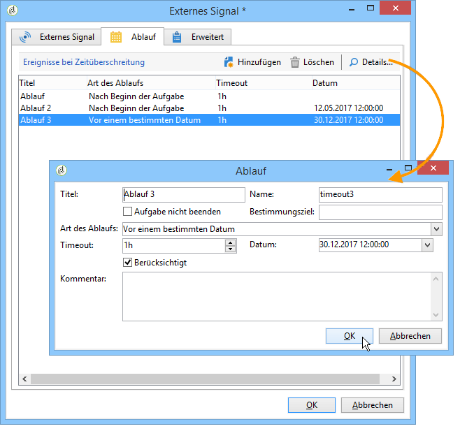
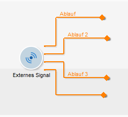

# Externes Signal{#external-signal}

Ein **Externes Signal** löst die Ausführung einer Reihe von Aufgaben innerhalb eines Workflows aus.

Wenn eine Aufgabe „Externes Signal“ aktiviert wird, wird sie unbegrenzt oder bis zum Ende des angegebenen Zeitraums ausgesetzt. Ihre Transition wird durch den SOAP-Aufruf **PostEvent(sessionToken, workflowId, activity, transitions, parameters, complete) aktiviert.** Der **[!UICONTROL complete]**-Parameter ermöglicht die Fertigstellung der Aufgabe, damit sie nicht mehr auf nachfolgende Aufrufe reagiert.

Weiterführende Hinweise zu SOAP-Aufrufen und der PostEvent-Funktion finden Sie in der einschlägigen Online-Literatur.

Es besteht die Möglichkeit, in der Aktivität Ereignisse zu konfigurieren, die bei Abwesenheit von Signalen wirksam werden. Öffnen Sie hierzu die Aktivität und gehen Sie in den Tab **[!UICONTROL Ablauf]**. Klicken Sie auf die Schaltfläche **[!UICONTROL Hinzufügen]**, um Ereignisse zu erstellen und zu konfigurieren.

Die Ablauf-Konfiguration wird im Abschnitt [Timeouts](../../workflow/using/defining-approvals.md) beschrieben.

In der Spalte **Timeout** kann die Zeitspanne vor Ablauf in den Einheiten Ihrer Wahl definiert werden. Siehe [Warten](../../workflow/using/wait.md).

Jede Zeile stellt einen Ablauftypen dar und entspricht einer Transition.

