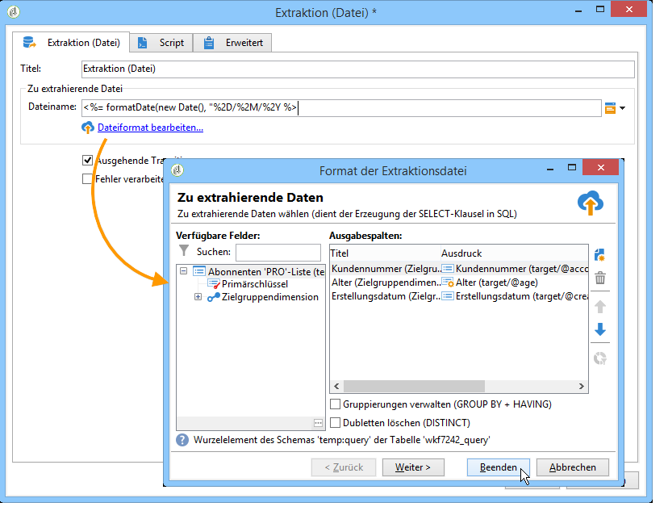
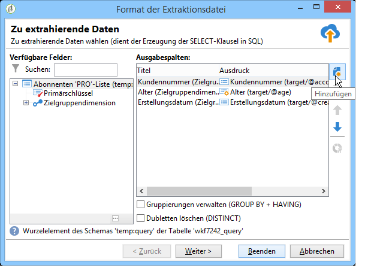
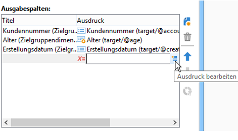
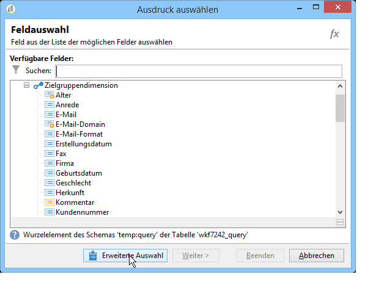
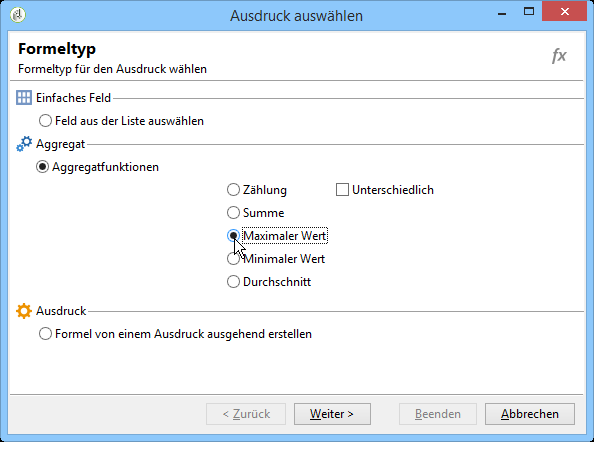
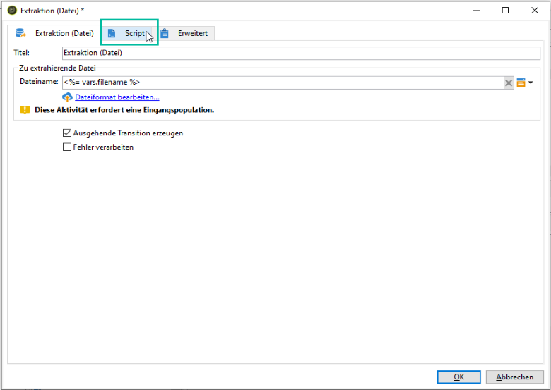

# Extraktion (Datei){#extraction-file}

Mithilfe der Aktivität **[!UICONTROL Extraktion (Datei)]** werden Daten einer Workflow-Tabelle in eine externe Datei extrahiert.

>[!CAUTION]
>
>Diese Aktivität erfordert eine eingehende Transition mit den zu extrahierenden Daten.

Gehen Sie wie folgt vor, um eine Extraktion zu konfigurieren:

1. Benennen Sie die zu extrahierende Datei. Der Name kann Variablen enthalten, die über die Personalisierungsschaltfläche rechts des entsprechenden Felds eingefügt werden können.
1. Klicken Sie auf den Link **[!UICONTROL Dateiformat bearbeiten...]**, um die zu extrahierenden Daten auszuwählen.

   

   Die Option **[!UICONTROL Gruppierungen verwalten (GROUP BY + HAVING)]** fügt eine weitere Etappe hinzu, die die Filterung des Aggregats ermöglicht (z. B. nach einer bestimmten Art von Bestellung, nach Kunden mit mehr als zehn Bestellungen etc.).

1. If necessary, you can add new columns to the output file, such as computing or processing results for example. To do this, click the **[!UICONTROL Add]** icon.

   

   Klicken Sie dann auf das Symbol **[!UICONTROL Ausdruck bearbeiten]**, um den Inhalt der neuen Spalte zu definieren.

   

   Klicken Sie im darauffolgenden Fenster auf **[!UICONTROL Erweiterte Auswahl]**, um die auf die Daten anzuwendende Funktion zu konfigurieren.

   

   Kreuzen Sie den gewünschten Formeltyp an.

   

Sie können einen Nachbearbeitungsprozess definieren, der während der Extraktion der Daten ausgeführt werden soll, sodass Sie die Dateien komprimieren oder verschlüsseln können. Dazu muss der gewünschte Befehl auf der Registerkarte &quot; **[!UICONTROL Skript]** &quot;der Aktivität hinzugefügt werden.

Weitere Informationen finden Sie in diesem Abschnitt: [Komprimieren oder Verschlüsseln einer Datei](../../workflow/using/how-to-use-workflow-data.md#zipping-or-encrypting-a-file).

## Aggregat-Funktionen {#list-of-aggregate-functions}

Folgende Aggregatfunktionen stehen zur Verfügung:

* **[!UICONTROL Zählung]**: zählt die Werte ungleich null des zu aggregierenden Felds einschließlich der doppelten Werte (des aggregierten Felds).

   **[!UICONTROL Zählung - Unterschiedlich]**: zählt die unterschiedlichen Werte ungleich null des zu aggregierenden Felds. Doppelte Werte werden vor der Berechnung ausgeschlossen.

* **[!UICONTROL Summe]**: gibt die Summe der Werte eines numerischen Felds aus.
* **[!UICONTROL Minimaler Wert]**: gibt den Mindestwert eines beliebigen Felds aus.
* **[!UICONTROL Maximaler Wert]**: gibt den Höchstwert eines beliebigen Felds aus.
* **[!UICONTROL Durchschnitt]**: gibt den Durchschnittswert eines numerischen Felds aus.

