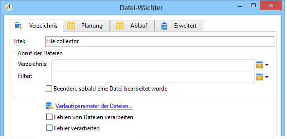

# Datei-Wächter{#file-collector}

Die **Datei-Wächter-Aktivität** überwacht ein Verzeichnis und aktiviert ihre Transition bei jedem neuen Eingang von Dateien. Für jedes Ereignis enthält eine **[!UICONTROL filename]**-Variable den vollständigen Namen der eingegangenen Datei. Die abgerufenen Dateien werden zu Verlaufszwecken und damit sie nur einmal berücksichtigt werden in ein anderes Verzeichnis verschoben.

Standardmäßig ist der Datei-Wächter eine persistente Aufgabe, die zu den in der Planung definierten Zeitpunkten das Verzeichnis auf das Vorhandensein von Dateien prüft.

Die Dateien müssen sich auf dem Server befinden, auf dem das wfserver-Modul des betreffenden Workflows ausgeführt wird. Wenn verschiedene wfserver-Module auf derselben Instanz laufen, muss die Affinität entweder der die Dateien verwendenden Aktivitäten oder des Workflows angegeben werden.

## Eigenschaften {#properties}

Auf dem ersten Tab der Aktivität **[!UICONTROL Datei-Wächter]** können Sie den Quellordner auswählen und die erfassten Dateien bei Bedarf filtern. Die anderen Tabs werden unter [E-Mail-Empfang](../../workflow/using/inbound-emails.md) (auf den Tabs **[!UICONTROL Planung]** und **[!UICONTROL Ablauf]**) ausführlich beschrieben.

1. **Abruf der Dateien**

   * **[!UICONTROL Verzeichnis]**

      Angabe des die abzurufenden Dateien enthaltenden Verzeichnisses. Das Verzeichnis muss zuvor auf dem Server erstellt worden sein. Wenn es nicht existiert, wird ein Fehler erzeugt.

   * **[!UICONTROL Filter]**

      Nur die Dateien, die den angegebenen Filterkriterien entsprechen, werden berücksichtigt. Die anderen Dateien im Verzeichnis werden ignoriert. Wenn kein Filter definiert wurde, werden alle im Verzeichnis enthaltenen Dateien abgerufen. Filterbeispiele: **&quot;*.zip&quot;**, **&quot;import-*.txt&quot;**.

   * **[!UICONTROL Beenden, sobald eine Datei bearbeitet wurde]**

      Wenn diese Option angekreuzt wird, ist die Aufgabe abgeschlossen, sobald die erste Datei empfangen wurde. In diesem Fall wird nur eine Datei berücksichtigt, auch wenn das Verzeichnis mehrere, den Kriterien entsprechende Dateien enthält. Diese Option stellt somit sicher, dass nur ein Ereignis übermittelt wird. Die berücksichtigte Datei ist die erste in alphabetischer Reihenfolge.

      Im Falle einer Aktivität, für die keine Planung definiert wurde, wird ein Fehler erzeugt, wenn keine Datei den Filterkriterien entspricht und die Option **[!UICONTROL Fehlen von Dateien bearbeiten]** nicht aktiviert wurde.

   * **[!UICONTROL Planung]**

      Definiert mithilfe der im Tab **[!UICONTROL Planung]** angegebenen Parameter die Häufigkeit, mit der das Verzeichnis auf die Existenz von Dateien überprüft wird.

1. **Umgang mit Fehlern**

   Zwei Optionen stehen zur Verfügung:

   * **[!UICONTROL Fehlen von Dateien bearbeiten]**

      Bei Ankreuzen dieser Option erscheint eine spezifische Transition, die immer dann aktiviert wird, wenn keine dem Filter entsprechende Datei im angegebenen Verzeichnis vorhanden ist.

      Wenn für die Aufgabe keine Planung definiert wurde, wird diese Transition nur einmal aktiviert.

   * **[!UICONTROL Fehler verarbeiten]**

      Bei Ankreuzen dieser Option erscheint eine spezifische Transition, die immer dann aktiviert wird, wenn ein Fehler auftritt. In diesem Fall wird die Ausführung des Workflows nicht ausgesetzt, sondern fortgeführt.

      Dies gilt für Fehler des Dateisystems (Datei kann nicht verschoben werden, Zugriff auf das Verzeichnis nicht möglich usw.).

      Fehler, die aus der Konfiguration der Aktivität resultieren, beispielsweise durch Angabe von ungültigen Werten (z. B. inexistentes Verzeichnis), werden nicht verarbeitet.

1. **Verlauf**

   Informationen zum Schritt **[!UICONTROL Verlaufserstellung]** finden Sie unter [HTTP-Übertragung](../../workflow/using/web-download.md).

Die Reihenfolge der Dateiverarbeitung kann nicht beeinflusst werden. Um eine Reihe von Dateien schrittweise zu verarbeiten, kann die Option **[!UICONTROL Beenden, sobald eine Datei bearbeitet wurde]** in Verbindung mit einer Schlaufe verwendet werden. In diesem Fall werden die Dateien in alphabetischer Reihenfolge verarbeitet. Die Option **[!UICONTROL Fehlen von Dateien bearbeiten]** beendet die Schlaufe.

## Ausgabeparameter {#output-parameters}

* filename: Vollständiger Dateiname. Dies ist der Dateiname, nachdem er in das Historisierungsverzeichnis verschoben wurde. Der Pfad ist daher anders; der Name unterscheidet sich jedoch ebenfalls, wenn in dem Verzeichnis bereits eine andere Datei mit demselben Namen vorhanden ist. Die Erweiterung bleibt erhalten.
