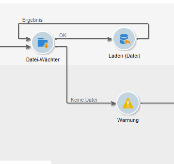

# Datei-Wächter{#file-collector}

Der **Dateisammler** überwacht den Eingang einer oder mehrerer Dateien in einem Verzeichnis und aktiviert den Übergang für jede empfangene Datei. Für jedes Ereignis enthält eine **[!UICONTROL filename]** Variable den vollständigen Namen der empfangenen Datei. Die gesammelten Dateien werden zu Archivierungszwecken in ein anderes Verzeichnis verschoben, um sicherzustellen, dass sie nur einmal gezählt werden.

Standardmäßig ist der Datei-Wächter eine persistente Aufgabe, die zu den in der Planung definierten Zeitpunkten das Verzeichnis auf das Vorhandensein von Dateien prüft.

Die Dateien müssen sich auf dem Server befinden, auf dem das wfserver-Modul des betreffenden Workflows ausgeführt wird. Wenn verschiedene wfserver-Module auf derselben Instanz laufen, muss die Affinität entweder der die Dateien verwendenden Aktivitäten oder des Workflows angegeben werden.

## Eigenschaften {#properties}

Auf der ersten Registerkarte der **[!UICONTROL File collector]** Aktivität können Sie den Quellordner auswählen und bei Bedarf die erfassten Dateien filtern. Die anderen Registerkarten sind unter [Inbound Emails](../../workflow/using/inbound-emails.md) (**[!UICONTROL Schedule]** und **[!UICONTROL Expiry]** Registerkarten) ausführlich beschrieben.

1. **Abruf der Dateien**

   * **[!UICONTROL Directory]**

      Angabe des die abzurufenden Dateien enthaltenden Verzeichnisses. Das Verzeichnis muss zuvor auf dem Server erstellt worden sein. Wenn es nicht existiert, wird ein Fehler erzeugt.

   * **[!UICONTROL Filter]**

      Es werden nur Dateien berücksichtigt, die diesem Filter entsprechen. Die anderen Dateien im Ordner werden ignoriert. Wenn der Filter leer ist, werden alle Dateien im Ordner berücksichtigt. Filterbeispiele: ***.zip**, **import-*.txt**.

   * **[!UICONTROL Stop as soon as a file has been processed]**

      Wenn diese Option angekreuzt wird, ist die Aufgabe abgeschlossen, sobald die erste Datei empfangen wurde. In diesem Fall wird nur eine Datei berücksichtigt, auch wenn das Verzeichnis mehrere, den Kriterien entsprechende Dateien enthält. Diese Option stellt somit sicher, dass nur ein Ereignis übermittelt wird. Die berücksichtigte Datei ist die erste in alphabetischer Reihenfolge.

      For an unscheduled activity, if no file matching the filter is found in the specified directory, and if the **[!UICONTROL Process file nonexistence]** option is not enabled, an error will be raised.

   * **[!UICONTROL Execution schedule]**

      Determines the frequency of the file presence check via the parameters of the **[!UICONTROL Schedule]** tab.

1. **Umgang mit Fehlern**

   Zwei Optionen stehen zur Verfügung:

   * **[!UICONTROL Process file nonexistence]**

      Bei Ankreuzen dieser Option erscheint eine spezifische Transition, die immer dann aktiviert wird, wenn keine dem Filter entsprechende Datei im angegebenen Verzeichnis vorhanden ist.

      Wenn für die Aufgabe keine Planung definiert wurde, wird diese Transition nur einmal aktiviert.

   * **[!UICONTROL Processing errors]**

      Bei Ankreuzen dieser Option erscheint eine spezifische Transition, die immer dann aktiviert wird, wenn ein Fehler auftritt. In diesem Fall wird die Ausführung des Workflows nicht ausgesetzt, sondern fortgeführt.

      Dies gilt für Fehler des Dateisystems (Datei kann nicht verschoben werden, Zugriff auf das Verzeichnis nicht möglich usw.).

      Fehler, die aus der Konfiguration der Aktivität resultieren, beispielsweise durch Angabe von ungültigen Werten (z. B. inexistentes Verzeichnis), werden nicht verarbeitet.

1. **Verlauf**

   Gehen Sie wie folgt **[!UICONTROL File historization]** vor: [Webdownload](../../workflow/using/web-download.md).

Die Dateiverarbeitungsreihenfolge kann nicht bestimmt werden. Um einen Satz Dateien nacheinander zu verarbeiten, verwenden Sie die **[!UICONTROL Stop as soon as a file has been processed]** Option und erstellen Sie eine Schleife. In diesem Fall werden die Dateien in alphabetischer Reihenfolge verarbeitet. Mit der **[!UICONTROL Process file nonexistence]** Option können Sie die Iteration beenden.

## Ausgabeparameter {#output-parameters}

* filename

Vollständiger Name der Datei. Es handelt sich hierbei um den Namen der Datei, nachdem sie in das Verlaufsverzeichnis verschoben wurde. Der Pfad weicht somit von der ursprünglichen Datei ab, gegebenenfalls auch der Name, wenn bereits eine Datei mit demselben Namen im Verzeichnis existiert. Die Endung bleibt unverändert.
