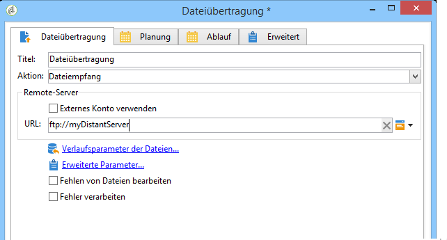

# Dateiversand{#file-transfer}

Die **Dateiübertragung** ermöglicht den Empfang, den Versand und die Prüfung auf Existenz von Dateien oder das Listen von Dateien auf einem Server. Als Protokoll wird der Amazon Simple Storage Service (S3), das File Transfer Protocol (FTP) oder das Secure File Transfer Protocol (SFTP) verwendet.
Mit der S3- oder SFTP-Verbindung können Sie auch Segmentdaten mit der Adobe Echtzeit-Kundendatenplattform in Adobe Campaign importieren. For more on this, refer to this [documentation](https://docs.adobe.com/content/help/en/experience-platform/rtcdp/destinations/destinations-cat/adobe-destinations/adobe-campaign-destination.html).

## Eigenschaften {#properties}

Use the drop-down list of the **[!UICONTROL Action]** field to select the action of the activity.

Die weitere Konfiguration hängt von der gewählten Aktion ab.

1. **Dateiempfang**

   Um auf einem Remote-Server gespeicherte Dateien zu empfangen, wählen Sie **[!UICONTROL File download]** im **[!UICONTROL Action]** Feld aus. Sie müssen die URL im entsprechenden Feld angeben.

   

   Wählen Sie **[!UICONTROL Use an external account]** ein Konto aus den S3-, FTP- oder SFTP-Konten aus, die im **[!UICONTROL Administration > Platform > External accounts]** Knoten der Struktur konfiguriert sind. Geben Sie dann an, welches Verzeichnis auf dem Server die herunterzuladenden Dateien enthält.

   

1. **Dateiversand**

   Um eine Datei an einen Server zu senden, wählen Sie **[!UICONTROL File upload]** im **[!UICONTROL Action]** Feld aus. Sie müssen den Zielserver im **[!UICONTROL Remote server]** Abschnitt des Editors angeben. Die Parameter sind mit denen für eingehende Dateien identisch. Siehe oben.

   Die Quelldatei kann aus der vorherigen Aktivität stammen. In diesem Fall muss die **[!UICONTROL Use the file generated by the previous activity]** Option ausgewählt werden.

   

   Dies kann auch eine oder mehrere andere Dateien betreffen. Um sie auszuwählen, deaktivieren Sie die Option und klicken Sie auf **[!UICONTROL Insert]**. Geben Sie den Zugriffspfad der zu sendenden Datei an. Um eine weitere Datei hinzuzufügen, klicken Sie **[!UICONTROL Insert]** erneut. Die Dateien haben jetzt jeweils eine eigene Registerkarte.

   

   Mithilfe der Pfeile kann die Reihenfolge der Tabs angepasst werden. Die Dateien werden in dieser Reihenfolge an den Server übertragen.

   Mit dieser **[!UICONTROL Keep history of files sent]** Option können Sie die gesendeten Dateien verfolgen. Auf diesen Verlauf kann über den Ordner zugegriffen werden.

1. **Existenztest einer Datei**

   Um zu prüfen, ob eine Datei vorhanden ist, wählen Sie die **[!UICONTROL Test to see if file exists]** Option im **[!UICONTROL Action]** Feld aus. Die Konfiguration des Remote-Servers ist mit der des Dateidownloads identisch. For more information, refer to this [section](#properties).

   

1. **Dateiauflistung**

   Um die Dateien aufzulisten, wählen Sie die **[!UICONTROL File listing]** Option aus dem **[!UICONTROL Action]** Feld. Die Konfiguration des Remote-Servers ist mit der des Empfangs von Dateien identisch. For more information, refer to this [section](#properties).

   The **[!UICONTROL List all files]** option, available when selecting the **[!UICONTROL File listing]** action, allows you to store all files present on the server in the event variable **vars.filenames** wherein the file names are separated by `\n` characters.

Zwei weitere Optionen stehen generell für die Dateiübertragung zur Verfügung:

* The **[!UICONTROL Process missing file]** option adds a transition which is activated if no file is found in the specified directory.
* Die **[!UICONTROL Process errors]** Option wird unter [Verarbeitungsfehler](../../workflow/using/monitoring-workflow-execution.md#processing-errors)beschrieben.

The **[!UICONTROL Advanced parameters...]** link lets you access the following options:

* **[!UICONTROL Delete the source files after transfer]**

   Löscht die Dateien auf dem Remote-Server.

* **[!UICONTROL Use SSL]**

   Verwendet eine gesicherte Verbindung bei der Dateiübertragung (SSL-Protokoll).

* **[!UICONTROL Display the session logs]**

   Ruft die S3-, FTP- bzw. SFTP-Übertragungslogs ab und fügt sie in die Workflow-Logs ein.

* **[!UICONTROL Disable passive mode]**

   Ermöglicht es, den für die Übertragung zu verwendenden Verbindungsport anzugeben.

Der **[!UICONTROL File historization settings...]** Link gibt Ihnen Zugriff auf die Optionen, die im [Web-Download](../../workflow/using/web-download.md) (**[!UICONTROL File historization]** Schritt) beschrieben sind.

## Eingabeparameter {#input-parameters}

* filename

   Vollständiger Name der übertragenen Datei.

## Ausgabeparameter {#output-parameters}

* filename

   Vollständiger Name der empfangenen Datei, wenn die **[!UICONTROL Use the file generated by the previous activity]** Option ausgewählt ist.

