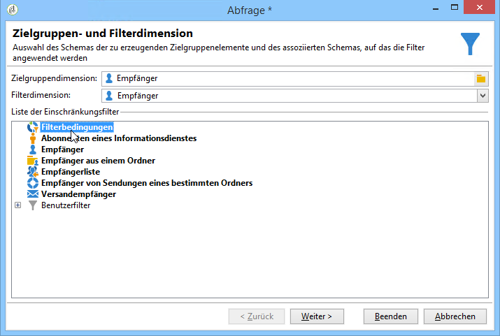
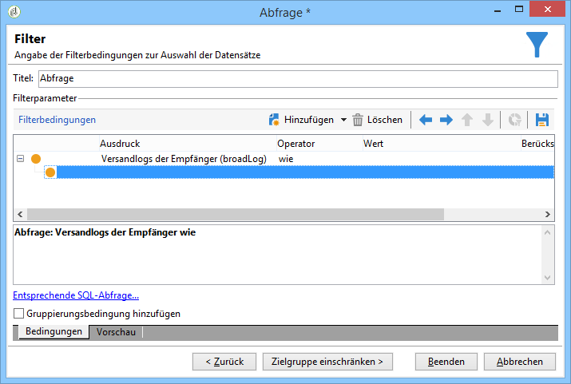
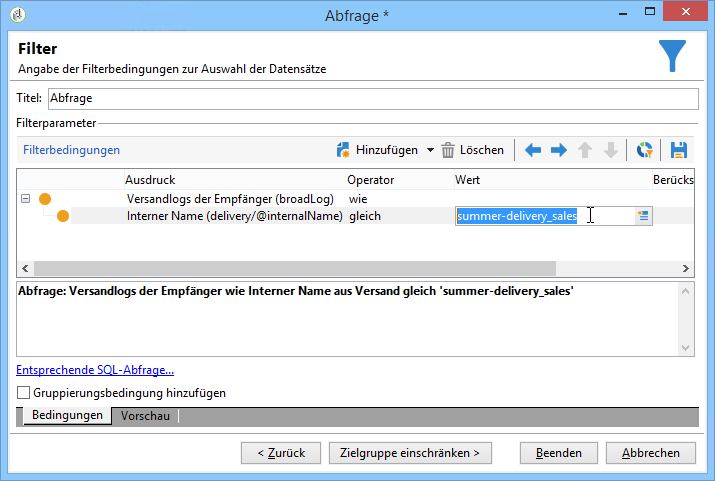
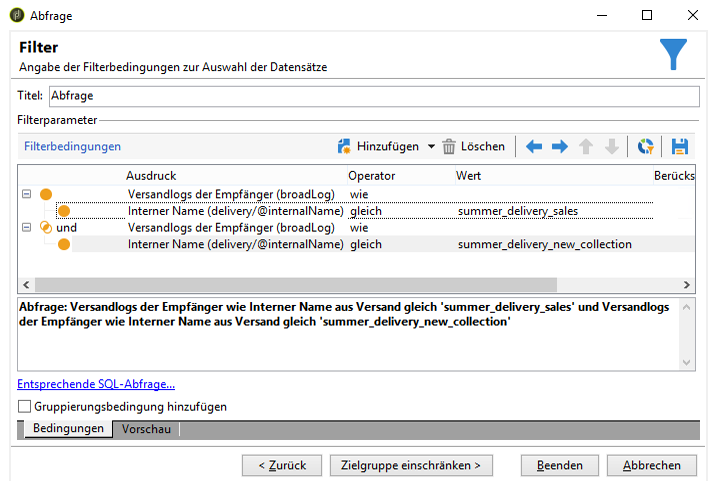

# Duplizierte Empfänger filtern {#filtering-duplicated-recipients}

In diesem Beispiel werden wir Empfänger filtern, die doppelt oder öfter in einem Versand vorkommen, um duplizierte Profile festzustellen.

Gehen Sie wie folgt vor:

1. Drag and drop a **[!UICONTROL Query]** activity in a workflow and open the activity.
1. Klicken Sie auf **[!UICONTROL Edit query]** und legen Sie die Ziel- und Filterdimensionen auf **[!UICONTROL Recipients]**.

   

1. Definieren Sie die folgende Filterbedingung für die Empfänger im Versandlog. Wählen Sie in der Spalte **Ausdruck** die Option **Versandlog eines Empfängers (Broadlog)** und in der Spalte **Operator** die Option **wie** aus.

   

1. Definieren Sie die folgende Filterbedingung, um Ihre Bereitstellung zielgerichtet durchzuführen. Wählen Sie **[!UICONTROL Internal name]** in der Spalte &quot;Ausdruck&quot;und in der Spalte &quot;Operator&quot; **[!UICONTROL equal to]** .
1. Fügen Sie in der Wertspalte den internen Namen des Versands ein.

   

1. With an **[!UICONTROL AND]** operator, repeat the same operations to target other deliveries.

   

Ihre ausgehende Transition enthält die duplizierten Empfänger der Sendungen.
