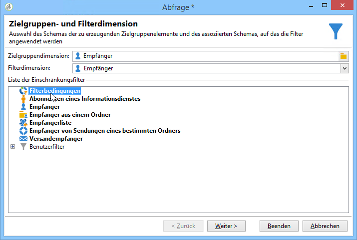
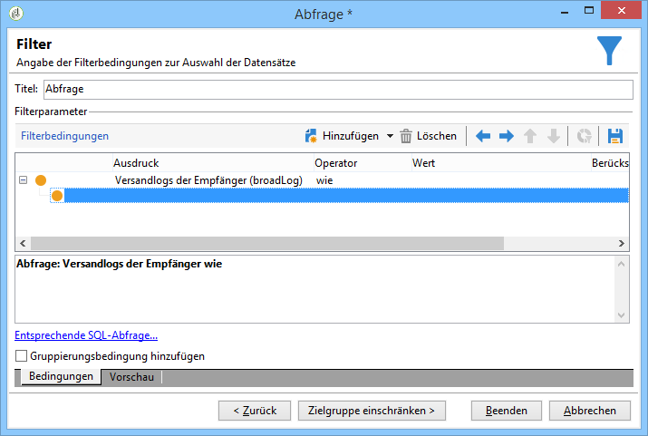
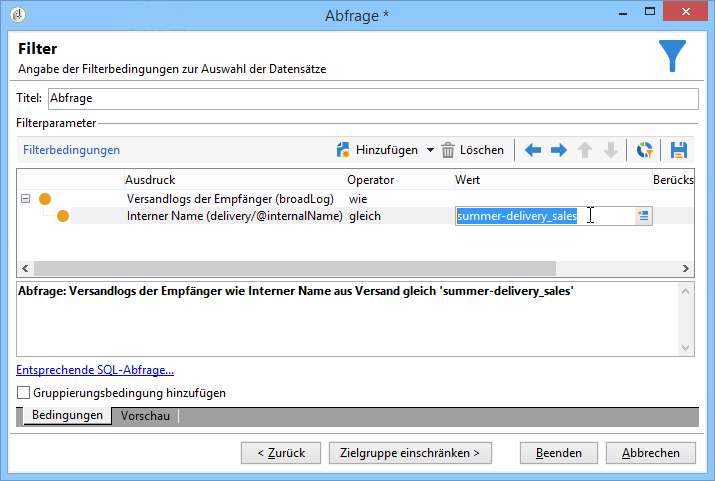
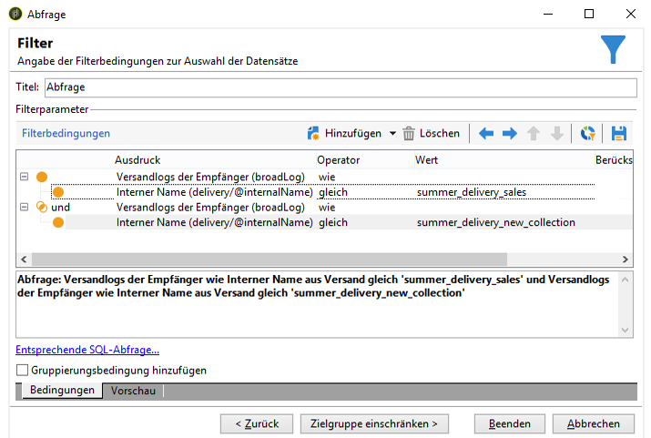

# Filtern doppelter Empfänger {#filtering-duplicated-recipients}

In diesem Beispiel werden wir Empfänger filtern, die doppelt oder öfter in einem Versand vorkommen, um duplizierte Profile festzustellen.

Gehen Sie wie folgt vor:

1. Ziehen Sie eine **[!UICONTROL Abfrage]** in den Workflow-Arbeitsbereich und öffnen Sie sie.
1. Wählen Sie **[!UICONTROL Abfrage bearbeiten]** aus und wählen Sie für die Zielgruppen- und Filterdimension die Option **[!UICONTROL Empfänger]** aus.

   

1. Definieren Sie die folgende Filterbedingung für die Empfänger im Versandlog. Wählen Sie in der Spalte **Ausdruck** die Option **Versandlog eines Empfängers (Broadlog)** und in der Spalte **Operator** die Option **wie** aus.

   

1. Definieren Sie die folgende Filterbedingung für Ihren Versand. Wählen Sie in der Ausdrucksspalte die Option **[!UICONTROL Interner Name]** und in der Operator-Spalte die Option **[!UICONTROL gleich]**.
1. Fügen Sie in der Wertspalte den internen Namen des Versands ein.

   

1. Wiederholen Sie diesen Vorgang mit einem **[!UICONTROL UND]**-Operator für andere Sendungen.

   

Ihre ausgehende Transition enthält die duplizierten Empfänger der Sendungen.
