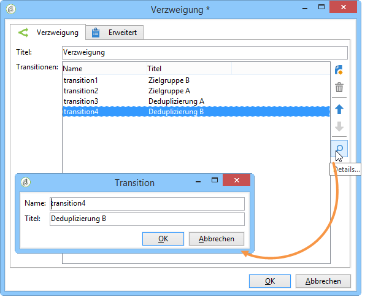

# Verzweigung{#fork}

Mit einer Gabel können Sie alle ausgehenden Aktivitäten parallel aktivieren.

Beispielsweise können Sie die Aktivität im Zusammenhang mit der Inhaltserstellung und der Automatisierung des Versands beim Senden verwenden, um die Zielgruppe und Inhaltserstellung gleichzeitig zu starten. A dedicated use case is available in [this section](../../delivery/using/automating-via-workflows.md#creating-the-delivery-and-its-content).

Um die Aktivität zu konfigurieren, öffnen Sie sie und definieren Sie die Anzahl und die Beschriftung der gewünschten ausgehenden Transitionen.

