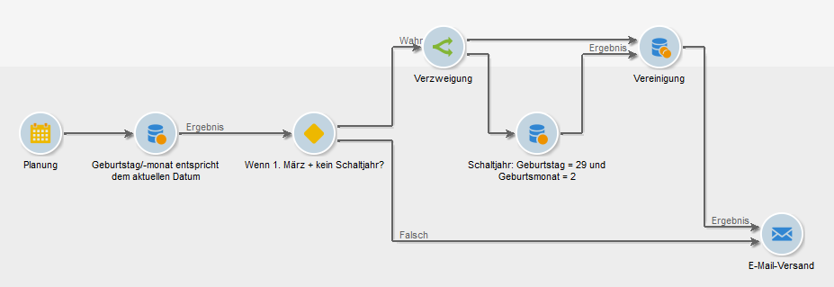
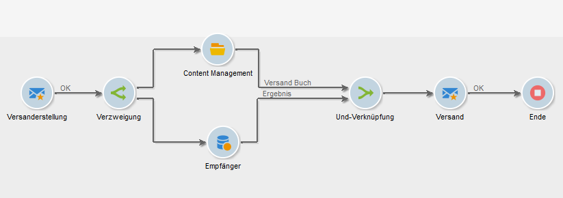

# Verzweigung{#fork}

Sie können die Aktivität **[!UICONTROL Verzweigung]** verwenden, um mehrere ausgehende Transitionen zu erstellen und innerhalb desselben Workflows mehrere Aktivitäten unabhängig voneinander auszuführen.

>[!IMPORTANT]
>
>Die ausgehenden Transitionen, die Sie nach einer **[!UICONTROL Verzweigung]** -Aktivität hinzufügen, werden nicht gleichzeitig ausgeführt. Dieses Verhalten kann sich auf die Workflow-Leistung auswirken. Verwenden Sie die Aktivität **[!UICONTROL Verzweigung]** , wenn Sie mehrere Aktivitäten unabhängig voneinander ausführen müssen. Optional können Sie die ausgehenden Aktivitäten vor dem folgenden Teil des Workflows verbinden.

Gehen Sie wie folgt vor, um eine **[!UICONTROL Verzweigung]** -Aktivität und die zugehörigen Aktivitäten zu konfigurieren:

1. Öffnen Sie die Aktivität **[!UICONTROL Verzweigung]** und definieren Sie den Namen und den Titel der ausgehenden Transitionen.

   

1. Öffnen Sie jede ausgehende Transition und konfigurieren Sie sie.
1. Um ausgehende Transitionen miteinander zu verbinden, fügen Sie optional eine Und-Verknüpfung hinzu. [Weitere Informationen](and-join.md).

   Der nachfolgende Teil des Workflows wird erst nach Abschluss der verbundenen ausgehenden Transitionen ausgeführt.

## Beispiel: Segmentierung

In diesem Beispiel werden verschiedene E-Mails an verschiedene Populationen gesendet. Eine **[!UICONTROL Verzweigung]** -Aktivität wird nach einer Abfrage verwendet, um zwei parallele Aktionen durchzuführen:

* Speichern Sie das Abfrageergebnis
* Segmentieren des Ergebnisses zum Senden mehrerer Sendungen

   

Der Workflow umfasst die folgenden Aktivitäten:

1. **** AbfrageAktivität

   Es werden zwei Populationsgruppen ausgewählt: Frauen und Pariser.

1. **** Intersectionactivity

   Die Schnittmenge der Abfrageergebnisse, also die Pariser Frauen, wird ausgewählt.

1. **** forkactivity

   Die berechnete Population wird gespeichert und parallel dazu in zwei Gruppen unterteilt:

   1. Pariser Frauen im Alter zwischen 18 und 40 Jahren
   1. Pariser Frauen über 40

1. **[!UICONTROL Versandaktivität]**

   Jede Populationsgruppe erhält eine andere E-Mail.

## Anwendungsfall: Geburtstags-E-Mail senden

Eine wiederkehrende E-Mail wird an eine Empfängerliste zum Geburtstag gesendet. Die Aktivität **[!UICONTROL Verzweigung]** schließt Empfänger ein, die am 29. Februar in einem Schaltjahr Geburtstag haben. [Erfahren Sie ](sending-a-birthday-email.md) mehr über diesen Anwendungsfall.

## Anwendungsfall: automatisieren von Inhalten mit einem Workflow

Erstellung und Versand eines Inhaltsbausteins werden automatisiert. Die Aktivität **[!UICONTROL Verzweigung]** wird verwendet, um die Zielgruppe zu berechnen und parallel den Inhalt zu erstellen. [Erfahren Sie ](../../delivery/using/automating-via-workflows.md#creating-the-delivery-and-its-content) mehr über diesen Anwendungsfall.

Anschließend können Sie die einzelnen ausgehenden Transitionen konfigurieren und dann gegebenenfalls mithilfe der Aktivität [Und-Verknüpfung](and-join.md) verknüpfen. Auf diese Weise wird der Rest des Workflows erst ausgeführt, nachdem die ausgehenden Transitionen der **[!UICONTROL Verzweigungsaktivität]** abgeschlossen sind.

## Verwandte Themen

* [Und-Verknüpfung](and-join.md)
* [Anwendungsfall: Geburtstags-E-Mail](sending-a-birthday-email.md)
* [Anwendungsfall: Inhaltserstellung und -bereitstellung](../../delivery/using/automating-via-workflows.md#creating-the-delivery-and-its-content)