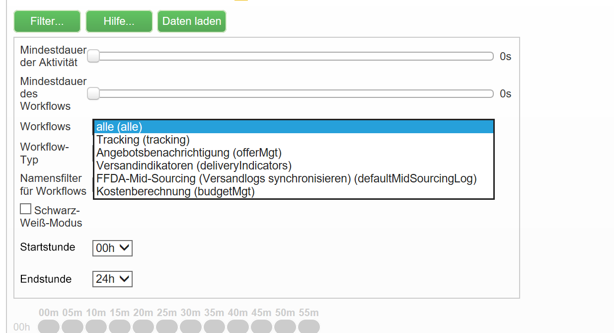

# Workflow-Heatmap {#workflow-heatmap}

Die Adobe Campaign Workflow-Heatmap besteht aus einer farbcodierten grafischen Darstellung aller derzeit ausgeführten Workflows. Sie steht nur Administratoren der Instanz zur Verfügung.

Weitere Möglichkeiten zur Überwachung der verschiedenen Campaign-Prozesse werden auf [dieser Seite](../../production/using/monitoring-guidelines.md) vorgestellt.

## Über die Workflow-Heatmap {#about-the-workflow-heatmap}

Durch die Workflow-Heatmap erhalten die Administratoren der Adobe Campaign-Plattform einen schnellen Überblick über die Anzahl der gleichzeitig ablaufenden Workflows und können die Auslastung der Instanz überwachen und Workflows entsprechend planen.

Genauer gesagt, hilft sie den Administratoren der Plattform bei Folgendem:

* Anzeigen und Verstehen gleichzeitig ablaufender Workflows
* Filtern von Workflows nach Dauer, um festzustellen, bei welchen Workflows Probleme auftreten können
* Filtern von Aktivitäten nach Dauer, um festzustellen, bei welchen Aktivitäten Probleme auftreten können
* Einfaches Auffinden einzelner Workflows und aller damit verbundenen Aktivitäten (mit ihrer Dauer)
* Suche nach Workflow-Typ ([technische Workflows](../../workflow/using/building-a-workflow.md#technical-workflows) oder [Kampagnen-Workflows](../../workflow/using/building-a-workflow.md#campaign-workflows))
* Suche nach einem bestimmten zu analysierenden Workflow

>[!NOTE]
>
>Zusätzlich zur **Workflow-Heatmap** können Sie einen Workflow erstellen, mit dem Sie den Status einer Reihe von Workflows überwachen und wiederkehrende Nachrichten an Supervisoren senden können. Weitere Informationen hierzu finden Sie im [entsprechenden Abschnitt](../../workflow/using/supervising-workflows.md).

Die Verwendung der Workflow-Heatmap erfordert ein gutes Verständnis der folgenden Konzepte: [Workflows](../../workflow/using/about-workflows.md), [Aktivitäten](../../workflow/using/about-activities.md) und [Best Practices für Workflows](../../workflow/using/workflow-best-practices.md).

Die Workflow-Heatmap ist ab Version 18.10 standardmäßig in Adobe Campaign verfügbar. Wenn Sie einen Build zwischen 8700 und 8977 (18.10) haben, können Sie ebenfalls von dieser Funktion profitieren. Um das entsprechende Package anzufordern, wenden Sie sich an die [Adobe-Kundenunterstützung](https://support.neolane.net/) und befolgen Sie die Anweisungen auf [dieser Seite](https://helpx.adobe.com/de/campaign/kb/install-workflow-heatmap-package.html), um zu erfahren, wie Sie es installieren.

Wenn Sie zum ersten Mal auf die Workflow-Heatmap zugreifen, wird das folgende Popup-Fenster angezeigt. Diese Vereinbarung erlaubt die Übertragung und Speicherung in den USA und ermöglicht Adobe Campaign Folgendes:

* Instanzen überwachen, um etwaige Leistungsprobleme zu untersuchen.
* Daten zur Anomalieerkennung erfassen.

Beachten Sie, dass die Übertragung Ihrer Daten nur für Benutzer verfügbar ist, die mit ihrer Adobe ID eine Verbindung zu Adobe Campaign herstellen.

Drei Optionen stehen zur Wahl:

* **[!UICONTROL Akzeptieren]**: Durch das Akzeptieren dieser Vereinbarung ermächtigen Sie Adobe Campaign, Ihre Daten zu sammeln und in die USA zu übertragen, um Ihnen bei der Anomalieerkennung helfen zu können.
* **[!UICONTROL Ablehnen]**: Wenn Sie die Vereinbarung ablehnen, werden Ihre Daten nicht übertragen, Sie können jedoch weiterhin die Workflow-Heatmap verwenden.
* **[!UICONTROL Diese Nachricht nicht wieder anzeigen]**: Wenn Sie auf **[!UICONTROL Diese Nachricht nicht wieder anzeigen]** klicken, wird das Popup-Fenster beim Zugriff auf die Workflow-Heatmap nicht mehr angezeigt. Es steht jedoch weiterhin über die Schaltfläche **[!UICONTROL Nutzungsbedingungen]** zur Verfügung.

Diese Auswahl ist nicht endgültig, Sie können sie jederzeit ändern, indem Sie auf die Schaltfläche **[!UICONTROL Nutzungsbedingungen]** klicken.

## HeatMap verwenden {#using-the-heatmap}

>[!NOTE]
>
>Nur Benutzer mit Administratorrechten können auf die Campaign Workflow-Heatmap zugreifen.

1. Gehen Sie zu **[!UICONTROL Monitoring]** und klicken Sie auf den Link **[!UICONTROL Workflow-Heatmap]**, um die Seite **[!UICONTROL Campaign Workflow-Heatmap]** anzuzeigen.

   

1. Klicken Sie auf den Kalender, um einen Tag auszuwählen.

   Standardmäßig zeigt die Seite die Workflow-Aktivität des aktuellen Tages an. Sie können dies ändern und einen beliebigen Tag in der Vergangenheit auswählen.

   >[!NOTE]
   >
   >Es werden nur die Workflows angezeigt, die vom **[!UICONTROL Datenbankbereinigungs]**-Workflow nicht gelöscht wurden. Weiter Informationen zum Datenbankbereinigungs-Workflows finden Sie in [diesem Abschnitt](../../production/using/database-cleanup-workflow.md).\
   >Standardmäßig ist die Zeitzone der Workflow-Heatmap für den aktuellen Administratorbenutzer definiert. Sie können sie beispielsweise ändern, wenn Sie sich nicht in derselben Region wie die Marketing-Benutzer befinden, mit denen Sie arbeiten.

1. Klicken Sie auf die Schaltfläche **[!UICONTROL Filter]**.

   

1. Verwenden Sie den Regler, um die Mindestdauer von 0 Sekunden bis 1 Stunde festzulegen. Auf diese Weise können Sie nur nach Workflows suchen, die länger als eine bestimmte Anzahl von Sekunden oder Minuten ausgeführt werden.

   

1. Sie können auch einen bestimmten Workflow aus der Liste **[!UICONTROL Workflows]** auswählen.

   

   >[!NOTE]
   >
   >Es wird der Filter **[!UICONTROL Mindestdauer]** angewendet. Wenn Sie einen bestimmten Workflow nicht finden können, setzen Sie die Mindestdauer auf 0, damit alle Workflows in der Liste angezeigt werden.

1. Sie können auch nach dem **[!UICONTROL Workflow-Typ]** filtern:

   * **[!UICONTROL Technisch]**: Es werden nur [vordefinierte technische Workflows](../../workflow/using/building-a-workflow.md#technical-workflows) und [Data Management-Workflows](../../workflow/using/targeting-data.md#data-management) angezeigt.
   * **[!UICONTROL Marketing]**: Es werden nur Workflows angezeigt, die mit einer Marketing-Kampagne verknüpft sind, die als [Kampagnen-Workflows](../../workflow/using/building-a-workflow.md#campaign-workflows) bezeichnet werden.

1. Um einen bestimmten Workflow nach Namen zu suchen, können Sie auch das Feld **[!UICONTROL Namensfilter für Workflows]** verwenden.

   

1. Wenn Sie in der Zwischenzeit einige Workflows bearbeitet haben, klicken Sie auf die Schaltfläche **[!UICONTROL Daten neu laden]**, um die in der Tabelle angezeigten Daten zu aktualisieren.

## HeatMap lesen {#reading-the-heatmap}

Die Campaign Workflow-Heatmap ist eine Tabelle, die von oben links nach unten rechts lesbar ist und es ermöglicht, die „heißen Zonen“ in einem grün bis rot farbcodierten Bereich zu finden.

* Die dunkleren roten Zellen entsprechen Zeiträumen, in denen gleichzeitig eine hohe Anzahl von Workflows ausgeführt wird.
* Die grauen Zellen entsprechen Zeiträumen, in denen kein Workflow ausgeführt wird.

Klicken Sie auf die Schaltfläche **[!UICONTROL Hilfe]**, um zu erfahren, wie der Farbcode angewendet wird und wie Sie in der HeatMap navigieren.

Jede Zeile stellt eine Stunde des Tages dar und jede Zelle entspricht 5 Minuten dieser Stunde.

Die Tabelle zeigt alle Workflows an, die für jeden dieser 5-Minuten-Zeiträume gleichzeitig ausgeführt werden.

Im folgenden Beispiel werden zwischen 8:00 und 8:05 Uhr drei Workflows ausgeführt (unabhängig von ihrer individuellen Dauer):

1. Klicken Sie auf eine farbige Zelle, um die Details aller gleichzeitigen Workflows anzuzeigen, die während dieses Zeitraums ausgeführt werden.

   

   Für jeden Workflow werden alle darin enthaltenen Aktivitäten mit ihrer Dauer aufgelistet.

1. Klicken Sie auf die Workflow-ID oder den Namen, um einen Workflow direkt zu öffnen.
1. Um zur Ansicht **[!UICONTROL Campaign Workflow-Heatmap]** zurückzukehren, klicken Sie auf die Schaltfläche **[!UICONTROL Startseite]**.

## Anwendungsbeispiele: Verwendung der HeatMap zum Ausführen von Aktionen {#use-cases--using-the-heatmap-to-take-actions}

Es gibt zwei Hauptfälle, in denen die Campaign Workflow-Heatmap nützlich sein kann.

### Verringerung der Anzahl gleichzeitig ablaufender Workflows {#reducing-the-number-of-concurrent-workflows}

Als Campaign-Administrator kann Ihnen die Workflow-HeatMap dabei helfen, die Auslastung der Instanz zu verstehen und vorhandene oder neue Workflows zu geeigneten Zeiten zu planen.

1. Klicken Sie in der Ansicht **[!UICONTROL Campaign Workflow-Heatmap]** auf die Schaltfläche **[!UICONTROL Filter]**.
1. Legen Sie die Dauer auf ein paar Sekunden oder ein paar Minuten fest.
1. Schließen Sie die kürzesten nicht relevanten Workflows aus, indem Sie den Dauerfilter erhöhen.

   

1. Untersuchen Sie die Ergebnisse, um die Auslastung der Instanz zu verstehen und geeignete Maßnahmen zu ergreifen:

   * Wenn Leistungsprobleme auftreten und eine oder mehrere rote Zellen in der Tabelle angezeigt werden, sollten Sie die Startzeiten mehrerer Workflows ändern. Bitten Sie die Marketing-Benutzer, Workflows manuell von beschäftigten („heißen“) Zeiträumen in verfügbarere Zeitfenster zu verschieben. Dies sollte ein stabiles Aktivitätsniveau über den Tag hinweg aufrechterhalten.
   * Um Spitzen und eine Überlastung der Instanz zu vermeiden, sollten Sie sich die HeatMap ansehen, bevor Sie neue Workflows planen, und die beste Zeit auswählen. Erwägen Sie Zeitfenster, die grauen oder grünen Zellen in der Tabelle entsprechen, um neue Workflows zu starten.

### Auffinden langwieriger Workflows mit Auswirkungen auf die Leistung {#finding-long-running-workflows-that-impact-performance}

Als Campaign-Administrator hilft Ihnen die Workflow-HeatMap dabei, die längsten Workflows zu finden, die die Aktivität verlangsamen können.

1. Klicken Sie in der Ansicht **[!UICONTROL Campaign Workflow-Heatmap]** auf die Schaltfläche **[!UICONTROL Filter]**.
1. Legen Sie die Dauer auf 1 Stunde fest.

   

1. Fügen Sie weitere Ergebnisse hinzu, indem Sie den Filter **[!UICONTROL Mindestdauer]** verringern.
1. Untersuchen Sie die Ergebnisse, um die längsten Workflows zu finden, die möglicherweise größere Auswirkungen auf die Server- und Datenbankressourcen (CPU, RAM, Netzwerk, IOPS usw.) haben können.
1. Ergreifen Sie geeignete Maßnahmen:

   * Weisen Sie Marketing-Benutzer an, die längsten Workflows zu teilen, um die Verarbeitungsdauer zu verkürzen.
   * Beginnen Sie eine tiefere Analyse bestimmter Workflows und Aktivitäten (wie JavaScript, Import, Export usw.), um die Probleme zu isolieren und sie leichter zu lösen.

## Beispiel: Verwendung der HeatMap zur Verbesserung der Workflow-Planung {#example--using-the-heatmap-to-improve-workflow-planning}

Das folgende Beispiel zeigt, wie die Planung effizienter gestaltet und die Leistung bei Verwendung der Adobe Campaign Workflow-HeatMap verbessert werden kann.

In diesem Fall beschweren sich viele Benutzer über die Workflow-Leistung. Sie müssen überprüfen, was die Aktivität verlangsamt und wie das Problem zu lösen ist.

1. Gehen Sie zu **[!UICONTROL Monitoring]** und klicken Sie auf den Link **[!UICONTROL Workflow-Heatmap]**, um die Seite **[!UICONTROL Campaign Workflow-Heatmap]** anzuzeigen.
1. Legen Sie für den Filter **[!UICONTROL Mindestdauer]** auf 5 Minuten fest.
1. Setzen Sie den Filter **[!UICONTROL Workflow-Typ]** auf **[!UICONTROL Marketing]**.
1. Beachten Sie Folgendes in der HeatMap-Tabelle:

   

   * Fünfzig langwierige (über 5 Minuten) Kampagnen-Workflows werden um 10 Uhr ausgeführt.
   * Die meisten von ihnen haben den Status „Ausstehend“ (standardmäßig ist der Grenzwert für gleichzeitig laufende Workflows auf 20 festgelegt).
   * Die ausstehenden Workflows müssen jeden Tag manuell neu gestartet werden.
   * Die Leistung ist gering.

1. Statt fünfzig Workflows, die um 10 Uhr morgens beginnen, sollten Sie die Startzeiten der Workflows gleichmäßig auf den Rest des Tages verteilen.
1. Gehen Sie zurück zur Seite **[!UICONTROL Campaign Workflow-Heatmap]** und klicken Sie auf die Schaltfläche **[!UICONTROL Daten neu laden]**.
1. Beachten Sie jetzt Folgendes:

   

   * Um 10 Uhr morgens laufen nur noch achtzehn langwierige Kampagnen-Workflows.
   * Es befinden sich keine Workflows mehr im Status „Ausstehend“ (der Grenzwert für gleichzeitig laufende Workflows ist weiterhin auf 20 festgelegt).
   * Die Startzeiten der Workflows sind gleichmäßig über den Tag verteilt.
   * Es beschweren sich keine Benutzer mehr über Leistungsprobleme.
