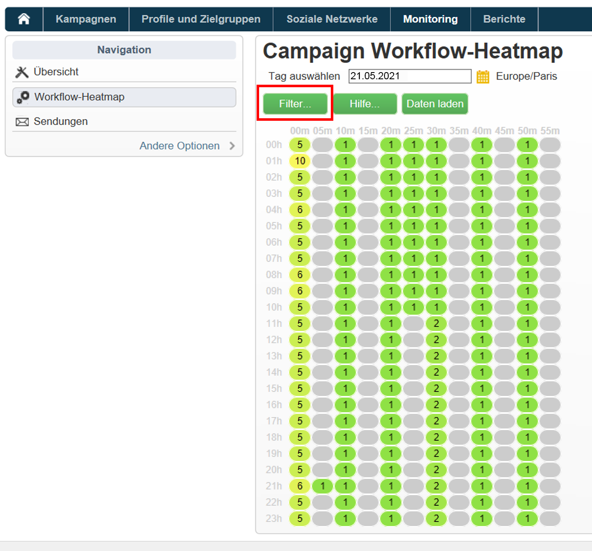
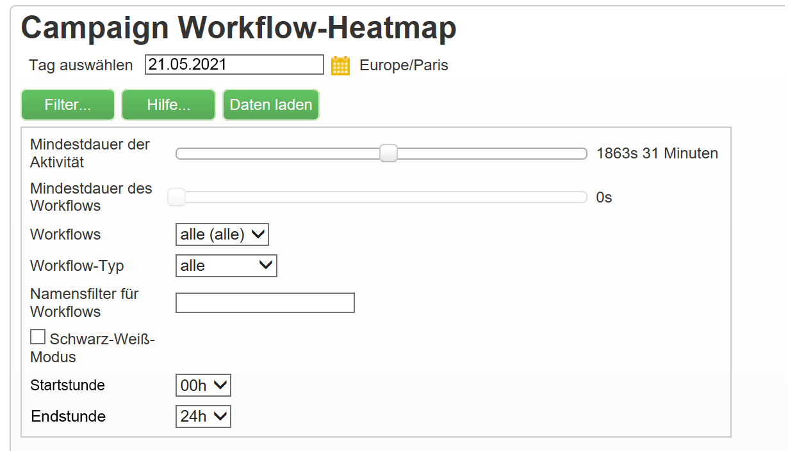
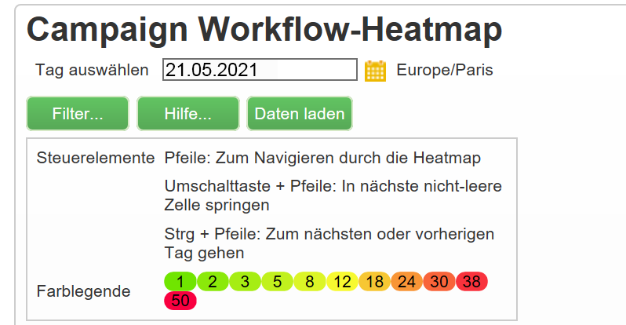
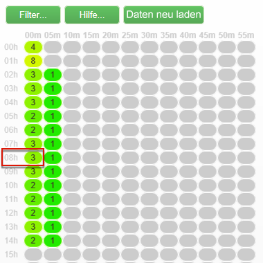
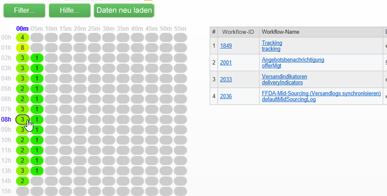

# Workflow-Heatmap {#workflow-heatmap}

Adobe Campaign Workflow HeatMap besteht aus einer farbkodierten grafischen Darstellung aller derzeit ausgeführten Workflows. Sie steht nur Administratoren der Instanz zur Verfügung.

Auf [dieser Seite](https://helpx.adobe.com/campaign/kb/acc-maintenance.html)werden weitere Möglichkeiten zur Überwachung der verschiedenen Kampagnenprozesse vorgestellt.

## Informationen zur Workflow HeatMap {#about-the-workflow-heatmap}

Durch einen schnellen Überblick über die Anzahl gleichzeitiger Workflows können die Adobe Campaign-Plattformadministratoren mit Workflow HeatMap die Belastung der Instanz überwachen und Workflows entsprechend planen.

Genauer gesagt hilft es den Plattformadministratoren,

* Anzeigen und Verstehen paralleler Workflows
* Filtern von Workflows nach Dauer, um zu sehen, welche Workflows Probleme haben können
* Filtern Sie Aktivitäten nach Dauer, um zu sehen, welche Aktivitäten Probleme haben können.
* Einfache Suche nach einzelnen Workflows und allen damit zusammenhängenden Aktivitäten (mit ihrer Dauer)
* Nach Workflow-Typ suchen ([technische Arbeitsabläufe](../../workflow/using/building-a-workflow.md#technical-workflows) oder [Kampagnenarbeitsabläufe](../../workflow/using/building-a-workflow.md#campaign-workflows))
* Suchen Sie nach einem bestimmten Arbeitsablauf zur Analyse

>[!NOTE]
>
>Zusätzlich zur **Workflow-Heatmap** können Sie einen Workflow erstellen, mit dem Sie den Status einer Reihe von Workflows überwachen und wiederholte Nachrichten an die Aufsichtsbehörden senden können. Weitere Informationen hierzu finden Sie im [entsprechenden Abschnitt](../../workflow/using/supervising-workflows.md).

Die Verwendung von Workflow HeatMap erfordert ein gutes Verständnis der folgenden Konzepte: Best Practices für [Arbeitsabläufe](../../workflow/using/about-workflows.md), [Aktivitäten](../../workflow/using/about-activities.md) und [Arbeitsabläufe](../../workflow/using/workflow-best-practices.md).

Die Workflow HeatMap ist ab Version 18.10 in Adobe Campaign standardmäßig verfügbar. Wenn Sie einen Build zwischen 8700 und 8977 (18.10) haben, können Sie auch von dieser Funktion profitieren. Um das entsprechende Paket anzufordern, wenden Sie sich an den [Adobe-Kundendienst](https://support.neolane.net/) und befolgen Sie die Anweisungen auf [dieser Seite](https://helpx.adobe.com/campaign/kb/install-workflow-heatmap-package.html) , um zu erfahren, wie Sie es installieren.

Wenn Sie zum ersten Mal auf Workfklow HeatMap zugreifen, wird das folgende Popup-Fenster angezeigt. Diese Vereinbarung erlaubt die Übertragung und Speicherung in den Vereinigten Staaten und ermöglicht Adobe Campaign Folgendes:

* Instanzen überwachen, um Leistungsaspekte zu untersuchen.
* Daten zur Anomalieerkennung erfassen.

Beachten Sie, dass die Übertragung Ihrer Daten nur für Benutzer verfügbar ist, die mit ihrer Adobe ID eine Verbindung zu Adobe Campaign herstellen.

Drei Optionen stehen zur Wahl:

* **[!UICONTROL Accept]** : Indem Sie diese Vereinbarung akzeptieren, autorisieren Sie Adobe Campaign, Ihre Daten zu sammeln und sie an die USA zu übertragen, um Ihnen bei Anomalieerkennungen helfen zu können.
* **[!UICONTROL Refuse]** : Wenn Sie die Vereinbarung ablehnen, werden Ihre Daten nicht übertragen, Sie können jedoch weiterhin Workflow Heatmap verwenden.
* **[!UICONTROL Do not show this message again]** : Wenn Sie auf **[!UICONTROL Do not show this message again]** klicken, wird das Popup-Fenster beim Zugriff auf Workflow Heatmap nicht mehr angezeigt, es steht aber weiterhin über die **[!UICONTROL Term of use]** Schaltfläche zur Verfügung.

Diese Auswahl ist nicht endgültig, Sie können sie jederzeit durch Klicken auf die **[!UICONTROL Term of use]** Schaltfläche ändern.

## Verwenden von HeatMap {#using-the-heatmap}

>[!NOTE]
>
>Nur Benutzer mit Administratorrechten können auf Campaign Workflow HeatMap zugreifen.

1. Gehen Sie zu **[!UICONTROL Monitoring]** und klicken Sie auf den **[!UICONTROL Workflow HeatMap]** Link, um die **[!UICONTROL Campaign Workflow HeatMap]** Seite anzuzeigen.

   

1. Klicken Sie auf den Kalender, um einen Tag auszuwählen.

   Standardmäßig zeigt die Seite die Workflow-Aktivität des aktuellen Tages an. Sie können sie ändern und einen beliebigen Tag in der Vergangenheit auswählen.

   >[!NOTE]
   >
   >Nur die Workflows, die nicht vom **[!UICONTROL Database cleanup]** Workflow gelöscht wurden, sind sichtbar. For more on the Database cleanup workflow, refer to [this section](../../production/using/database-cleanup-workflow.md).\
   >Standardmäßig ist die Zeitzone Workflow HeatMap für den aktuellen Administratorbenutzer definiert. Sie können es beispielsweise ändern, wenn Sie sich nicht im gleichen Bereich wie die Marketing-Benutzer befinden, mit denen Sie arbeiten.

1. Click the **[!UICONTROL Filters]** button.

   

1. Verwenden Sie den Schieberegler, um die Mindestdauer von 0 bis 1 Stunde festzulegen. Dadurch können Sie nur Arbeitsabläufe suchen, die länger als eine bestimmte Anzahl von Sekunden oder Minuten ausgeführt werden.

   

1. Sie können auch einen bestimmten Workflow aus der **[!UICONTROL Workflows]** Liste auswählen.

   

   >[!NOTE]
   >
   >Der **[!UICONTROL Min duration]** Filter wird angewendet. Wenn Sie keinen bestimmten Workflow finden können, setzen Sie die Mindestdauer auf 0, damit alle Workflows in der Liste angezeigt werden.

1. Sie können auch nach den folgenden **[!UICONTROL Workflow type]** filtern:

   * **[!UICONTROL Technical]** : Es werden nur [vordefinierte technische Arbeitsabläufe](../../workflow/using/building-a-workflow.md#technical-workflows) und [Datenverwaltungsabläufe](../../workflow/using/targeting-data.md#data-management) angezeigt.
   * **[!UICONTROL Marketing]** : Es werden nur Workflows angezeigt, die mit einer Marketingkampagne verknüpft sind, die als [Kampagnen-Workflows](../../workflow/using/building-a-workflow.md#campaign-workflows)bezeichnet werden.

1. Um einen bestimmten Workflow anhand des Namens zu suchen, können Sie auch das **[!UICONTROL Workflow name filter]** Feld verwenden.

   

1. Wenn Sie einige Arbeitsabläufe in der Zeit dazwischen bearbeitet haben, klicken Sie auf die **[!UICONTROL Reload data]** Schaltfläche, um die im Raster angezeigten Daten zu aktualisieren.

## HeatMap lesen {#reading-the-heatmap}

Die Kampagne Workflow HeatMap ist ein Raster, das natürlich von oben links nach unten rechts lesbar ist, sodass die &quot;Randzonen&quot;mit einem grün bis rot farbkodierten Bereich gefunden werden können.

* Die dunkleren roten Zellen entsprechen Zeiträumen, in denen gleichzeitig eine hohe Anzahl von Workflows ausgeführt wird.
* Die grauen Zellen entsprechen Zeiträumen, in denen kein Workflow ausgeführt wird.

Um zu erfahren, wie der Farbcode angewendet wird und wie Sie in der HeatMap navigieren, klicken Sie auf die **[!UICONTROL Help]** Schaltfläche.

Jede Zeile stellt eine Stunde des Tages dar, und jede Zelle entspricht 5 Minuten dieser Stunde.

Das Raster zeigt alle Arbeitsabläufe an, die für jeden dieser 5-Minuten-Zeiträume gleichzeitig ausgeführt werden.

Im Beispiel unten werden zwischen 8 Uhr und 8 Uhr morgens drei Workflows ausgeführt (unabhängig von ihrer individuellen Dauer):

1. Klicken Sie auf eine farbige Zelle, um die Details aller gleichzeitigen Workflows anzuzeigen, die während dieses Zeitraums ausgeführt werden.

   

   Für jeden Workflow werden alle darin enthaltenen Aktivitäten mit ihrer Dauer aufgelistet.

1. Klicken Sie auf die Workflow-ID oder den Namen, um einen Workflow direkt zu öffnen.
1. Um zur **[!UICONTROL Campaign Workflow HeatMap]** Ansicht zurückzukehren, klicken Sie auf die **[!UICONTROL Home]** Schaltfläche.

## Anwendungsfälle: Verwenden von HeatMap zum Ausführen von Aktionen {#use-cases--using-the-heatmap-to-take-actions}

Es gibt zwei Hauptfälle, in denen die HeatMap des Kampagnenarbeitsablaufs nützlich sein kann.

### Verringerung der Anzahl gleichzeitiger Workflows {#reducing-the-number-of-concurrent-workflows}

Als Kampagnenadministrator kann die Workflow HeatMap Ihnen helfen, die Belastung der Instanz zu verstehen und zu gegebener Zeit vorhandene oder neue Workflows zu planen.

1. Klicken Sie in der **[!UICONTROL Campaign Workflow HeatMap]** Ansicht auf die **[!UICONTROL Filters]** Schaltfläche.
1. Legen Sie die Dauer auf einige Sekunden oder einige Minuten fest.
1. Schließen Sie die kürzesten Arbeitsabläufe aus, die nicht relevant sind, indem Sie den Filter für die Dauer erhöhen.

   

1. Lernen Sie die Ergebnisse kennen, um die Belastung der Instanz zu verstehen, und führen Sie geeignete Aktionen durch:

   * Wenn Leistungsprobleme auftreten und eine oder mehrere rote Zellen im Raster angezeigt werden, sollten Sie die Startzeiten mehrerer Workflows ändern. Bitten Sie die Marketing-Benutzer, manuelle Arbeitsabläufe von aktiven Zeiträumen (&quot;hot&quot;) auf verfügbare Zeiträume zu verschieben. Dadurch sollte ein stabiles Maß an Aktivität über den Tag hinweg aufrechterhalten werden.
   * Um Spitzen zu vermeiden und zu verhindern, dass die Instanz überlastet wird, sollten Sie sich die HeatMap ansehen, bevor Sie neue Workflows planen, und die beste Zeit auswählen. Betrachten Sie Zeitfenster, die Grauzonen oder grüne Zellen im Raster entsprechen, um neue Arbeitsabläufe zu starten.

### Finden langwieriger Arbeitsabläufe mit Auswirkungen auf die Leistung {#finding-long-running-workflows-that-impact-performance}

Als Kampagnenadministrator hilft Ihnen die Workflow HeatMap bei der Suche nach den längsten Workflows, die die Aktivität verlangsamen können.

1. Klicken Sie in der **[!UICONTROL Campaign Workflow HeatMap]** Ansicht auf die **[!UICONTROL Filters]** Schaltfläche.
1. Legen Sie die Dauer auf 1 Stunde fest.

   

1. Fügen Sie weitere Ergebnisse hinzu, indem Sie den **[!UICONTROL Min duration]** Filter verringern.
1. Erfahren Sie, welche Ergebnisse erzielt wurden, um die längsten Arbeitsabläufe zu finden, die potenziell mehr Auswirkungen auf Server- und Datenbankressourcen haben können (CPU, RAM, Netzwerk, IOPS usw.).
1. Ergreifen Sie geeignete Maßnahmen:

   * Weisen Sie Marketing-Benutzer an, die längsten Workflows zu teilen, um die Verarbeitungszeit zu verkürzen.
   * Starten Sie eine tiefer gehende Analyse zu bestimmten Workflows und spezifischen Aktivitäten (z. B. JavaScript, Import, Export usw.), um die Probleme zu isolieren und einfacher zu lösen.

## Beispiel: Verwenden der HeatMap zur Verbesserung der Workflow-Planung {#example--using-the-heatmap-to-improve-workflow-planning}

Das folgende Beispiel zeigt, wie Planung effizienter sein kann und wie die Leistung bei Verwendung von Adobe Campaign Workflow HeatMap verbessert werden kann.

In diesem Fall beschweren sich viele Benutzer über die Leistung des Workflows. Sie müssen überprüfen, was die Aktivität verlangsamt und wie das Problem zu lösen ist.

1. Gehen Sie zu **[!UICONTROL Monitoring]** und klicken Sie auf den **[!UICONTROL Workflows]** Link, um die **[!UICONTROL Campaign Workflow HeatMap]** Seite anzuzeigen.
1. Legen Sie den **[!UICONTROL Min duration]** Filter auf 5 Minuten fest.
1. Setzen Sie den **[!UICONTROL Workflow type]** Filter auf **[!UICONTROL Marketing]** .
1. Beachten Sie im HeatMap-Raster Folgendes:

   

   * Fünfzig langfristige (über 5 Minuten) Kampagnen-Workflows werden um 10 Uhr ausgeführt.
   * Die meisten von ihnen haben einen Status &quot;Ausstehend&quot;(standardmäßig ist der Grenzwert für Parallelität auf 20 festgelegt).
   * Die ausstehenden Workflows müssen jeden Tag manuell neu gestartet werden.
   * Die Leistung ist gering.

1. Statt fünfzig Arbeitsabläufe ab 10:00 Uhr zu haben, verteilen Sie die Startzeiten der Arbeitsabläufe gleichmäßig über den Rest des Tages.
1. Gehen Sie zurück zur **[!UICONTROL Campaign Workflow HeatMap]** Seite und klicken Sie auf die **[!UICONTROL Reload data]** Schaltfläche.
1. Beachten Sie jetzt Folgendes:

   

   * Nur achtzehn langfristige Kampagnen-Workflows werden um 10 Uhr ausgeführt.
   * Es befinden sich keine weiteren Arbeitsabläufe im Status &quot;Ausstehend&quot;(die Zeitüberschreitungsgrenze ist weiterhin auf 20 festgelegt).
   * Die Startzeiten des Arbeitsablaufs sind gleichmäßig über den Tag verteilt.
   * Keine Benutzer beschweren sich mehr über Leistungsprobleme.
