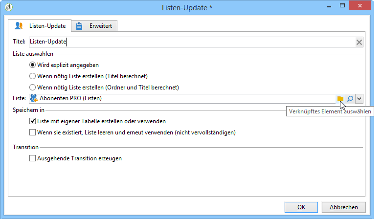
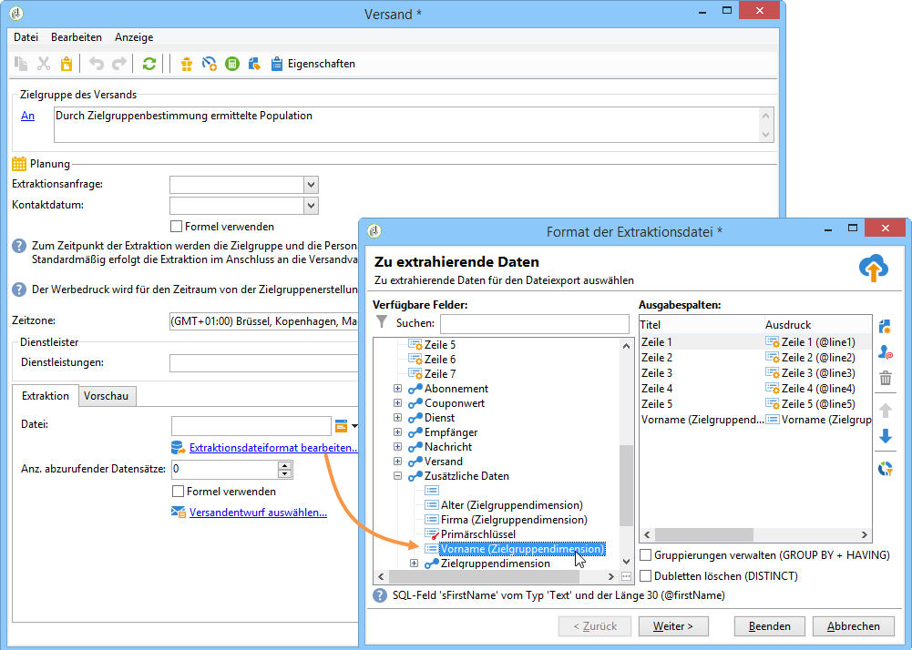
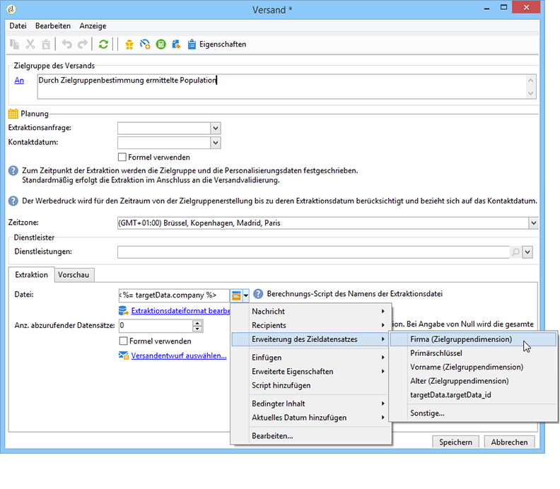
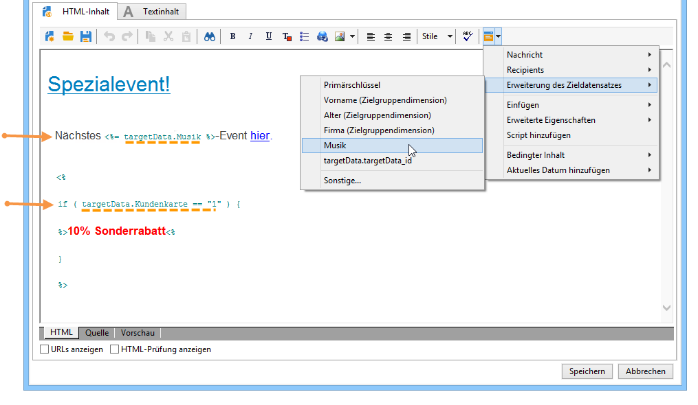
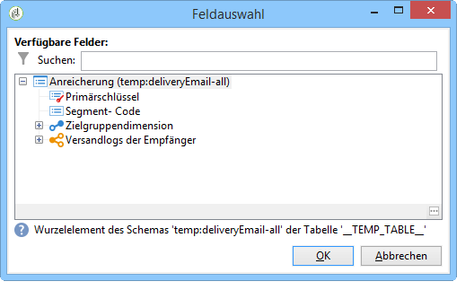

# Workflow-Daten verwenden{#how-to-use-workflow-data}

## Datenbank aktualisieren {#updating-the-database}

Alle in Workflows erhobenen Daten können zur Aktualisierung der Datenbank oder in Sendungen verwendet werden, um beispielsweise die Möglichkeiten der Inhaltspersonalisierung zu ergänzen (Einfügung der Anzahl von Versicherungspolicen, des durchschnittlichen Warenkorbs im vergangenen Jahr etc.) oder die Zielgruppenbestimmung zu verfeinern (eine Nachricht an die Mitversicherten adressieren, die 1000 besten Kunden ansprechen etc.). Diese Daten können auch in eine Liste exportiert oder zur Erstellung eines Verlaufs verwendet werden.

### Listen und direkt Aktualisierungen {#lists-and-direct-updates}

Zur Aktualisierung der Adobe-Campaign-Datenbank und von Listen stehen zwei dedizierte Aktivitäten zur Verfügung:

* Über die Aktivität **[!UICONTROL Listen-Update]** können Arbeitstabellen in einer Datenliste gespeichert werden.

   Hierbei kann eine existierende Liste verwendet oder eine neue erstellt werden. In diesem Fall werden ihr Name und gegebenenfalls ihr Speicherverzeichnis berechnet.

   

   Siehe [Listen-Update](../../workflow/using/list-update.md).

* Die **[!UICONTROL Daten-Update]**-Aktivität ermöglicht eine gebündelte Aktualisierung von Datenbankfeldern.

   Weitere Informationen hierzu finden Sie im Abschnitt [Daten-Update](../../workflow/using/update-data.md).

### An- und Abmeldungen verwalten {#subscription-unsubscription-management}

Die An- und Abmeldung von Empfängern für einen Informationsdienst im Rahmen eines Workflows wird im Abschnitt ](../../workflow/using/subscription-services.md)An-/Abmeldedienst[ beschrieben.

## Über einen Workflow versenden {#sending-via-a-workflow}

### Versandaktivität {#delivery-activity}

Die Versandaktivität wird im Abschnitt ](../../workflow/using/delivery.md)Versand[ beschrieben.

### Sendungen anreichern und personalisieren {#enriching-and-targeting-deliveries}

Im Rahmen von Sendungen bieten Workflow-Aktivitäten die Möglichkeit, Daten zur Personalisierung des Inhalts oder zur Konfiguration der Versandzielgruppen bereitzustellen.

Beispielsweise können Sie bei Briefpost-Sendungen Zusatzdaten in die Extraktionsdatei aufnehmen, die mithilfe einer Workflow-Aktivität abgerufen werden:



Ergänzend zu den üblichen Personalisierungsfeldern können Sie den Versandinhalt mit aus einem Workflow stammenden Daten personalisieren. Tatsächlich können die aus Workflow-Aktivitäten gewonnenen Zusatzdaten gespeichert und im Versand-Assistenten verfügbar gemacht werden. Unten stehendes Beispiel verdeutlicht dies anhand des Namens der Ausgabedatei eines Briefpost-Versands:



Aus Workflow-Arbeitstabellen stammende Daten sind über ihren Namen leicht identifizierbar. Er beginnt jeweils mit **targetData**. Weitere Informationen hierzu finden Sie im Abschnitt [Zielgruppendaten](../../workflow/using/data-life-cycle.md#target-data).

Auch im Rahmen eines E-Mail-Versands können Personalisierungsfelder auf Daten zugreifen, die im Zuge einer Erweiterung des Zieldatensatzes in einem Zielgruppen-Workflow erhoben wurden, wie die folgende Abbildung verdeutlicht:



Wenn in einer Aktivität zur Zielgruppenbestimmung ein Segment-Code angegeben wird, wird dieser in einer gesonderten Spalte der Workflow-Arbeitstabelle gespeichert und innerhalb der Personalisierungsfelder zur Verfügung gestellt. Klicken Sie zur Anzeige aller Personalisierungsfelder auf die entsprechende Schaltfläche im Versand und wählen Sie die Option **[!UICONTROL Erweiterung des Zieldatensatzes > Sonstige...]** aus.



## Export von Daten {#exporting-data}

### Datei komprimieren oder verschlüsseln {#zipping-or-encrypting-a-file}

Mit Adobe Campaign können Sie komprimierte oder verschlüsselte Dateien exportieren. Wenn Sie einen Export über die Aktivität **[!UICONTROL Extraktion (Datei)]** planen, können Sie eine Nachbearbeitung definieren, um die Datei zu komprimieren oder zu verschlüsseln.

Gehen Sie dazu folgendermaßen vor:

* Wenn Ihre Adobe-Campaign-Installation von Adobe gehostet wird: Senden Sie eine Anfrage an [den Support](https://support.neolane.net), damit die nötigen Utilities auf dem Server installiert werden.
* Wenn Sie eine On-Premise-Installation von Adobe Campaign haben: Installieren Sie die gewünschte Utility (z. B.: GPG, GZIP) sowie die nötigen Schlüssel (zur Verschlüsselung) auf dem Anwendungsserver.

Danach können Sie Befehle oder Codes verwenden, wie zum Beispiel:

```
function encryptFile(file) {  
  var systemCommand = “gpg --encrypt --recipient  recipientToEncryptTo ” + file;  
  var result = execCommand(systemCommand, true); 
}
```

Beim Importieren einer Datei kann diese auch dekomprimiert oder entschlüsselt werden. Siehe [Datei vor der Verarbeitung dekomprimieren oder entschlüsseln](../../workflow/using/importing-data.md#unzipping-or-decrypting-a-file-before-processing).
