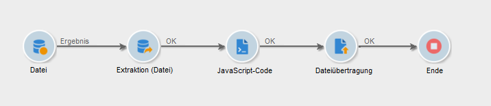
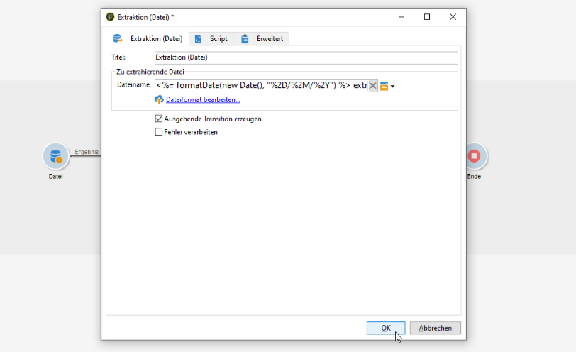
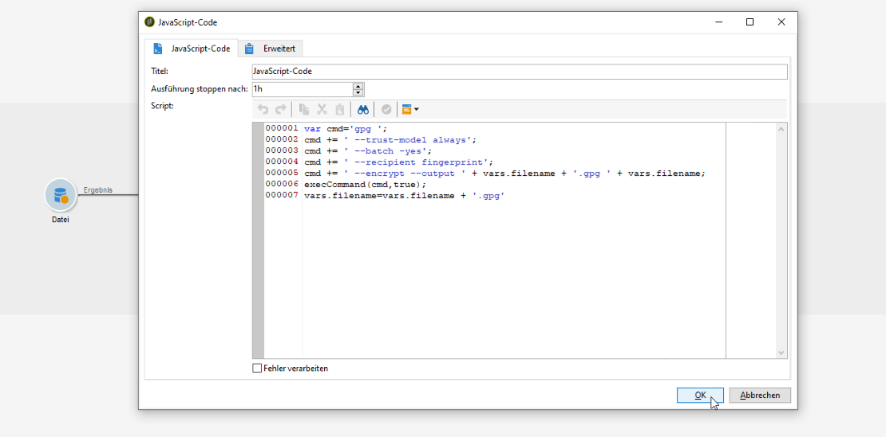
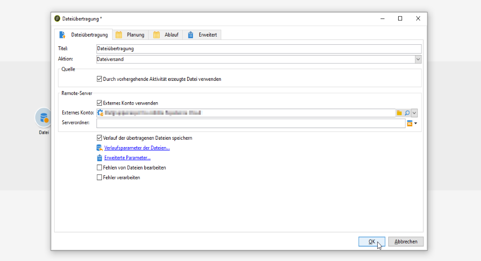

# Workflow-Daten verwenden{#how-to-use-workflow-data}

## Datenbank aktualisieren {#updating-the-database}

Alle in Workflows erhobenen Daten können zur Aktualisierung der Datenbank oder in Sendungen verwendet werden, um beispielsweise die Möglichkeiten der Inhaltspersonalisierung zu ergänzen (Einfügung der Anzahl von Versicherungspolicen, des durchschnittlichen Warenkorbs im vergangenen Jahr etc.) oder die Zielgruppenbestimmung zu verfeinern (eine Nachricht an die Mitversicherten adressieren, die 1000 besten Kunden ansprechen etc.). Diese Daten können auch in eine Liste exportiert oder zur Erstellung eines Verlaufs verwendet werden.

### Listen und direkt Aktualisierungen {#lists-and-direct-updates}

Zur Aktualisierung der Adobe-Campaign-Datenbank und von Listen stehen zwei dedizierte Aktivitäten zur Verfügung:

* Über die Aktivität **[!UICONTROL Listen-Update]** können Arbeitstabellen in einer Datenliste gespeichert werden.

   Hierbei kann eine existierende Liste verwendet oder eine neue erstellt werden. In diesem Fall werden ihr Name und gegebenenfalls ihr Speicherverzeichnis berechnet.

   

   Siehe [Listen-Update](../../workflow/using/list-update.md).

* Die **[!UICONTROL Daten-Update]**-Aktivität ermöglicht eine gebündelte Aktualisierung von Datenbankfeldern.

   Weitere Informationen hierzu finden Sie im Abschnitt [Daten-Update](../../workflow/using/update-data.md).

### An- und Abmeldungen verwalten {#subscription-unsubscription-management}

Die An- und Abmeldung von Empfängern für einen Informationsdienst im Rahmen eines Workflows wird im Abschnitt [An-/Abmeldedienst](../../workflow/using/subscription-services.md) beschrieben.

## Über einen Workflow versenden {#sending-via-a-workflow}

### Versandaktivität {#delivery-activity}

Die Versandaktivität wird im Abschnitt [Versand](../../workflow/using/delivery.md) beschrieben.

### Sendungen anreichern und personalisieren {#enriching-and-targeting-deliveries}

Im Rahmen von Sendungen bieten Workflow-Aktivitäten die Möglichkeit, Daten zur Personalisierung des Inhalts oder zur Konfiguration der Versandzielgruppen bereitzustellen.

Beispielsweise können Sie bei Briefpost-Sendungen Zusatzdaten in die Extraktionsdatei aufnehmen, die mithilfe einer Workflow-Aktivität abgerufen werden:


Ergänzend zu den üblichen Personalisierungsfeldern können Sie den Versandinhalt mit aus einem Workflow stammenden Daten personalisieren. Tatsächlich können die aus Workflow-Aktivitäten gewonnenen Zusatzdaten gespeichert und im Versand-Assistenten verfügbar gemacht werden. Unten stehendes Beispiel verdeutlicht dies anhand des Namens der Ausgabedatei eines Briefpost-Versands:


Aus Workflow-Arbeitstabellen stammende Daten sind über ihren Namen leicht identifizierbar. Er beginnt jeweils mit **targetData**. Weitere Informationen hierzu finden Sie im Abschnitt [Zielgruppendaten](../../workflow/using/data-life-cycle.md#target-data).

Auch im Rahmen eines E-Mail-Versands können Personalisierungsfelder auf Daten zugreifen, die im Zuge einer Erweiterung des Zieldatensatzes in einem Zielgruppen-Workflow erhoben wurden, wie die folgende Abbildung verdeutlicht:


Wenn in einer Aktivität zur Zielgruppenbestimmung ein Segment-Code angegeben wird, wird dieser in einer gesonderten Spalte der Workflow-Arbeitstabelle gespeichert und innerhalb der Personalisierungsfelder zur Verfügung gestellt. Klicken Sie zur Anzeige aller Personalisierungsfelder auf die entsprechende Schaltfläche im Versand und wählen Sie die Option **[!UICONTROL Erweiterung des Zieldatensatzes > Sonstige...]** aus.


## Export von Daten {#exporting-data}

### Datei komprimieren oder verschlüsseln {#zipping-or-encrypting-a-file}

Mit Adobe Campaign können Sie komprimierte oder verschlüsselte Dateien exportieren. Wenn Sie einen Export über die Aktivität **[!UICONTROL Extraktion (Datei)]** planen, können Sie eine Nachbearbeitung definieren, um die Datei zu komprimieren oder zu verschlüsseln.

Gehen Sie dazu folgendermaßen vor:

1. Installieren Sie mit dem [Control Panel](https://docs.adobe.com/content/help/de-DE/control-panel/using/instances-settings/gpg-keys-management.html#encrypting-data) ein GPG-Schlüsselpaar für Ihre Instanz.

   >[!NOTE]
   >
   >Das Control Panel steht allen auf AWS gehosteten Kunden zur Verfügung (mit Ausnahme von Kunden, die ihre Marketing-Instanzen auf einer lokalen Plattform hosten).

1. Wenn Ihre Adobe Campaign-Installation von Adobe gehostet wird: Wenden Sie sich an die Kundenunterstützung von Adobe, damit die nötigen öffentlichen Dienste auf dem Server installiert werden.
1. Wenn Sie eine On-Premise-Installation von Adobe Campaign haben, installieren Sie den gewünschten öffentlichen Dienst (z. B.: GPG, GZIP) sowie die nötigen Schlüssel (zur Verschlüsselung) auf dem Anwendungs-Server.

Sie können dann auf der Registerkarte **[!UICONTROL Skript]** der Aktivität oder in einer **[!UICONTROL JavaScript-Code]**-Aktivität Befehle bzw. Code verwenden. Im folgenden Anwendungsfall wird ein Beispiel dargestellt.

**Verwandte Themen:**

* [Datei vor der Verarbeitung dekomprimieren oder entschlüsseln](../../workflow/using/importing-data.md#unzipping-or-decrypting-a-file-before-processing)
* [Aktivität &quot;Extraktion (Datei)&quot;](../../workflow/using/extraction--file-.md).

### Anwendungsfall: Verschlüsseln und Exportieren von Daten mit einem im Control Panel installierten Schlüssel {#use-case-gpg-encrypt}

In diesem Anwendungsfall wird ein Workflow erstellt, um Daten mit einem im Control Panel installierten Schlüssel zu verschlüsseln und zu exportieren.

In [diesem Abschnitt](https://docs.adobe.com/content/help/de-DE/campaign-classic-learn/tutorials/administrating/control-panel-acc/gpg-key-management/using-a-gpg-key-to-encrypt-data.html) finden Sie außerdem ein Video, in dem die Verwendung eines GPG-Schlüssels zum Verschlüsseln von Daten veranschaulicht wird.

Die Schritte zum Ausführen dieses Anwendungsfalls lauten wie folgt:

1. Generieren Sie ein GPG-Schlüsselpaar (öffentlich/privat) mit einem GPG-Dienstprogramm und installieren Sie dann den öffentlichen Schlüssel im Control Panel. Ausführliche Anweisungen finden Sie in der [Control Panel-Dokumentation](https://docs.adobe.com/content/help/de-DE/control-panel/using/instances-settings/gpg-keys-management.html#encrypting-data).

1. Erstellen Sie einen Workflow in Campaign Classic, um die Daten mithilfe des über das Control Panel installierten privaten Schlüssels zu verschlüsseln und zu exportieren. Zu diesem Zweck wird folgender Workflow erstellt:

   

   * Aktivität **[!UICONTROL Abfrage]**: In diesem Beispiel möchten wir eine Abfrage ausführen, die auf die Daten aus der Datenbank abzielt, die wir exportieren möchten.
   * Aktivität **[!UICONTROL Extraktion (Datei)]**: Extrahiert die Daten in eine Datei.
   * Aktivität **[!UICONTROL JavaScript-Code]**: Verschlüsselt die zu extrahierenden Daten.
   * Aktivität **[!UICONTROL Dateiübertragung]**: Sendet die Daten an eine externe Quelle (in diesem Beispiel an einen SFTP-Server).

1. Konfigurieren Sie die Aktivität **[!UICONTROL Abfrage]** so, dass sie auf die gewünschten Daten aus der Datenbank abzielt. Weiterführende Informationen hierzu finden Sie in [diesem Abschnitt](../../workflow/using/query.md).

1. Öffnen Sie die Aktivität **[!UICONTROL Extraktion (Datei)]** und konfigurieren Sie sie entsprechend Ihren Anforderungen. Globale Konzepte zur Konfiguration der Aktivität finden Sie in [diesem Abschnitt](../../workflow/using/extraction--file-.md).

   

1. Öffnen Sie die Aktivität **[!UICONTROL JavaScript-Code]** und fügen Sie den unten stehenden Befehl ein, um die zu extrahierenden Daten zu verschlüsseln.

   >[!IMPORTANT]
   >
   >Vergessen Sie nicht, den Wert **fingerprint** im Befehl durch den Fingerabdruck des öffentlichen, im Control Panel installierten Schlüssels zu ersetzen.

   ```
   var cmd='gpg ';
   cmd += ' --trust-model always';
   cmd += ' --batch -yes';
   cmd += ' --recipient fingerprint';
   cmd += ' --encrypt --output ' + vars.filename + '.gpg ' + vars.filename;
   execCommand(cmd,true);
   vars.filename=vars.filename + '.gpg'
   ```

   

1. Öffnen Sie die Aktivität **[!UICONTROL Dateiübertragung]** und geben Sie dann den SFTP-Server an, an den Sie die Datei senden möchten. Globale Konzepte zur Konfiguration der Aktivität finden Sie in [diesem Abschnitt](../../workflow/using/file-transfer.md).

   

1. Sie können den Workflow jetzt ausführen. Nach der Ausführung werden die über die Abfrage abgerufenen Daten in eine verschlüsselte .gpg-Datei für den SFTP-Server exportiert.

   
