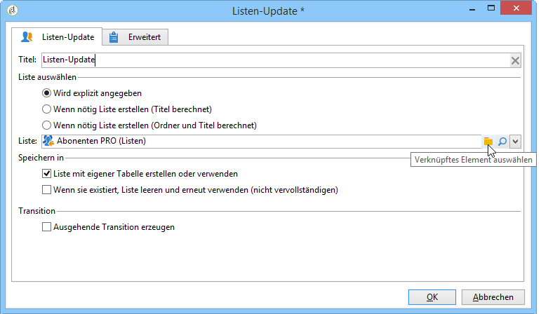
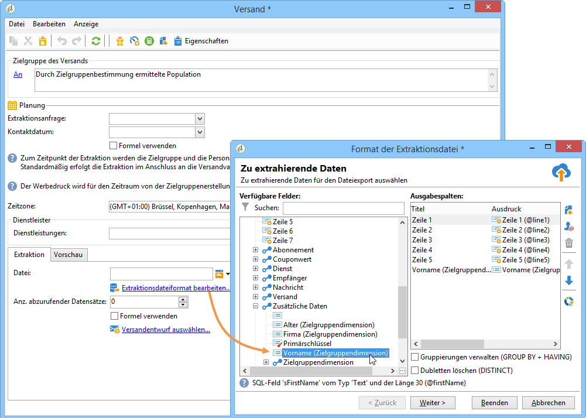
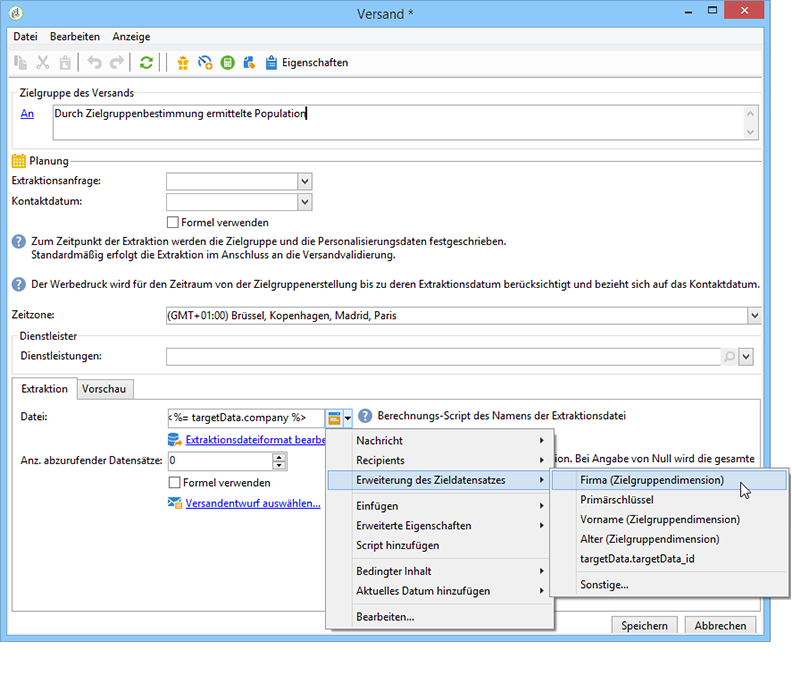
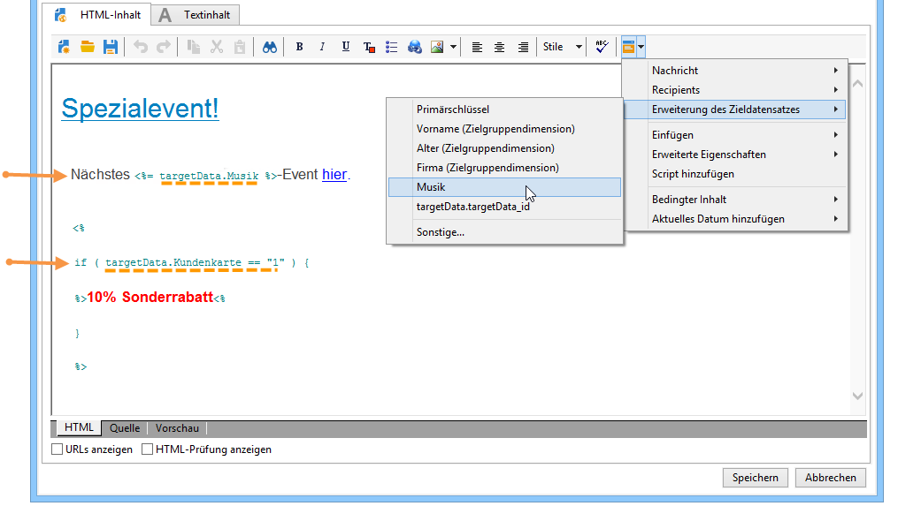
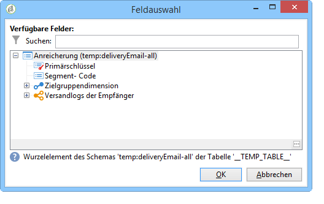

# Workflow-Daten verwenden{#how-to-use-workflow-data}

## Datenbank aktualisieren {#updating-the-database}

Alle erfassten Daten können zur Aktualisierung der Datenbank oder in Sendungen verwendet werden. Sie können beispielsweise die Möglichkeiten der Personalisierung von Nachrichteninhalten anreichern (einschließlich der Anzahl der Verträge in der Nachricht, Angabe des durchschnittlichen Warenkorbs im letzten Jahr usw.) oder die Zielgruppenbestimmung detaillierter darstellen (eine Nachricht an die Mitversicherten senden, die 1.000 besten Abonnentinnen und Abonnenten von Online-Diensten ansprechen usw.). Diese Daten können auch exportiert oder in einer Liste archiviert werden.

### Listen und direkte Aktualisierungen {#lists-and-direct-updates}

Zur Aktualisierung der Adobe Campaign-Datenbank und von Listen stehen zwei dedizierte Aktivitäten zur Verfügung:

* Über die Aktivität **[!UICONTROL Listen-Update]** können Arbeitstabellen in einer Datenliste gespeichert werden.

  Sie können eine vorhandene Liste auswählen oder eine Liste erstellen. In diesem Fall werden ihr Name und gegebenenfalls ihr Eintragsordner berechnet.

  

  Siehe [Listen-Update](list-update.md).

* Die **[!UICONTROL Daten-Update]**-Aktivität ermöglicht eine gebündelte Aktualisierung von Datenbankfeldern.

  Weitere Informationen hierzu finden Sie im Abschnitt [Daten-Update](update-data.md).

### An- und Abmeldungen verwalten {#subscription-unsubscription-management}

Die An- und Abmeldung von Empfängern für einen Informationsdienst im Rahmen eines Workflows wird im Abschnitt [An-/Abmeldedienst](subscription-services.md) beschrieben.

## Über einen Workflow versenden {#sending-via-a-workflow}

### Versandaktivität {#delivery-activity}

Die Versandaktivität wird im Abschnitt [Versand](delivery.md) beschrieben.

### Sendungen anreichern und personalisieren {#enriching-and-targeting-deliveries}

Im Rahmen von Sendungen bieten Workflow-Aktivitäten die Möglichkeit, Daten zur Personalisierung des Inhalts oder zur Konfiguration der Versandzielpopulationen bereitzustellen.

Beispielsweise können Sie bei Briefpost-Sendungen Zusatzdaten in die Extraktionsdatei aufnehmen, die mithilfe einer Workflow-Aktivität abgerufen werden:

Ergänzend zu den üblichen Personalisierungsfeldern können Sie den Versandinhalt mit aus einem Workflow stammenden Daten personalisieren. Tatsächlich können die aus Workflow-Aktivitäten gewonnenen Zusatzdaten gespeichert und im Versandassistenten verfügbar gemacht werden. Unten stehendes Beispiel verdeutlicht dies anhand des Namens der Ausgabedatei eines Briefpost-Versands:

Aus Workflow-Arbeitstabellen stammende Daten sind über ihren Namen leicht identifizierbar. Er beginnt jeweils mit **targetData**. Weitere Informationen hierzu finden Sie im Abschnitt [Zielgruppendaten](data-life-cycle.md#target-data).

Auch im Rahmen eines E-Mail-Versands können Personalisierungsfelder auf Daten zugreifen, die im Zuge einer Erweiterung des Zieldatensatzes in einem Zielgruppen-Workflow erhoben wurden, wie die folgende Abbildung verdeutlicht:

Wenn ein Segment-Code in einer Zielgruppenbestimmungsaktivität angegeben wird, wird er einer bestimmten Spalte der Workflow-Tabelle hinzugefügt und zusammen mit den Personalisierungsfeldern angeboten. Klicken Sie zur Anzeige aller Personalisierungsfelder auf die entsprechende Schaltfläche im Versand und wählen Sie die Option **[!UICONTROL Erweiterung des Zieldatensatzes > Sonstige...]** aus.

