# Daten importieren{#importing-data}

>[!CAUTION]
>
>Beachten Sie beim Importieren von Daten die Einschränkungen für SFTP-Datenspeicherung, Datenbank-Datenspeicherung und aktive Profile gemäß Ihrem Adobe Campaign-Vertrag.

## Datenerfassung {#how-to-collect-data}

### Verwendung von Daten aus einer Liste: Liste lesen {#using-data-from-a-list--read-list}

In Workflows genutzte Daten können aus Listen stammen, deren Daten zuvor aufbereitet und strukturiert wurden.

Dabei kann es sich um Listen aus Adobe Campaign oder über die Option **[!UICONTROL Liste importieren]** eingespeiste Daten handeln. Weiterführende Informationen zu dieser Option finden Sie auf dieser [Seite](../../platform/using/generic-imports-and-exports.md).

Weiterführende Informationen zum Gebrauch von Listen in Workflows finden Sie im Abschnitt [Liste lesen](../../workflow/using/read-list.md).

### Laden von Daten aus einer Datei: Laden (Datei){#loading-data-from-a-file}

Die im Workflow verarbeiteten Daten können aus einer strukturierten Datei stammen, die in Adobe Campaign importiert wird.

Weiterführende Informationen finden Sie im Abschnitt [Laden (Datei)](../../workflow/using/data-loading--file-.md).

Beispiel einer zu importierenden strukturierten Datei:

```
lastname;firstname;birthdate;email;crmID
Smith;Hayden;23/05/1989;hayden.smith@example.com;124365
Mars;Daniel;17/11/1987;dannymars@example.com;123545
Smith;Clara;08/02/1989;hayden.smith@example.com;124567
Durance;Allison;15/12/1978;allison.durance@example.com;120987
```

## Best Practices beim Datenimport {#best-practices-when-importing-data}

Eine sorgfältige Arbeitsweise und die Befolgung der unten stehenden einfachen Regeln helfen Ihnen, die Datenbank konsistent zu halten und gängige Fehler bei der Datenbankaktualisierung oder beim Datenexport zu vermeiden.

### Importvorlagen verwenden        {#using-import-templates}

Import-Workflows sollten die folgenden Aktivitäten beinhalten: **[!UICONTROL Laden (Datei)]**, **[!UICONTROL Anreicherung]**, **[!UICONTROL Aufspaltung]**, **[!UICONTROL Deduplizierung]**, **[!UICONTROL Daten-Update]**.

Importvorlagen vereinfachen die Durchführung ähnlicher Importe und halten die Datenbank konsistent. Erfahren Sie im Abschnitt [Workflow-Vorlagen](../../workflow/using/building-a-workflow.md#workflow-templates), wie Sie Workflow-Vorlagen erstellen können.

In vielen Projekten werden Importe ohne **[!UICONTROL Deduplizierung]** erstellt, da die im Projekt verwendeten Dateien ohnehin keine Duplikate aufweisen. Beim Import verschiedener Dateien können jedoch Duplikate entstehen. Dann ist eine Deduplizierung schwierig. Deshalb ist eine Deduplizierung eine gute Vorsichtsmaßnahme bei jedem Import-Workflow.

Verlassen Sie sich nicht darauf, dass die eingehenden Daten konsistent und korrekt sind oder dass sich die IT-Abteilung oder der Adobe-Campaign-Verantwortliche darum kümmert. Führen Sie stattdessen während des Projekts die Datenbereinigung durch. Achten Sie beim Datenimport auf die Deduplizierung, die Abstimmung und die Gewährleistung der Konsistenz.

Ein Beispiel für eine Importvorlage finden Sie im Abschnitt [Einrichten eines wiederkehrenden Imports](#setting-up-a-recurring-import).

### Dateiformate mit einfach strukturierten Daten verwenden      {#using-flat-file-formats}

Das effizienteste Format für Importe sind flache Dateien, die im Bulk-Modus auf Datenbankebene importiert werden können.

Beispiel:

* Trennzeichen: Tabulator oder Semikolon
* Erste Zeile mit Headern
* Keine Zeichenketten-Qualifizierer
* Datumsformat: JJJJ/MM/TT hh:mm:ss

Adobe Campaign kann mit den Standard-Dateiimportaktivitäten keine XML-Dateien importieren. XML-Dateien können mit JavaScript importiert werden, aber nur wenn sie maximal 10.000 Datensätze pro Datei aufweisen.

### Komprimierung und Verschlüsselung verwenden {#using-compression-and-encryption}

Verwenden Sie für Importe und Exporte möglichst ZIP-Dateien.

Unter Linux können Sie eine Datei gleichzeitig dekomprimieren und mit einer Befehlszeile importieren. Beispiel:

```
zcat nl6/var/vp/import/filename.gz
```

Ferner wird empfohlen, in einem unsicheren Netzwerk übermittelte Dateien zu verschlüsseln, beispielsweise mit GPG.

### Daten im Batch-Modus aus Dateien laden {#loading-data-in-batch-from-files}

Das Laden von Daten im Batch-Modus aus einer Datei ist effizienter als das Laden einzelner Zeilen in Echtzeit (z. B. über einen Webdienst).

Importe mit Webdiensten sind nicht effizient. Nach Möglichkeit sollten Dateien verwendet werden.

Die Verwendung externer Webdienste zur Anreicherung von Profilen in Echtzeit verursacht Leistungsprobleme und Speicherlecks, da diese Vorgänge auf Zeilenebene ablaufen.

Wenn Sie Daten importieren müssen, sollten Sie dies im Batch-Modus mit einem Workflow durchführen anstatt in Echtzeit mit einer Webanwendung oder einem Webdienst.

### Data Management verwenden {#using-data-management}

Das Laden im iterativen Modus (Zeile für Zeile) mit JavaScript sollte auf kleine Volumina beschränkt sein.

Verwenden Sie immer die Aktivität **[!UICONTROL Laden (Datei)]**, um Data-Management-Workflows effizienter zu gestalten.

### Im Deltamodus importieren {#importing-in-delta-mode}

Regelmäßige Importe müssen im Deltamodus durchgeführt werden. Damit wird gewährleistet, dass nicht jedes Mal die gesamte Tabelle, sondern nur geänderte oder neue Daten an Adobe Campaign gesendet werden.

Vollständige Importe sollten nur für das erstmalige Laden verwendet werden.

Für den Datenimport wird empfohlen, anstelle von JavaScript das Data Management zu verwenden.

### Konsistenz gewährleisten      {#maintaining-consistency}

Um die Konsistenz der Adobe-Campaign-Datenbank zu gewährleisten, befolgen Sie die unten stehenden Grundsätze:

* Wenn die importierten Daten einer Referenztabelle in Adobe Campaign entsprechen, sollten sie im Workflow mit dieser Tabelle abgeglichen werden. Nicht übereinstimmende Datensätze sollten abgelehnt werden.
* Achten Sie darauf, dass die importierten Daten (E-Mail, Telefonnummer, Postanschrift) stets **&quot;bereinigt&quot;** werden und dass diese Bereinigung zuverlässig ist und sich im Laufe der Jahre nicht verändert. Andernfalls könnten in der Datenbank Duplikate entstehen. Da Adobe Campaign keine Tools zum &quot;unscharfen&quot; Abgleich besitzt, ist es dann sehr schwierig, diese Duplikate zu verwalten und zu entfernen.
* Transaktionsdaten sollten einen Abstimmschlüssel aufweisen und mit den bestehenden Daten abgestimmt werden, damit keine Duplikate entstehen.
* **Importieren Sie verknüpfte Dateien in der richtigen Reihenfolge**.

   Wenn der Import aus mehreren miteinander verbundenen Dateien besteht, sollte im Workflow darauf geachtet werden, dass die Dateien in der richtigen Reihenfolge importiert werden. Wenn der Import einer Datei fehlschlägt, werden auch die anderen nicht importiert.

* Achten Sie beim Datenimport auf die **Deduplizierung**, die Abstimmung und die Gewährleistung der Konsistenz.

## Anwendungsbeispiel: Einrichten eines wiederkehrenden Imports {#setting-up-a-recurring-import}

Für den regelmäßigen Import von Dateien derselben Struktur empfiehlt sich die Verwendung einer Importvorlage.

In diesem Beispiel wird gezeigt, wie ein Workflow für den wiederholten Import von Profilen aus einer CRM-Lösung in der Adobe Campaign-Datenbank erstellt wird. Weiterführende Informationen zu jeder Aktivität finden Sie in diesem [Abschnitt](../../workflow/using/about-activities.md).

1. Erstellen Sie eine neue Workflow-Vorlage unter **[!UICONTROL Ressourcen > Vorlagen > Workflow-Vorlagen]**.
1. Fügen Sie die folgenden Aktivitäten hinzu:

   * **[!UICONTROL Laden (Datei)]**: Definieren Sie die erwartete Struktur der Datei, die die zu importierenden Daten enthält.
   * **[!UICONTROL Anreicherung]**: Stimmen Sie die importierten Daten mit den Daten in der Datenbank ab.
   * **[!UICONTROL Aufspaltung]**: Erstellen Sie Filter, um Datensätze, die abgestimmt werden konnten, und jene, die nicht abgestimmt werden konnten, unterschiedlich zu verarbeiten.
   * **[!UICONTROL Deduplizierung]**: Deduplizieren Sie die Daten aus der eingehenden Datei, bevor sie zur Datenbank hinzugefügt werden.
   * **[!UICONTROL Daten-Update]**: Aktualisieren Sie die Datenbank mit den importierten Profilen.

   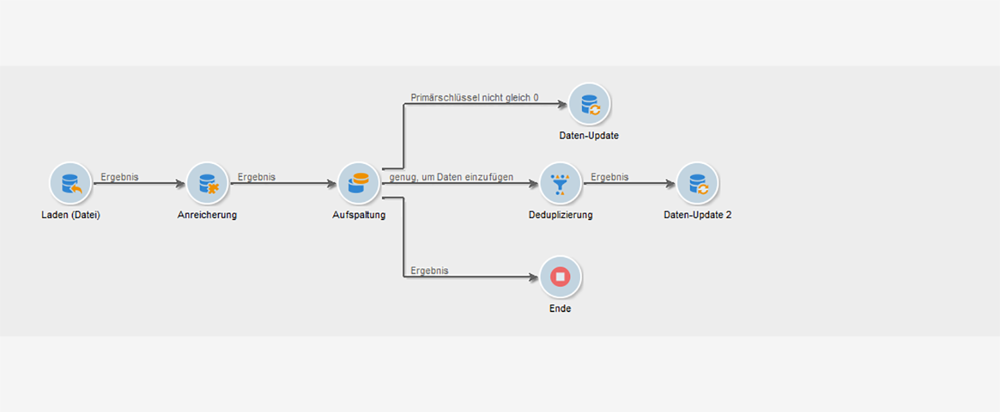

1. Konfigurieren Sie die Aktivität **[!UICONTROL Laden (Datei)]**:

   * Definieren Sie die Struktur, die die Importdatei aufweisen soll, indem Sie eine Beispieldatei hochladen. Diese sollte nur einige wenige Zeilen aufweisen, aber alle für den Import erforderlichen Spalten. Prüfen und bearbeiten Sie das Dateiformat, um sicherzustellen, dass jeder Spaltentyp richtig eingerichtet ist: Text, Datum, Integer usw. Beispiel:

      ```
      lastname;firstname;birthdate;email;crmID
      Smith;Hayden;23/05/1989;hayden.smith@mailtest.com;123456
      ```

   * Wählen Sie im Bereich **[!UICONTROL Name der zu ladenden Datei]** die Option **[!UICONTROL Lokal existierende Datei laden]** und lassen Sie das Feld leer. Jedes Mal, wenn ein neuer Workflow von dieser Vorlage erstellt wird, können Sie hier die gewünschte Datei spezifizieren, solange sie der definierten Struktur entspricht.

      Sie können alle beliebigen Optionen verwenden, müssen aber die Vorlage entsprechend ändern. Wenn Sie beispielsweise **[!UICONTROL Wird durch die Transition angegeben]** auswählen, können Sie die Aktivität **[!UICONTROL Dateiübertragung]** hinzufügen, bevor Sie die zu importierende Datei von einem FTP-/SFTP-Server abrufen. Mit einer S3- oder SFTP-Verbindung können Sie auch Segmentdaten mit der Adobe-Echtzeit-Kundendatenplattform in Adobe Campaign importieren. Weitere Informationen hierzu finden Sie in [dieser Dokumentation](https://docs.adobe.com/content/help/de-DE/experience-platform/rtcdp/destinations/destinations-cat/adobe-destinations/adobe-campaign-destination.html).

      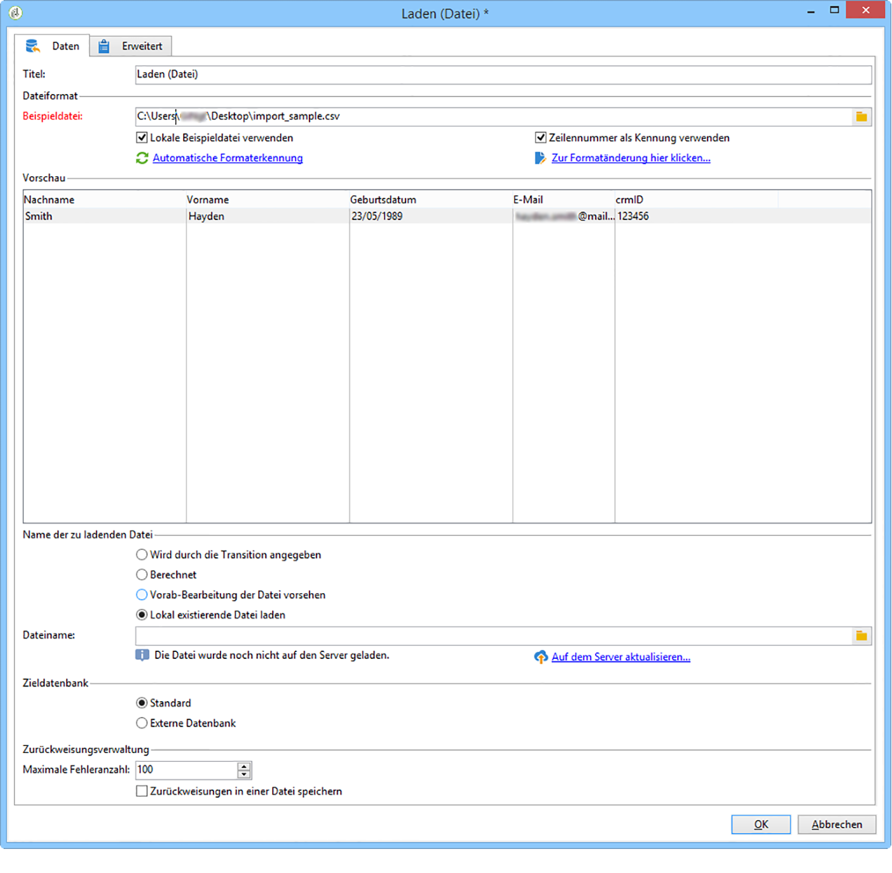

1. Konfigurieren Sie die Aktivität **[!UICONTROL Anreicherung]**. Diese Aktivität hat in unserem Fall den Zweck, die eingehenden Daten zu identifizieren.

   * Wählen Sie im Tab **[!UICONTROL Anreicherung]** die Option **[!UICONTROL Daten hinzufügen]** und definieren Sie eine Verknüpfung zwischen den importierten Daten und der Zielgruppendimension der Empfänger. In unserem Beispiel wird diese Join-Bedingung mithilfe des benutzerdefinierten Feldes **Kennung im CRM** erstellt. Verwenden Sie das erforderliche Feld oder eine Kombination von Feldern, um eindeutige Datensätze zu identifizieren.
   * Lassen Sie im Tab **[!UICONTROL Abstimmung]** die Option **[!UICONTROL Dokument zur Zielgruppenbestimmung aufgrund der Arbeitsdaten identifizieren]** deaktiviert.

   

1. Konfigurieren Sie die Aktivität **[!UICONTROL Aufspaltung]**, um abgestimmte Empfänger in einer Transition abzurufen und Empfänger, die nicht abgestimmt werden konnten, aber genügend Daten enthalten, in einer anderen Transition abzurufen.

   Danach kann die Datenbank mit der Transition mit abgestimmten Empfängern aktualisiert werden. Mit der Transition mit unbekannten Empfängern können dann neue Empfängereinträge in der Datenbank erstellt werden, vorausgesetzt die Datei enthält ein Mindestmaß an Daten.

   Empfänger, die nicht abgestimmt werden können und nicht genügend Daten aufweisen, werden in einer komplementären ausgehenden Transition ausgewählt und können in einer separaten Datei exportiert oder einfach ignoriert werden.

   * Wählen Sie im Tab **[!UICONTROL Allgemein]** der Aktivität die Option **[!UICONTROL Nur zusätzliche Daten nutzen]** als Filterparameter und achten Sie darauf, dass für die **[!UICONTROL Zielgruppendimension]** automatisch **[!UICONTROL Anreicherung]** aktiviert wird.

      Aktivieren Sie die Option **[!UICONTROL Komplement erzeugen]**, um sich die Datensätze anzeigen zu lassen, die nicht in die Datenbank eingefügt werden können. Bei Bedarf können Sie dann für die komplementären Daten zusätzliche Verarbeitungsschritte setzen: Dateiexport, Listen-Update etc.

   * Fügen Sie der ersten Teilmenge des Tabs **[!UICONTROL Teilmengen]** eine Filterbedingung für die Eingangspopulation hinzu, um nur Datensätze auszuwählen, für die der Primärschlüssel der Empfänger nicht gleich 0 ist. Auf diese Weise werden in dieser Teilmenge Daten aus der Datei ausgewählt, die mit Empfängern aus der Datenbank abgestimmt sind.

      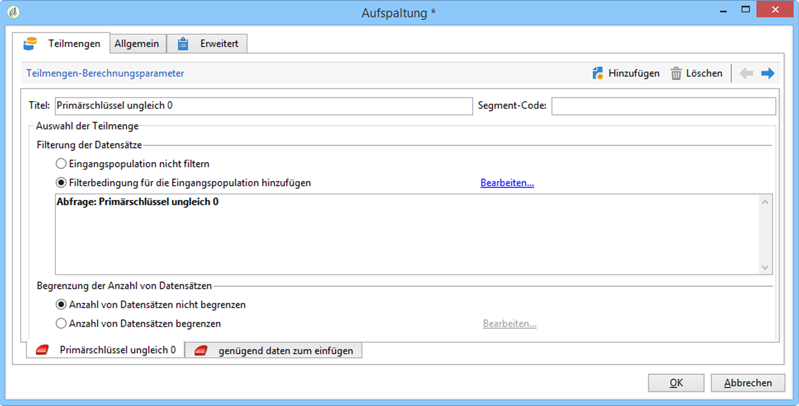

   * Fügen Sie eine zweite Teilmenge hinzu, die nicht abgestimmte Datensätze enthält, die aber genügend Informationen für die Aufnahme in die Datenbank aufweisen. Beispiel: E-Mail-Adresse, Vor- und Nachname.

      Teilmengen werden in der Reihenfolge ihrer Erstellung verarbeitet. Bei der Verarbeitung dieser zweiten Teilmenge wurden deshalb alle in der Datenbank befindlichen Datensätze bereits in der ersten Teilmenge ausgewählt.

      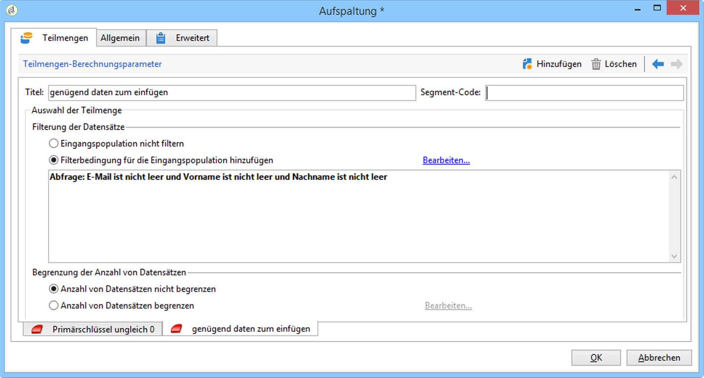

   * Alle nicht in den ersten beiden Teilmengen ausgewählten Datensätze werden im **[!UICONTROL Komplement]** ausgewählt.

1. Konfigurieren Sie die Aktivität **[!UICONTROL Daten-Update]**, die auf die erste ausgehende Transition der zuvor konfigurierten **[!UICONTROL Aufspaltung]** folgt.

   * Wählen Sie als **[!UICONTROL Kampagnentyp]** die Option **[!UICONTROL Aktualisieren]** aus, da die eingehende Transition nur bereits in der Datenbank vorhandene Empfänger enthält.
   * Wählen Sie im Bereich **[!UICONTROL Datensatz-Identifizierung]** die Option **[!UICONTROL Über Abstimmschlüssel]** aus und definieren Sie einen Schlüssel zwischen der Zielgruppendimension und der in der **[!UICONTROL Anreicherung]** erstellten Verknüpfung. In unserem Beispiel wird das benutzerdefinierte Feld **Kennung im CRM** verwendet.
   * Geben Sie im Bereich **[!UICONTROL Zu aktualisierende Felder]** an, welche Felder aus der Empfänger-Dimension mit dem Wert der entsprechenden Spalte in der Datei aktualisiert werden sollen. Wenn die Namen der Dateispalten mit den Namen der Dimensionsfelder der Empfänger übereinstimmen oder ihnen sehr ähnlich sind, können Sie die Felder mithilfe des Zauberstab-Symbols automatisch miteinander abstimmen.

      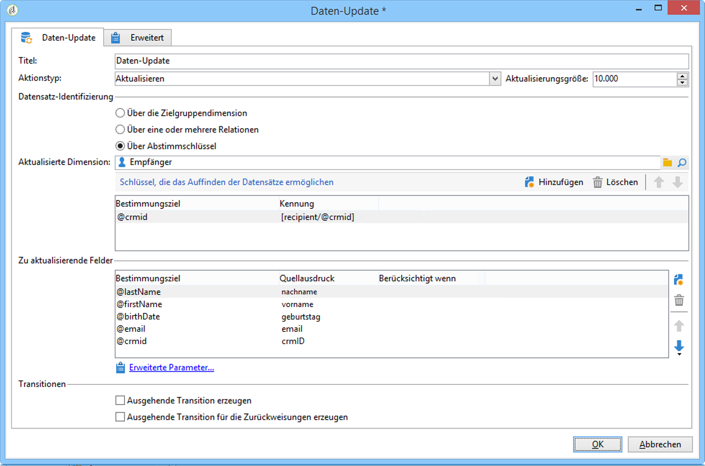

1. Konfigurieren Sie die Aktivität **[!UICONTROL Deduplizierung]**, die auf die Transition nicht abgestimmter Empfänger folgt:

   * Wählen Sie **[!UICONTROL Konfiguration bearbeiten]** aus und danach für die Zielgruppendimension das temporäre Schema, das von der Aktivität **[!UICONTROL Anreicherung]** des Workflows erstellt wurde.

      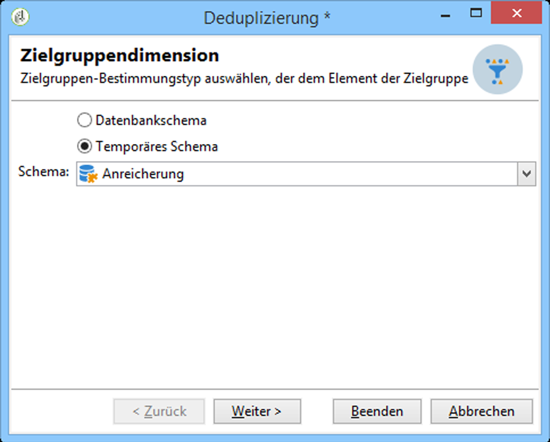

   * In diesem Beispiel wird das E-Mail-Feld zum Ermitteln eindeutiger Profile verwendet. Sie können aber auch jedes andere Feld verwenden, das ausgefüllt und Teil einer eindeutigen Kombination ist.
   * Wählen Sie im Bildschirm **[!UICONTROL Deduplizierungsmethode]** die Option **[!UICONTROL Erweiterte Parameter]** und aktivieren Sie die Option **[!UICONTROL Automatischen Filter der Datensätze mit ID=0 deaktivieren]**, um zu gewährleisten, dass Datensätze mit einem Primärschlüssel gleich 0 (d. h. alle Datensätze dieser Transition) nicht ausgeschlossen werden.

   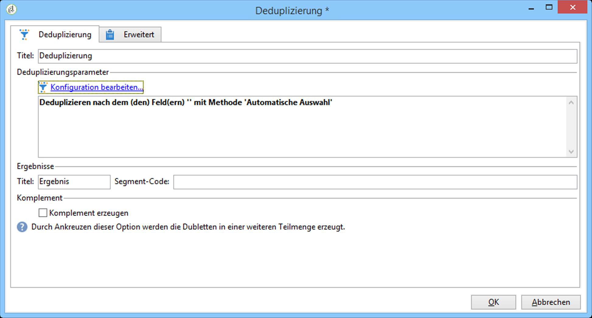

1. Konfigurieren Sie die Aktivität **[!UICONTROL Daten-Update]**, die auf die zuvor konfigurierte Aktivität **[!UICONTROL Deduplizierung]** folgt.

   * Wählen Sie als **[!UICONTROL Kampagnentyp]** die Option **[!UICONTROL Hinzufügen]** aus, da die eingehende Transition nur noch nicht in der Datenbank vorhandene Empfänger enthält.
   * Wählen Sie im Bereich **[!UICONTROL Datensatz-Identifizierung]** die Option **[!UICONTROL Über die Zielgruppendimension]** und dann die Dimension **[!UICONTROL Empfänger]** aus.
   * Geben Sie im Bereich **[!UICONTROL Zu aktualisierende Felder]** an, welche Felder aus der Empfänger-Dimension mit dem Wert der entsprechenden Spalte in der Datei aktualisiert werden sollen. Wenn die Namen der Dateispalten mit den Namen der Dimensionsfelder der Empfänger übereinstimmen oder ihnen sehr ähnlich sind, können Sie die Felder mithilfe des Zauberstab-Symbols automatisch miteinander abstimmen.

      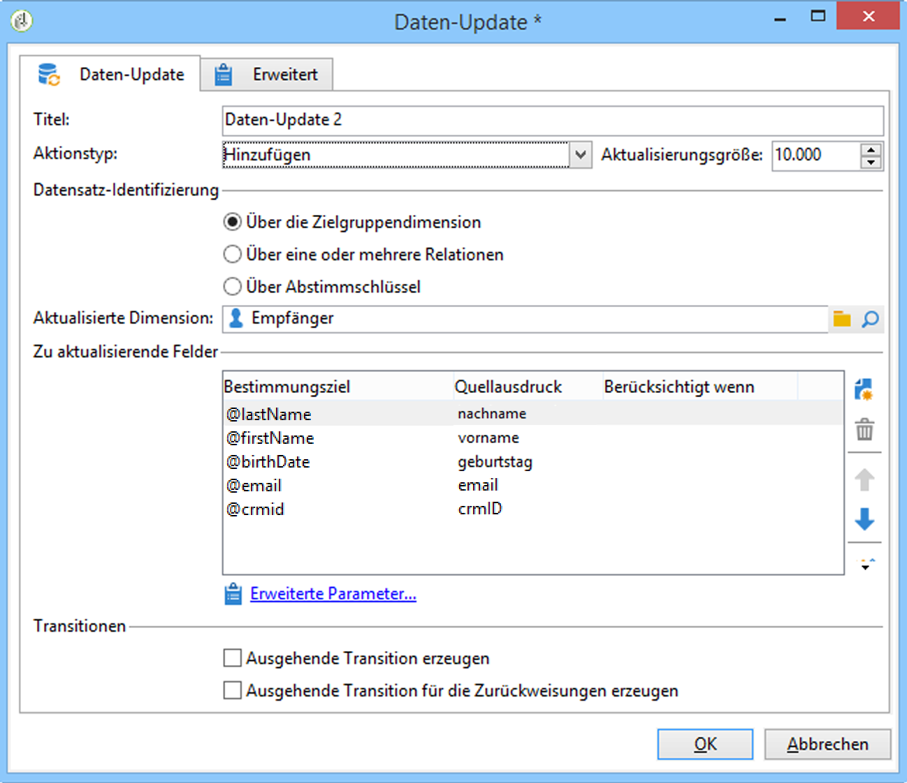

1. Fügen Sie nach der dritten Transition der Aktivität **[!UICONTROL Aufspaltung]** die Aktivität **[!UICONTROL Extraktion (Datei)]** und eine **[!UICONTROL Dateiübertragung]** hinzu, wenn Sie die noch nicht in die Datenbank übertragenen Daten verfolgen möchten. Konfigurieren Sie diese Aktivitäten, um die benötigte Spalte zu exportieren und die Datei auf einen FTP- oder SFTP-Server zu übertragen, wo Sie sie abrufen können.
1. Fügen Sie eine **[!UICONTROL Ende]**-Aktivität an und speichern Sie die Workflow-Vorlage.

Die Vorlage ist jetzt einsatzbereit und kann für jeden neuen Workflow verwendet werden. Dann muss nur noch die Datei spezifiziert werden, deren Daten in der Aktivität **[!UICONTROL Laden (Datei)]** importiert werden sollen.

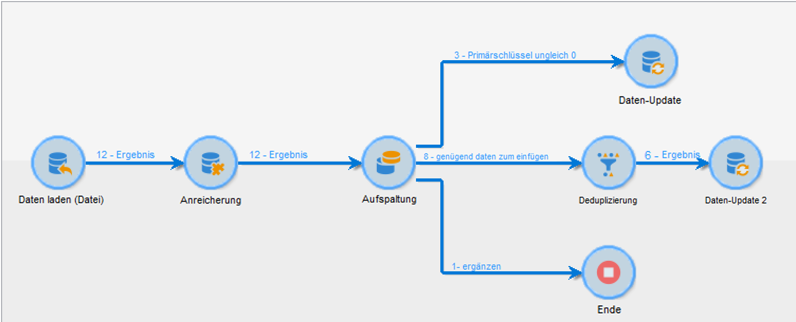

## Datei vor der Verarbeitung dekomprimieren oder entschlüsseln {#unzipping-or-decrypting-a-file-before-processing}

### Informationen zu Vorab-Bearbeitungsetappen {#about-pre-processing-stages}

Mit Adobe Campaign können Sie komprimierte oder verschlüsselte Dateien importieren. Damit sie in der Aktivität [Laden (Datei)](../../workflow/using/data-loading--file-.md) gelesen werden können, definieren Sie eine Vorab-Bearbeitung, um die Datei zu dekomprimieren oder zu entschlüsseln.

Gehen Sie dazu folgendermaßen vor:

1. Verwenden Sie das [Control Panel](https://docs.adobe.com/content/help/de-DE/control-panel/using/instances-settings/gpg-keys-management.html#decrypting-data), um ein Schlüsselpaar aus öffentlichem und privatem Schlüssel zu generieren.

   >[!NOTE]
   >
   >Das Control Panel steht allen auf AWS gehosteten Kunden zur Verfügung (mit Ausnahme von Kunden, die ihre Marketing-Instanzen auf einer lokalen Plattform hosten).

1. Wenn Ihre Adobe Campaign-Installation von Adobe gehostet wird: Wenden Sie sich an die Kundenunterstützung von Adobe, damit die nötigen öffentlichen Dienste auf dem Server installiert werden.
1. Wenn Sie eine On-Premise-Installation von Adobe Campaign haben: Installieren Sie den gewünschten öffentlichen Dienst (z. B.: GPG, GZIP) sowie die nötigen Schlüssel (zur Verschlüsselung) auf dem Anwendungs-Server.

Anschließend können Sie die gewünschten Vorab-Bearbeitungsbefehle in Ihren Workflows nutzen:

1. Fügen Sie in Ihrem Workflow die Aktivität **[!UICONTROL Dateiübertragung]** hinzu und konfigurieren Sie sie.
1. Fügen Sie die Aktivität **[!UICONTROL Laden (Datei)]** hinzu und definieren Sie das Dateiformat.
1. Aktivieren Sie die Option **[!UICONTROL Vorab-Bearbeitung der Datei vorsehen]**.
1. Geben Sie den Vorab-Bearbeitungsbefehl an, den Sie anwenden möchten.
1. Fügen Sie andere Aktivitäten zur Handhabung der Daten in der Datei hinzu.
1. Speichern und starten Sie Ihren Workflow.

Im folgenden Anwendungsfall wird ein Beispiel dargestellt.

**Verwandte Themen:**

* [Aktivität &quot;Laden (Datei)&quot;](../../workflow/using/data-loading--file-.md).
* [Datei komprimieren oder verschlüsseln](../../workflow/using/how-to-use-workflow-data.md#zipping-or-encrypting-a-file).

### Anwendungsfall: Importieren von Daten, die mit einem vom Control Panel generierten Schlüssel verschlüsselt wurden {#use-case-gpg-decrypt}

In diesem Anwendungsfall erstellen wir einen Workflow, um Daten, die in einem externen System verschlüsselt wurden, mithilfe eines im Control Panel generierten Schlüssels zu importieren.

In [diesem Abschnitt](https://docs.adobe.com/content/help/de-DE/campaign-classic-learn/tutorials/administrating/control-panel-acc/gpg-key-management/decrypting-data.html) finden Sie außerdem ein Video, in dem gezeigt wird, wie Daten mit einem GPG-Schlüssel entschlüsselt werden können.

Die Schritte zum Ausführen dieses Anwendungsfalls lauten wie folgt:

1. Verwenden Sie das Control Panel, um ein Schlüsselpaar (öffentlich/privat) zu generieren. Ausführliche Anweisungen finden Sie in der [Control Panel-Dokumentation](https://docs.adobe.com/content/help/de-DE/control-panel/using/instances-settings/gpg-keys-management.html#decrypting-data).

   * Der öffentliche Schlüssel wird mit dem externen System geteilt, das ihn zum Verschlüsseln der an Campaign zu sendenden Daten verwendet.
   * Der private Schlüssel wird von Campaign Classic verwendet, um die eingehenden verschlüsselten Daten zu entschlüsseln.

   

1. Verwenden Sie im externen System den vom Control Panel heruntergeladenen öffentlichen Schlüssel, um die Daten für den Import in Campaign Classic zu verschlüsseln.

1. Erstellen Sie einen Workflow in Campaign Classic, um die verschlüsselten Daten zu importieren und mithilfe des über das Control Panel installierten privaten Schlüssels zu entschlüsseln. Zu diesem Zweck wird folgender Workflow erstellt:

   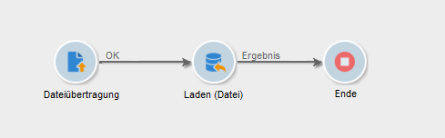

   * Aktivität **[!UICONTROL Dateiübertragung]**: Überträgt die Datei von einer externen Quelle an Campaign Classic. In diesem Beispiel soll die Datei von einem SFTP-Server übertragen werden.
   * Aktivität **[!UICONTROL Laden (Datei)]**: Lädt die Daten aus der Datei in die Datenbank und entschlüsselt sie mithilfe des im Control Panel generierten privaten Schlüssels.

1. Öffnen Sie die Aktivität **[!UICONTROL Dateiübertragung]** und geben Sie das externe Konto an, aus dem Sie die verschlüsselte GPG-Datei importieren möchten.

   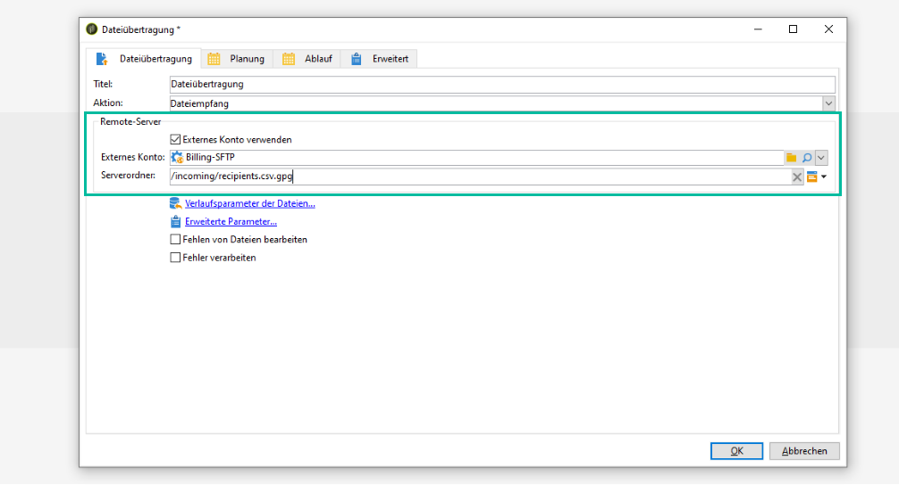

   Globale Konzepte zur Konfiguration der Aktivität finden Sie in [diesem Abschnitt](../../workflow/using/file-transfer.md).

1. Öffnen Sie die Aktivität **[!UICONTROL Laden (Datei)]** und konfigurieren Sie sie entsprechend Ihren Anforderungen. Globale Konzepte zur Konfiguration der Aktivität finden Sie in [diesem Abschnitt](../../workflow/using/data-loading--file-.md).

   Fügen Sie der Aktivität eine Vorab-Bearbeitungsetappe hinzu, um die eingehenden Daten zu entschlüsseln. Wählen Sie dazu die Option **[!UICONTROL Vorab-Bearbeitung der Datei vorsehen]** und kopieren Sie den folgenden Entschlüsselungsbefehl in das Feld **[!UICONTROL Befehl]**:

   `gpg --batch --passphrase passphrase --decrypt <%=vars.filename%>`

   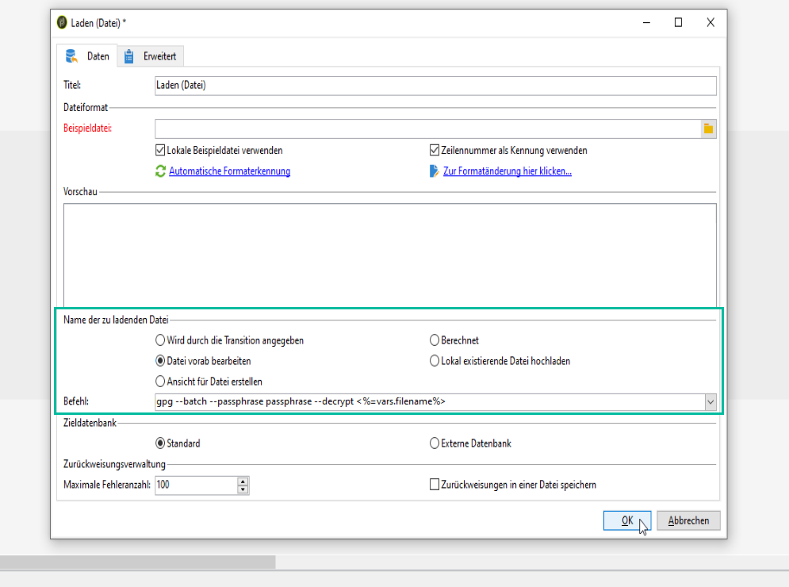

   >[!CAUTION]
   >
   >In diesem Beispiel verwenden wir die Passphrase, die das Control Panel standardmäßig nutzt, nämlich &quot;passphrase&quot;.
   >
   >Wenn per Anfrage an die Kundenunterstützung bereits in der Vergangenheit GPG-Schlüssel in Ihrer Instanz installiert wurden, hat sich die Passphrase möglicherweise geändert und unterscheidet sich von der standardmäßigen Passphrase.

1. Wählen Sie **[!UICONTROL OK]** aus, um die Konfiguration der Aktivität zu bestätigen.

1. Sie können den Workflow jetzt ausführen. Nach der Ausführung können Sie in den Workflow-Logs prüfen, ob die Entschlüsselung ausgeführt wurde und Daten aus der Datei importiert wurden.

   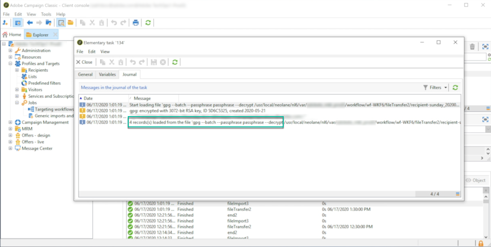
