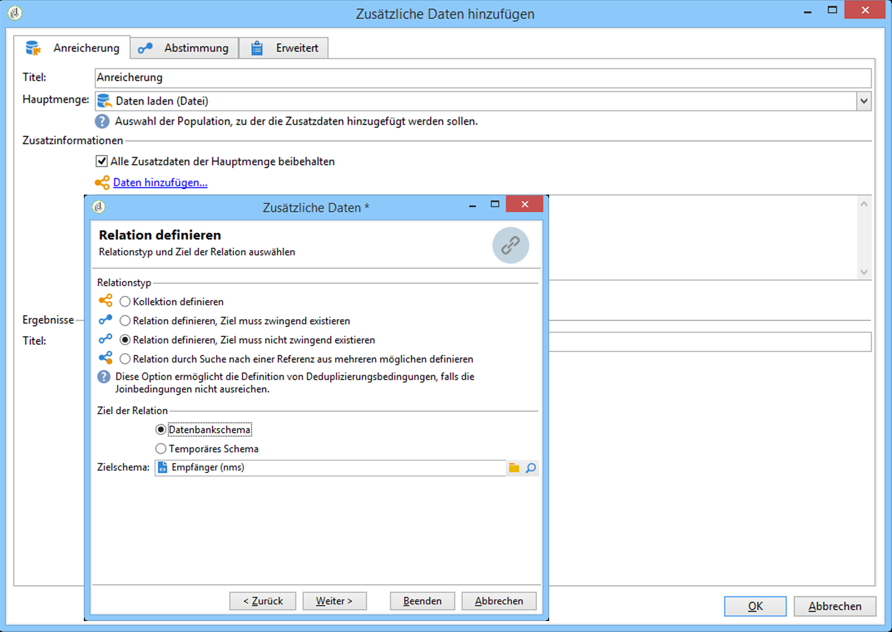

# Daten importieren{#importing-data}

## Datenerfassung {#how-to-collect-data}

### Verwendung von Daten aus einer Liste: Liste lesen {#using-data-from-a-list--read-list}

In Workflows genutzte Daten können aus Listen stammen, deren Daten zuvor aufbereitet und strukturiert wurden.

This list may have been directly created in Adobe Campaign or imported by the **[!UICONTROL Import a list]** option. For more on this option, refer to this [page](../../platform/using/generic-imports-and-exports.md).

For more on using the read list activity in a workflow, refer to [Read list](../../workflow/using/read-list.md).

### Laden von Daten aus einer Datei: Laden (Datei){#loading-data-from-a-file}

Die im Workflow verarbeiteten Daten können aus einer strukturierten Datei stammen, die in Adobe Campaign importiert wird.

A description of the loading data activity can be found in the [Data loading (file)](../../workflow/using/data-loading--file-.md) section.

Beispiel einer zu importierenden strukturierten Datei:

```
lastname;firstname;birthdate;email;crmID
Smith;Hayden;23/05/1989;hayden.smith@example.com;124365
Mars;Daniel;17/11/1987;dannymars@example.com;123545
Smith;Clara;08/02/1989;hayden.smith@example.com;124567
Durance;Allison;15/12/1978;allison.durance@example.com;120987
```

### Datei vor der Verarbeitung dekomprimieren oder entschlüsseln {#unzipping-or-decrypting-a-file-before-processing}

Mit Adobe Campaign können Sie komprimierte oder verschlüsselte Dateien importieren. Bevor sie in einer **[!UICONTROL Data loading (file)]** Aktivität gelesen werden können, können Sie eine Vorverarbeitung definieren, um die Datei zu entpacken oder zu entschlüsseln.

Gehen Sie dazu folgendermaßen vor:

* Wenn Ihre Adobe-Campaign-Installation von Adobe gehostet wird: Senden Sie eine Anfrage an [den Support](https://support.neolane.net), damit die nötigen Utilities auf dem Server installiert werden.
* Wenn Sie eine On-Premise-Installation von Adobe Campaign haben: Installieren Sie die gewünschte Utility (z. B.: GPG, GZIP) sowie die nötigen Schlüssel (zur Verschlüsselung) auf dem Anwendungsserver.

1. Add and configure a **[!UICONTROL File transfer]** activity in your workflow.
1. Fügen Sie eine **[!UICONTROL Data loading (file)]** Aktivität hinzu und definieren Sie das Dateiformat.
1. Aktivieren Sie die **[!UICONTROL Pre-process the file]** Option.
1. Spezifizieren Sie den gewünschten Befehl zur Vorab-Bearbeitung. Verwenden Sie z. B. zum Entschlüsseln einer Datei PGP:

   ```
   <path-to_pgp_if-not_global_or_server/>pgp.exe --decrypt --input nl6/var/vp/import/filename.pgp --passphrase "your password" --recipient recipient @email.com --verbose --output nl6/var/vp/import/filename
   ```

1. Fügen Sie andere Aktivitäten zur Handhabung der Daten in der Datei hinzu.
1. Speichern und starten Sie Ihren Workflow.

Beim Exportieren einer Datei können Sie diese auch komprimieren oder verschlüsseln. See [Zipping or encrypting a file](../../workflow/using/how-to-use-workflow-data.md#zipping-or-encrypting-a-file).

## Best Practices beim Datenimport {#best-practices-when-importing-data}

Eine sorgfältige Arbeitsweise und die Befolgung der unten stehenden einfachen Regeln helfen Ihnen, die Datenbank konsistent zu halten und gängige Fehler bei der Datenbankaktualisierung oder beim Datenexport zu vermeiden.

### Importvorlagen verwenden  {#using-import-templates}

Die meisten Import-Workflows sollten die folgenden Aktivitäten enthalten: **[!UICONTROL Data loading (file)]**, **[!UICONTROL Enrichment]**, **[!UICONTROL Split]**, **[!UICONTROL Deduplication]**, **[!UICONTROL Update data]**.

Importvorlagen vereinfachen die Durchführung ähnlicher Importe und halten die Datenbank konsistent. Erfahren Sie, wie Sie Workflow-Vorlagen im Abschnitt [Workflow-Vorlagen](../../workflow/using/building-a-workflow.md#workflow-templates) erstellen.

In many projects, imports are built without **[!UICONTROL Deduplication]** activity because the files used in the project do not have duplicates. Beim Import verschiedener Dateien können jedoch Duplikate entstehen. Dann ist eine Deduplizierung schwierig. Deshalb ist eine Deduplizierung eine gute Vorsichtsmaßnahme bei jedem Import-Workflow.

Verlassen Sie sich nicht darauf, dass die eingehenden Daten konsistent und korrekt sind oder dass sich die IT-Abteilung oder der Adobe-Campaign-Verantwortliche darum kümmert. Führen Sie stattdessen während des Projekts die Datenbereinigung durch. Achten Sie beim Datenimport auf die Deduplizierung, die Abstimmung und die Gewährleistung der Konsistenz.

Ein Beispiel für eine Importvorlage finden Sie im Abschnitt [Einrichten eines wiederkehrenden Imports](#setting-up-a-recurring-import) .

### Dateiformate mit einfach strukturierten Daten verwenden  {#using-flat-file-formats}

Das effizienteste Format für Importe sind flache Dateien, die im Bulk-Modus auf Datenbankebene importiert werden können.

Beispiel:

* Trennzeichen: Tabulator oder Semikolon
* Erste Zeile mit Headern
* Keine Zeichenketten-Qualifizierer
* Datumsformat: JJJJ/MM/TT hh:mm:ss

Adobe Campaign kann mit den Standard-Dateiimportaktivitäten keine XML-Dateien importieren. XML-Dateien können mit JavaScript importiert werden, aber nur wenn sie maximal 10.000 Datensätze pro Datei aufweisen.

### Komprimierung und Verschlüsselung verwenden {#using-compression-and-encryption}

Verwenden Sie für Importe und Exporte möglichst ZIP-Dateien.

Unter Linux können Sie eine Datei gleichzeitig dekomprimieren und mit einer Befehlszeile importieren. Beispiel:

```
zcat nl6/var/vp/import/filename.gz
```

Ferner wird empfohlen, in einem unsicheren Netzwerk übermittelte Dateien zu verschlüsseln, beispielsweise mit GPG.

### Daten im Batch-Modus aus Dateien laden {#loading-data-in-batch-from-files}

Das Laden von Daten im Batch-Modus aus einer Datei ist effizienter als das Laden einzelner Zeilen in Echtzeit (z. B. über einen Webdienst).

Importe mit Webdiensten sind nicht effizient. Nach Möglichkeit sollten Dateien verwendet werden.

Die Verwendung externer Webdienste zur Anreicherung von Profilen in Echtzeit verursacht Leistungsprobleme und Speicherlecks, da diese Vorgänge auf Zeilenebene ablaufen.

Wenn Sie Daten importieren müssen, sollten Sie dies im Batch-Modus mit einem Workflow durchführen anstatt in Echtzeit mit einer Webanwendung oder einem Webdienst.

### Data Management verwenden {#using-data-management}

Das Laden im iterativen Modus (Zeile für Zeile) mit JavaScript sollte auf kleine Volumina beschränkt sein.

For better efficiency, always use the **[!UICONTROL Data Loading (File)]** activity in data management workflows.

### Im Deltamodus importieren {#importing-in-delta-mode}

Regelmäßige Importe müssen im Deltamodus durchgeführt werden. Damit wird gewährleistet, dass nicht jedes Mal die gesamte Tabelle, sondern nur geänderte oder neue Daten an Adobe Campaign gesendet werden.

Vollständige Importe sollten nur für das erstmalige Laden verwendet werden.

Für den Datenimport wird empfohlen, anstelle von JavaScript das Data Management zu verwenden.

### Konsistenz gewährleisten  {#maintaining-consistency}

Um die Konsistenz der Adobe-Campaign-Datenbank zu gewährleisten, befolgen Sie die unten stehenden Grundsätze:

* Wenn die importierten Daten einer Referenztabelle in Adobe Campaign entsprechen, sollten sie im Workflow mit dieser Tabelle abgeglichen werden. Nicht übereinstimmende Datensätze sollten abgelehnt werden.
* Achten Sie darauf, dass die importierten Daten (E-Mail, Telefonnummer, Postanschrift) stets **&quot;bereinigt&quot;** werden und dass diese Bereinigung zuverlässig ist und sich im Laufe der Jahre nicht verändert. Andernfalls könnten in der Datenbank Duplikate entstehen. Da Adobe Campaign keine Tools zum &quot;unscharfen&quot; Abgleich besitzt, ist es dann sehr schwierig, diese Duplikate zu verwalten und zu entfernen.
* Transaktionsdaten sollten einen Abstimmschlüssel aufweisen und mit den bestehenden Daten abgestimmt werden, damit keine Duplikate entstehen.
* **Importieren Sie verknüpfte Dateien in der richtigen Reihenfolge**.

   Wenn der Import aus mehreren miteinander verbundenen Dateien besteht, sollte im Workflow darauf geachtet werden, dass die Dateien in der richtigen Reihenfolge importiert werden. Wenn der Import einer Datei fehlschlägt, werden auch die anderen nicht importiert.

* Achten Sie beim Datenimport auf die **Deduplizierung**, die Abstimmung und die Gewährleistung der Konsistenz.

## Einrichten eines wiederkehrenden Imports {#setting-up-a-recurring-import}

Für den regelmäßigen Import von Dateien derselben Struktur empfiehlt sich die Verwendung einer Importvorlage.

In diesem Beispiel wird gezeigt, wie ein Workflow für den wiederholten Import von Profilen aus einer CRM-Lösung in der Adobe Campaign-Datenbank erstellt wird. Weiterführende Informationen zu jeder Aktivität finden Sie in diesem [Abschnitt](../../workflow/using/about-activities.md).

1. Erstellen Sie eine neue Workflow-Vorlage aus **[!UICONTROL Resources > Templates > Workflow templates]**.
1. Fügen Sie die folgenden Aktivitäten hinzu:

   * **[!UICONTROL Data loading (file)]**: Definieren Sie die erwartete Struktur der Datei mit den zu importierenden Daten.
   * **[!UICONTROL Enrichment]**: Verknüpfen Sie die importierten Daten mit den Datenbankdaten.
   * **[!UICONTROL Split]**: Erstellen Sie Filter, um Datensätze je nachdem, ob sie abgeglichen werden können oder nicht, unterschiedlich zu verarbeiten.
   * **[!UICONTROL Deduplication]**: Deduplizieren Sie die Daten aus der eingehenden Datei, bevor sie in die Datenbank eingefügt werden.
   * **[!UICONTROL Update data]**: Aktualisieren Sie die Datenbank mit den importierten Profilen.
   

1. Konfigurieren Sie die **[!UICONTROL Data Loading (file)]** Aktivität:

   * Definieren Sie die Struktur, die die Importdatei aufweisen soll, indem Sie eine Beispieldatei hochladen. Diese sollte nur einige wenige Zeilen aufweisen, aber alle für den Import erforderlichen Spalten. Prüfen und bearbeiten Sie das Dateiformat, um sicherzustellen, dass jeder Spaltentyp richtig eingerichtet ist: Text, Datum, Integer usw. Beispiel:

      ```
      lastname;firstname;birthdate;email;crmID
      Smith;Hayden;23/05/1989;hayden.smith@mailtest.com;123456
      ```

   * Wählen Sie im **[!UICONTROL Name of the file to load]** Abschnitt das Feld aus **[!UICONTROL Upload a file from the local machine]** und lassen Sie es leer. Jedes Mal, wenn ein neuer Workflow von dieser Vorlage erstellt wird, können Sie hier die gewünschte Datei spezifizieren, solange sie der definierten Struktur entspricht.

      Sie können alle beliebigen Optionen verwenden, müssen aber die Vorlage entsprechend ändern. Wenn Sie beispielsweise **[!UICONTROL Specified in the transition]****[!UICONTROL File Transfer]** auswählen, können Sie eine Aktivität hinzufügen, bevor Sie die Datei abrufen, die von einem FTP-/SFTP-Server importiert werden soll. Mit der S3- oder SFTP-Verbindung können Sie auch Segmentdaten mit der Adobe Echtzeit-Kundendatenplattform in Adobe Campaign importieren. For more on this, refer to this [documentation](https://docs.adobe.com/content/help/en/experience-platform/rtcdp/destinations/destinations-cat/adobe-destinations/adobe-campaign-destination.html).

      

1. Konfigurieren Sie die **[!UICONTROL Enrichment]** Aktivität. Diese Aktivität hat in unserem Fall den Zweck, die eingehenden Daten zu identifizieren.

   * Wählen Sie auf der **[!UICONTROL Enrichment]** Registerkarte eine Verknüpfung zwischen den importierten Daten und der Targeting-Dimension der Empfänger aus **[!UICONTROL Add data]** und definieren Sie sie. In unserem Beispiel wird diese Join-Bedingung mithilfe des benutzerdefinierten Feldes **Kennung im CRM** erstellt. Verwenden Sie das erforderliche Feld oder eine Kombination von Feldern, um eindeutige Datensätze zu identifizieren.
   * Lassen Sie die Option auf der **[!UICONTROL Reconciliation]** Registerkarte **[!UICONTROL Identify the document from the working data]** deaktiviert.
   

1. Configure the **[!UICONTROL Split]** activity to retrieve reconciled recipients in one transition and recipients that could not be reconciled but who have enough data in a second transition.

   Danach kann die Datenbank mit der Transition mit abgestimmten Empfängern aktualisiert werden. Mit der Transition mit unbekannten Empfängern können dann neue Empfängereinträge in der Datenbank erstellt werden, vorausgesetzt die Datei enthält ein Mindestmaß an Daten.

   Empfänger, die nicht abgestimmt werden können und nicht genügend Daten aufweisen, werden in einer komplementären ausgehenden Transition ausgewählt und können in einer separaten Datei exportiert oder einfach ignoriert werden.

   * Wählen Sie auf der **[!UICONTROL General]** Registerkarte der Aktivität die Filtereinstellung **[!UICONTROL Use the additional data only]** aus und stellen Sie sicher, dass die Einstellung automatisch **[!UICONTROL Targeting dimension]** auf **[!UICONTROL Enrichment]** eingestellt ist.

      Überprüfen Sie die **[!UICONTROL Generate complement]** Option, um festzustellen, ob ein Datensatz nicht in die Datenbank eingefügt werden kann. Bei Bedarf können Sie dann für die komplementären Daten zusätzliche Verarbeitungsschritte setzen: Dateiexport, Listen-Update usw.

   * In the first subset of the **[!UICONTROL Subsets]** tab, add a filtering condition on the inbound population to select only records for which the recipient primary key is not equal to 0. Auf diese Weise werden Daten aus der Datei, die mit Empfängern aus der Datenbank abgeglichen werden, in dieser Untergruppe ausgewählt.

      

   * Fügen Sie eine zweite Teilmenge hinzu, die nicht abgestimmte Datensätze enthält, die aber genügend Informationen für die Aufnahme in die Datenbank aufweisen. Beispiel: E-Mail-Adresse, Vor- und Nachname.

      Teilmengen werden in der Reihenfolge ihrer Erstellung verarbeitet. Bei der Verarbeitung dieser zweiten Teilmenge wurden deshalb alle in der Datenbank befindlichen Datensätze bereits in der ersten Teilmenge ausgewählt.

      

   * All records that are not selected in the first two subsets are selected in the **[!UICONTROL Complement]**.

1. Configure the **[!UICONTROL Update data]** activity located after the first outbound transition of the **[!UICONTROL Split]** activity configured previously.

   * Select **[!UICONTROL Update]** as **[!UICONTROL Operation type]** since the inbound transition only contains recipients already present in the database.
   * Wählen Sie im **[!UICONTROL Record identification]** Abschnitt einen Schlüssel zwischen der Targeting-Dimension **[!UICONTROL Using reconciliation keys]** und dem im **[!UICONTROL Enrichment]** Abschnitt erstellten Link aus und definieren Sie ihn. In unserem Beispiel wird das benutzerdefinierte Feld **Kennung im CRM** verwendet.
   * In the **[!UICONTROL Fields to update]** section, indicate the fields from the recipients dimension to update with the value of the corresponding column from the file. Wenn die Namen der Dateispalten mit den Namen der Dimensionsfelder der Empfänger übereinstimmen oder ihnen sehr ähnlich sind, können Sie die Felder mithilfe des Zauberstab-Symbols automatisch miteinander abstimmen.

      

1. Configure the **[!UICONTROL Deduplication]** activity located after the transition containing unreconciled recipients:

   * Select **[!UICONTROL Edit configuration]** and set the targeting dimension to the temporary schema generated from the **[!UICONTROL Enrichment]** activity of the workflow.

      

   * In diesem Beispiel wird das E-Mail-Feld zum Ermitteln eindeutiger Profile verwendet. Sie können aber auch jedes andere Feld verwenden, das ausgefüllt und Teil einer eindeutigen Kombination ist.
   * Wählen Sie im **[!UICONTROL Deduplication method]** Bildschirm die **[!UICONTROL Advanced parameters]** Option aus **[!UICONTROL Disable automatic filtering of 0 ID records]** und aktivieren Sie sie, um sicherzustellen, dass Datensätze mit einem Primärschlüssel gleich 0 (der alle Datensätze dieses Übergangs sein sollte) nicht ausgeschlossen werden.
   

1. Konfigurieren Sie die **[!UICONTROL Update data]** Aktivität, die sich nach der zuvor konfigurierten **[!UICONTROL Deduplication]** Aktivität befindet.

   * Select **[!UICONTROL Insert]** as **[!UICONTROL Operation type]** since the inbound transition only contains recipients not present in the database.
   * Wählen Sie im **[!UICONTROL Record identification]** Abschnitt die **[!UICONTROL Directly using the targeting dimension]** Dimension aus **[!UICONTROL Recipients]** und wählen Sie sie aus.
   * In the **[!UICONTROL Fields to update]** section, indicate the fields from the recipients dimension to update with the value of the corresponding column from the file. Wenn die Namen der Dateispalten mit den Namen der Dimensionsfelder der Empfänger übereinstimmen oder ihnen sehr ähnlich sind, können Sie die Felder mithilfe des Zauberstab-Symbols automatisch miteinander abstimmen.

      

1. After the third transition of the **[!UICONTROL Split]** activity, add a **[!UICONTROL Data extraction (file)]** activity and a **[!UICONTROL File transfer]** activity if you want to keep track of data not inserted in the database. Konfigurieren Sie diese Aktivitäten, um die benötigte Spalte zu exportieren und die Datei auf einen FTP- oder SFTP-Server zu übertragen, wo Sie sie abrufen können.
1. Add an **[!UICONTROL End]** activity and save the workflow template.

Die Vorlage ist jetzt einsatzbereit und kann für jeden neuen Workflow verwendet werden. All is needed is then to specify the file containing the data to import in the **[!UICONTROL Data loading (file)]** activity.


