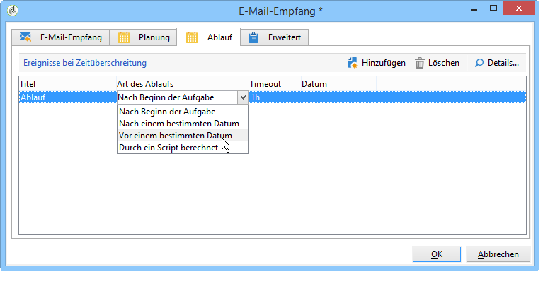

# E-Mail-Empfang{#inbound-emails}

Die Aktivität **E-Mail-Empfang** ermöglicht den Abruf und die Verarbeitung von E-Mails aus Mailboxen, die über POP3 abgefragt werden können.

Geben Sie im Tab **E-Mail-Empfang** die POP3-Parameter sowie das bei Empfang jeder Nachricht auszuführende Script an. Im zweiten Tab können Sie eine Planung für die Aktivität definieren und im dritten eine eventuelle Ablauffrist.

1. **[!UICONTROL E-Mail-Empfang]**

   * **[!UICONTROL Externes Konto verwenden]**

      Wenn diese Option aktiviert wird, können Sie direkt ein externes POP3-Konto auswählen, anstatt die Verbindungsparameter anzugeben. Im Feld **[!UICONTROL Externes Konto]** (nur sichtbar bei Aktivierung der Option) wird das zu verwendende POP3-Konto angezeigt, das die Verbindung zur Mailbox herstellt.

      Wenn die zuvor beschriebene Option nicht aktiviert wurde, sind folgende Parameter anzugeben:

      

      * **[!UICONTROL POP3-Server]**

         Name des POP3-Servers.

      * **[!UICONTROL POP3-Konto]**

         Name des Benutzers.

      * **[!UICONTROL Passwort]**

         Passwort des Benutzerkontos.

      * **[!UICONTROL Port]**

         Nummer des POP3-Verbindungsports. Standardmäßig ist dies der Port 110.
   * **[!UICONTROL Beenden, sobald eine E-Mail verarbeitet wurde]**

      Bei Auswahl dieser Option werden die E-Mails einzeln verarbeitet. Die Transition der Aktivität wird nur einmal aktiviert. Alle nicht verarbeiteten Nachrichten bleiben auf dem Server.

1. **[!UICONTROL Script]**

   Die Angabe eines Scripts ermöglicht die Verarbeitung der Nachricht und die Ausführung von verschiedenen Vorgängen, je nach Nachrichteninhalt. Das Script wird auf jede Nachricht angewendet und entscheidet, welcher Vorgang auszuführen ist (Nachricht in der Mailbox belassen oder löschen) und ob die ausgehende Transition zu aktivieren ist.

   Der Rückgabe-Code muss einem der folgenden Werte entsprechen:

   * 1 - Löscht die Nachricht auf dem Server und aktiviert die ausgehende Transition.
   * 2 - Lässt die Nachricht auf dem Server und aktiviert die ausgehende Transition.
   * 3 - Löscht die Nachricht auf dem Server.
   * 4 - Lässt die Nachricht auf dem Server.

   Auf den Inhalt der Nachricht kann über die allgemeine Variable **[!UICONTROL mailMessage]** zugegriffen werden.

1. **[!UICONTROL Planung]**

   Gehen Sie in den **[!UICONTROL Planung]**-Tab und kreuzen Sie die Option **[!UICONTROL Ausführung planen an]**. Klicken Sie anschließend auf die Schaltfläche **[!UICONTROL Ändern]**, um den Ausführungsrhythmus der Aktivität zu konfigurieren.

   Die Konfiguration erfolgt analog zum Planungsassistenten. Siehe [Planung](../../workflow/using/scheduler.md).

1. **[!UICONTROL Ablauf]**

   Im **[!UICONTROL Ablauf]**-Tab können Ablauffristen für die Aktivität definiert werden.

   

   Die Konfiguration erfolgt analog zum Planungsassistenten. Siehe [Timeouts](../../workflow/using/defining-approvals.md).

