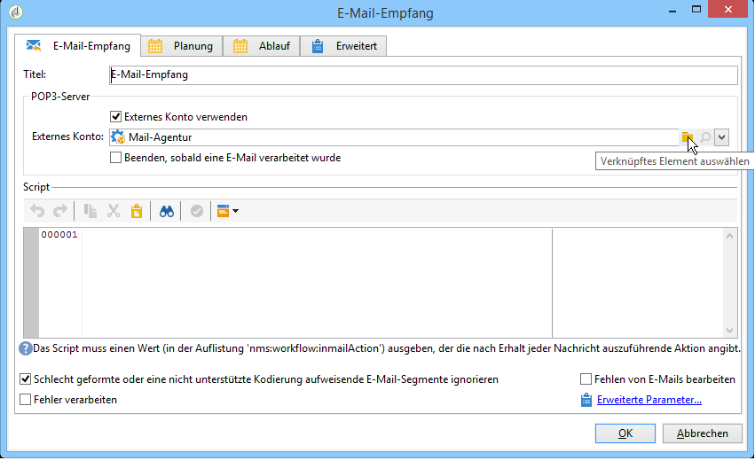
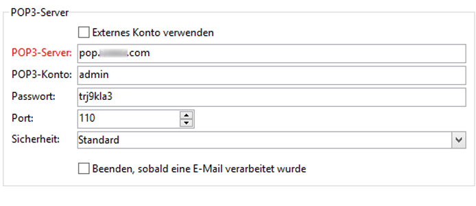

# E-Mail-Empfang{#inbound-emails}

Die Aktivität **E-Mail-Empfang** ermöglicht den Abruf und die Verarbeitung von E-Mails aus Mailboxen, die über POP3 abgefragt werden können.

Geben Sie im Tab **E-Mail-Empfang** die POP3-Parameter sowie das bei Empfang jeder Nachricht auszuführende Script an. Im zweiten Tab können Sie eine Planung für die Aktivität definieren und im dritten eine eventuelle Ablauffrist.

1. **[!UICONTROL Inbound Emails]**

   * **[!UICONTROL Use an external account]**

      Wenn diese Option aktiviert ist, können Sie ein externes POP3-Konto auswählen, anstatt die Verbindungsparameter einzugeben. Das **[!UICONTROL External account]** Feld gibt das externe POP3-Konto an, mit dem eine Verbindung zum E-Mail-Dienst hergestellt werden soll. Dieses Feld ist nur sichtbar, wenn die Option &quot;Externes Konto verwenden&quot;aktiviert ist.

      Wenn die zuvor beschriebene Option nicht aktiviert wurde, sind folgende Parameter anzugeben:

      

      * **[!UICONTROL POP3 server]**

         Name des POP3-Servers.

      * **[!UICONTROL POP3 account]**

         Name des Benutzers.

      * **[!UICONTROL Password]**

         Passwort des Benutzerkontos.

      * **[!UICONTROL Port]**

         Nummer des POP3-Verbindungsports. Standardmäßig ist dies der Port 110.
   * **[!UICONTROL Stop as soon as email is processed]**

      Bei Auswahl dieser Option werden die E-Mails einzeln verarbeitet. Die Transition der Aktivität wird nur einmal aktiviert. Alle nicht verarbeiteten Nachrichten bleiben auf dem Server.

1. **[!UICONTROL Script]**

   Die Angabe eines Scripts ermöglicht die Verarbeitung der Nachricht und die Ausführung von verschiedenen Vorgängen, je nach Nachrichteninhalt. Das Script wird auf jede Nachricht angewendet und entscheidet, welcher Vorgang auszuführen ist (Nachricht in der Mailbox belassen oder löschen) und ob die ausgehende Transition zu aktivieren ist.

   Der Rückgabe-Code muss einem der folgenden Werte entsprechen:

   * 1 - Löscht die Nachricht auf dem Server und aktiviert die ausgehende Transition.
   * 2 - Lässt die Nachricht auf dem Server und aktiviert die ausgehende Transition.
   * 3 - Löscht die Nachricht auf dem Server.
   * 4 - Lässt die Nachricht auf dem Server.
   Auf den Inhalt der Nachricht kann über die allgemeine Variable **[!UICONTROL mailMessage]** zugegriffen werden.

1. **[!UICONTROL Schedule]**

   Um einen Zeitplan für die Aktivität zu definieren, klicken Sie auf die **[!UICONTROL Scheduling]** Registerkarte und aktivieren Sie **[!UICONTROL Plan execution]**. Klicken Sie auf die **[!UICONTROL Change]** Schaltfläche, um den Zeitplan zu konfigurieren.

   Die Konfiguration des Zeitplans ist mit der der Planungsaktivität identisch. Siehe [Zeitplan](../../workflow/using/scheduler.md).

1. **[!UICONTROL Expiration]**

   You can define expiration delays via the **[!UICONTROL Expiration]** tab.

   

   Die Konfiguration ist mit der der Planungsaktivität identisch. Siehe [Ablauf](../../workflow/using/executing-a-workflow.md#expirations).

