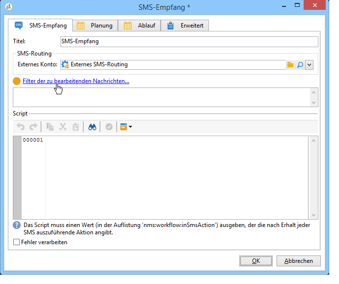
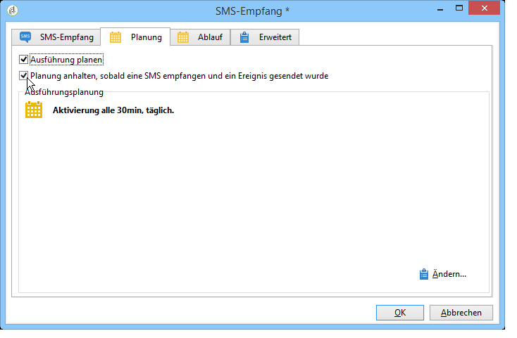

# SMS-Empfang{#inbound-sms}

Die Aktivität **SMS-Empfang** ermöglicht den Abruf und die Verarbeitung von SMS über ein externes Konto.

## Eigenschaften {#properties}

Geben Sie im Tab **SMS-Empfang** die SMS-Routing-Parameter sowie das bei Empfang jeder Nachricht auszuführende Script an. Im zweiten Tab können Sie eine Planung für die Aktivität definieren und im dritten bei Bedarf eine Ablauffrist.

1. **[!UICONTROL SMS-Routing]**: Wählen Sie das für den SMS-Empfang zu verwendende externe Konto aus. Externe Konten werden im Knoten **[!UICONTROL Administration > Platform >Externe Konten]** der Baumstruktur konfiguriert.
1. **[!UICONTROL Script]**
1. **[!UICONTROL Planung]**

   

1. **[!UICONTROL Ablauf]**

Die Tabs **[!UICONTROL Script]**, **[!UICONTROL Planung]** und **[!UICONTROL Ablauf]** werden im Abschnitt [Eingehende E-Mails](../../workflow/using/inbound-emails.md) erläutert.
