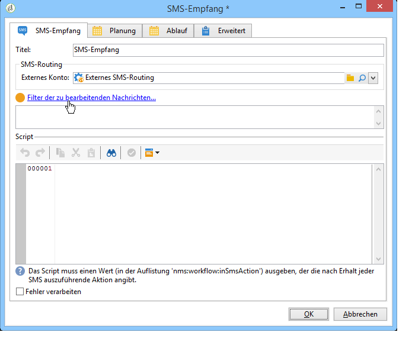
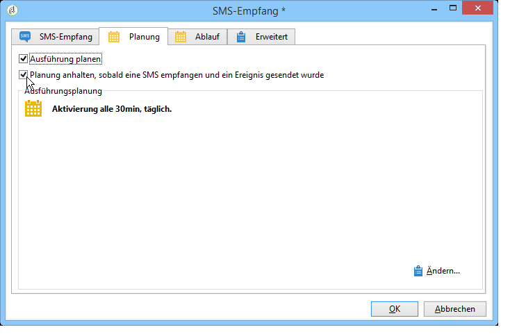

# SMS-Empfang {#inbound-sms}

Die Aktivität **SMS-Empfang** ermöglicht den Abruf und die Verarbeitung von SMS über ein externes Konto.

## Eigenschaften {#properties}

Auf der ersten Registerkarte der Aktivität **SMS-Empfang** können Sie die Routing-Parameter für SMS-Nachrichten sowie das für jede empfangene Nachricht auszuführende Skript eingeben. Auf der zweiten Registerkarte können Sie der Aktivität einen Zeitplan zuweisen und auf der dritten Registerkarte die Ablaufbedingungen der Aktivität definieren.

1. **[!UICONTROL SMS-Routing]**: Wählen Sie das für den SMS-Empfang zu verwendende externe Konto aus. Externe Konten werden im Knoten **[!UICONTROL Administration > Platform >Externe Konten]** der Baumstruktur konfiguriert.
1. **[!UICONTROL Script]**
1. **[!UICONTROL Planung]**

   

1. **[!UICONTROL Ablauf]**

Die Tabs **[!UICONTROL Script]**, **[!UICONTROL Planung]** und **[!UICONTROL Ablauf]** werden im Abschnitt [Eingehende E-Mails](inbound-emails.md) erläutert.
