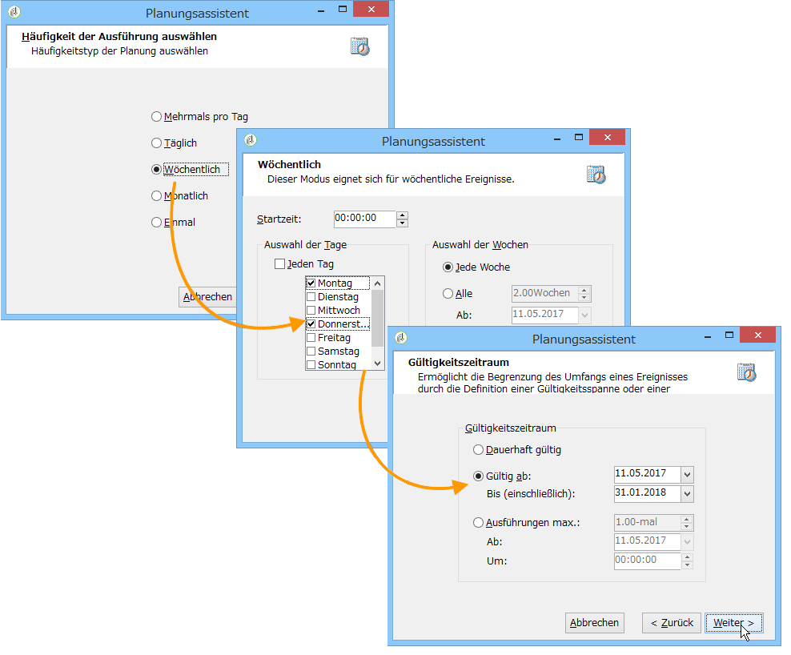
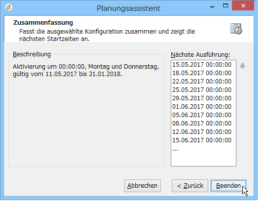
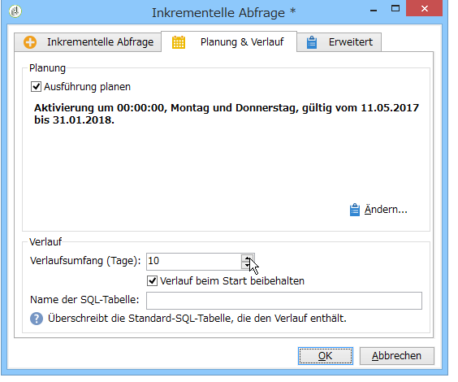

# Inkrementelle Abfrage{#incremental-query}

Inkrementelle Abfragen ermöglichen die regelmäßig wiederkehrende Auswahl einer Zielgruppe nach bestimmten Kriterien unter Ausschluss der Population, die in früheren Durchgängen bereits aufgrund dieser Kriterien ausgewählt wurde.

Die zuvor ausgewählten Populationen werden nach Workflow-Instanz und nach Aktivität gespeichert. Dies bedeutet, dass zwei gestartete Workflows, die auf derselben Vorlage basieren, nicht den gleichen Verlauf aufweisen. Zwei auf derselben inkrementellen Abfrage basierende Aufgaben innerhalb einer Workflow-Instanz hingegen teilen sich ein und denselben Verlauf.

Die Konfiguration der Abfrage entspricht der von Standardabfragen, aber die Ausführung wird geplant.

**Verwandte Themen:**

* [Anwendungsfall: Vierteljährliches Listen-Update unter Verwendung einer inkrementellen Abfrage](../../workflow/using/quarterly-list-update.md)
* [Abfragen erstellen](../../workflow/using/query.md#creating-a-query)

>[!CAUTION]
>
>Wenn das Ergebnis der inkrementellen Abfrage bei einer ihrer Ausführungen gleich **0** ist, wird der Workflow bis zur nächsten geplanten Ausführung der Abfrage ausgesetzt. Die auf die inkrementelle Abfrage folgenden Transitionen und Aktivitäten werden somit nicht vor der nächsten Ausführung aktiviert.

Gehen Sie dazu wie folgt vor:

1. Kreuzen Sie im Tab **[!UICONTROL Planung &amp; Verlauf]** die Option **[!UICONTROL Ausführung planen]** an. Nach Erstellung bleibt die Aufgabe aktiv, aber sie startet nur zu den in der Planung angegebenen Zeitpunkten, um die Abfrage auszuführen. Wenn die Option deaktiviert wurde, wird die Abfrage **einmalig und sofort** ausgeführt.
1. Klicken Sie auf die Schaltfläche **[!UICONTROL Ändern...]**.

   Im sich öffnenden **[!UICONTROL Planungsassistent]**-Fenster können Sie den Ausführungsrhythmus und den Gültigkeitszeitraum definieren.

   

1. Klicken Sie zur Bestätigung Ihrer Eingaben auf **[!UICONTROL Beenden]**.

   

1. Im unteren Bereich des Tabs **[!UICONTROL Planung &amp; Verlauf]** können Sie nähere Angaben zum Verlauf machen.

   

   * **[!UICONTROL Verlaufsumfang (Tage)]**

      Bereits berücksichtigte Empfänger bleiben die angegebene Anzahl an Tagen im Verlauf. Bei Angabe von &quot;0&quot; werden Empfänger nie aus dem Verlauf gelöscht.

   * **[!UICONTROL Verlauf beim Start beibehalten]**

      Bei Auswahl dieser Option wird der Verlauf bei der Aktivierung der Aktivität nicht gelöscht.

   * **[!UICONTROL Name der SQL-Tabelle]**

      Mithilfe dieses Felds kann die Standard-SQL-Tabelle, die den Verlauf enthält, überschrieben werden.

## Ausgabeparameter {#output-parameters}

* tableName
* schema
* recCount

Anhand der drei Werte lässt sich die durch den Ausschluss ermittelte Zielgruppe identifizieren. **[!UICONTROL tableName]** ist der Name der Tabelle, welche die Kennungen der Zielgruppenempfänger enthält, **[!UICONTROL schema]** ist das Schema der Population, (i. d. R. nms:recipient) und **[!UICONTROL recCount]** ist die Anzahl an Elementen in der Tabelle.
