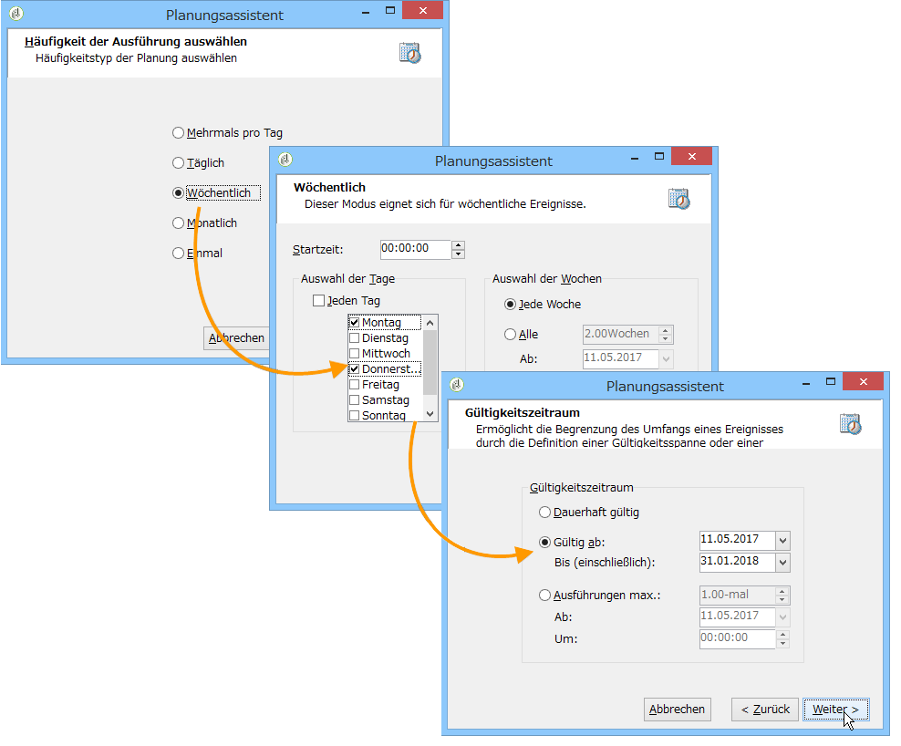
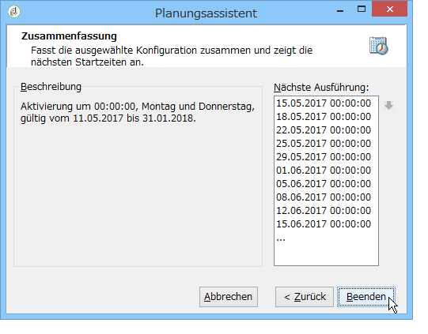
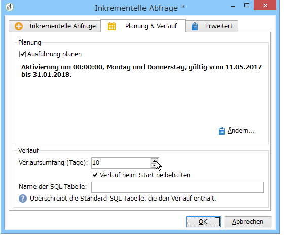

# Inkrementelle Abfrage{#incremental-query}

Inkrementelle Abfragen ermöglichen die regelmäßig wiederkehrende Auswahl einer Zielgruppe nach bestimmten Kriterien unter Ausschluss der Population, die in früheren Durchgängen bereits aufgrund dieser Kriterien ausgewählt wurde.

Die zuvor ausgewählte Population wird nach Workflow-Instanz und nach Aktivität gespeichert. Dies bedeutet, dass zwei von derselben Vorlage gestartete Workflows nicht dasselbe Protokoll verwenden. Zwei Aufgaben, die auf derselben inkrementellen Abfrage im selben Workflow basieren, verwenden jedoch dasselbe Protokoll.

Die Konfiguration der Abfrage entspricht der von Standardabfragen, aber die Ausführung wird geplant.

**Verwandte Themen:**

* [Anwendungsfall: Vierteljährliches Listen-Update mithilfe einer inkrementellen Abfrage](quarterly-list-update.md)
* [Abfragen erstellen](query.md#creating-a-query)

>[!CAUTION]
>
>Wenn das Ergebnis einer inkrementellen Abfrage bei einer ihrer Ausführungen gleich **0** ist, wird der Workflow bis zur nächsten planmäßigen Ausführung der Abfrage ausgesetzt. Die auf die inkrementelle Abfrage folgenden Transitionen und Aktivitäten werden nicht vor der nachfolgenden Ausführung verarbeitet.

Gehen Sie dazu wie folgt vor:

1. Wählen Sie in der Registerkarte **[!UICONTROL Planung und Verlauf]** die Option **[!UICONTROL Ausführung planen]**. Nach Erstellung bleibt die Aufgabe aktiv, aber sie startet nur zu den in der Planung angegebenen Zeitpunkten, um die Abfrage auszuführen. Wenn die Option deaktiviert wurde, wird die Abfrage **einmalig und sofort** ausgeführt.
1. Klicken Sie auf die Schaltfläche **[!UICONTROL Ändern...]**.

   Im sich Fenster **[!UICONTROL Planungsassistent]** können Sie den Ausführungsrhythmus, das Intervall und den Gültigkeitszeitraum des Ereignisses definieren.

   

1. Klicken Sie zur Bestätigung Ihrer Eingaben auf **[!UICONTROL Beenden]**.

   

1. Im unteren Bereich des Tabs **[!UICONTROL Planung &amp; Verlauf]** können Sie nähere Angaben zum Verlauf machen.

   

   * **[!UICONTROL Verlaufsumfang (Tage)]**

     Die bereits angesprochenen Empfangenden können ab dem Tag, an dem sie angesprochen wurden, bis zu einer Höchstzahl von Tagen protokolliert werden. Wenn dieser Wert null ist, werden die Empfangenden nie aus dem Protokoll gelöscht.

   * **[!UICONTROL Verlauf beim Start beibehalten]**

     Bei Auswahl dieser Option wird der Verlauf bei der Aktivierung der Aktivität nicht gelöscht.

   * **[!UICONTROL Name der SQL-Tabelle]**

     Mithilfe dieses Felds kann die Standard-SQL-Tabelle, die den Verlauf enthält, überschrieben werden.

## Ausgabeparameter {#output-parameters}

* tableName
* schema
* recCount

Anhand der drei Werte lässt sich die durch die Abfrage ermittelte Population identifizieren. **[!UICONTROL tableName]** ist der Name der Tabelle, die die Zielgruppen-IDs enthält, **[!UICONTROL schema]** ist das Schema der Population, (i. d. R. nms:recipient) und **[!UICONTROL recCount]** ist die Anzahl der Elemente in der Tabelle.
