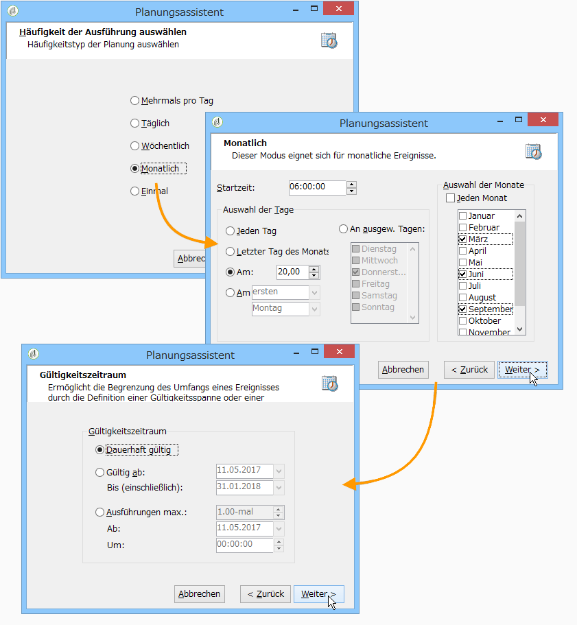

# Inkrementelle Abfrage{#incremental-query}

Inkrementelle Abfragen ermöglichen die regelmäßig wiederkehrende Auswahl einer Zielgruppe nach bestimmten Kriterien unter Ausschluss der Population, die in früheren Durchgängen bereits aufgrund dieser Kriterien ausgewählt wurde.

Die zuvor ausgewählten Populationen werden nach Workflow-Instanz und nach Aktivität gespeichert. Dies bedeutet, dass zwei gestartete Workflows, die auf derselben Vorlage basieren, nicht den gleichen Verlauf aufweisen. Zwei auf derselben inkrementellen Abfrage basierende Aufgaben innerhalb einer Workflow-Instanz hingegen teilen sich ein und denselben Verlauf.

Die Konfiguration der Abfrage entspricht der von Standardabfragen (siehe [Abfragen erstellen ](../../workflow/using/query.md#creating-a-query)), aber ihre Ausführung wird geplant.

>[!CAUTION]
>
>Wenn das Ergebnis der inkrementellen Abfrage bei einer ihrer Ausführungen gleich **0** ist, wird der Workflow bis zur nächsten geplanten Ausführung der Abfrage ausgesetzt. Die auf die inkrementelle Abfrage folgenden Transitionen und Aktivitäten werden somit nicht vor der nächsten Ausführung aktiviert.

Gehen Sie dazu wie folgt vor:

1. Kreuzen Sie im Tab **[!UICONTROL Planung &amp; Verlauf]** die Option **[!UICONTROL Ausführung planen]** an. Nach Erstellung bleibt die Aufgabe aktiv, aber sie startet nur zu den in der Planung angegebenen Zeitpunkten, um die Abfrage auszuführen. Wenn die Option deaktiviert wurde, wird die Abfrage **einmalig und sofort** ausgeführt.
1. Klicken Sie auf die Schaltfläche **[!UICONTROL Ändern...]**.

   Im sich öffnenden **[!UICONTROL Planungsassistent]**-Fenster können Sie den Ausführungsrhythmus und den Gültigkeitszeitraum definieren.

   

1. Klicken Sie zur Bestätigung Ihrer Eingaben auf **[!UICONTROL Beenden]**.

   

1. Im unteren Bereich des Tabs **[!UICONTROL Planung &amp; Verlauf]** können Sie nähere Angaben zum Verlauf machen.

   

   * **[!UICONTROL Verlaufsumfang (Tage)]**

      Bereits berücksichtigte Empfänger bleiben die angegebene Anzahl an Tagen im Verlauf. Bei Angabe von &quot;0&quot; werden Empfänger nie aus dem Verlauf gelöscht.

   * **[!UICONTROL Verlauf beim Start beibehalten]**

      Bei Auswahl dieser Option wird der Verlauf bei der Aktivierung der Aktivität nicht gelöscht.

   * **[!UICONTROL Name der SQL-Tabelle]**

      Mithilfe dieses Felds kann die Standard-SQL-Tabelle, die den Verlauf enthält, überschrieben werden.

## Anwendungsbeispiel: Quartalsmäßige Listenaktualisierung {#example-of-an-incremental-query--quarterly-list-update}

Im folgenden Beispiel wird eine inkrementelle Abfrage verwendet, um automatisch eine Empfängerliste zu aktualisieren. Diese wird regelmäßig im Rahmen saisonaler Marketingkampagnen verwendet.

Jeweils zu Beginn einer neuen Saison werden geeignete sportliche Aktivitäten beworben. Dies bedeutet, dass die Listen einmal pro Quartal aktualisiert werden. Die Empfänger sollen jedoch im Rahmen dieser Kampagne nur einmal alle neun Monate angesprochen werden. Auf diese Weise wird eine eventuelle Werbemüdigkeit durch den Empfänger vermieden und sichergestellt, dass er im Laufe der Zeit Angebote für verschiedene Jahreszeiten erhält.

1. Erstellen Sie einen neuen Workflow und positionieren Sie eine inkrementelle Abfrage mit anschließendem Listen-Update im Diagramm.
1. Konfigurieren Sie in der Aktivität den Tab **[!UICONTROL Inkrementelle Abfrage]** (wie im Abschnitt ](../../workflow/using/query.md#creating-a-query)Abfragen erstellen[ beschrieben).
1. Gehen Sie in den Tab **[!UICONTROL Planung &amp; Verlauf]** und geben Sie einen Verlaufsumfang von 270 Tagen an. Ein bereits angesprochener Empfänger wird innerhalb der nächsten 270 Tage, also ungefähr 9 Monate, nicht mehr im Rahmen dieser Kampagne kontaktiert.

   Klicken Sie dann auf die Schaltfläche **[!UICONTROL Ändern...]**.

1. Da die Liste jeweils zu Saisonbeginn aktualisiert werden soll, muss als Häufigkeit **[!UICONTROL Monatlich]** ausgewählt werden.
1. Wählen Sie im nächsten Bildschirm die Monate März, Juni, September und Dezember aus. Geben Sie als Tag den 20. des Monats an und die Uhrzeit, an der der Workflow gestartet werden soll.
1. Geben Sie abschließend den Gültigkeitszeitraum der Abfrage an. Im vorliegenden Beispiel wurde **[!UICONTROL Dauerhaft gültig]** ausgewählt.

   

1. Konfigurieren Sie nun die Aktivität Listen-Update (wie im Abschnitt ](../../workflow/using/list-update.md)Listen-Update[ beschrieben).

Der Workflow startet automatisch zu jedem Saisonbeginn und die Liste wird jeweils mit den neuen Angebotsempfängern aktualisiert.

## Ausgabeparameter {#output-parameters}

* tableName
* schema
* recCount

Anhand der drei Werte lässt sich die durch den Ausschluss ermittelte Zielgruppe identifizieren. **[!UICONTROL tableName]** ist der Name der Tabelle, welche die Kennungen der Zielgruppenempfänger enthält, **[!UICONTROL schema]** ist das Schema der Population, (i. d. R. nms:recipient) und **[!UICONTROL recCount]** ist die Anzahl an Elementen in der Tabelle.
