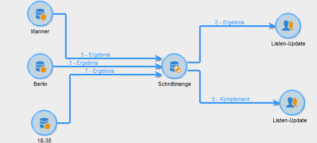

# Schnittmenge{#intersection}

Die Aktivität **Schnittmenge** erzeugt ausgehend von den eingehenden Aktivitäten eine neue Population.

Dabei werden nur die in jeder der eingehenden Aktivitäten enthaltenen Populationen extrahiert. Die Zielgruppe wird aus allen eingehenden Ergebnissen erstellt, dies bedeutet, dass die vorgeschalteten Aktivitäten beendet sein müssen, bevor die Schnittmenge ausgeführt werden kann. Konfigurieren Sie die Aktivität, indem Sie einen Titel vergeben und die Optionen bezüglich des Ergebnisses auswählen.

Weitere Informationen zum Konfigurieren und Verwenden der Schnittstellenaktivität finden Sie unter Gemeinsame Daten [extrahieren (Schnittmenge)](../../workflow/using/targeting-data.md#extracting-joint-data--intersection-).

Markieren Sie die **[!UICONTROL Generate complement]** Option, wenn Sie die verbleibende Population verarbeiten möchten. Die Ergänzung enthält die Zusammenstellung der Ergebnisse aller eingehenden Aktivitäten abzüglich der Schnittmenge. Anschließend wird der Aktivität ein zusätzlicher Auslandsübergang wie folgt hinzugefügt:

## Anwendungsbeispiel {#intersection-example}

Im vorliegenden Beispiel werden drei Abfragen erstellt. Gesucht werden die in jeder der drei Populationen enthaltenen Empfänger. Diese sollen in einer Liste gespeichert werden. Gehen Sie wie folgt vor:

1. After three simple queries, insert an **[!UICONTROL Intersection]** -type activity.

   Im vorliegenden Beispiel ruft die erste Abfrage alle männlichen Empfänger ab, die zweite alle Empfänger, die in Berlin leben, die dritte alle Empfänger zwischen 18 und 30 Jahre.

1. Konfigurieren Sie die Schnittmenge. To do this, select the **[!UICONTROL Keys only]** reconciliation method since the populations resulting from the queries contain consistent data.
1. Falls Sie in den Abfragen Zusatzdaten verwenden, können Sie sich dafür entscheiden, nur gemeinsame Daten beizubehalten, indem Sie die entsprechende Option ankreuzen.
1. If you wish to use the rest of the data (in regard to the queries but not their intersection), check the **[!UICONTROL Generate complement]** box.
1. Schließen Sie an die Schnittmengenaktivität und gegebenenfalls auch an das Komplement jeweils ein Listen-Update an.
1. Starten Sie den Workflow. Im vorliegenden Beispiel sind zwei Empfänger in allen drei eingehenden Abfragen enthalten. Das Komplement enthält die fünf Empfänger, die nur in einer oder zwei der drei Abfragen vorkommen.

   Das Ergebnis der Schnittmenge wird an die erste Listen-Update-Aktivität übermittelt. Das Ergebnis des Komplements wird an die zweite Listen-Update-Aktivität gesandt.

   

## Eingabeparameter {#input-parameters}

* tableName
* schema

Jedes eingehende Ereignis muss eine durch diese Parameter definierte Zielgruppe angeben.

## Ausgabeparameter {#output-parameters}

* tableName
* schema
* recCount

Dieser Satz von drei Werten identifiziert das Ziel, das sich aus der Schnittmenge ergibt. **[!UICONTROL tableName]** ist der Name der Tabelle, die die Zielkennungen aufzeichnet, das Schema der Population (normalerweise **[!UICONTROL schema]****[!UICONTROL nms:recipient]** **[!UICONTROL recCount]** ) und die Anzahl der Elemente in der Tabelle.
