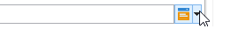
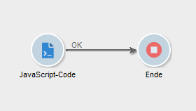
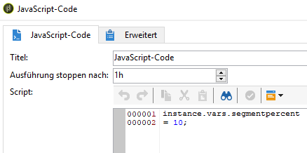
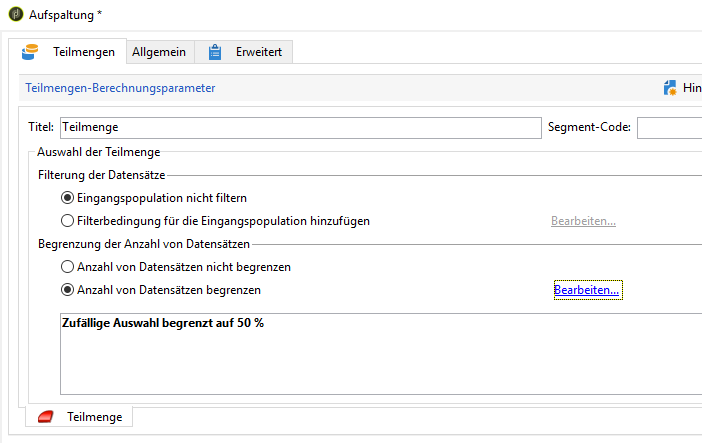
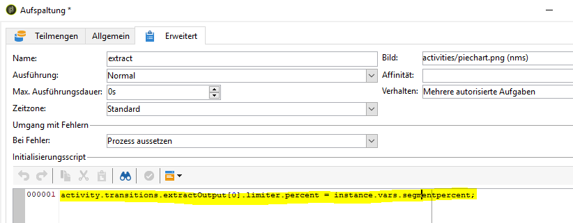
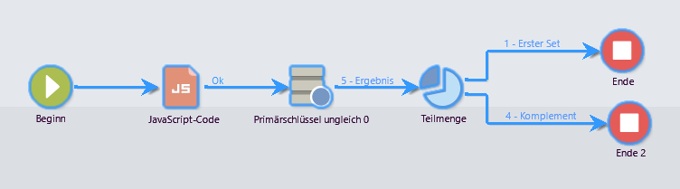
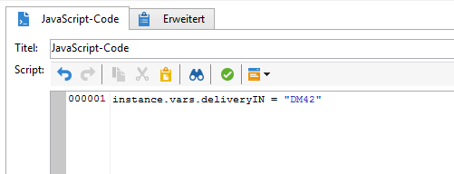
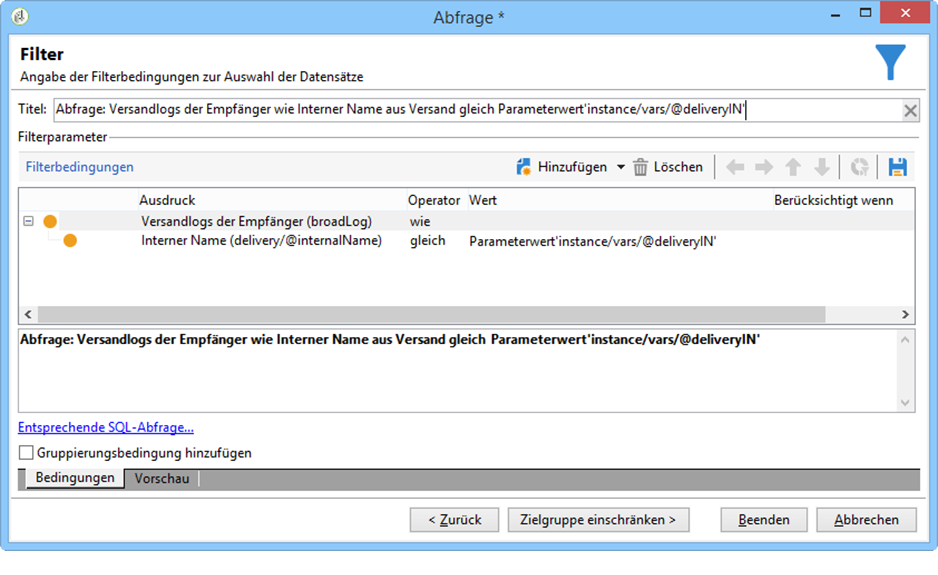

# Scripts/JavaScript-Templates{#javascript-scripts-and-templates}

Scripts dienen zur Berechnung von Werten, dem Austausch von Daten zwischen verschiedenen Aufgaben des Prozesses und der Ausführung von spezifischen Aktionen mithilfe von SOAP-Calls.

In einem Workflow-Diagramm sind Scripts allgegenwärtig:

* Jede Aktivität verfügt über ein Initialisierungscript. Dieses wird bei Aktivierung der Aktivität ausgeführt. Es initialisiert die Variablen oder ändert die Eigenschaften der Aktivität.
* Die &#39;JavaScript-Code&#39;-Aktivität dient einzig der Ausführung eines Scripts.
* Die &#39;Test&#39;-Aktivität evaluiert JavaScript-Ausdrücke, um die richtige Transition zu aktivieren.
* Die meisten Textfelder sind JavaScript-Templates: Sie können zwischen &lt;%= und %> JavaScript-Ausdrücke enthalten. Darüber hinaus besteht Zugriff auf eine Dropdown-Liste, die die Erstellung der Ausdrücke erleichtert.

   

## Script-Objekte {#objects-exposed}

Jedes im Rahmen des Workflows ausgeführte JavaScript greift auf eine Reihe von globalen Objekten zu.

* **instance**: Stellt den Workflow dar, der ausgeführt wird. Das Schema dieses Objekts ist **xtk:workflow**.
* **Aufgabe**: Stellt die ausgeführten Aufgaben dar. Das Schema dieses Objekts ist **xtk:workflowTask**.
* **Ereignis**: Stellt die Ereignisse dar, die die ausgeführte Aufgabe aktiviert haben. Das Schema dieses Objekts ist **xtk:workflowEvent**. Dieses Objekt wird nicht für Aktivitäten vom Typ **AND-join** initialisiert, die von mehreren Übergängen aktiviert wurden.
* **Ereignisse**: Stellt die Liste der Ereignisse dar, die die aktuelle Aufgabe aktiviert haben. Das Schema dieses Objekts ist **xtk:workflowEvent**. Diese Tabelle enthält in der Regel ein Element, kann jedoch mehrere für **AND-join** -Aktivitäten enthalten, die aufgrund mehrerer Übergänge aktiviert wurden.
* **Aktivität**: Stellt das Modell der ausgeführten Aufgabe dar. Das Schema dieses Objekts hängt vom Aktivitätstyp ab. Dieses Objekt kann vom Initialisierungsskript geändert werden, in anderen Skripten, Änderungen mit unbestimmbaren Auswirkungen.

Die verfügbaren Eigenschaften dieser Objekte sind über die Dropdown-Liste rechts in der Symbolleiste des Scripts abrufbar.

>[!CAUTION]
>
>Die Objekteigenschaften sind schreibgeschützt mit Ausnahme der Unter-Eigenschaften der vars-Eigenschaft.
>  
>Die meisten Eigenschaften werden erst nach Ausführung einer elementaren Aufgabe oder zum Zeitpunkt der Instanzpassivierung aktualisiert. Daher entsprechen die abgerufenen Werte nicht unbedingt dem aktuellen, sondern in der Regel dem vorangegangenen Status.

**Beispiel**

Für das vorliegende Beispiel und die folgenden wird wie unten dargestellt ein Workflow mit einer **JavaScript-Code**-Aktivität und einem **Ende** benötigt.



Öffnen Sie die **JavaScript-Code**-Aktivität und fügen Sie das folgende Script ein:

```
logInfo("Label: " + instance.label)
logInfo("Start date: " + task.creationDate)
```

The **[!UICONTROL logInfo(message)]** function inserts a message into the log.

Klicken Sie auf **[!UICONTROL OK]** , um den Erstellungsassistenten zu schließen, und starten Sie dann den Workflow mit den Aktionsschaltflächen oben rechts in der Liste der Arbeitsabläufe. Am Ende der Ausführung konsultieren Sie das Protokoll. Es sollten zwei Meldungen entsprechend dem Skript angezeigt werden: Eine zeigt die Beschriftung des Workflows an, die andere das Datum, an dem das Skript aktiviert wurde.

## Variablen {#variables}

Bei den Variablen handelt es sich um die freien Eigenschaften der Objekte **[!UICONTROL instance]**, **[!UICONTROL task]** und **[!UICONTROL event]** . Die für diese Variablen autorisierten JavaScript-Typen sind **[!UICONTROL string]**, **[!UICONTROL number]** und **[!UICONTROL Date]**.

### Instanzvariablen {#instance-variables}

Instanzvariablen (**[!UICONTROL instance.vars.xxx]**) sind mit allgemeinen Variablen vergleichbar, sie sind aktivitätenübergreifend gültig.

### Aufgabenvariablen {#task-variables}

Die Aufgabenvariablen (**[!UICONTROL task.vars.xxx]**) sind mit den lokalen Variablen vergleichbar: Sie werden nur von der aktuellen Aufgabe verwendet. Diese Variablen werden von persistenten Aktivitäten zur Datenspeicherung verwendet und werden manchmal zum Datenaustausch zwischen den verschiedenen Skripten derselben Aktivität verwendet.

### Ereignisvariablen {#event-variables}

Die Ereignisvariablen (**[!UICONTROL vars.xxx]**) ermöglichen den Datenaustausch zwischen den elementaren Aufgaben eines Workflow-Prozesses. Diese Variablen werden von der Aufgabe übergeben, die die laufende Aufgabe aktiviert hat. Es ist möglich, sie zu ändern und neue zu definieren. Sie werden dann an die folgenden Aktivitäten weitergeleitet.

Bei Verwendung einer **UND-Verknüpfung** fusionieren die Variablen. Wenn eine Variable mehrmals definiert wurde entsteht ein Konflikt und es wird ein unbestimmter Wert ausgegeben.

Diese Variablen werden am häufigsten verwendet und sind Instanzvariablen vorzuziehen.

Bestimmte Ereignisvariablen werden von den verschiedenen Aktivitäten geändert oder gelesen. Dies sind alle Zeichenfolgenvariablen. Beispiel: Ein Export setzt die **[!UICONTROL vars.filename]** Variable mit dem vollständigen Namen der Datei, die gerade exportiert wurde. Alle diese gelesenen oder geänderten Variablen werden in [Info-Aktivitäten](../../workflow/using/about-activities.md)in den Abschnitten **Eingabeparameter** und **Ausgabeparameter** der Aktivitäten dokumentiert.

### Beispiele {#example}

**Beispiel 1**

In diesem Beispiel wird eine Instanzvariable verwendet, um den auf eine Population anzuwendenden geteilten Prozentsatz dynamisch zu berechnen.

1. Erstellen Sie einen Workflow und fügen Sie eine Startaktivität hinzu.

1. Fügen Sie eine JavaScript-Codeaktivität hinzu und konfigurieren Sie sie, um eine Instanzvariable zu definieren.

   Beispiel: `instance.vars.segmentpercent = 10;`

   

1. Fügen Sie eine Abfrageaktivität hinzu und richten Sie die Empfänger entsprechend Ihren Anforderungen an.

1. Fügen Sie eine Teilungsaktivität hinzu und konfigurieren Sie sie, um eine zufällige Stichprobe der eingehenden Population durchzuführen. Der Stichprobenprozentsatz kann beliebig sein. In diesem Beispiel ist er auf 50 % festgelegt.

   Dieser Prozentsatz wird dank der zuvor definierten Instanzvariablen dynamisch aktualisiert.

   

1. Definieren Sie im Abschnitt Initialisierungsskript auf der Registerkarte Erweitert der Teilungsaktivität eine JS-Bedingung. Die JS-Bedingung wählt den zufälligen Stichprobenprozentsatz des ersten Übergangs aus der Split-Aktivität aus und aktualisiert ihn auf einen Wert, der von der zuvor erstellten Instanzvariablen festgelegt wurde.

   ```activity.transitions.extractOutput[0].limiter.percent = instance.vars.segmentpercent;```

   

1. Stellen Sie sicher, dass die Ergänzung in einem separaten Übergang der Teilungsaktivität generiert wird, und fügen Sie nach jedem der ausgehenden Übergänge End-Aktivitäten hinzu.

1. Speichern und starten Sie den Workflow. Das dynamische Sampling wird entsprechend der Instanzvariablen angewendet.

   

**Beispiel 2**

1. Ausgehend vom Workflow des vorangehenden Beispiels wird das Script der **JavaScript-Code**-Aktivität durch folgendes Script ersetzt:

   ```
   instance.vars.foo = "bar1"
   vars.foo = "bar2"
   task.vars.foo = "bar3"
   ```

1. Ergänzen Sie dann das Initialisierungsscript der **Ende**-Aktivität um folgendes Script:

   ```
   logInfo("instance.vars.foo = " + instance.vars.foo)
   logInfo("vars.foo = " + vars.foo)
   logInfo("task.vars.foo = " + task.vars.foo)
   ```

1. Starten Sie den Workflow und rufen Sie das Protokoll auf:

   ```
   Workflow finished
   task.vars.foo = undefined
   vars.foo = bar2
   instance.vars.foo = bar1
   Starting workflow (operator 'admin')
   ```

Das Beispiel zeigt, dass die Aktivität **JavaScript-Code** auf die Instanz- und Ereignisvariablen zugreift, während die Aufgabenvariablen ausserhalb der Aufgaben nicht verfügbar sind (&#39;undefined&#39;).

### Instanzvariablen in Abfragen aufrufen {#calling-an-instance-variable-in-a-query}

In Aktivitäten definierte Instanzvariablen können in Workflow-Abfragen wiederverwendet werden.

Geben Sie beispielsweise zum Abruf der Variablen **instance.vars.xxx = &quot;yyy&quot;** folgende Filterbedingung an: **$(instance/vars/xxx)**.

Beispiel:

1. Create an instance variable that defines a delivery&#39;s internal name via the **[!UICONTROL JavaScript code]**: **instance.vars.deliveryIN = &quot;DM42&quot;**.

   

1. Erstellen Sie eine Abfrage mit den Empfängern als Zielgruppen- und als Filterdimension. Geben Sie in den Bedingungen an, alle Empfänger zu suchen, an die der von der Variablen bezeichnete Versand gerichtet war.

   Hinweis: Diese Informationen werden in den Versandlogs gespeichert.

   To reference the instance variable in the **[!UICONTROL Value]** column, enter **$(instance/vars/@deliveryIN)**.

   Der Workflow gibt die Empfänger aus, die den Versand DM42 erhalten haben.

   

## Erweiterte Funktionen {#advanced-functions}

Neben den Standard-JavaScript-Funkionen stehen spezifische Funktionen zur Verfügung, um Dateien zu bearbeiten, Daten der Datenbank zu lesen oder zu ändern oder Nachrichten in das Protokoll einzutragen.

### Protokoll {#journal}

**[!UICONTROL logInfo(message)]** wurde bereits weiter oben erläutert. Diese Funktion fügt einen Eintrag zum Protokoll hinzu.

**[!UICONTROL logError(message)]** fügt eine Fehlernachricht zum Protokoll hinzu. Die Ausführung des Scripts wird unterbrochen und der Workflow wechselt in den Fehlerstatus (standardmäßig wird die Instanz ausgesetzt).

## Initialisierungsscript {#initialization-script}

Eine Aktivitätseigenschaft kann unter bestimmten Bedingungen zum Zeitpunkt der Ausführung geändert werden.

Die Mehrzahl der Aktivitätseigenschaften kann dynamisch berechnet werden, entweder unter Verwendung eines JavaScript-Templates oder weil die Workflow-Eigenschaften die Berechnung des Werts durch ein Script explizit erlauben.

Bei anderen Eigenschaften müssen Sie jedoch das Initialisierungsskript verwenden. Dieses Skript wird ausgewertet, bevor die Aufgabe ausgeführt wird. Die **[!UICONTROL activity]** Variable verweist auf die Aktivität, die der Aufgabe entspricht. Die Eigenschaften dieser Aktivität können geändert werden und betreffen nur diese Aufgabe.
