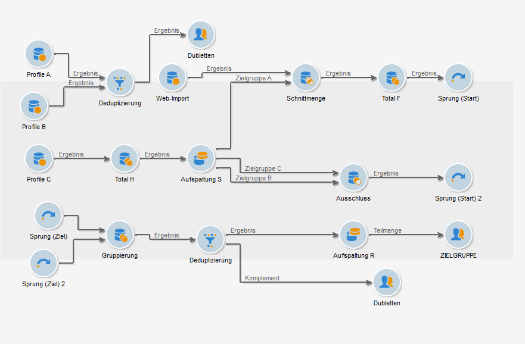
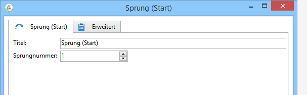

# Sprung (Start und Ziel){#jump-start-point-and-end-point}

**[!UICONTROL Sprung]**-Aktivitäten dienen der besseren Übersichtlichkeit von komplexen Workflow-Diagrammen, insbesondere bei sich überschneidenden Transitionen.

Sprünge sind Transitionen ohne Pfeile.

Sie springen von einer Aktivität zur nächsten, wie im folgenden Beispiel gezeigt wird:

Für jeden Sprung (Start) muss ein Sprung (Ziel) im Diagramm positioniert werden.

Sie können mehrere Sprünge zum Start- und Endpunkt in denselben Workflow einfügen. Diese werden durch eine Zahl identifiziert, die in den Parametern eingegeben werden muss:

Für eine bessere Lesbarkeit des Diagramms können Sie das den Sprüngen zugeordnete Symbol durch die entsprechende Ziffer ersetzen. Siehe [Ändern der Bilder für Aktivitäten](managing-activity-images.md).
