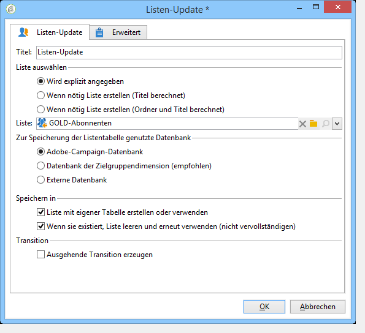
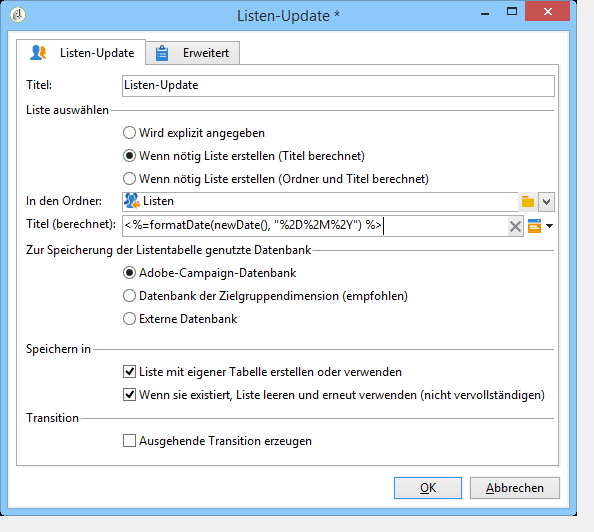
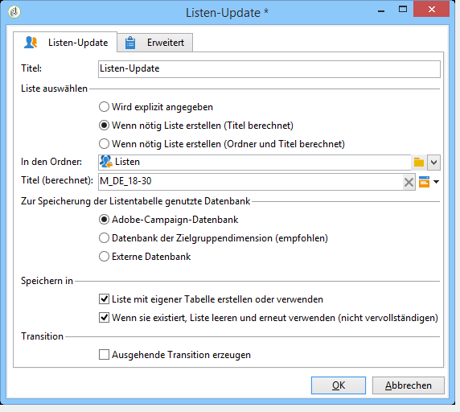

# Listen-Update{#list-update}

Das **Listen-Update** speichert die Ergebnisse der eingehenden Aktivitäten in einer Liste.

Die Liste kann bereits existieren.

Es kann auch mit den **[!UICONTROL Create the list if necessary (Computed name)]** Optionen und **[!UICONTROL Create the list if necessary (Computed Folder and Name)]** Optionen erstellt werden. Mit diesen Optionen können Sie die Bezeichnung Ihrer Wahl auswählen, um eine Liste zu erstellen, und später den Ordner, in dem sie gespeichert wird. Die Beschriftung kann auch automatisch durch Einfügen dynamischer Felder oder eines Skripts erstellt werden. Die verschiedenen dynamischen Felder sind im Popupmenü rechts neben der Beschriftung verfügbar.

Wenn die Liste bereits vorhanden ist, werden Empfänger dem vorhandenen Inhalt hinzugefügt, es sei denn, Sie aktivieren die **[!UICONTROL Purge the list if it exists (otherwise add to the list)]** Option. In diesem Fall wird der Inhalt der Liste vor der Aktualisierung gelöscht.

Wenn die erstellte oder aktualisierte Liste eine andere Tabelle als die Empfängertabelle verwenden soll, aktivieren Sie die **[!UICONTROL Create or use a list with its own table]** Option.

In diesem Fall müssen die entsprechenden Tabellen zuvor in der Adobe-Campaign-Instanz konfiguriert werden.

Im Allgemeinen markiert das Speichern eines Ziels in einer Liste das Ende eines Workflows. Standardmäßig hat die **[!UICONTROL List update]** Aktivität daher keinen ausgehenden Übergang. Markieren Sie die **[!UICONTROL Generate an outbound transition]** Option, um eine hinzuzufügen.

## Anwendungsbeispiel Listen-Update {#example--list-update}

Im vorliegenden Beispiel soll eine Liste mit allen Männern über 30 Jahre, die in Deutschland leben, erstellt werden. Bei der ersten Durchführung des Workflows wird die Liste erstellt, bei allen späteren Durchführungen wird sie aktualisiert. Die Liste kann beispielsweise im Rahmen von speziell abgestimmten Werbekampagnen Verwendung finden.

1. Add a **[!UICONTROL list update activity]** directly after a query then open it up to edit it.

   For more on creating a query in a workflow, refer to [Query](../../workflow/using/query.md).

1. Benennen Sie die Aktivität.
1. Select the **[!UICONTROL Create the list if necessary (Calculated name)]** option to show that the list will be created once the first workflow has been executed, then updated with the following executions.
1. Wählen Sie den Ordner aus, in dem die Liste gespeichert werden soll.
1. Geben Sie den Titel der Liste an. Fügen Sie gegebenenfalls dynamische Felder ein, um den Listentitel automatisch zu berechnen. Im vorliegenden Beispiel hat die Liste den gleichen Namen wie die Abfrage, um den Inhalt leichter identifizieren zu können.
1. Lassen Sie die **[!UICONTROL Purge the list if it exists (otherwise add to the list)]** Option aktiviert, um Empfänger, die nicht den Targeting-Kriterien entsprechen, zu löschen und die neuen in die Liste einzufügen.
1. Lassen Sie auch die **[!UICONTROL Create or use a list with its own table]** Option aktiviert.
1. Lassen Sie die **[!UICONTROL Generate an outbound transition]** Option deaktiviert.
1. Klicken Sie auf **[!UICONTROL Ok]** und starten Sie den Workflow.

   

   Die Empfängerliste wird erstellt und bei erneuter Ausführung des Workflows aktualisiert.

Mehr dazu erfahren Sie im Video [Creating a list of recipients](https://docs.campaign.adobe.com/doc/AC/en/Videos/Videos.html).

## Eingabeparameter {#input-parameters}

* tableName
* schema

Identifiziert die in der Gruppe zu speichernde Population.

## Ausgabeparameter {#output-parameters}

* groupId

Kennung der Gruppe.
