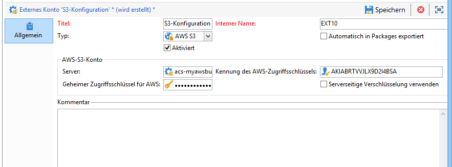
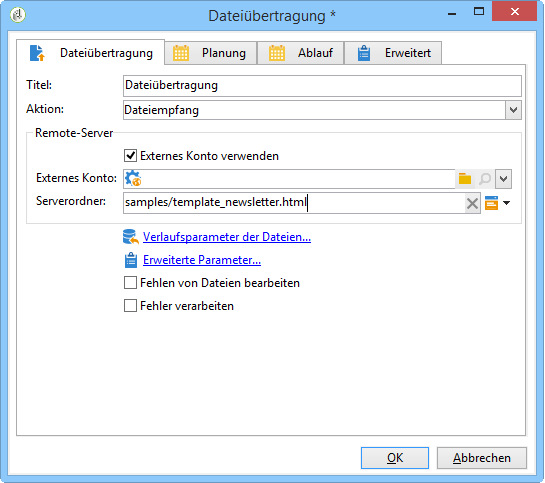
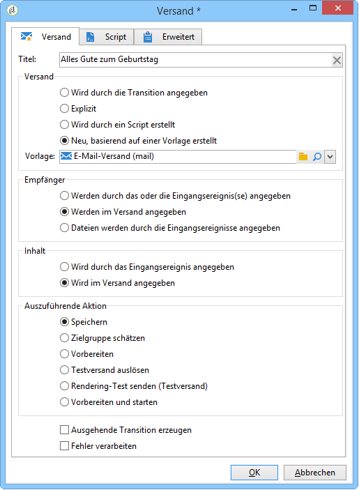
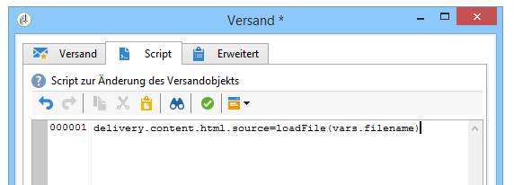

# Versandinhalt laden{#loading-delivery-content}

Wenn Ihr Versandinhalt in einer auf einem Amazon-S3-, FTP- oder SFTP-Server gespeicherten HTML-Datei verfügbar ist, können Sie diesen Inhalt einfach in Adobe-Campaign-Sendungen laden.

Gehen Sie dazu wie folgt vor:

1. Wenn Sie die Verbindung zwischen Adobe Campaign und dem (S)FTP-Server, auf dem sich die Inhaltsdateien befinden, noch nicht definiert haben, erstellen Sie ein neues S3-, FTP- oder externes SFTP-Konto in **[!UICONTROL Administration]** > **[!UICONTROL Plattform]** > **[!UICONTROL Externe Konten]**. Geben Sie in diesem externen Konto die für die Verbindung zum S3- oder (S)FTP-Server verwendete Adresse und die entsprechenden Zugangsdaten an.

   Hier ist ein Beispiel eines externen S3-Kontos:

   

1. Erstellen Sie einen neuen Workflow, beispielsweise in **[!UICONTROL Profile und Zielgruppen]** > **[!UICONTROL Vorgänge]** > **[!UICONTROL Zielgruppen-Workflow]**.
1. Fügen Sie Ihrem Workflow die Aktivität **[!UICONTROL Dateiübertragung]** hinzu und konfigurieren Sie sie durch folgende Angaben:

   * das zu verwendende externe Konto für die Verbindung mit dem S3- oder (S)FTP-Server.
   * den Pfad der Datei auf dem S3- oder (S)FTP-Server.

   

1. Fügen Sie eine **[!UICONTROL Versand]**-Aktivität hinzu und verbinden Sie sie mit der ausgehenden Transition der Aktivität **[!UICONTROL Dateiübertragung]**. Konfigurieren Sie sie folgendermaßen:

   * Versand: nach Bedarf entweder ein bestimmter im System vorhandener Versand oder ein neuer Versand auf der Basis einer vorhandenen Vorlage.
   * Empfänger: In diesem Beispiel wurde die Zielgruppe im Versand selbst festgelegt.
   * Inhalt: Wählen Sie **[!UICONTROL Wird im Versand angegeben]** aus, selbst wenn der Inhalt in der vorherigen Aktivität importiert wurde. Da der Inhalt direkt aus einer auf einem Remote-Server gespeicherten Datei importiert wird, besitzt er keine Kennung, wenn er vom Workflow verarbeitet wird, und kann nicht als vom Eingangsereignis kommend identifiziert werden.
   * Auszuführende Aktion: Wählen Sie **[!UICONTROL Speichern]**, um den Versand zu speichern und darauf über **[!UICONTROL Kampagnenverwaltung]** > **[!UICONTROL Sendungen]** zugreifen zu können, wenn der Workflow ausgeführt wird.

   

1. Fügen Sie in der Aktivität **[!UICONTROL Versand]** im Tab **[!UICONTROL Script]** den folgenden Befehl hinzu, um den Inhalt der importierten Datei in den Versand zu laden:

   ```
   delivery.content.md.source=loadFile(vars.filename)
   ```

   

1. Speichern Sie den Workflow und führen Sie ihn aus. Unter **[!UICONTROL Kampagnenverwaltung]** > **[!UICONTROL Sendungen]** wird ein neuer Versand mit dem geladenen Inhalt erstellt.

>[!NOTE]
>
>Best Practices und Problembehebung bei der Verwendung von SFTP-Servern finden Sie auf [dieser Seite](../../platform/using/sftp-server-usage.md).
