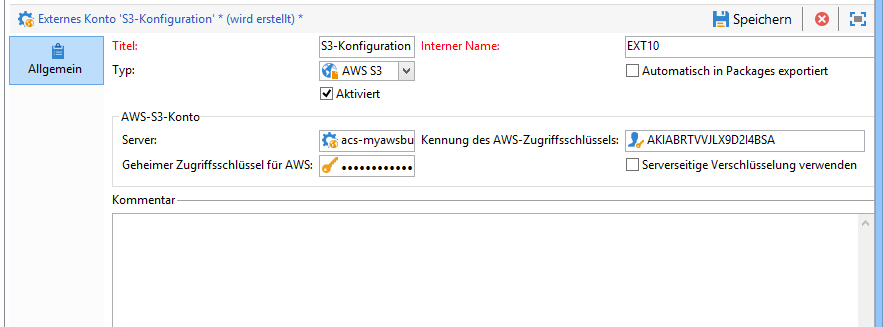
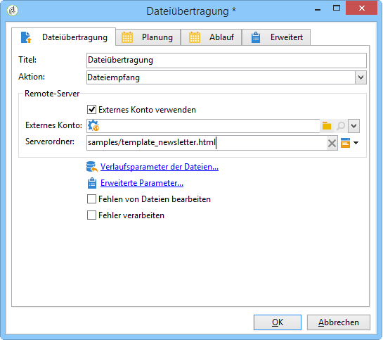
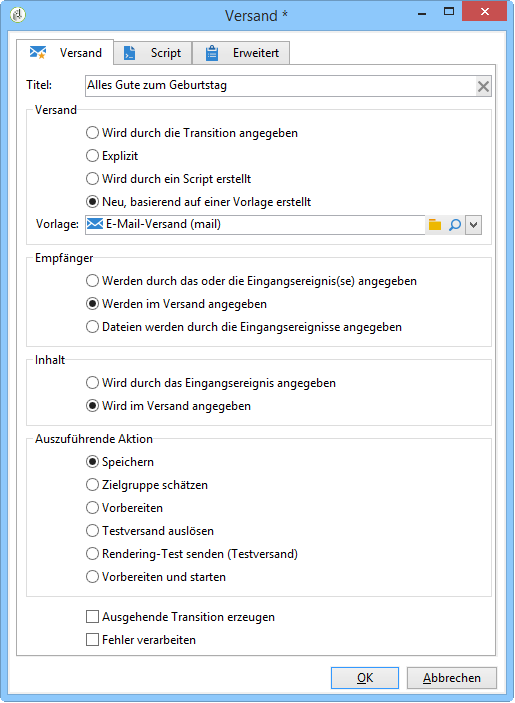
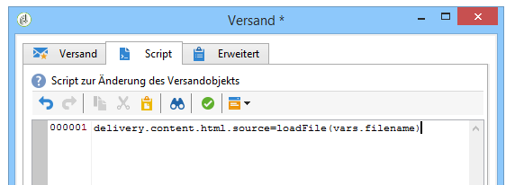

# Laden des Versandinhalts{#loading-delivery-content}


Wenn Ihr Versandinhalt in einer auf einem Amazon-S3-, FTP- oder SFTP-Server gespeicherten HTML-Datei verfügbar ist, können Sie diesen Inhalt einfach in Adobe Campaign-Sendungen laden.

Gehen Sie dazu wie folgt vor:

1. Wenn Sie noch keine Verbindung zwischen Adobe Campaign und dem (S)FTP-Server definiert haben, auf dem die Inhaltsdateien gehostet werden, erstellen Sie ein neues externes S3-, FTP- oder SFTP-Konto unter **[!UICONTROL Administration]** > **[!UICONTROL Plattform]** > **[!UICONTROL Externe Konten]**. Geben Sie in diesem externen Konto die Adresse und die Anmeldeinformationen an, die zum Herstellen der Verbindung mit dem S3- oder (S)FTP-Server verwendet werden.

   Hier ist ein Beispiel eines externen S3-Kontos:

   

1. Erstellen Sie einen neuen Workflow, beispielsweise in **[!UICONTROL Profile und Zielgruppen]** > **[!UICONTROL Aufträge]** > **[!UICONTROL Zielgruppen-Workflow]**.
1. Fügen Sie Ihrem Workflow die Aktivität **[!UICONTROL Dateiübertragung]** hinzu und konfigurieren Sie sie durch folgende Angaben:

   * das zu verwendende externe Konto für die Verbindung mit dem S3- oder (S)FTP-Server.
   * den Pfad der Datei auf dem S3- oder (S)FTP-Server.

   

1. Fügen Sie **[!UICONTROL Aktivität]** Versand“ hinzu und verbinden Sie sie mit der ausgehenden Transition der Aktivität **[!UICONTROL Dateiübertragung]** . Konfigurieren Sie ihn wie folgt:

   * Versand: nach Bedarf entweder ein bestimmter im System vorhandener Versand oder ein neuer Versand auf der Basis einer vorhandenen Vorlage.
   * Empfänger: In diesem Beispiel wurde die Zielgruppe im Versand selbst festgelegt.
   * Inhalt: Selbst wenn der Inhalt in der vorherigen Aktivität importiert wurde, wählen Sie **[!UICONTROL Im Versand angegeben]** aus. Da der Inhalt direkt aus einer auf einem Remote-Server gespeicherten Datei importiert wird, enthält er bei der Verarbeitung durch den Workflow keine Kennung und kann nicht als vom Eingangsereignis stammend identifiziert werden.
   * Auszuführende Aktion: Wählen Sie **[!UICONTROL Speichern]**, um den Versand zu speichern und darauf über **[!UICONTROL Kampagnenverwaltung]** > **[!UICONTROL Sendungen]** zugreifen zu können, wenn der Workflow ausgeführt wird.

   

1. Fügen Sie in der Aktivität **[!UICONTROL Versand]** im Tab **[!UICONTROL Script]** den folgenden Befehl hinzu, um den Inhalt der importierten Datei in den Versand zu laden:

   ```
   delivery.content.html.source=loadFile(vars.filename)
   ```

   

1. Speichern und starten Sie den Workflow. Unter **[!UICONTROL Kampagnenverwaltung]** > **[!UICONTROL Sendungen]** wird ein neuer Versand mit dem geladenen Inhalt erstellt.

>[!NOTE]
>
>Best Practices und Problembehebung bei der Verwendung von SFTP-Servern finden Sie auf [dieser Seite](../../platform/using/sftp-server-usage.md).
