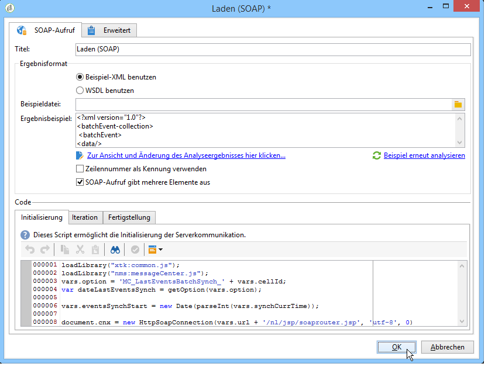
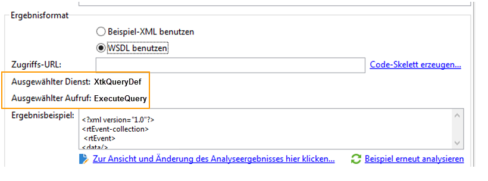
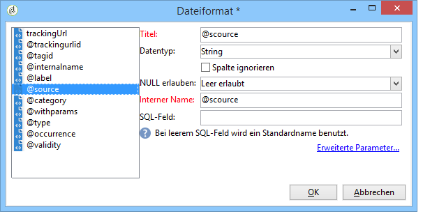

# Laden (SOAP){#loading-soap}

>[!CAUTION]
>
>Die Aktivität **Laden (SOAP** ist nur verfügbar, wenn das Modul **FDA (Federated Data Access)** installiert ist. Prüfen Sie diesbezüglich Ihren Lizenzvertrag.

Im Allgemeinen wird die Aktivität **Laden (SOAP)** ergänzend zur Aktivität **Laden (DBMS)** eingesetzt, für den Fall, dass der direkte Datenabruf aus einer externen Datenbank über den FDA nicht möglich ist.

Gehen Sie wie folgt vor:

1. Wählen Sie zwischen der Verwendung eines Beispiel-XMLs oder einer WSDL.

   Das im Folgenden dargestellte Beispiel stammt aus einem technischen Workflow des Message-Center-Moduls.

   

1. Wählen Sie für ein XML-Beispiel eine Beispieldatei aus. Die Datei wird analysiert, um ein Ergebnisbeispiel zu erstellen.

   Geben Sie für eine WSDL die entsprechende Zugriffs-URL ein und generieren Sie dann den Code-Skelett. Der ausgewählte Service und Aufruf werden automatisch aktualisiert und angezeigt.

   

1. Klicken Sie auf den Link **[!UICONTROL Zur Ansicht und Änderung des Analyseergebnisses hier klicken...]**, um die identifizierten Spalten zu definieren.

   

   Durch Klick auf **[!UICONTROL Beispiel erneut analysieren]**, können Sie das Beispiel aktualisieren.

   Der Link **[!UICONTROL Erweiterte Parameter...]** erlaubt eine benutzerdefinierte Formatierung der Spaltendaten. Weiterführende Informationen zur Formatierung von importierten Daten finden Sie in diesem [Abschnitt](../../platform/using/executing-import-jobs.md).

1. Als Kennung kann die Zeilennummer verwendet werden und/oder Sie können angeben, dass der SOAP-Aufruf mehrere Elemente zurückgibt.
1. Geben Sie die erforderlichen Scripts in den entsprechenden Tabs ein:

   * **[!UICONTROL Initialisierung]**: Herstellung der SOAP-Verbindung.
   * **[!UICONTROL Iteration]**: Führt den Aufruf des SOAP-Service aus. Die Rückgabe für diese Funktion muss ein XML-Objekt sein, das mit der Beschreibung des Beispiels oder der WSDL kompatibel ist.

     Der Code dieses Tabs wird von Adobe Campaign so lange in einer Schleife aufgerufen, bis ein Null-XML-Element zurückgegeben wird.

   * **[!UICONTROL Fertigstellung]**: Unterbrechung der Verbindung und/oder Freigabe der anderen, während des Vorgangs erstellten Ressourcen.
