# Lokale Validierung{#local-approval}

When integrated into a targeting workflow, the **[!UICONTROL Local approval]** activity lets you set up a recipient approval process before the delivery is sent.

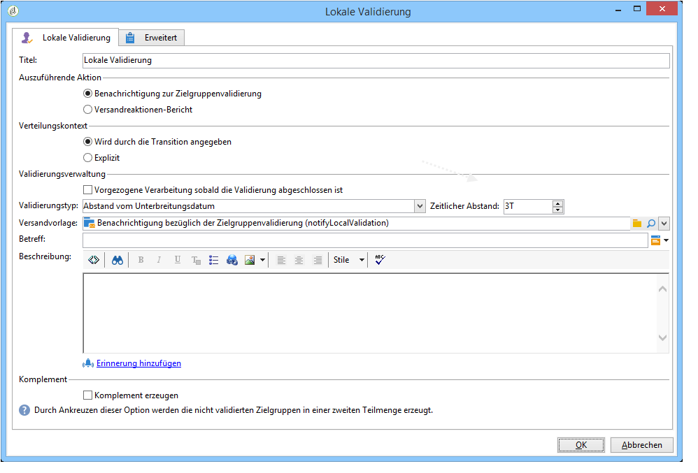

>[!CAUTION]
>
>Zur Verwendung dieser Funktion benötigen Sie das Modul Distributed Marketing (Campaign-Option). Bitte prüfen Sie Ihren Lizenzvertrag.

Ein Beispiel für die **[!UICONTROL Local approval]** Aktivität mit einer Verteilungsvorlage finden Sie unter [Verwenden der lokalen Genehmigungsaktivität](../../workflow/using/using-the-local-approval-activity.md).

Start by entering a label for the activity and the **[!UICONTROL Action to execute]** field:

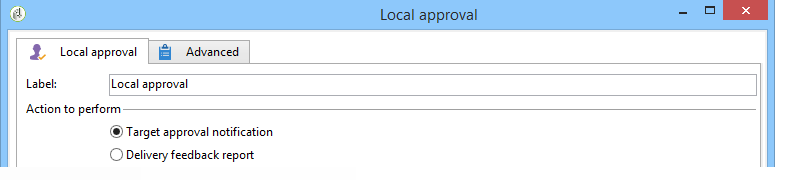

* Select the **[!UICONTROL Target approval notification]** option to send a notification email to local supervisors before the delivery, asking them to approve the recipients assigned to them.

   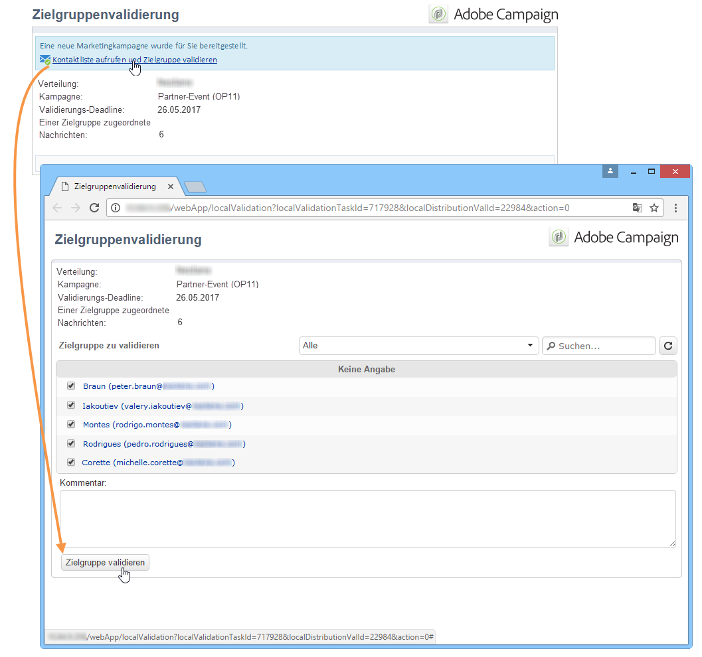

* **Inkrementelle Abfrage**: können Sie eine Abfrage ausführen und deren Ausführung planen. Refer to the [Incremental query](../../workflow/using/incremental-query.md) section.

   

## Benachrichtigung zur Zielgruppenvalidierung {#target-approval-notification}

In this case, the **[!UICONTROL Local approval]** activity is placed between upstream targeting and the delivery:

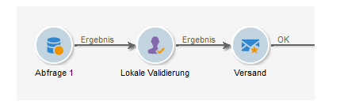

In diesem Fall sind folgende Felder zu konfigurieren:

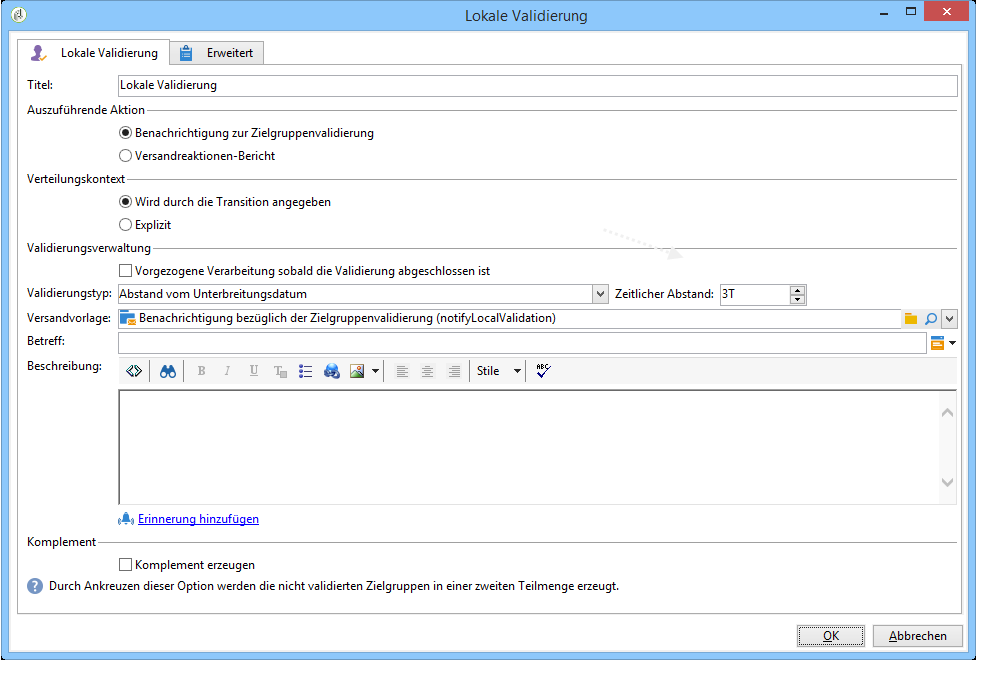

* **[!UICONTROL Distribution context]**: Wählen Sie die **[!UICONTROL Specified in the transition]** Option aus, wenn Sie eine **[!UICONTROL Split]** Typaktivität verwenden, um die Zielgruppe einzuschränken. In diesem Fall wird die Distributionsvorlage in die geteilte Aktivität eingegeben. Wenn Sie die Zielgruppe nicht einschränken, wählen Sie die **[!UICONTROL Explicit]** Option hier aus und geben Sie die Verteilungsvorlage in das **[!UICONTROL Data distribution]** Feld ein.

   Weitere Informationen zum Erstellen einer Datenverteilungsvorlage finden Sie unter [Beschränken der Anzahl der untergeordneten Datensätze pro Datenverteilung](../../workflow/using/split.md#limiting-the-number-of-subset-records-per-data-distribution).

* **[!UICONTROL Approval management]**

   * Select the delivery template and the subject that will be used for the email notification. A default template is available: **[!UICONTROL Local approval notification]**. You can also add a description that will appear above the recipient lists in the approval and feedback notifications.
   * Geben Sie den **[!UICONTROL Approval type]** an, der der Genehmigungsfrist entspricht (Datum oder Frist ab Beginn der Genehmigung). Ab diesem Datum wird der Workflow erneut gestartet, und die Empfänger, die nicht genehmigt wurden, werden beim Targeting nicht berücksichtigt. Sobald die Benachrichtigungen gesendet wurden, wird die Aktivität in eine Warteschlange gestellt, damit die lokalen Aufsichtsbehörden ihre Kontakte genehmigen können.

      >[!NOTE]
      >
      >Wenn nicht anders angegeben, wartet die Aktivität drei Tage.

      Sie können auch eine oder mehrere Erinnerungen hinzufügen, um lokale Aufsichtsbehörden darüber zu informieren, dass die Frist näher rückt. To do this, click the **[!UICONTROL Add a reminder]** link.

* **[!UICONTROL Complementary set]**: Mit der **[!UICONTROL Generate complement]** Option können Sie einen zweiten Satz erstellen, der alle nicht genehmigten Ziele enthält.

   >[!NOTE]
   >
   >Standardmäßig ist diese Option deaktiviert.

## Versandreaktionen-Bericht {#delivery-feedback-report}

In this case, the **[!UICONTROL Local approval]** activity is placed after the delivery:

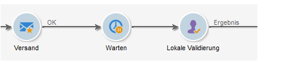

Folgende Angaben sind erforderlich:

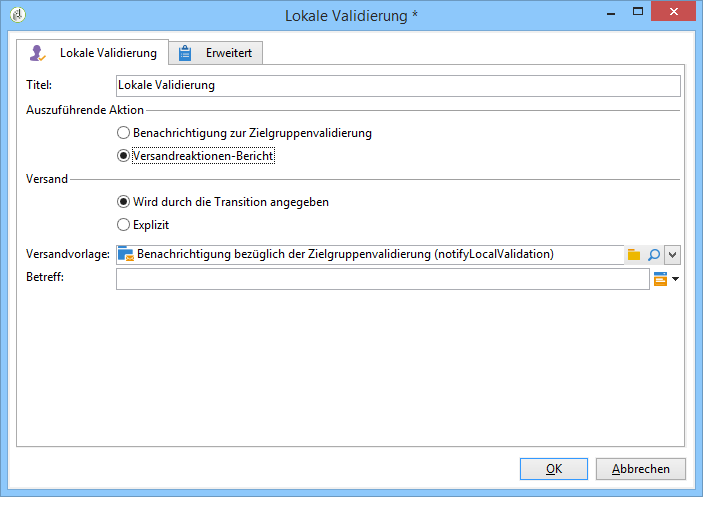

* Wählen Sie die **[!UICONTROL Specified in the transition]** Option, wenn die Bereitstellung während einer vorherigen Aktivität eingegeben wurde. Wählen Sie **[!UICONTROL Explicit]** die Bereitstellung in der lokalen Genehmigungsaktivität aus.
* Select the delivery template and the object of the notification email. There is a default template: **[!UICONTROL Local approval notification]**.

## Beispiel: Workflow-Versand validieren {#example--approving-a-workflow-delivery}

Dieses Beispiel zeigt, wie Sie einen Genehmigungsprozess für eine Workflow-Bereitstellung einrichten. Weitere Informationen zum Erstellen von Bereitstellungsarbeitsabläufen finden Sie im [Beispiel: Abschnitt zum Bereitstellungsarbeitsablauf](../../workflow/using/delivery.md#example--delivery-workflow) .

Dem Benutzer bieten sich zwei verschiedene Möglichkeiten, um einen Versand zu validieren. Dies kann entweder per Webzugriff unter Verwendung des in der Benachrichtigung enthaltenen Links oder direkt in der Clientkonsole geschehen.

* Validierung über Webzugriff

   Die an die zuvor gewählte Benutzergruppe gesandte Benachrichtigung ermöglicht die Validierung der Versandzielgruppe. Die Benachrichtigung enthält den in der Vorlage definierten Text, wobei der JavaScript-Ausdruck durch den berechneten Wert (hier &#39;574&#39;) ersetzt wird.

   Klicken Sie zur Validierung auf den entsprechenden Link in der Benachrichtigung und verbinden Sie sich mit der Adobe-Campaign-Konsole.

   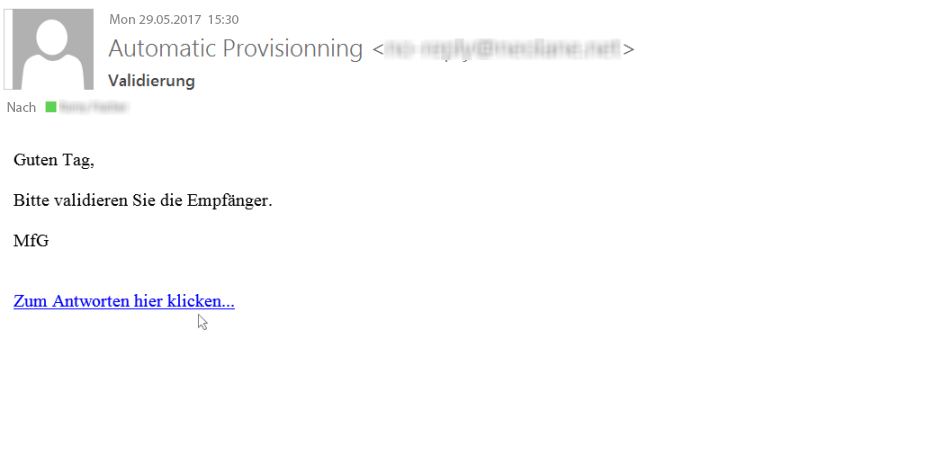

   Make a choice and click the **[!UICONTROL Submit]** button.

   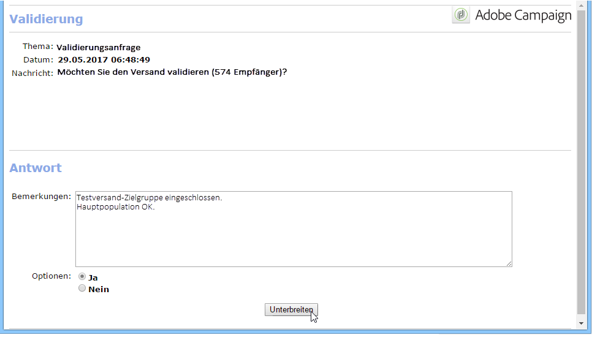

* Validierung in der Clientkonsole

   In der Baumstruktur enthält der **[!UICONTROL Administration > Production > Objects created automatically > Approvals pending]** Knoten die Liste der Aufgaben, die vom derzeit angeschlossenen Operator genehmigt werden sollen. Die Liste sollte eine Zeile enthalten. Doppelklicken Sie auf diese Zeile, um zu antworten. Das folgende Fenster wird angezeigt:

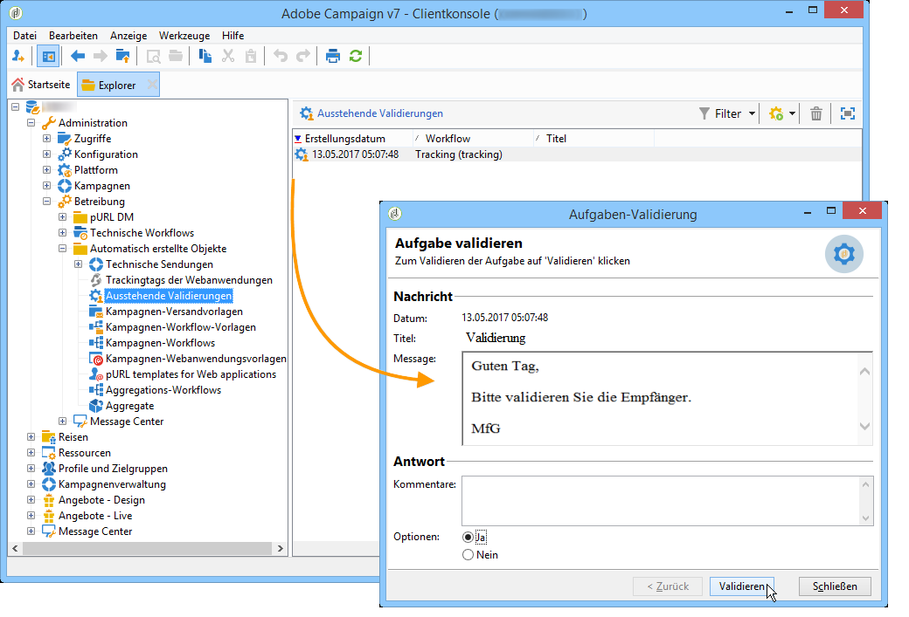

Select **Yes**, then click **[!UICONTROL Approve]**. A message will inform you that the response has been recorded.

Wenn Sie nach einigen Sekunden zum Workflow-Diagramm zurückkehren, stellt es sich wie folgt dar:

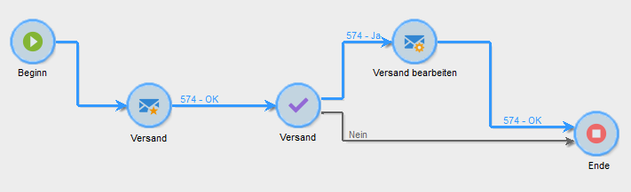

Der Workflow hat die **[!UICONTROL Delivery control]** Aufgabe ausgeführt, was in diesem Fall bedeutet, dass die zuvor erstellte Bereitstellung gestartet wird. Der Workflow wurde fehlerfrei abgeschlossen.
