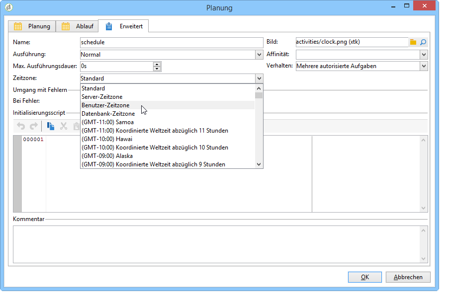

# Zeitzonen verwalten{#managing-time-zones}

Adobe Campaign ist in der Lage, verschiedene Zeitzonen innerhalb einer Instanz zu verwalten. Die verwendeten Zeitzonen werden bei der Instanzerstellung konfiguriert.

Weiterführende Informationen zur Zeitzonenkonfiguration finden Sie in diesem [Abschnitt](../../installation/using/time-zone-management.md).

In einem Workflow besteht nicht nur die Möglichkeit, die Ausführung einzelner Aktivitäten zu terminieren, sondern auch dem ganzen Workflow oder einzelnen Aktivitäten eine Zeitzone zuzuordnen. Dies kann insbesondere beim Dateiimport oder im Zuge der Versandplanung von Nutzen sein.

## Ausführung planen {#execution-scheduling}

Sie können die Ausführung von Aufgaben mit dem Zeitplan planen (siehe [Zeitplan](../../workflow/using/scheduler.md)). Sie können auch die Planungsoptionen verwenden, die in den Aktivitäten verfügbar sind, die diese Funktion bieten. Diese Aktivitäten bieten eine **[!UICONTROL Schedule]** Registerkarte: **[!UICONTROL File collector]**, **[!UICONTROL File transfer]**, **[!UICONTROL Web download]**, **[!UICONTROL Email reception]** &amp; **[!UICONTROL SMS]**, etc.

Für alle geplanten Aufgaben, d. h. alle Aktivitäten mit Planungsoptionen, können Sie die anzuwendende Zeitzone auswählen. Die Zeitzone wird über die **[!UICONTROL Advanced]** Registerkarte der betreffenden Aktivität ausgewählt:

Mögliche Werte:

* Server-Zeitzone

   Verwendet die Zeitzone des Adobe-Campaign-Anwendungsservers.

* Benutzer-Zeitzone

   Verwendet die Zeitzone des Adobe-Campaign-Benutzers, der die Ausführung des Workflows startet.

* Zeitzone der Datenbank

   Verwendet die Zeitzone des Datenbankservers.

* Bestimmte Zeitzonen

   Verwendet die ausgewählte Zeitzone.

If the **[!UICONTROL By default]** value is selected, the time zone of the workflow is applied, or, otherwise, that of the application server.

## Aktivitäten eine Zeitzone zuweisen {#linking-a-time-zone-to-an-activity}

Auf der **[!UICONTROL Advanced]** Registerkarte der Workflow-Aktivitäten können Sie die Zeitzone auswählen. Obwohl die Zeitzone der Workflows meistens ausreicht, kann es notwendig sein, sie für eine bestimmte Aktivität wie den Datenimport immer wieder zu überladen, um Daten mit der richtigen Zeitzone zu verknüpfen.
