# Überwachen der Workflow-Ausführung {#monitoring-workflow-execution}


Dieser Abschnitt enthält Informationen zur Überwachung der Ausführung Ihrer Workflows.

Ein Anwendungsbeispiel zum Erstellen eines Workflows, mit dem Sie den Status einer Reihe von Workflows überwachen können, die „ausgesetzt“, „angehalten“ oder „Mit Fehlern“ sind, finden Sie zudem in [diesem Abschnitt](supervising-workflows.md#supervising-workflows).

Darüber hinaus können Administratoren der Instanz das **Audit-Protokoll** verwenden, um Aktivitäten und letzte Änderungen an Workflows und somit den Zustand Ihrer Workflows zu überprüfen. Weitere Informationen hierzu finden Sie im [Produktionshandbuch zu Campaign Classic v7](../../production/using/audit-trail.md).

Weitere Möglichkeiten zur Überwachung der verschiedenen Campaign-Prozesse finden Sie im [Produktionshandbuch zu Campaign Classic v7](../../production/using/monitoring-guidelines.md).

## Fortschritt anzeigen {#displaying-progress}

Die Ausführung des Workflows kann am Bildschirm verfolgt werden.

Wenn Sie auf das Symbol **[!UICONTROL Fortschritt anzeigen]** klicken, werden Workflow-Ausführung, -Status und Ergebnis der Aktivitäten am Bildschirm dargestellt.

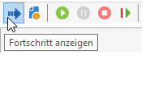

Wenn diese Option ausgewählt ist, werden ausgeführte Aktivitäten blau angezeigt, ausstehende Aktivitäten blinkend, Warnungen orange und Fehler rot. Des Weiteren werden auf den ausgehenden Transitionen die Ergebnisse der Aktivitäten eingeblendet, gefolgt vom in der Aktivität definierten Ergebnistitel sowie der Ausführungsdauer, wenn sie mehr als eine Sekunde beträgt.

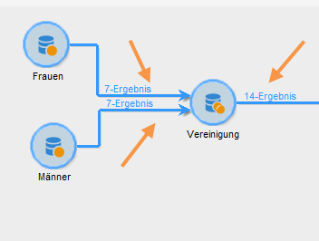

## Protokoll anzeigen {#displaying-logs}

Das Protokoll enthält den gesamten Verlauf, d. h. das Audit-Protokoll des Workflows. Alle Benutzeraktionen, alle ausgeführten Vorgänge und aufgetretenen Fehler werden aufgezeichnet. Sie haben folgende Möglichkeiten:

* Wählen Sie die Registerkarte **[!UICONTROL Tracking]** in den Details aus. Diese Liste enthält alle Workflow-Nachrichten.

  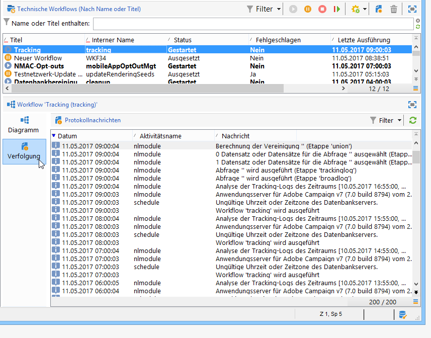

* Filtern Sie die Protokollnachrichten nach Aktivität. Klicken Sie dazu auf **[!UICONTROL Aufgaben und Protokoll anzeigen]** in der Symbolleiste über dem Diagramm, um die Registerkarten **[!UICONTROL Protokoll]** und **[!UICONTROL Aufgaben]** unterhalb des Diagramms anzuzeigen. Wählen Sie eine Aktivität aus, um alle zugehörigen Nachrichten anzuzeigen. Diese Liste enthält alle Nachrichten, wenn keine Aktivität ausgewählt ist.

  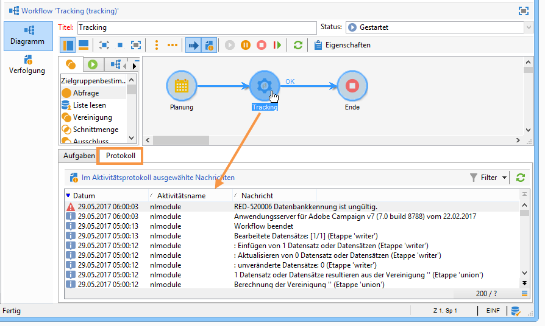

  >[!NOTE]
  >
  >Durch Klicken auf den Diagrammhintergrund werden alle Markierungen entfernt.

* Sie können entscheiden, nur die Nachrichten anzuzeigen, die mit einer bestimmten Aufgabe verknüpft sind. Wählen Sie dazu zunächst die Registerkarte **[!UICONTROL Aufgaben]** und anschließend eine Aktivität im Diagramm aus, um die Liste einzuschränken. Doppelklicken Sie auf eine Aufgabe, um die Informationen anzuzeigen. Die letzte Registerkarte im Fenster enthält das Protokoll.

  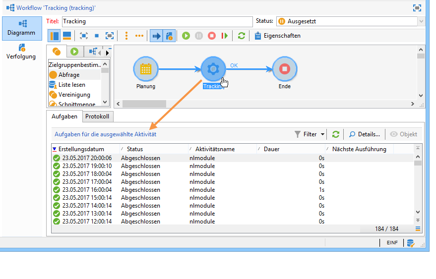

  Mit der Schaltfläche **[!UICONTROL Details…]** können Sie alle zusätzlichen Informationen zur Aktivitätsausführung anzeigen. Beispielsweise erscheinen hier die validierende Person und der Kommentar, den diese gegebenenfalls eingegeben hat:

  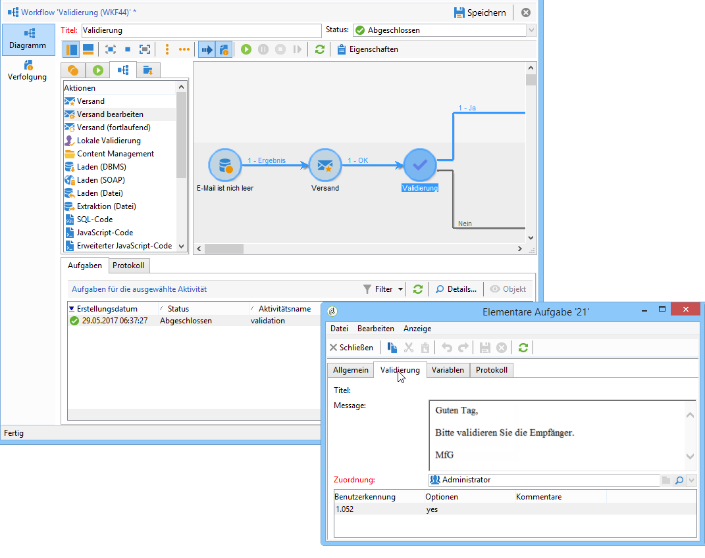

>[!NOTE]
>
>Das Protokoll wird beim Neustart eines Workflows nicht bereinigt. Alle Nachrichten werden beibehalten. Wenn Sie die Protokolle einer früheren Ausführung verwerfen möchten, müssen Sie den Verlauf bereinigen.

Die Nachrichten bezüglich der Ausführung der Workflow-Aktivitäten werden im Protokoll in chronologischer Reihenfolge aufgelistet.

* Protokoll einer Zielgruppenbestimmung

  Klicken Sie nach einer Zielgruppenbestimmung auf den Tab **[!UICONTROL Verfolgung]**, um die einzelnen Schritte der Ausführung nachzuvollziehen.

  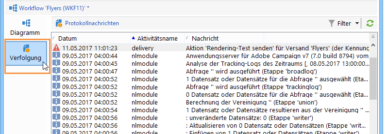

  Alle Vorgänge, Warnhinweise und Fehler werden protokolliert.

* Protokoll einer Aktivität

  Sie können auch das Ausführungsprotokoll und die Details von Aktivitäten anzeigen. Dafür gibt es zwei Möglichkeiten:

   1. Markieren Sie die gewünschte Aktivität und klicken Sie auf die Schaltfläche **[!UICONTROL Aufgaben und Protokoll anzeigen]**.

      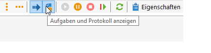

      Unter dem Diagramm erscheinen nun die Tabs Protokoll und Aufgaben.

      Die Markierung einer Aktivität im Diagramm arbeitet wie ein Filter in Bezug auf das Protokoll und die Aufgabenliste.

      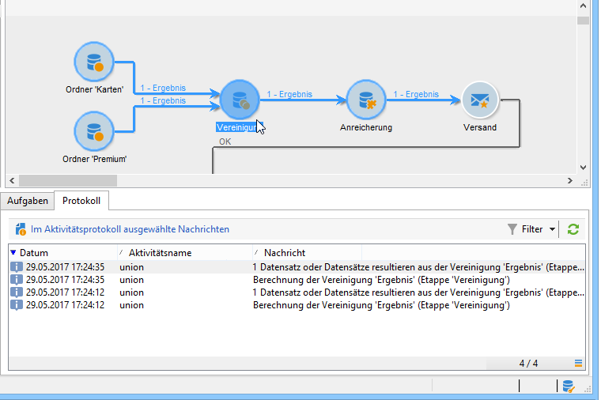

   1. Klicken Sie mit der rechten Maustaste auf die gewünschte Aktivität und wählen Sie die Option **[!UICONTROL Protokoll anzeigen]**.

      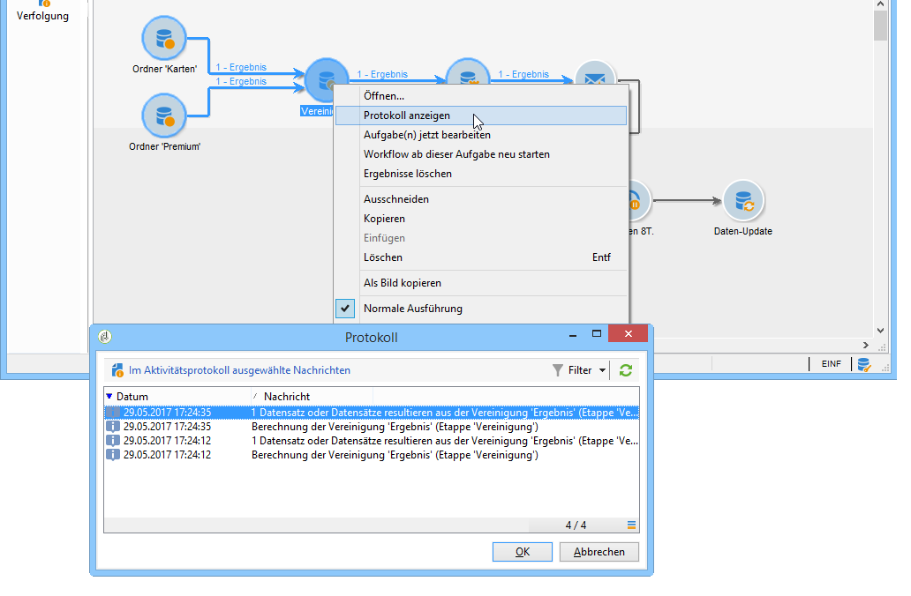

      Das Protokoll öffnet sich in einem separaten Fenster.

## Verläufe bereinigen {#purging-the-logs}

Workflow-Verläufe werden nicht automatisch bereinigt: Alle Nachrichten werden standardmäßig beibehalten. Der Verlauf kann über das Menü **[!UICONTROL Datei > Aktionen]** oder durch Klicken auf die Schaltfläche **[!UICONTROL Aktionen]** in der Symbolleiste oberhalb der Liste bereinigt werden. Wählen Sie **[!UICONTROL Verlauf bereinigen]** aus. Die im Menü **[!UICONTROL Aktionen]** verfügbaren Optionen werden im Abschnitt [Aktionen-Symbolleiste](starting-a-workflow.md) beschrieben.

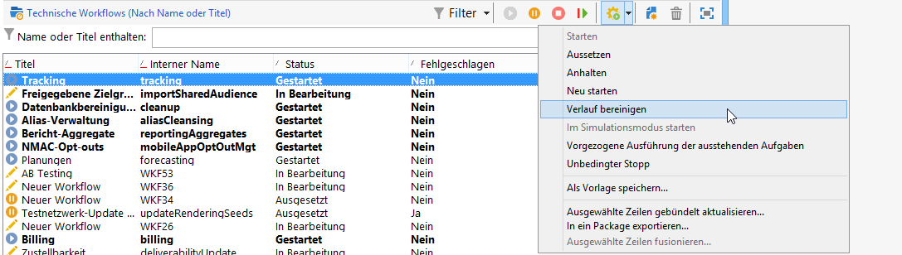

## Arbeitstabellen und Workflow-Schemata {#worktables-and-workflow-schema}

Der Workflow übermittelt Arbeitstabellen, die über bestimmte Aktivitäten bearbeitet werden können. Adobe Campaign bietet über Data-Management-Aktivitäten die Möglichkeit, Spalten aus Workflow-Arbeitstabellen umzuwandeln, umzubenennen oder anzureichern. Auf diese Weise können beispielsweise Nomenklaturen an den Kundenbedarf angepasst oder zusätzliche Informationen über Vertragsbegünstigte erhoben werden.

Es ist auch möglich, Verknüpfungen zwischen verschiedenen Arbeitsdimensionen zu erstellen und Dimensionsänderungen zu definieren. So können Sie beispielsweise festlegen, dass Kommunikationen an Beitragszahlende einer Police gerichtet werden, dabei aber die Daten der Mitversicherten in den Zusatzinformationen zu berücksichtigen sind.

Die Arbeitstabellen des Workflows werden automatisch gelöscht, wenn der Workflow passiviert. Wenn Sie eine Arbeitstabelle beibehalten möchten, speichern Sie sie über die Aktivität **[!UICONTROL Listen-Update]** in einer Liste (siehe [Listen-Update](list-update.md)).

## Fehler beheben {#managing-errors}

Wenn ein Fehler auftritt, wird der Workflow ausgesetzt und die bei Fehlerauftritt ausgeführte Aktivität blinkt rot. In der Workflow-Übersicht können Sie über den Link **[!UICONTROL Workflows]** im Tab **[!UICONTROL Monitoring]** wie unten dargestellt nur Workflows mit Fehlern anzeigen.

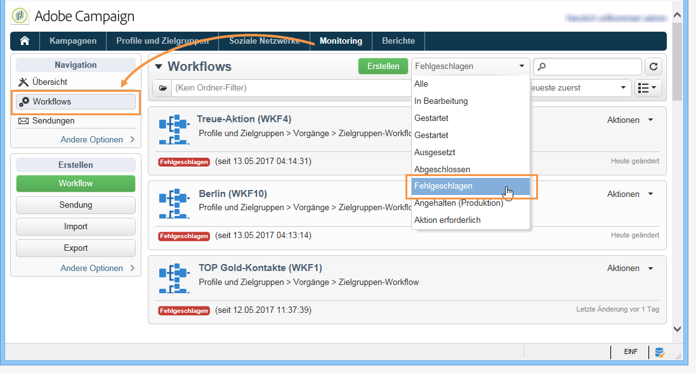

Im Explorer enthält die Listenansicht der Workflows standardmäßig die Spalte **[!UICONTROL Fehlgeschlagen]**.

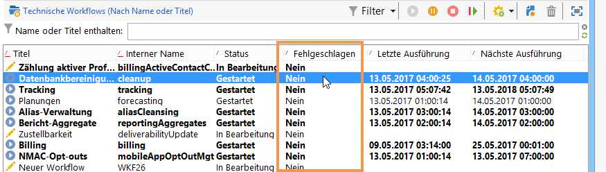

Wenn ein Workflow fehlerhaft ist, werden die zur Workflow-Überwachungsgruppe gehörenden Benutzenden per E-Mail benachrichtigt, sofern ihre E-Mail-Adresse in ihrem Profil angegeben ist. Diese Gruppe ist im Feld **[!UICONTROL Verantwortliche(r)]** der Workflow-Eigenschaften ausgewählt.

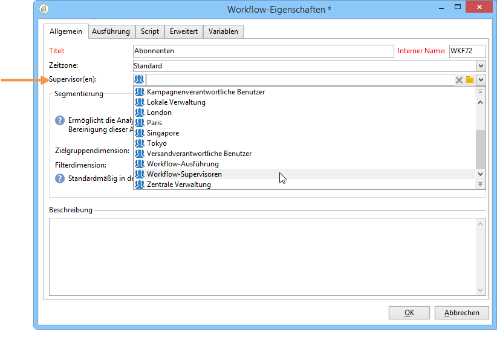

Der Benachrichtigungsinhalt wird in der Standardvorlage **[!UICONTROL Benachrichtigung des Workflow-Verantwortlichen]** konfiguriert, die in der Registerkarte **[!UICONTROL Ausführung]** der Workflow-Eigenschaften ausgewählt werden kann. Die Benachrichtigung zeigt den Namen des Fehler-Workflows und der betroffenen Aufgabe an.

Beispiel einer Benachrichtigung:

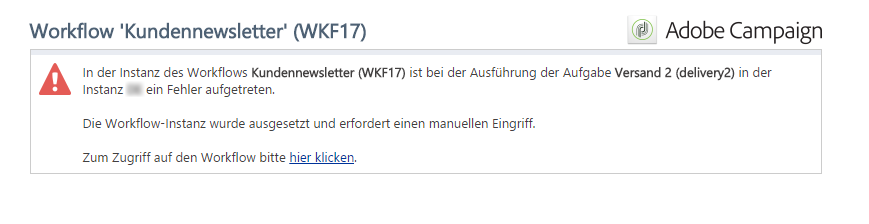

Über den enthaltenen Link wird der Benutzer direkt per Webzugriff auf die Adobe Campaign-Konsole weitergeleitet. Nach Anmeldung kann er dann den fehlgeschlagenen Workflow bearbeiten.

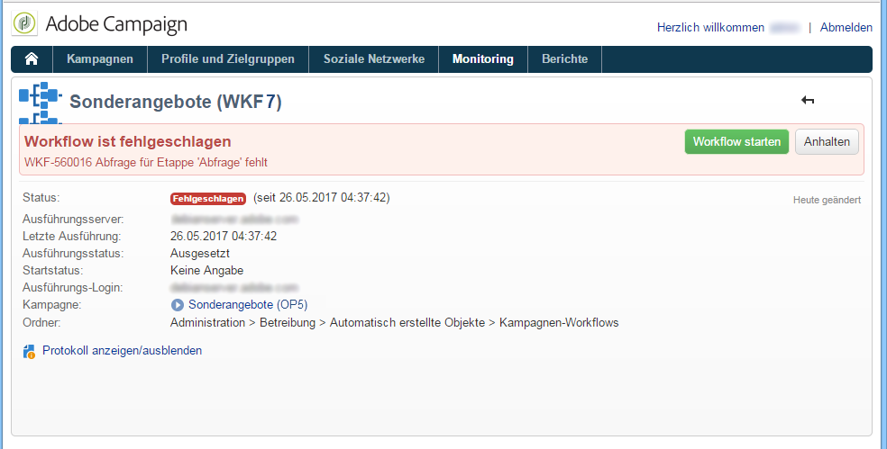

Es besteht die Möglichkeit, das Aussetzen des Workflows im Falle von Fehlern zu vermeiden und die sich anschließenden Aufgaben wie geplant auszuführen. Bearbeiten Sie dazu den Workflow **[!UICONTROL Eigenschaften]** und wählen Sie im Abschnitt **[!UICONTROL Umgang mit Fehlern]** die Option **[!UICONTROL Ignorieren]** im Feld **[!UICONTROL Bei Fehler]** aus. Sie können dann die Anzahl der aufeinanderfolgenden Fehler angeben, die ignoriert werden können, bevor der Prozess angehalten wird.

In diesem Fall wird die fehlerhafte Aufgabe abgebrochen. Dieser Modus ist insbesondere für Workflows für spätere Neuversuche der Kampagne (periodische Aktionen) geeignet.

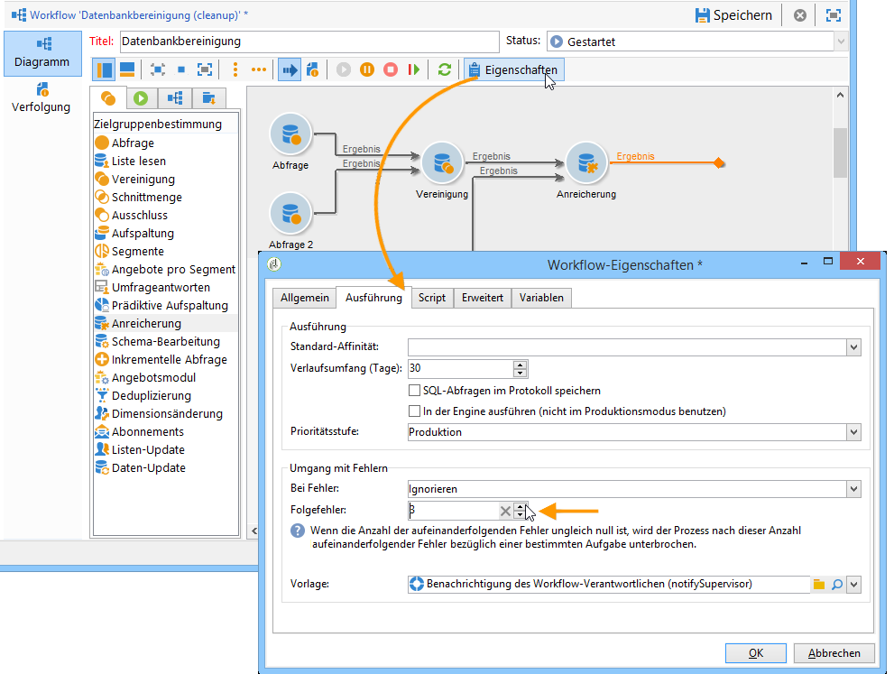

>[!NOTE]
>
>Es besteht die Möglichkeit, diese Vorgehensweise individuell für jede Aktivität zu konfigurieren. Bearbeiten Sie dazu die Aktivitätseigenschaften und wählen Sie den Modus „Umgang mit Fehlern“ auf der Registerkarte **[!UICONTROL Erweitert]** aus.

Weitere Informationen zur Fehlerbehebung bei der Ausführung von Workflows finden Sie im [Produktionshandbuch zu Campaign Classic v7](../../production/using/workflow-execution.md).

## Fehler verarbeiten {#processing-errors}

Auf Aktivitätsebene erscheint im Fall von Fehlern eine bestimmte Transition, wenn die Option **[!UICONTROL Fehler verarbeiten]** aktiviert wurde. In diesem Fall wechselt der Workflow nicht in den Fehlermodus und die Ausführung wird fortgesetzt.

Dies gilt für Fehler des Dateisystems (Datei kann nicht verschoben werden, Zugriff auf das Verzeichnis nicht möglich usw.).

Fehler, die aus der Konfiguration der Aktivität resultieren, beispielsweise durch Angabe von ungültigen Werten (z. B. inexistentes Verzeichnis), werden nicht verarbeitet. Fehler, die aus fehlerhafter Konfiguration der Aktivität resultieren (z. B. inexistentes Verzeichnis), aktivieren diese Transition nicht.

Wenn ein Workflow angehalten wurde (manuell oder automatisch aufgrund eines Fehlers), setzt die Schaltfläche **[!UICONTROL Starten]** die Ausführung an der Stelle fort, an der sie unterbrochen wurde. Die fehlerhafte Aktivität (oder angehaltene Aktivität) wird erneut ausgeführt. Die vorherigen Aktivitäten werden nicht erneut ausgeführt.

Verwenden Sie die Schaltfläche **[!UICONTROL Neu starten]**, um alle Workflow-Aktivitäten erneut auszuführen.

Änderungen an bereits ausgeführten Aktivitäten werden somit nicht berücksichtigt, wenn die Workflow-Ausführung neu gestartet wird.

Änderungen an noch nicht ausgeführten Aktivitäten werden jedoch berücksichtigt, wenn die Workflow-Ausführung neu gestartet wird.

Änderungen an der ausgesetzten Aktivität werden beim Neustart der Workflow-Ausführung unter Umständen nicht korrekt berücksichtigt.

Es wird daher empfohlen, die Workflow-Ausführung nach Änderungen komplett neu zu starten.

## Instanz-Monitoring {#instance-supervision}

Die Seite **[!UICONTROL Instanz-Monitoring]** bietet die Möglichkeit, den Adobe Campaign-Server zu überwachen. Sie enthält die Liste fehlgeschlagener Workflows und Sendungen.

Auf diese Seite können Sie über den Tab **[!UICONTROL Monitoring]** zugreifen. Klicken Sie auf die Schaltfläche **[!UICONTROL Übersicht]**.

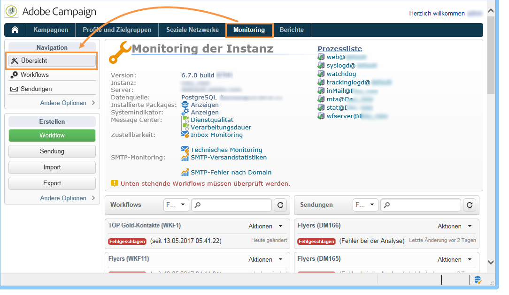

Um alle Workflows anzuzeigen, klicken Sie auf den Link **[!UICONTROL Workflows]**. Um die Workflows auf der Plattform basierend auf ihren Status anzuzeigen, verwenden Sie die Dropdown-Liste.

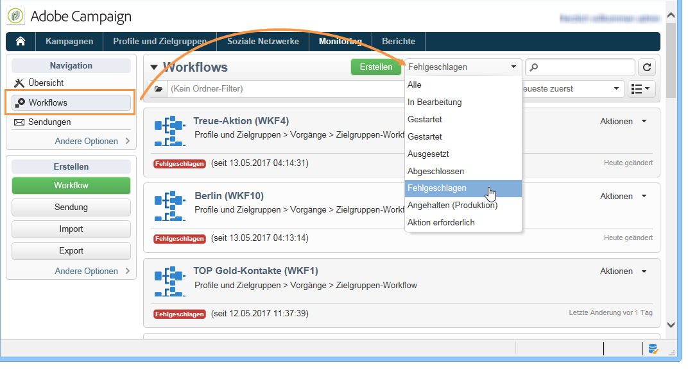

Durch Klick auf den Namen eines Workflows öffnet sich dieser und Sie können das Protokoll einsehen.

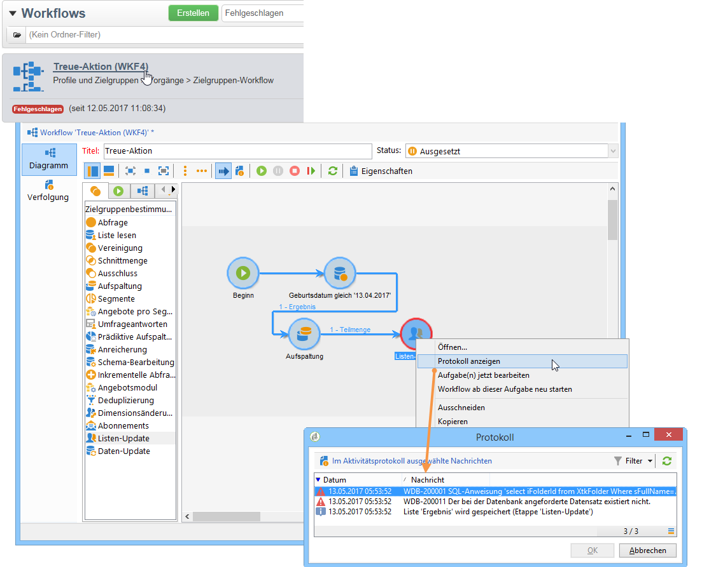

## Mehrere gleichzeitige Ausführungen verhindern {#preventing-simultaneous-multiple-executions}

Ein einzelner Workflow kann mehrere gleichzeitig ablaufende Ausführungen enthalten. In einigen Fällen sollten Sie dies verhindern.

Beispielsweise kann eine Planung die Workflow-Ausführung stündlich auslösen, während die Ausführung des gesamten Workflows aber mehr als eine Stunde dauert. Sie können die Ausführung ggf. überspringen, wenn der Workflow bereits ausgeführt wird.

Wenn vor dem Beginn eines Workflows eine Signalaktivität erfolgt und der Workflow bereits läuft, sollte das Signal übersprungen werden.

Allgemein gilt:

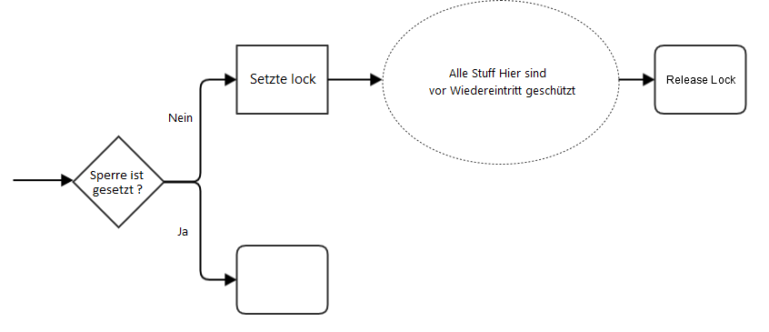

Die Lösung besteht darin, eine Instanzvariable zu verwenden. Instanzvariablen werden von allen parallelen Ausführungen der Workflows gemeinsam verwendet.

Hier ist ein einfacher Test-Workflow:

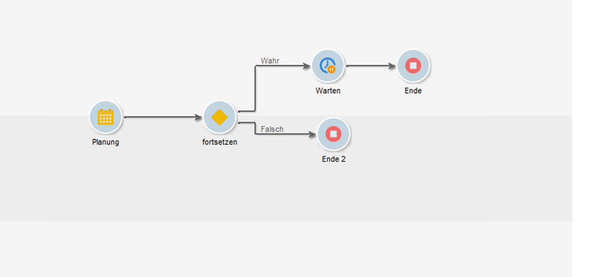

Die **[!UICONTROL Planung]** löst jede Minute ein Ereignis aus. Mit der folgenden **[!UICONTROL Test-Aktivität]** wird die Instanzvariable **isRunning** getestet, um zu entscheiden, ob die Ausführung fortgesetzt werden soll oder nicht:

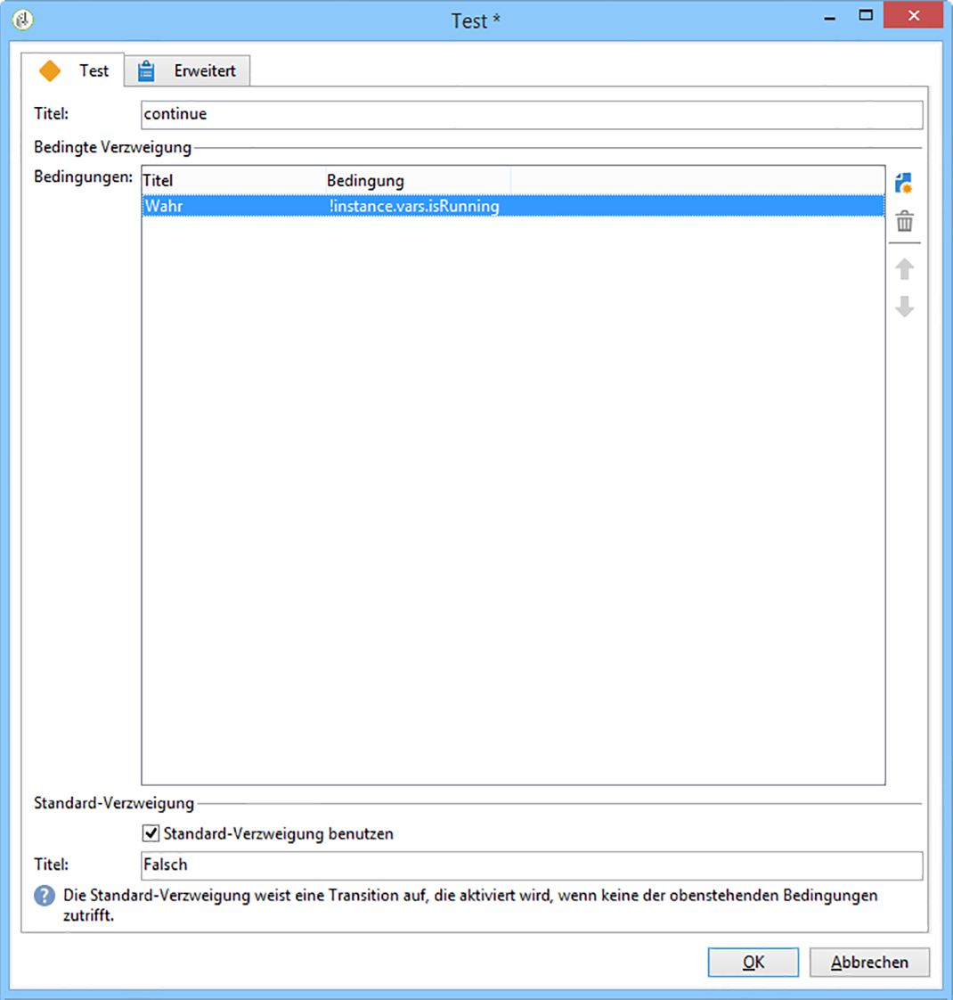

>[!NOTE]
>
>**isRunning** ist ein für dieses Beispiel ausgewählter Variablenname. Dies ist keine integrierte Variable.

In der Aktivität, die unmittelbar auf **[!UICONTROL Test]** im Zweig **yes** folgt, muss die Instanzvariable im **Initialisierungsscript** auf true gesetzt werden:

```
instance.vars.isRunning = true
```

In der letzten Aktivität im Zweig **yes** muss die Variable in im **Initialisierungsscript** wieder auf false gesetzt werden:

```
instance.vars.isRunning = false
```

Bitte beachten Sie Folgendes:

* Den aktuellen Wert der Instanzvariable können Sie im Tab **Variablen** im Workflow **Eigenschaften** prüfen.
* Beim Neustart eines Workflows werden die Instanzvariablen zurückgesetzt.
* In JavaScript ist ein nicht definierter Wert in einem Test auf false gesetzt. Dadurch kann die Instanzvariable noch vor ihrer Initialisierung geprüft werden.
* Sie können die aufgrund dieses Mechanismus nicht verarbeiteten Aktivitäten überwachten, indem Sie dem Initialisierungsscript des &quot;Nein&quot;-Zweigs eine Protokollierungsanweisung hinzufügen.

  ```
  logInfo("Workflow already running, parallel execution not allowed.");
  ```

Im Abschnitt [Datenaktualisierungen koordinieren](coordinating-data-updates.md) wird ein Anwendungsbeispiel vorgestellt.

## Wartung der Datenbank {#database-maintenance}

In Workflows werden zahlreiche Arbeitstabellen verwendet, die Speicherplatz benötigen und mit der Zeit die gesamte Plattform verlangsamen, wenn sie nicht gewartet wird. Weiterführende Informationen zur Datenbankwartung finden Sie in diesem [Abschnitt](../../production/using/tables-to-maintain.md).

Der Workflow **Datenbankbereinigung**, auf den Sie über den Knoten **Administration > Betreibung > Technische Workflows** zugreifen können, ermöglicht das Löschen veralteter Daten, um das exponentielle Anwachsen der Datenbank zu verhindern. Der Workflow wird automatisch ohne Benutzereingriff ausgelöst. Siehe [Produktionshandbuch zu Campaign Classic v7](../../production/using/database-cleanup-workflow.md).

Sie können auch spezifische technische Workflows erstellen, um unnötige Daten zu bereinigen, die Speicherplatz belegen. Siehe [Produktionshandbuch zu Campaign Classic v7](../../production/using/application-objects.md) und diesen [Abschnitt](#purging-the-logs).

## Handhaben von ausgesetzten Workflows {#handling-of-paused-workflows}

Wenn ein Workflow angehalten wird, werden dessen Arbeitstabellen standardmäßig nie bereinigt. Ab Build 8880 werden Workflows, die zu lange in einem ausgesetzten Zustand angehalten werden, automatisch gestoppt und deren Arbeitstabellen bereinigt. Dieses Verhalten wird wie folgt ausgelöst:

* Sind Workflows länger als sieben Tage ausgesetzt, erscheint ein Warnhinweis im Monitoring-Dashboard (und in der Monitoring-API) und es wird eine Benachrichtigung an die Supervisoren-Gruppe gesendet.
* Dasselbe passiert jede Woche, wenn der technische Workflow **[!UICONTROL cleanupPausedWorkflows]** ausgelöst wird. Weitere Informationen zum Workflow finden Sie in [diesem Abschnitt](delivery.md).
* Nach vier Benachrichtigungen (d. h. standardmäßig nach einem Monat im ausgesetzten Zustand) wird der Workflow bedingungslos gestoppt. Ein Protokoll wird im Workflow angezeigt, nachdem er angehalten wurde. Die Tabellen werden bei der nächsten Ausführung des Workflows **[!UICONTROL Bereinigung]** bereinigt

Diese Zeiträume können mit der Option NmsServer_PausedWorkflowPeriod konfiguriert werden.

Für den Workflow verantwortliche Personen werden benachrichtigt. Die erstellenden Personen sowie die letzte Person, die den Workflow modifiziert hat, werden ebenfalls benachrichtigt. Admins erhalten die Benachrichtigungen nicht.

## Filtern von Workflows nach ihrem Status {#filtering-workflows-status}

Mit der Oberfläche von Campaign Classic können Sie den Ausführungsstatus aller Workflows in Ihrer Instanz mithilfe vordefinierter **Ansichten** überwachen. Um auf diese Ansichten zuzugreifen, öffnen Sie den Knoten **[!UICONTROL Administration]** / **[!UICONTROL Verfolgung]** / **[!UICONTROL Status des Workflows]**.

Folgende Ansichten stehen zur Verfügung:

* **[!UICONTROL Wird ausgeführt]**: listet alle ausgeführten Workflows auf.
* **[!UICONTROL Ausgesetzt]**: listet alle ausgesetzten Workflows auf.
* **[!UICONTROL Fehlgeschlagen]**: listet alle fehlgeschlagenen Workflows auf.
* **[!UICONTROL Start ausstehend]**: listet alle Workflows auf, die darauf warten, vom operationMgt-Prozess gestartet zu werden. Diese Ansicht ist nur mit dem Package **Marketing-Kampagnen** verfügbar. Weitere Informationen finden Sie im [Installationshandbuch zu Campaign Classic v7](../../installation/using/installing-campaign-standard-packages.md)).

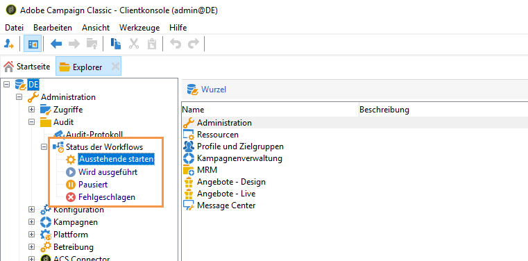

Standardmäßig sind diese Ansichten im Ordner **[!UICONTROL Verfolgung]** aufrufbar. Sie können sie jedoch an einer Stelle Ihrer Wahl in der Ordnerstruktur neu erstellen. Auf diese Weise sind sie für Standardbenutzer ohne Administratorrechte verfügbar.

Gehen Sie dazu wie folgt vor:

1. Klicken Sie mit der rechten Maustaste auf den Ordner, in dem Sie die Ansicht hinzufügen möchten.
1. Wählen Sie unter **[!UICONTROL Ordner hinzufügen]** / **[!UICONTROL Administration]** die Ansicht aus, die Sie hinzufügen möchten.
1. Nachdem der Ordner zum Baum hinzugefügt wurde, stellen Sie sicher, dass Sie ihn als Ansicht konfigurieren, damit alle Workflows unabhängig vom Ursprungsordner angezeigt werden. Weitere Informationen zum Konfigurieren von Ansichten finden Sie [in diesem Abschnitt](../../platform/using/about-adobe-campaign-classic.md).

Zusätzlich zu diesen Ansichten können Sie Filterordner einrichten, mit denen Sie die Liste der Workflows nach ihrem Ausführungsstatus filtern können. Gehen Sie dazu wie folgt vor:

1. Rufen Sie einen Ordner vom Typ „Workflow“ auf und wählen Sie dann das Menü **[!UICONTROL Filter]** / **[!UICONTROL Erweiterter Filter]**.
1. Konfigurieren Sie den Filter so, dass das Feld **[!UICONTROL @status]** des Workflows dem Status Ihrer Wahl entspricht.
1. Speichern und benennen Sie den Filter. Er ist dann direkt in der Filterliste verfügbar.

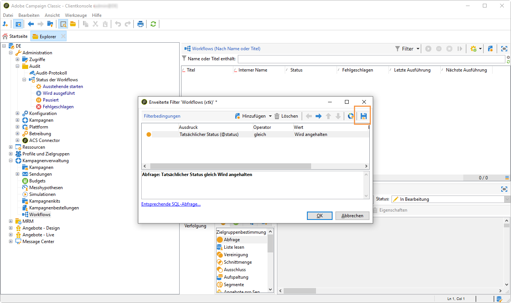

Weitere Informationen zu Filtern finden Sie in der [Dokumentation zu Campaign v8 (Konsole)](https://experienceleague.adobe.com/de/docs/campaign/campaign-v8/audience/create-filters){target=_blank}.
