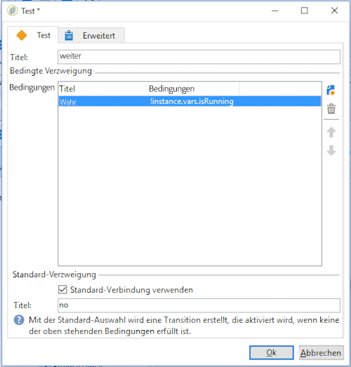

# Ausführung des Workflows überwachen {#monitoring-workflow-execution}

Dieser Abschnitt enthält Informationen zur Überwachung der Ausführung Ihrer Workflows.

Ein Anwendungsbeispiel zum Erstellen eines Workflows, mit dem Sie den Status einer Reihe von Workflows überwachen können, die &quot;angehalten&quot;, &quot;gestoppt&quot;oder &quot;mit Fehlern&quot;sind, finden Sie ebenfalls in [diesem Abschnitt](../../workflow/using/supervising-workflows.md#supervising-workflows).

Außerdem können Administratoren der Instanz den **Audit-Protokoll** verwenden, um Aktivitäten und letzte Änderungen an Workflows, den Zustand Ihrer Workflows, zu überprüfen. Weitere Informationen hierzu finden Sie im [entsprechenden Abschnitt](../../production/using/audit-trail.md).

Auf [dieser Seite](https://helpx.adobe.com/campaign/kb/acc-maintenance.html)werden weitere Möglichkeiten zur Überwachung der verschiedenen Kampagnenprozesse vorgestellt.

## Fortschritt anzeigen {#displaying-progress}

Die Ausführung des Workflows kann am Bildschirm verfolgt werden.

The **[!UICONTROL Display progress information]** icon lets you display the status and the activity result in the execution screen.


In diesem Fall erscheinen laufende Aktivitäten in Blau, wartende Aktivitäten blinken und Warnhinweise und Fehler werden in Orange bzw. Rot angezeigt. Des Weiteren werden auf den ausgehenden Transitionen die Ergebnisse der Aktivitäten eingeblendet, gefolgt vom in der Aktivität definierten Ergebnistitel sowie der Ausführungsdauer, wenn sie mehr als eine Sekunde beträgt.


## Protokoll anzeigen {#displaying-logs}

Das Protokoll enthält den Verlauf der Workflow-Ausführung. Es speichert die von den Benutzern angeforderten Befehle, ausgeführte Vorgänge und aufgetretene Fehler. Sie haben die Möglichkeit:

* Wählen Sie die **[!UICONTROL Tracking]** Registerkarte im Detail aus. Diese Liste enthält alle Workflow-Meldungen.

   

* Filtern Sie die Protokollmeldungen nach Aktivität. Klicken Sie dazu auf **[!UICONTROL Display the tasks and the log]** der Symbolleiste über dem Diagramm, um die Registerkarten **[!UICONTROL Log]** und **[!UICONTROL Tasks]** unter dem Diagramm anzuzeigen. Wählen Sie eine Aktivität aus, um alle zugehörigen Nachrichten anzuzeigen. Diese Liste enthält alle Meldungen, wenn keine Aktivität ausgewählt ist.

   

   >[!NOTE]
   >
   >Durch Klick in den Diagrammhintergrund werden alle Markierungen entfernt.

* Zeigen Sie nur die Nachrichten an, die mit einer bestimmten Aufgabe verknüpft sind. Wählen Sie dazu die **[!UICONTROL Tasks]** Registerkarte und dann eine Aktivität im Diagramm aus, um die Liste einzuschränken. Doppelklicken Sie auf eine Aufgabe, um die Informationen anzuzeigen. Die letzte Registerkarte im Fenster enthält das Protokoll.

   

   Über die **[!UICONTROL Details...]** Schaltfläche können Sie alle zusätzlichen Informationen zur Ausführung der Aktivität anzeigen. Sie können beispielsweise den Überprüfungsoperator und gegebenenfalls den Kommentar anzeigen, den Sie während der Genehmigung eingegeben haben, wie im folgenden Beispiel:

   

>[!NOTE]
>
>Das Protokoll wird bei einem Neustart des Workflows nicht bereinigt. Alle Nachrichten werden beibehalten. Sollten Sie die Nachrichten einer früheren Ausführung nicht beibehalten wollen, müssen Sie den Verlauf bereinigen.

Die Nachrichten bezüglich der Ausführung der Workflow-Aktivitäten werden im Protokoll in chronologischer Reihenfolge aufgelistet.

* Protokoll einer Zielgruppenbestimmung

   Once a targeting campaign has been executed, click the **[!UICONTROL Tracking]** tab to view the execution trace.

   

   Alle Vorgänge, Warnhinweise und Fehler werden protokolliert.

* Protokoll einer Aktivität

   Auch die Ausführung von Aktivitäten wird detailliert protokolliert. Sie haben zwei Möglichkeiten, die Nachrichten einzusehen:

   1. Wählen Sie die Zielaktivität aus und klicken Sie auf das **[!UICONTROL Display the tasks and the log]** Symbol.

      

      Unter dem Diagramm erscheinen nun die Tabs Protokoll und Aufgaben.

      Die Markierung einer Aktivität im Diagramm arbeitet wie ein Filter in Bezug auf das Protokoll und die Aufgabenliste.

      

   1. Right-click the targeted activity and select **[!UICONTROL Display logs]**.

      

      Das Protokoll öffnet sich in einem separaten Fenster.

## Verläufe bereinigen {#purging-the-logs}

Workflow-Verlauf wird nicht automatisch bereinigt: alle Nachrichten werden standardmäßig gespeichert. Der Verlauf kann über das **[!UICONTROL File > Actions]** Menü oder durch Klicken auf die **[!UICONTROL Actions]** Schaltfläche in der Symbolleiste über der Liste bereinigt werden. Auswählen **[!UICONTROL Purge history]**. Die im **[!UICONTROL Actions]** Menü verfügbaren Optionen werden im Abschnitt [Aktionen-Symbolleiste](../../workflow/using/executing-a-workflow.md#actions-toolbar) beschrieben.


## Arbeitstabellen und Workflow-Schemata {#worktables-and-workflow-schema}

Workflows verwenden diverse Arbeitstabellen, die mithilfe bestimmter Aktivitäten bearbeitet werden können. Adobe Campaign bietet über Data-Management-Aktivitäten die Möglichkeit, Spalten aus Workflow-Arbeitstabellen umzuwandeln, umzubenennen oder anzureichern. Auf diese Weise können beispielsweise Nomenklaturen angepasst oder zusätzliche Informationen erhoben werden.

Es ist des Weiteren möglich, Relationen zwischen verschiedenen Arbeitsdimensionen herzustellen und Dimensionswechsel zu definieren. So können Sie beispielsweise festlegen, dass Kommunikationen an den Beitragszahler einer Police gerichtet werden, dabei aber die Daten des Mitversicherten in den Zusatzinformationen zu berücksichtigen sind.

Die Arbeitstabellen des Workflows werden automatisch gelöscht, wenn der Workflow passiert. Wenn Sie eine Arbeitstabelle behalten möchten, speichern Sie sie über die **[!UICONTROL List update]** Aktivität in einer Liste (siehe [Listenaktualisierung](../../workflow/using/list-update.md)).

## Fehler beheben {#managing-errors}

Wenn ein Fehler auftritt, wird der Workflow angehalten und die Aktivität, die beim Auftreten des Fehlers ausgeführt wird, wird rot angezeigt. In der Workflow-Übersicht (**[!UICONTROL Monitoring]** **[!UICONTROL Workflows]** Universe > Link) können Sie nur Arbeitsabläufe mit Fehlern anzeigen, wie unten dargestellt.


In the Adobe Campaign Explorer, the workflow list displays a **[!UICONTROL Failed]** column by default.


Wenn ein Workflow fehlerhaft ist, werden die zu der Gruppe zur Workflow-Überwachung gehörenden Operatoren per E-Mail benachrichtigt, solange ihre E-Mail-Adresse in ihrem Profil aufgeführt ist. Diese Gruppe wird im **[!UICONTROL Supervisor(s)]** Feld der Workflow-Eigenschaften ausgewählt.


Der Benachrichtigungsinhalt wird in der **[!UICONTROL Workflow manager notification]** Standardvorlage konfiguriert: Diese Vorlage wird auf der **[!UICONTROL Execution]** Registerkarte der Workflow-Eigenschaften ausgewählt. Die Benachrichtigung zeigt den Namen des Fehlerarbeitsablaufs und die betreffende Aufgabe an.

Beispiel einer Benachrichtigung:


Über den enthaltenen Link wird der Benutzer direkt per Webzugriff auf die Adobe-Campaign-Konsole weitergeleitet. Nach Anmeldung kann er dann den fehlgeschlagenen Workflow bearbeiten.


Sie können den Workflow so konfigurieren, dass er bei Fehlern nicht angehalten wird und die Ausführung fortgesetzt wird. Dazu bearbeiten Sie den Workflow **[!UICONTROL Properties]** und wählen Sie im **[!UICONTROL Error management]** Abschnitt die **[!UICONTROL Ignore]** Option im **[!UICONTROL In case of error]** Feld aus. Sie können dann die Anzahl der aufeinander folgenden Fehler angeben, die ignoriert werden können, bevor der Prozess angehalten wird.

In diesem Fall wird die fehlerhafte Aufgabe abgebrochen. Dieser Modus ist insbesondere bei Workflows mit wiederkehrenden Vorgängen angebracht.


>[!NOTE]
>
>Es besteht die Möglichkeit, diese Vorgehensweise innerhalb eines Workflows nur für bestimmte Aktivitäten zu konfigurieren. Bearbeiten Sie dazu die Aktivitätseigenschaften und wählen Sie auf der **[!UICONTROL Advanced]** Registerkarte den Fehlerverwaltungsmodus aus.

Weitere Informationen zur Fehlerbehebung bei der Ausführung von Workflows finden Sie im [entsprechenden Abschnitt](../../production/using/workflow-execution.md).

## Fehler verarbeiten {#processing-errors}

In Bezug auf Aktivitäten zeigt die **[!UICONTROL Process errors]** Option einen bestimmten Übergang an, der aktiviert wird, wenn ein Fehler erzeugt wird. In diesem Fall wird der Workflow nicht in den Fehlermodus versetzt und die Ausführung wird fortgesetzt.

Dies gilt für Fehler des Dateisystems (Datei kann nicht verschoben werden, Zugriff auf das Verzeichnis nicht möglich usw.).

Fehler, die aus der Konfiguration der Aktivität resultieren, d. h. ungültige Werte (z. B. inexistentes Verzeichnis), aktivieren die zusätzliche Transition nicht.

Wenn ein Workflow angehalten wird (manuell oder automatisch nach einem Fehler), startet die **[!UICONTROL Start]** Schaltfläche die Workflow-Ausführung an der Stelle, an der sie beendet wurde. Die fehlerhafte Aktivität (oder angehaltene Aktivität) wird erneut ausgeführt. Die vorherigen Aktivitäten werden nicht erneut ausgeführt.

To re-execute all of the workflow activities, use the **[!UICONTROL Restart]** button.

Änderungen an bereits ausgeführten Aktivitäten werden somit nicht berücksichtigt, wenn die Workflow-Ausführung wiederaufgenommen wird.

Änderungen an noch nicht ausgeführten Aktivitäten werden jedoch berücksichtigt, wenn die Workflow-Ausführung wiederaufgenommen wird.

Änderungen an der ausgesetzten Aktivität werden bei der Wiederaufnahme der Workflow-Ausführung unter Umständen nicht korrekt berücksichtigt.

Es wird daher empfohlen, die Workflow-Ausführung nach Änderungen komplett neu zu starten.

## Instanz-Monitoring {#instance-supervision}

The **[!UICONTROL Instance supervision]** page lets you view the Adobe Campaign server activity and display the list of workflows and deliveries with errors.

To access this page, go to the **[!UICONTROL Monitoring]** universe and click the **[!UICONTROL General view]** link.


Um alle Workflows anzuzeigen, klicken Sie auf den **[!UICONTROL Workflows]** Link. Verwenden Sie die Dropdownliste, um die Workflows je nach Status in der Plattform anzuzeigen.


Durch Klick auf den Namen eines Workflows öffnet sich dieser und Sie können das Protokoll einsehen.


## Mehrere gleichzeitige Ausführungen verhindern {#preventing-simultaneous-multiple-executions}

Ein einzelner Workflow kann mehrere gleichzeitig ablaufende Ausführungen enthalten. In manchen Situationen sollte dies verhindert werden.

Beispielsweise könnte die Workflow-Ausführung stündlich ausgelöst werden, manchmal aber länger als eine Stunde dauern. Wenn der Workflow bereits ausgeführt wird, ist es empfehlenswert, den Start einer weiteren Ausführung zu überspringen.

Wenn vor dem Beginn eines Workflows eine Signalaktivität erfolgt und der Workflow bereits läuft, sollte das Signal übersprungen werden.

Allgemein gilt:


In dieser Situation wird eine Instanzvariable verwendet, die für alle parallelen Ausführungen von Workflows gültig ist.

Hier ist ein einfacher Test-Workflow:


Das Ereignis **[!UICONTROL Scheduler]** löst jede Minute aus. Die folgende **[!UICONTROL Test]** Aktivität wird die Instanzvariable **isRunning** testen, um zu entscheiden, ob die Ausführung fortgesetzt werden soll:



>[!NOTE]
>
>**isRunning** ist eine für dieses Beispiel ausgewählte Variable, und keine integrierte Variable.

In der Aktivität, die unmittelbar auf **[!UICONTROL Test]** im Zweig **yes** folgt, muss die Instanzvariable im **Initialisierungsscript** auf true gesetzt werden:

```
instance.vars.isRunning = true
```

In der letzten Aktivität im Zweig **yes** muss die Variable in im **Initialisierungsscript** wieder auf false gesetzt werden:

```
instance.vars.isRunning = false
```

Bitte beachten Sie Folgendes:

* Den aktuellen Wert der Instanzvariable können Sie im Tab **Variablen** im Workflow **Eigenschaften** prüfen.
* Beim erneuten Start eines Workflows werden die Instanzvariablen zurückgesetzt.
* In JavaScript ist ein nicht definierter Wert in einem Test auf false gesetzt. Dadurch kann die Instanzvariable noch vor ihrer Initialisierung geprüft werden.
* Sie können die aufgrund dieses Mechanismus nicht verarbeiteten Aktivitäten überwachten, indem Sie dem Initialisierungsscript des &quot;Nein&quot;-Zweigs eine Protokollierungsanweisung hinzufügen.

   ```
   logInfo("Workflow already running, parallel execution not allowed.");
   ```

In diesem Abschnitt wird ein Anwendungsfall vorgestellt: [Koordinieren von Datenaktualisierungen](../../workflow/using/coordinating-data-updates.md).

## Bereinigung der Datenbank {#database-maintenance}

In Workflows werden zahlreiche Arbeitstabellen verwendet, die Speicherplatz benötigen und mit der Zeit die gesamte Plattform verlangsamen, wenn sie nicht gewartet wird. Weiterführende Informationen zur Datenbankwartung finden Sie in diesem [Abschnitt](../../production/using/tables-to-maintain.md).

Der Workflow **Bereinigung der Datenbank**, auf den Sie über den Knoten **Administration > Betreibung > Technische Workflows** zugreifen können, ermöglicht das Löschen veralteter Daten, um das exponentielle Anwachsen der Datenbank zu verhindern. Der Workflow wird automatisch ohne das Eingreifen des Benutzers ausgelöst. Weiterführende Informationen finden Sie in diesem [Abschnitt](../../production/using/database-cleanup-workflow.md).

Sie können auch spezifische technische Workflows erstellen, um unnötige Daten zu entfernen, die andernfalls Speicherplatz belegen. Weiterführende Informationen finden Sie in diesem [Abschnitt](../../production/using/application-objects.md) und auf dieser [Seite](#purging-the-logs).

## Ausgesetzte Workflows handhaben {#handling-of-paused-workflows}

Die Arbeitstabellen ausgesetzter Workflows werden standardmäßig nie bereinigt. Ab Build 8880 werden Workflows, die zu lange in einem ausgesetzten Zustand angehalten werden, automatisch gestoppt und deren Arbeitstabellen bereinigt. Dieser Vorgang wird folgendermaßen ausgelöst:

* Sind Workflows länger als sieben Tage ausgesetzt, erscheint ein Warnhinweis im Monitoring-Dashboard (und in der Monitoring-API) und eine Benachrichtigung wird an die Supervisoren-Gruppe gesendet.
* Dasselbe passiert jede Woche, wenn der technische Workflow **[!UICONTROL cleanupPausedWorkflows]** ausgelöst wird. For more details on the workflow, refer to [this section](../../workflow/using/delivery.md).
* Nach 4 Benachrichtigungen (standardmäßig ein Monat angehalten) wird der Workflow bedingungslos beendet. Im Workflow wird ein Protokoll angezeigt, nachdem es beendet wurde. Die Tabellen werden beim nächsten **[!UICONTROL cleanup]** Workflow bereinigt

Diese Zeiträume können mit der Option NmsServer_PausedWorkflowPeriod konfiguriert werden.

Die Supervisoren des Workflows sowie der Ersteller und der letzte Benutzer, der den Workflow modifiziert hat, werden benachrichtigt. Administratoren erhalten keine Benachrichtigung.

## Filtern von Workflows nach ihrem Status{#filtering-workflows-status}

Mit der Oberfläche von Campaign Classic können Sie den Ausführungsstatus aller Workflows auf Ihrer Instanz mithilfe vordefinierter **Ansichten**&#x200B;überwachen. Um auf diese Ansichten zuzugreifen, öffnen Sie den Knoten **Administration**/**Audit**/**Workflows Status**.

Die folgenden Ansichten sind verfügbar:

* **Ausführen**: listet alle ausgeführten Workflows auf.
* **Angehalten**: Listet alle angehaltenen Workflows auf.
* **Fehlgeschlagen**: listet alle fehlgeschlagenen Workflows auf.

<!--Start Pending: lists all workflows that are waiting to be started by the operationMgt process.-->


<!--The Start Pending view is available with the Marketing campaigns package only. See Installing Campaign standard packages../../installation/using/installing-campaign-standard-packages.md.-->

Standardmäßig sind diese Ansichten im Ordner &quot;**Prüfung**&quot;verfügbar. Sie können sie jedoch an der gewünschten Stelle in der Ordnerstruktur neu erstellen. Auf diese Weise sind sie für Standardbenutzer ohne Administratorrechte verfügbar.

Gehen Sie folgendermaßen vor:

1. Klicken Sie mit der rechten Maustaste auf den Ordner, in dem Sie die Ansicht hinzufügen möchten.
1. Wählen Sie unter **Neuen Ordner**/**Verwaltung** hinzufügen die Ansicht aus, die Sie hinzufügen möchten.
1. Nachdem der Ordner zum Baum hinzugefügt wurde, stellen Sie sicher, dass Sie ihn als Ansicht konfigurieren, damit alle Workflows unabhängig vom Ursprungsordner angezeigt werden.Weitere Informationen zum Konfigurieren von Ansichten finden Sie in [diesem Abschnitt](../../platform/using/access-management.md#adding-folders-and-creating-views).

Zusätzlich zu diesen Ansichten können Sie Filter-Ordner einrichten, mit denen Sie die Liste der Arbeitsabläufe nach ihrem Ausführungsstatus filtern können. Gehen Sie dazu wie folgt vor:

1. Rufen Sie einen Workflow-Typ-Ordner auf und wählen Sie dann das **[!UICONTROL Filters]** /- **[!UICONTROL Advanced filter]** Menü.
1. Konfigurieren Sie den Filter so, dass das **[!UICONTROL @status]** Feld des Workflows dem Status Ihrer Wahl entspricht.
1. Speichern und benennen Sie den Filter. Es ist dann direkt in der Filterliste verfügbar.


Weitere Informationen finden Sie in den folgenden Abschnitten:

* [Erstellen erweiterter Filter](../../platform/using/creating-filters.md#creating-an-advanced-filter)
* [Speichern von Filtern](../../platform/using/creating-filters.md#saving-a-filter)

<!-- need to check if pending status filter will be implemented or not in january release, note, Additionally to these views, a prefedefined filter is available in workflow-type folders. It allows you to display in the list workflows that are waiting to be started by the operationMgt process only.This filter is available with the Marketing campaigns package only. See Installing Campaign standard packages../../installation/using/installing-campaign-standard-packages.md.-->

