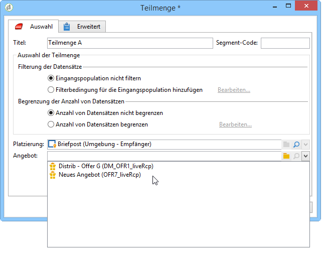

# Angebote pro Segment{#offers-by-cell}

Mithilfe der Aktivität **[!UICONTROL Angebote pro Segment]** lässt sich die eingehende Population (die beispielsweise aus einer Abfrage hervorgeht) in mehrere Zielgruppen aufspalten, um so je Segment spezifische Angebote zu unterbreiten.

Um diese Aktivität verwenden zu können, benötigen Sie das Modul **Interaction**. Weiterführende Informationen finden Sie in diesem [Abschnitt](../../interaction/using/about-outbound-channels.md).

Gehen Sie dazu wie folgt vor:

1. Platzieren Sie im Anschluss an die Abfrage eine Aktivität **[!UICONTROL Angebote pro Segment]** und öffnen Sie sie zur weiteren Bearbeitung.
1. Wählen Sie im **[!UICONTROL Allgemein]**-Tab die Platzierung, über die Sie Angebote unterbreiten möchten.
1. Definieren Sie nun im **[!UICONTROL Segmente]**-Tab über die Schaltfläche **[!UICONTROL Hinzufügen]** die verschiedenen Segmente:

   * Konfigurieren Sie anhand der verfügbaren Filter und Begrenzungen die Population des Segments.
   * Wählen Sie dann das Angebot aus, das Sie dem Segment unterbreiten möchten. Es stehen die Angebote zur Verfügung, die der Konfiguration der zuvor ausgewählten Platzierung entsprechen.

      

1. Konfigurieren Sie dann eine Versandaktivität, die dem von Ihnen gewählten Kanal entspricht. Siehe [Kanalübergreifender Versand](../../workflow/using/cross-channel-deliveries.md).

