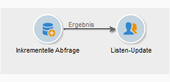
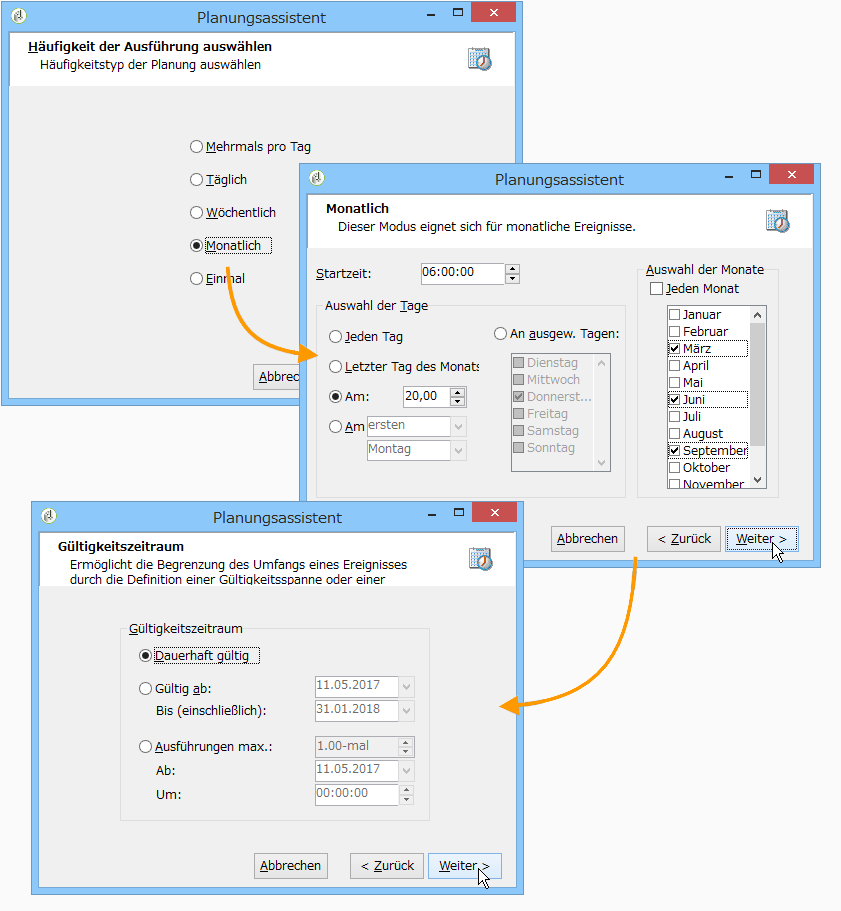

# Aktualisierung der vierteljährlichen Liste unter Verwendung einer inkrementellen Abfrage {#quarterly-list-update}

In the following example, an [incremental query](../../workflow/using/incremental-query.md) is used to automatically update a recipient list. These recipients are targeted as part of seasonal marketing campaigns.

Jeweils zu Beginn einer neuen Saison werden geeignete sportliche Aktivitäten beworben. Dies bedeutet, dass die Listen einmal pro Quartal aktualisiert werden. Die Empfänger sollen jedoch im Rahmen dieser Kampagne nur einmal alle neun Monate angesprochen werden. Auf diese Weise wird eine eventuelle Werbemüdigkeit durch den Empfänger vermieden und sichergestellt, dass er im Laufe der Zeit Angebote für verschiedene Jahreszeiten erhält.

1. Erstellen Sie einen neuen Workflow und positionieren Sie eine inkrementelle Abfrage mit anschließendem Listen-Update im Diagramm.
1. Konfigurieren Sie in der Aktivität den Tab **[!UICONTROL Inkrementelle Abfrage]** (wie im Abschnitt ](../../workflow/using/query.md#creating-a-query)Abfragen erstellen[ beschrieben).
1. Gehen Sie in den Tab **[!UICONTROL Planung &amp; Verlauf]** und geben Sie einen Verlaufsumfang von 270 Tagen an. Ein bereits angesprochener Empfänger wird innerhalb der nächsten 270 Tage, also ungefähr 9 Monate, nicht mehr im Rahmen dieser Kampagne kontaktiert.

   Klicken Sie dann auf die Schaltfläche **[!UICONTROL Ändern...]**.

1. Da die Liste jeweils zu Saisonbeginn aktualisiert werden soll, muss als Häufigkeit **[!UICONTROL Monatlich]** ausgewählt werden.
1. Wählen Sie im nächsten Bildschirm die Monate März, Juni, September und Dezember aus. Geben Sie als Tag den 20. des Monats an und die Uhrzeit, an der der Workflow gestartet werden soll.
1. Geben Sie abschließend den Gültigkeitszeitraum der Abfrage an. Im vorliegenden Beispiel wurde **[!UICONTROL Dauerhaft gültig]** ausgewählt.

   

1. Konfigurieren Sie nun die Aktivität Listen-Update (wie im Abschnitt ](../../workflow/using/list-update.md)Listen-Update[ beschrieben).

Der Workflow startet automatisch zu jedem Saisonbeginn und die Liste wird jeweils mit den neuen Angebotsempfängern aktualisiert.
